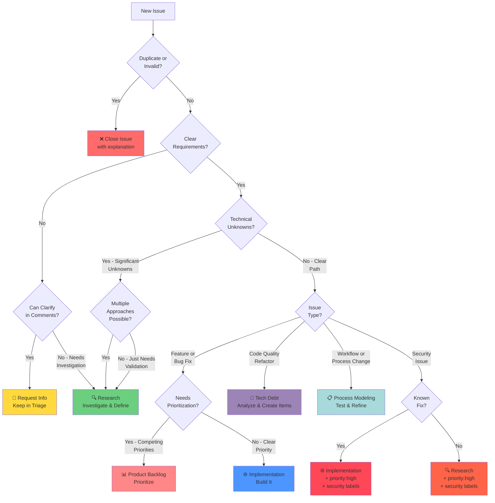
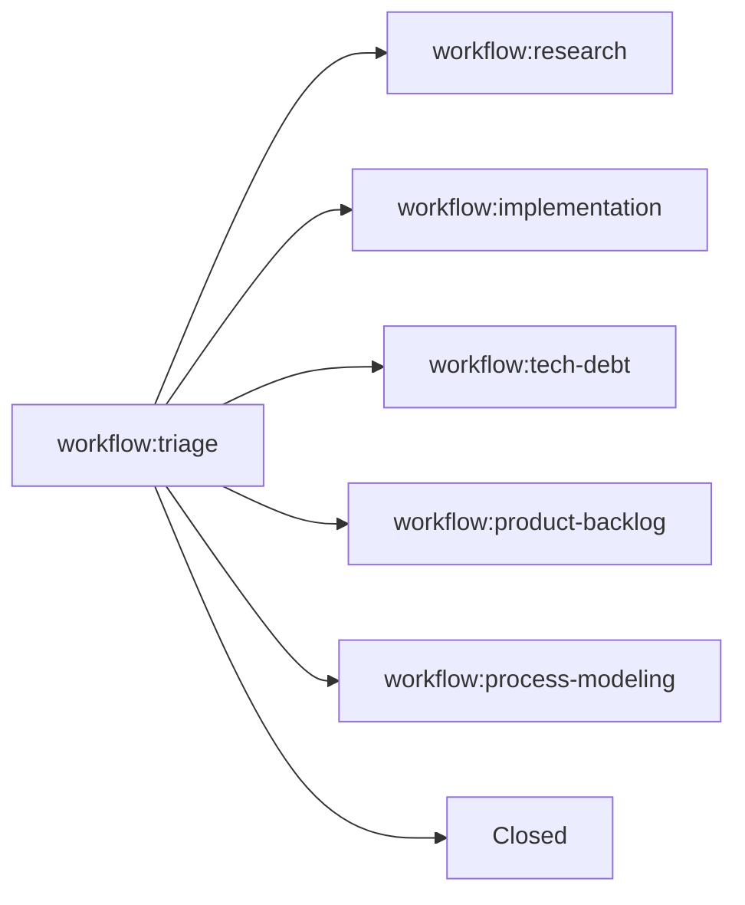

# Triage Workflow

This workflow guides the initial assessment of new issues and designation to appropriate workflows.

---

## Overview

**Purpose**: Assess new issues and designate them to the appropriate workflow (research, implementation, tech debt, product prioritization, or process modeling).

**Entry Point**: Issues automatically labeled with `workflow:triage` when created.

**Typical Duration**: 5-15 minutes per issue (single mode) or 30-90 minutes (bulk mode)

---

## Triage Modes

The triage workflow supports two modes:

### Single Issue Mode (Default)

**When to use**: You're assigned to a specific issue that needs triage

**Behavior**:
- Process the assigned issue only
- Assess and designate to appropriate workflow
- Stop after completing this one issue

### Bulk Triage Mode

**When to use**: You're assigned to a "Bulk Triage" issue created from the `triage.md` template

**Behavior**:
- Query ALL issues with `workflow:triage` label
- Exclude the bulk triage issue itself
- Process each issue in the queue sequentially
- Update the bulk triage issue with progress summaries
- Continue until queue is empty
- Close the bulk triage issue when complete

**How to identify bulk mode**:
- Issue title starts with `[Triage] Bulk triage`
- Issue body contains "Bulk Triage Instructions for @copilot"
- Issue explicitly requests processing the entire triage queue

---

## Quick Start

**Single Issue Mode**:
1. Read and assess the assigned issue
2. Determine appropriate workflow (see [Decision Tree](#decision-tree) for visual guide)
3. Handover to designated workflow with comment

**Bulk Triage Mode**:
1. Query all issues in triage queue
2. For each issue: read, assess, and handover (see [Decision Tree](#decision-tree) for visual guide)
3. Update bulk triage issue with summary
4. Close bulk triage issue when done

**⚠️ Comment Prefix Convention:**
- Prefix ALL comments with `[Copilot-Workflow: Triage]` to confirm you're following this workflow
- Example: `[Copilot-Workflow: Triage] After reviewing this issue, I recommend...`

---

## Step 1: Query Triage Queue

**For Copilot Agents** (use MCP tools):

```python
list_issues(
    owner="uniun-technology",
    repo="lib-dataflow",
    labels=["workflow:triage"],
    state="OPEN"
)
```

**For Manual/CI Use** (GitHub CLI):

```bash
gh issue list \
  --label "workflow:triage" \
  --state open \
  --json number,title,url,createdAt
```

---

## Label Cleanup (Before Starting Triage)

**⚠️ IMPORTANT**: Before triaging issues, check for and clean up conflicting workflow labels.

### Workflow Label Validation

When you start triage work (whether single-issue or bulk mode):

1. **For each issue you're about to triage**, check its labels for workflow conflicts
2. **Identify conflicts**: If an issue has MULTIPLE workflow labels (e.g., both `workflow:triage` AND `workflow:implementation`)
3. **Determine correct label**: 
   - If the issue is in the triage queue awaiting assessment, `workflow:triage` is correct
   - If it has another workflow label, that suggests it was already triaged but the label wasn't removed
4. **Remove conflicting labels**: Remove any workflow label that is NOT `workflow:triage`
5. **Add cleanup comment** noting what was corrected

### Label Cleanup Example

**For Copilot Agents** (use MCP tools):

```python
# Example: Issue has both workflow:triage and workflow:implementation labels
issue_write(
    method="update",
    owner="uniun-technology",
    repo="lib-dataflow",
    issue_number=ISSUE_NUMBER,
    labels=["workflow:triage"]  # Only keep the correct label
)

add_issue_comment(
    owner="uniun-technology",
    repo="lib-dataflow",
    issue_number=ISSUE_NUMBER,
    body="[Copilot-Workflow: Triage] 🏷️ Label cleanup: Removed conflicting `workflow:implementation` label. This issue is being re-triaged."
)
```

**Why this matters**: Issues should have exactly ONE workflow label at a time. Multiple labels create confusion about which workflow owns the issue.

**When to skip**: If the issue only has `workflow:triage` label (no conflicts), proceed directly to triage assessment.

---

## Multi-Phase Issue Check

**⚠️ ALWAYS**: Check if this issue is part of a multi-phase plan before starting triage work.

### Quick Check

```python
# Get current issue details
issue = issue_read(
    method="get",
    owner="uniun-technology",
    repo="lib-dataflow",
    issue_number=CURRENT_ISSUE_NUMBER
)

# Check if parent exists
if issue.parent:
    # This is a sub-issue - read parent context
    parent = issue_read(
        method="get",
        owner="uniun-technology",
        repo="lib-dataflow",
        issue_number=issue.parent.number
    )
    # Review parent to understand overall triage plan
else:
    # Standalone triage - proceed with normal workflow
```

### If This is a Sub-Issue

**DO:**
1. ✅ Read parent issue to understand overall triage plan
2. ✅ Note which triage phase this represents
3. ✅ Review completed phases for context
4. ✅ Update parent description as triage progresses
5. ✅ Check if this is the last sub-issue before finalizing

**Parent Update Pattern:**

When completing triage:
```python
# Update parent issue description to reflect progress
# Example: Change "Phase 2 - Issue Assessment" to "Phase 2 - 10 issues triaged, handovers complete"
issue_write(
    method="update",
    owner="uniun-technology",
    repo="lib-dataflow",
    issue_number=parent_number,
    body=updated_description
)
```

**Closing Parent (Last Sub-Issue Only):**

If this is the last open sub-issue of the triage plan, include parent in PR description:
```markdown
Fixes #CURRENT_ISSUE
Fixes #PARENT_ISSUE
```

This ensures both issues close when PR merges.

**See:** [Multi-Phase Issue Procedures](/.team/MULTI_PHASE_ISSUES.md) for complete guidance including examples and troubleshooting.

---

## Step 2: Assessment Criteria

For each issue, assess the following:

### Issue Type

**Bug Report**:
- Is this a defect in existing functionality?
- Is the bug reproducible?
- What is the severity/priority?

**Feature Request**:
- Is this a new feature or enhancement?
- Is the requirement clear?
- Is research needed to validate feasibility?

**Research Question**:
- Does this need investigation or prototyping?
- Are there unknown unknowns?

**Tech Debt**:
- Does this address code quality, maintainability, or architecture?
- Is this a refactoring or cleanup task?

**Process Improvement**:
- Does this relate to workflows, tooling, or team processes?
- Is this a meta-issue about how we work?

### Clarity & Scope

- [ ] Requirements are clear and specific
- [ ] Scope is well-defined
- [ ] Success criteria are stated
- [ ] No significant unknowns

### Complexity Assessment

**Low**: Simple change, clear path forward → `workflow:implementation`
**Medium**: Some unknowns, may need design → `workflow:research` or `workflow:implementation`
**High**: Significant unknowns, needs validation → `workflow:research`

---

## Step 3: Workflow Designation

Based on assessment, designate to appropriate workflow:

### → Research Workflow

**When to use**:
- Significant unknowns or technical uncertainty
- Needs prototyping or proof-of-concept
- Multiple approaches need evaluation
- Feasibility needs validation

**Example handover**:
```bash
gh issue edit $ISSUE \
  --remove-label "workflow:triage" \
  --add-label "workflow:research"

gh issue comment $ISSUE --body "🔍 **Triage → Research**

This issue requires research to validate feasibility and approach.

**Research Questions**:
- [Question 1]
- [Question 2]

See \`.team/prompts/RESEARCH_WORKFLOW.md\` for research process."
```

---

### → Implementation Workflow

**When to use**:
- Requirements are clear and specific
- No significant technical unknowns
- Straightforward bug fix or enhancement
- Design is already validated

**Example handover**:
```bash
gh issue edit $ISSUE \
  --remove-label "workflow:triage" \
  --add-label "workflow:implementation"

gh issue comment $ISSUE --body "⚙️ **Triage → Implementation**

Requirements are clear. Ready for implementation.

**Summary**: [Brief description]

See \`.team/prompts/IMPLEMENTATION_WORKFLOW.md\` for implementation process."
```

---

### → Tech Debt Workflow

**When to use**:
- Code quality or maintainability issue
- Refactoring or cleanup needed
- Architecture improvement
- Test coverage gap

**Example handover**:
```bash
gh issue edit $ISSUE \
  --remove-label "workflow:triage" \
  --add-label "workflow:tech-debt"

gh issue comment $ISSUE --body "🔧 **Triage → Tech Debt**

This is a technical debt item requiring analysis and prioritization.

**Debt Category**: [Code Quality / Architecture / Testing / Documentation]

See \`.team/prompts/TECH_DEBT_WORKFLOW.md\` for tech debt process."
```

---

### → Product Prioritization Workflow

**When to use**:
- Multiple competing priorities
- Needs business value assessment
- Resource allocation decision needed
- Part of larger backlog needing prioritization

**Example handover**:
```bash
gh issue edit $ISSUE \
  --remove-label "workflow:triage" \
  --add-label "workflow:product-backlog"

gh issue comment $ISSUE --body "📊 **Triage → Product Prioritization**

This item needs prioritization against other backlog items.

**Context**: [Business context or dependency info]

See \`.team/prompts/PRODUCT_PRIORITIZATION_WORKFLOW.md\` for prioritization process."
```

---

### → Process Modeling Workflow

**When to use**:
- Workflow or process improvement
- Tooling enhancement
- Team process optimization
- Meta-issue about how we work

**Example handover**:
```bash
gh issue edit $ISSUE \
  --remove-label "workflow:triage" \
  --add-label "workflow:process-modeling"

gh issue comment $ISSUE --body "📋 **Triage → Process Modeling**

This is a process improvement item.

**Area**: [Workflow / Tooling / Documentation / Other]

See \`.team/prompts/PROCESS_MODELING_WORKFLOW.md\` for process modeling workflow."
```

---

### → Close Issue

**When to close**:
- Duplicate of existing issue
- Invalid or not reproducible
- Out of scope
- Won't fix

**Example close**:
```bash
gh issue close $ISSUE --comment "❌ **Closing Issue**

**Reason**: [Duplicate of #123 / Invalid / Out of Scope / Won't Fix]

[Additional context if needed]"
```

---

## Step 4: Handover Methods

**For Copilot Agents** (use MCP tools):

```python
# Update workflow label
issue_write(
    method="update",
    owner="uniun-technology",
    repo="lib-dataflow",
    issue_number=ISSUE_NUMBER,
    labels=["workflow:TARGET_WORKFLOW"]
)

# Add handover comment
add_issue_comment(
    owner="uniun-technology",
    repo="lib-dataflow",
    issue_number=ISSUE_NUMBER,
    body="🔄 Triage → [Target Workflow]\n\nReason for handover"
)
```

**For Manual Use** (GitHub CLI):

Use the examples shown in Step 3 above, or:

```bash
gh issue edit ISSUE_NUMBER --remove-label "workflow:triage" --add-label "workflow:TARGET_WORKFLOW"
gh issue comment ISSUE_NUMBER --body "🔄 Triage → [Target Workflow]\n\nReason for handover"
```

**Example**:
```bash
gh issue edit 123 --remove-label "workflow:triage" --add-label "workflow:research"
gh issue comment 123 --body "🔄 Triage → Research\n\nNeeds validation of approach before implementation"
```

---

## Common Triage Patterns

This section documents frequently encountered scenarios and how to handle them. For detailed examples with full context, see [Triage Examples](TRIAGE_EXAMPLES.md).

### Pattern 1: Feature Request with Clear Requirements

**Indicators**:
- Specific feature description
- Clear acceptance criteria
- No architectural concerns
- Straightforward implementation

**Example**:
```
Issue: "Add support for cancellation tokens in BatchBlock"
Details: Constructor accepts CancellationToken, batch window respects it
Acceptance: Unit tests, docs updated, no breaking changes
```

**Decision**: `workflow:implementation`

**Rationale**: Requirements are clear, approach is standard (.NET pattern), no unknowns. Ready to build.

---

### Pattern 2: Feature Request with Technical Unknowns

**Indicators**:
- General idea but unclear approach
- Multiple possible implementations
- Architecture impact unclear
- Feasibility questions

**Example**:
```
Issue: "Add distributed caching support"
Questions: Which caching technology? How to integrate? Performance impact?
Approaches: Redis vs Memcached vs in-memory distributed cache
```

**Decision**: `workflow:research`

**Rationale**: Multiple approaches exist, need prototyping and benchmarking to determine best fit. Research validates approach, then hands to implementation.

---

### Pattern 3: Clear Bug Report (Reproducible)

**Indicators**:
- Reproducible steps provided
- Expected vs actual behavior clear
- Root cause identifiable
- Known fix pattern

**Example**:
```
Issue: "NullReferenceException in BatchBlock when maxBatchSize=0"
Reproduction: Create BatchBlock(maxBatchSize: 0), add items
Expected: Exception on construction or graceful handling
Actual: NullRef during processing
```

**Decision**: `workflow:implementation`

**Rationale**: Clear bug, reproducible, fix location known. No investigation needed.

---

### Pattern 4: Bug Report (Unclear or Intermittent)

**Indicators**:
- Cannot reproduce consistently
- Unclear root cause
- Missing information
- Could be user error or actual bug

**Example**:
```
Issue: "TransformBlock occasionally drops items"
Details: Sometimes output < input with high concurrency
Reproduction: Inconsistent, no clear pattern
```

**Decision**: 
- **Option 1**: Stay in `workflow:triage` - Request clarification (reproduction steps, minimal example)
- **Option 2**: `workflow:research` - If enough detail to investigate but root cause unclear

**Rationale**: Need more information before routing. After clarification, re-triage.

---

### Pattern 5: Code Quality / Refactoring

**Indicators**:
- Working code, no functional changes needed
- Modernization or cleanup
- Architecture improvements
- Test coverage gaps

**Example**:
```
Issue: "Refactor ActorPool to use modern C# patterns"
Context: Working code but uses old-style constructors, verbose properties
Goal: Apply modern C# 12 features for maintainability
```

**Decision**: `workflow:tech-debt`

**Rationale**: This is technical debt - code quality improvement. Tech Debt workflow discovers, analyzes, and creates backlog items.

---

### Pattern 6: Multiple Competing Feature Requests

**Indicators**:
- Several valid feature requests
- Resource constraints
- Need to determine priority
- Business value assessment needed

**Example**:
```
Issue: "Add metrics collection" (one of 4 observability requests)
Others: Distributed tracing (#145), Logging (#167), Health checks (#201)
Context: All valuable, limited resources
```

**Decision**: `workflow:product-backlog`

**Rationale**: Valid feature but needs prioritization. Product workflow assesses business value and dependencies, then routes to implementation when prioritized.

---

### Pattern 7: Workflow or Process Improvement

**Indicators**:
- About team workflows, not code
- Process optimization
- Documentation improvement
- Tooling enhancement

**Example**:
```
Issue: "Add visual decision tree to research workflow"
Details: Improve workflow docs with diagrams
Impact: Makes workflow easier to understand
```

**Decision**: `workflow:process-modeling`

**Rationale**: Meta-issue about improving workflows. Process Modeling tests changes through tabletop simulation and updates workflow documentation.

---

### Pattern 8: Security or Critical Issues

**Indicators**:
- Security vulnerability
- Data integrity risk
- High severity/urgency
- Could be clear fix OR need investigation

**Example Clear Fix**:
```
Issue: "Race condition in ActorPool channel access"
Impact: Data corruption risk
Fix: Add proper locking/synchronization (known pattern)
```

**Decision**: `workflow:implementation` + labels: `priority:high`, `security`

**Example Needs Investigation**:
```
Issue: "Potential security vulnerability in block composition"
Impact: Unknown scope
Investigation: Need to validate attack surface
```

**Decision**: `workflow:research` + labels: `priority:high`, `security`

**Rationale**: Route based on clarity of solution, but always add priority and security labels for visibility.

---

### Pattern 9: Architectural Changes

**Indicators**:
- Major architecture impact
- Changes core design principles
- Multiple integration points
- Significant unknowns

**Example**:
```
Issue: "Support push-based blocks in addition to pull-based"
Impact: Changes fundamental architecture
Questions: Interop? Performance? Breaking changes?
Complexity: Very high
```

**Decision**: `workflow:research`

**Rationale**: Major architectural changes require validation, prototyping, and design work before implementation. Research evaluates feasibility and creates specification.

---

### Pattern 10: Duplicate Issues

**Indicators**:
- Same request as existing issue
- Existing issue may be open or recently closed
- May reference same component/feature

**Example**:
```
Issue: "Add async error handling in ProcessorBlock"
Check: Issue #156 already tracks this
Status: #156 in implementation, PR #178 in progress
```

**Decision**: Close issue

**Action**:
```bash
gh issue close $ISSUE --comment "❌ Closing as duplicate of #156

This feature is already being tracked in #156 and implemented in PR #178.

Thank you for the suggestion!"
```

**Rationale**: Avoid duplicate work. Link to original issue so contributor can follow progress.

---

## Re-triage Scenarios

Issues can return to triage from other workflows when:

### Scenario 1: Requirements Change Significantly

**Example**: Implementation starts on "Add caching" but product team changes requirements to "distributed multi-region caching"

**Action**: Send back to triage to re-assess as research (needs validation) vs implementation (if approach is clear)

---

### Scenario 2: Initial Assessment Was Incorrect

**Example**: Issue sent to implementation, but developer discovers significant unknowns

**Action**: Send back to triage, note what was discovered, likely route to research

---

### Scenario 3: Blocker Discovered

**Example**: Implementation finds that feature depends on unimplemented infrastructure

**Action**: Send back to triage to split into multiple issues or re-scope

---

### Scenario 4: External Changes Affect Scope

**Example**: Issue routed to research, but new .NET version adds feature that changes approach

**Action**: Send back to triage to re-evaluate in light of new information

---

## Edge Cases and Special Situations

### When Multiple Workflows Could Apply

**Rule**: Choose the **FIRST** necessary workflow in the sequence

**Common Sequences**:
1. Research → Implementation
2. Research → Product Backlog → Implementation
3. Tech Debt → Product Backlog → Implementation
4. Triage → Clarification → Triage (re-assess)

**Example**: "Optimize ActorPool performance"
- Could be: Research (investigate approaches) OR Implementation (apply known patterns)
- **Decision**: If approach unclear → Research first (validates approach, then hands to implementation)
- If approach clear → Implementation directly

**Rationale**: Let workflows hand off naturally. Don't try to pre-plan the entire sequence.

---

### Issues Needing Clarification

**When to ask for clarification**:
- Reproduction steps missing
- Requirements vague or conflicting
- Scope undefined
- Success criteria unclear

**How to handle**:
1. Add comment requesting specific information
2. Keep issue in `workflow:triage`
3. Set label `status:needs-info` (if available)
4. When information provided, re-triage

**Example comment**:
```
❓ **Clarification Needed**

To properly triage this issue, please provide:
- Minimal code example reproducing the issue
- Expected behavior vs actual behavior
- Environment details (OS, .NET version)

Keeping in triage until clarified.
```

---

### Feature Requests That Are Really Questions

**Indicators**:
- Phrased as "How do I..." or "Is it possible to..."
- May be achievable with existing features
- User education needed

**Decision**: 
- If achievable now → Close with explanation and example
- If truly missing feature → Route to appropriate workflow

**Example**:
```
Issue: "Add support for parallel processing"
Reality: TransformBlock already supports this via maxConcurrency
Action: Close with explanation and example code
```

---

### Issues That Should Be Split

**Indicators**:
- Multiple unrelated requests in one issue
- Mix of bug + feature
- Different components/areas

**Action**:
1. Create separate issues for each concern
2. Close original with explanation
3. Link new issues to original
4. Triage each new issue separately

**Example**:
```
Original: "Fix BatchBlock bug AND add new FilterBlock AND update docs"
Action: Create 3 issues - bug fix, new feature, doc update
Triage: Bug → implementation, Feature → research, Docs → implementation
```

---

## Quick Decision Checklist

Use this checklist for rapid triage:

- [ ] **Check for duplicates** - Search existing issues first
- [ ] **Assess clarity** - Are requirements clear and specific?
- [ ] **Identify unknowns** - Are there technical uncertainties?
- [ ] **Determine type** - Feature? Bug? Tech debt? Process?
- [ ] **Check priority** - Urgent? Needs prioritization?
- [ ] **Verify completeness** - Enough info to route?

**If all clear** → Route to workflow

**If unclear** → Request clarification or send to research

**If duplicate/invalid** → Close with explanation

---

**See also**: [Triage Examples](TRIAGE_EXAMPLES.md) for 10 detailed real-world scenarios with full decision rationale

---

## Bulk Mode Execution

When assigned to a **Bulk Triage** issue, follow this process:

### Step 1: Identify Bulk Mode

Check if the assigned issue is a bulk triage request:
- Title starts with `[Triage] Bulk triage`
- Body contains "Bulk Triage Instructions for @copilot"
- Explicitly requests processing entire triage queue

If YES → Continue with bulk mode execution
If NO → Follow single issue mode (process only the assigned issue)

### Step 2: Setup - Add Date to Issue Title

**Update the bulk triage issue title to include today's date** (if not already present):

```python
from datetime import datetime

# Get current issue
current_issue = issue_read(
    method="get",
    owner="uniun-technology",
    repo="lib-dataflow",
    issue_number=BULK_TRIAGE_ISSUE_NUMBER
)

# Check if date is already in title
current_date = datetime.now().strftime("%Y-%m-%d")
if current_date not in current_issue['title']:
    # Append date to title
    new_title = f"{current_issue['title']}{current_date}"
    issue_write(
        method="update",
        owner="uniun-technology",
        repo="lib-dataflow",
        issue_number=BULK_TRIAGE_ISSUE_NUMBER,
        title=new_title
    )
```

**Why**: This ensures each bulk triage run has a unique, identifiable title for historical tracking.

### Step 3: Detect Unlabeled Issues

**Before querying the triage queue, find and label historic issues without workflow labels:**

```python
# Query ALL open issues
all_issues = list_issues(
    owner="uniun-technology",
    repo="lib-dataflow",
    state="OPEN",
    perPage=100
)

# Define workflow labels
workflow_labels = [
    'workflow:triage',
    'workflow:research',
    'workflow:implementation',
    'workflow:tech-debt',
    'workflow:product-backlog',
    'workflow:process-modeling'
]

# Find issues without any workflow label
unlabeled_count = 0
for issue in all_issues['issues']:
    # Skip the bulk triage issue itself
    if issue['number'] == BULK_TRIAGE_ISSUE_NUMBER:
        continue
    
    # Check if issue has any workflow label
    issue_labels = [label['name'] for label in issue['labels']]
    has_workflow_label = any(wf_label in issue_labels for wf_label in workflow_labels)
    
    if not has_workflow_label:
        # Add workflow:triage label
        issue_write(
            method="update",
            owner="uniun-technology",
            repo="lib-dataflow",
            issue_number=issue['number'],
            labels=["workflow:triage"]
        )
        
        # Add explanatory comment
        add_issue_comment(
            owner="uniun-technology",
            repo="lib-dataflow",
            issue_number=issue['number'],
            body="[Copilot-Workflow: Triage] 🏷️ Added to triage queue (historic issue without workflow label)"
        )
        
        unlabeled_count += 1

# Log the result
if unlabeled_count > 0:
    add_issue_comment(
        owner="uniun-technology",
        repo="lib-dataflow",
        issue_number=BULK_TRIAGE_ISSUE_NUMBER,
        body=f"[Copilot-Workflow: Triage] 🔍 Found and labeled {unlabeled_count} historic issues without workflow labels"
    )
```

**Why**: Historic issues created before the workflow topology system may not have any workflow label. This step ensures 100% coverage of the issue backlog.

### Step 4: Query and Filter Triage Queue

**Query the full triage queue** (now including newly labeled issues):
```python
issues = list_issues(
    owner="uniun-technology",
    repo="lib-dataflow",
    labels=["workflow:triage"],
    state="OPEN"
)
```

**Filter out the bulk triage issue itself**:
- Get the current issue number (the bulk triage issue)
- Exclude it from the list of issues to process
- Only process actual issues needing triage, not the coordination issue

### Step 5: Process Each Issue

For each issue in the filtered queue:

1. **Read the issue** to understand context
2. **Assess using Step 2 criteria** (issue type, clarity, complexity)
3. **Determine workflow** using Step 3 designation guidance
4. **Update workflow label** using MCP tools
5. **Add handover comment** with reasoning

**Example iteration**:
```python
for issue in filtered_issues:
    # Read issue
    issue_data = issue_read(
        method="get",
        owner="uniun-technology",
        repo="lib-dataflow",
        issue_number=issue['number']
    )
    
    # Assess and determine workflow (manual analysis)
    # ...
    
    # Update label
    issue_write(
        method="update",
        owner="uniun-technology",
        repo="lib-dataflow",
        issue_number=issue['number'],
        labels=["workflow:implementation"]  # or appropriate workflow
    )
    
    # Add handover comment
    add_issue_comment(
        owner="uniun-technology",
        repo="lib-dataflow",
        issue_number=issue['number'],
        body="[Copilot-Workflow: Triage] 🔄 Triage → Implementation\n\n[Reasoning...]"
    )
```

### Step 6: Housekeeping (Duplicate Detection & Cleanup)

**⚠️ NEW**: After routing is complete, perform housekeeping to identify and flag duplicates, completed items, and stale issues across ALL workflow labels.

**When to run**: Only in Bulk Triage Mode, after all routing is complete (Step 5 finished)

**Scope**: Queries ALL open issues (not limited to any specific workflow label)

#### Step 6a: Detect Duplicate Issues

**Query ALL open issues across all workflows:**

```python
# Get ALL open issues for duplicate detection (with pagination)
# Note: In actual implementation, you would need: from difflib import SequenceMatcher
all_open_issues = []
page = 1

while True:
    issues_page = list_issues(
        owner="uniun-technology",
        repo="lib-dataflow",
        state="OPEN",
        perPage=100,
        page=page
    )
    if not issues_page:
        break
    all_open_issues.extend(issues_page)
    if len(issues_page) < 100:
        break
    page += 1

def are_similar_titles(title1, title2, threshold=0.8):
    """Check if two titles are similar enough to be potential duplicates"""
    # Uses SequenceMatcher from difflib module
    return SequenceMatcher(None, title1.lower(), title2.lower()).ratio() > threshold

# Find potential duplicates
potential_duplicates = []
issues_list = all_open_issues

for i, issue1 in enumerate(issues_list):
    for issue2 in issues_list[i+1:]:
        similarity = SequenceMatcher(None, issue1['title'].lower(), issue2['title'].lower()).ratio()
        if similarity > 0.8:
            potential_duplicates.append({
                'duplicate': issue2['number'],
                'original': issue1['number'],
                'similarity': similarity,
                'title1': issue1['title'],
                'title2': issue2['title']
            })

# Flag duplicates with comments (do NOT auto-close)
for dup in potential_duplicates:
    add_issue_comment(
        owner="uniun-technology",
        repo="lib-dataflow",
        issue_number=dup['duplicate'],
        body=f"""[Copilot-Workflow: Triage] 🔍 **Potential Duplicate Detected**

This issue appears to be a duplicate of #{dup['original']}.

**Similarity Analysis**:
- Title similarity: {dup['similarity']:.0%}
- Original: {dup['title1']}
- This issue: {dup['title2']}

**Recommendation**: 
- Human review needed to confirm if this is a true duplicate
- If duplicate: Close this issue and reference #{dup['original']}
- If not duplicate: Add distinguishing details to title/description

**@maintainers**: Please review and take appropriate action.
"""
    )
```

#### Step 6b: Identify Completed Items

**Find issues marked as completed but still open:**

```python
# Search for completed items still in open state
# These are issues with "Completed" status in metadata or with merged PRs
completed_items = []

for issue in issues_list:
    # Check if issue body contains "Status: Completed" or similar
    if issue.get('body') and any(marker in issue['body'] for marker in ['Status: Completed', 'Status: Complete', '**Status**: Completed']):
        completed_items.append({
            'number': issue['number'],
            'title': issue['title'],
            'reason': 'Status marked as completed in issue body'
        })
        continue
    
    # Check if issue references a merged PR in comments
    # (This requires checking comments - simplified version shown)
    # Add to completed_items if merged PR found

# Flag completed items for closure
for item in completed_items:
    add_issue_comment(
        owner="uniun-technology",
        repo="lib-dataflow",
        issue_number=item['number'],
        body=f"""[Copilot-Workflow: Triage] ✅ **Completed Item - Ready to Archive**

This issue appears to be completed: {item['reason']}

**Recommended Actions**:
1. Close this issue (work is complete)
2. Any supporting artifacts referenced in the issue remain in the repository for historical reference

**@maintainers**: Please review and close if confirmed.
"""
    )
```

#### Step 6c: Identify Stale Items

**Find issues with no activity for >6 months:**

```python
# Note: In actual implementation, you would need: from datetime import datetime, timedelta

# Calculate 6 months ago
six_months_ago = datetime.now() - timedelta(days=180)

stale_items = []

for issue in issues_list:
    updated_at = datetime.fromisoformat(issue['updated_at'].replace('Z', '+00:00'))
    
    # Check if last update was >6 months ago
    if updated_at < six_months_ago:
        months_inactive = (datetime.now() - updated_at).days // 30
        stale_items.append({
            'number': issue['number'],
            'title': issue['title'],
            'months_inactive': months_inactive,
            'last_updated': updated_at.strftime('%Y-%m-%d')
        })

# Flag stale items for review
for item in stale_items:
    add_issue_comment(
        owner="uniun-technology",
        repo="lib-dataflow",
        issue_number=item['number'],
        body=f"""[Copilot-Workflow: Triage] 🕰️ **Stale Item - Review Needed**

This issue has had no updates in {item['months_inactive']} months (last update: {item['last_updated']}).

**Recommendation**: Please review and determine if this item is still relevant.
- If still needed: Update description and provide current status
- If no longer needed: Close this issue
- If unclear: Add comment with current thinking

**@maintainers**: Please review at your convenience.
"""
    )
```

#### Step 6d: Present Housekeeping Summary

**Helper functions for table formatting:**

```python
def format_duplicates_table(duplicates):
    if not duplicates:
        return "| - | No duplicates detected | - | - |"
    
    rows = []
    for dup in duplicates:
        rows.append(f"| #{dup['duplicate']} | {dup['title2'][:50]}... | Close as duplicate of #{dup['original']} | {dup['similarity']:.0%} title similarity |")
    return '\n'.join(rows)

def format_completed_table(completed):
    if not completed:
        return "| - | No completed items found | - | - |"
    
    rows = []
    for item in completed:
        rows.append(f"| #{item['number']} | {item['title'][:50]}... | Close as completed | {item['reason']} |")
    return '\n'.join(rows)

def format_stale_table(stale):
    if not stale:
        return "| - | No stale items found | - | - |"
    
    rows = []
    for item in stale:
        rows.append(f"| #{item['number']} | {item['title'][:50]}... | Close as not planned | {item['months_inactive']} months inactive |")
    return '\n'.join(rows)
```

**Add a summary comment to the bulk triage issue with suggested actions in tabular format:**

```python
add_issue_comment(
    owner="uniun-technology",
    repo="lib-dataflow",
    issue_number=BULK_TRIAGE_ISSUE_NUMBER,
    body=f"""[Copilot-Workflow: Triage] 🧹 **Housekeeping Summary**

Completed duplicate detection and cleanup scan across all open issues.

## 🔍 Suggested Housekeeping Actions

Please review the following suggested cleanup actions. Reply with your approval to execute them automatically.

### Duplicates to Close

| Issue # | Title | Action | Reason |
|---------|-------|--------|--------|
{format_duplicates_table(potential_duplicates)}

### Completed Items to Close

| Issue # | Title | Action | Reason |
|---------|-------|--------|--------|
{format_completed_table(completed_items)}

### Stale Items to Close

| Issue # | Title | Action | Reason |
|---------|-------|--------|--------|
{format_stale_table(stale_items)}

---

**To approve these actions**, reply with:
- `@copilot approve all` - Execute all suggested actions
- `@copilot approve duplicates` - Only close duplicates
- `@copilot approve completed` - Only close completed items
- `@copilot approve stale` - Only close stale items
- `@copilot approve #228, #230, #232` - Approve specific issue numbers

**To reject**, reply with:
- `@copilot skip housekeeping` - No automatic cleanup needed

Any actions not approved will remain as flagged comments on the respective issues for manual review.

**Housekeeping Statistics**:
- Potential duplicates detected: {len(potential_duplicates)}
- Completed items flagged: {len(completed_items)}
- Stale items flagged: {len(stale_items)}
- Total issues scanned: {len(issues_list)}
"""
)
```

#### Step 6e: Wait for Approval and Execute

**Monitor for reviewer response with approval command.**

When reviewer responds with an approval command, parse it and execute approved actions:

**Parsing approval commands:**

```python
# Note: In actual implementation, you would need: import re

def parse_approval_command(comment_body):
    """Parse reviewer approval command and return approved actions"""
    
    # Normalize comment
    comment = comment_body.lower().strip()
    
    # Check for approval patterns
    if "approve all" in comment or "approve everything" in comment:
        return {"duplicates": True, "completed": True, "stale": True, "specific": []}
    
    if "approve duplicates" in comment:
        return {"duplicates": True, "completed": False, "stale": False, "specific": []}
    
    if "approve completed" in comment:
        return {"duplicates": False, "completed": True, "stale": False, "specific": []}
    
    if "approve stale" in comment:
        return {"duplicates": False, "completed": False, "stale": True, "specific": []}
    
    # Check for specific issue numbers
    specific_pattern = r"approve\s+#?(\d+(?:\s*,\s*#?\d+)*)"
    match = re.search(specific_pattern, comment)
    if match:
        issue_numbers = [int(n.strip().lstrip('#')) for n in match.group(1).split(',')]
        return {"duplicates": False, "completed": False, "stale": False, "specific": issue_numbers}
    
    # Check for skip/reject
    if "skip housekeeping" in comment or "skip cleanup" in comment or "no cleanup" in comment:
        return None
    
    return None  # No valid approval found
```

**Executing approved actions:**

```python
# Example: After receiving "@copilot approve duplicates"
approval = parse_approval_command(reviewer_comment)

if approval and approval['duplicates']:
    # Close duplicate issues
    for dup in potential_duplicates:
        add_issue_comment(
            owner="uniun-technology",
            repo="lib-dataflow",
            issue_number=dup['duplicate'],
            body=f"""[Copilot-Workflow: Triage] ✅ **Closed as Duplicate**

This issue is a duplicate of #{dup['original']}.

**Action taken**: Closed automatically per reviewer approval in bulk triage housekeeping.

Please continue discussion in #{dup['original']}.
"""
        )
        
        issue_write(
            method="update",
            owner="uniun-technology",
            repo="lib-dataflow",
            issue_number=dup['duplicate'],
            state="closed",
            state_reason="not_planned"
        )

if approval and approval['completed']:
    # Close completed items
    for item in completed_items:
        add_issue_comment(
            owner="uniun-technology",
            repo="lib-dataflow",
            issue_number=item['number'],
            body=f"""[Copilot-Workflow: Triage] ✅ **Closed as Completed**

This issue has been completed.

**Action taken**: Closed automatically per reviewer approval in bulk triage housekeeping.
**Reason**: {item['reason']}
"""
        )
        
        issue_write(
            method="update",
            owner="uniun-technology",
            repo="lib-dataflow",
            issue_number=item['number'],
            state="closed",
            state_reason="completed"
        )

if approval and approval['stale']:
    # Close stale items
    for item in stale_items:
        add_issue_comment(
            owner="uniun-technology",
            repo="lib-dataflow",
            issue_number=item['number'],
            body=f"""[Copilot-Workflow: Triage] ⏸️ **Closed as Not Planned**

This issue has been inactive for {item['months_inactive']} months and is being closed.

**Action taken**: Closed automatically per reviewer approval in bulk triage housekeeping.

If this work is still needed, please reopen with updated context and priority justification.
"""
        )
        
        issue_write(
            method="update",
            owner="uniun-technology",
            repo="lib-dataflow",
            issue_number=item['number'],
            state="closed",
            state_reason="not_planned"
        )

# Handle specific issue approvals
if approval and approval.get('specific'):
    for issue_num in approval['specific']:
        # Find which category this issue belongs to and close appropriately
        # ... (implementation details)
        pass

# Report execution results
if approval:
    # Count executed actions
    duplicates_closed = len([d for d in potential_duplicates if approval.get('duplicates') or d['duplicate'] in approval.get('specific', [])])
    completed_closed = len([c for c in completed_items if approval.get('completed') or c['number'] in approval.get('specific', [])])
    stale_closed = len([s for s in stale_items if approval.get('stale') or s['number'] in approval.get('specific', [])])
    
    add_issue_comment(
        owner="uniun-technology",
        repo="lib-dataflow",
        issue_number=BULK_TRIAGE_ISSUE_NUMBER,
        body=f"""[Copilot-Workflow: Triage] ✅ **Housekeeping Actions Executed**

**Approved by**: @reviewer-username
**Executed**: {datetime.now().strftime("%Y-%m-%d %H:%M")}

### Actions Completed

**Duplicates Closed**: {duplicates_closed} issues
**Completed Items Closed**: {completed_closed} issues
**Stale Items Closed**: {stale_closed} issues

**Total Issues Cleaned**: {duplicates_closed + completed_closed + stale_closed}

All closed issues have been commented with closure reasons and references.
"""
    )
```

**Benefits of Housekeeping in Bulk Triage:**
- ✅ **Cross-workflow cleanup**: Works across ALL workflow labels, not just product backlog
- ✅ **Consolidated maintenance**: One place for all issue hygiene tasks
- ✅ **Automated but safe**: Flags issues, requires approval, then executes
- ✅ **Audit trail**: Clear record of what was cleaned and why
- ✅ **Regular cadence**: Runs whenever bulk triage runs

**When to skip housekeeping:**
- If no duplicates, completed items, or stale items found, skip Step 6e
- If reviewer responds with `@copilot skip housekeeping`, skip execution
- Continue to Step 7 (Track Progress)

### Step 7: Track Progress

**Update the bulk triage issue with progress summaries**:

After every 5 issues (or when complete), add a progress comment:

```python
add_issue_comment(
    owner="uniun-technology",
    repo="lib-dataflow",
    issue_number=BULK_TRIAGE_ISSUE_NUMBER,
    body="""[Copilot-Workflow: Triage] Progress Update

**Processed**: 5 issues
**Remaining**: 3 issues

**Distribution**:
- → Research: 2 issues
- → Implementation: 2 issues
- → Tech Debt: 1 issue

Continuing...
"""
)
```

**Link to quality tracking issue**:

In the bulk triage issue description or first comment, add a link to the "Triage Quality Metrics" issue for easy navigation:
```
📊 **Quality Metrics**: See issue #[tracking-issue-number] for triage effectiveness data
```

### Step 8: Complete and Close

When all issues in the queue are processed:

1. **Add final summary comment** to bulk triage issue:
```python
add_issue_comment(
    owner="uniun-technology",
    repo="lib-dataflow",
    issue_number=BULK_TRIAGE_ISSUE_NUMBER,
    body="""[Copilot-Workflow: Triage] ✅ Bulk Triage Complete

**Total Issues Processed**: 8

**Final Distribution**:
- → Research: 2 issues (#124, #127)
- → Implementation: 3 issues (#125, #128, #131)
- → Tech Debt: 2 issues (#126, #130)
- → Closed: 1 issue (#129 - duplicate)

All issues in triage queue have been processed.
"""
)
```

2. **Record metrics to tracking issue** (optional but recommended):
   - Search for issue titled "Triage Quality Metrics"
   - If not found, create it as a closed issue
   - Add comment with triage decisions for each processed issue
   - Format: `Issue #123 | Decision: Research | Time: 4h | Re-triage: N/A`
3. **Close the associated pull request** (if it exists):
```python
# Note: Bulk triage PR number typically matches issue number
# The PR contains no code changes, only tracks the triage work
try:
    update_pull_request(
        owner="uniun-technology",
        repo="lib-dataflow",
        pullNumber=BULK_TRIAGE_ISSUE_NUMBER,
        state="closed"
    )
except Exception as e:
    # PR may not exist or already closed
    pass
```

**Why close the PR**: The bulk triage PR contains no code changes to merge. It exists only to track the work. Once triage is complete, closing the PR keeps the repository clean.

4. **Close the bulk triage issue**:
```python
issue_write(
    method="update",
    owner="uniun-technology",
    repo="lib-dataflow",
    issue_number=BULK_TRIAGE_ISSUE_NUMBER,
    state="closed"
)
```

### Edge Cases

**Empty Queue**:
- If no issues need triage (queue only contains the bulk triage issue)
- Comment that queue is empty
- Close the bulk triage issue immediately

**Issues Needing Clarification**:
- If an issue needs clarification, add a comment requesting it
- Keep the issue in `workflow:triage`
- Note it in the bulk triage summary
- Continue processing other issues

**Errors or Blockers**:
- If you encounter an issue you can't triage (unclear, ambiguous)
- Add a comment requesting help or clarification
- Note it in the bulk triage summary
- Continue with remaining issues

---

## Decision Tree

### Quick Visual Guide

Use this decision tree to quickly determine the appropriate workflow for an issue:

> **Accessibility Note:** Color is used in the diagram below as a supplementary visual aid. All decision paths are clearly labeled with text, so you can follow the workflow without relying on color. If you use a colorblind mode or dark theme, the structure and text labels alone are sufficient to interpret the decision tree.



### Decision Tree Legend

| Symbol | Workflow | When to Use |
|--------|----------|-------------|
| 🔍 | **Research** | Unknowns, multiple approaches, needs validation |
| ⚙️ | **Implementation** | Clear requirements, known approach, ready to build |
| 🔧 | **Tech Debt** | Code quality, refactoring, architecture improvements |
| 📊 | **Product Backlog** | Needs prioritization among competing items |
| 📋 | **Process Modeling** | Workflow improvements, process changes |
| 💬 | **Stay in Triage** | Needs clarification before routing |
| ❌ | **Close** | Duplicate, invalid, out of scope, won't fix |

### Key Decision Points

The decision tree considers these factors in order:

1. **Validity**: Is this a duplicate or invalid issue?
2. **Clarity**: Are requirements clear enough to proceed?
3. **Unknowns**: Are there significant technical unknowns?
4. **Type**: What category of work is this?
5. **Priority**: Does it need prioritization vs clear path?
6. **Security**: Does it require special handling?

**See also**: [Triage Examples](TRIAGE_EXAMPLES.md) for 10 detailed scenarios showing how to apply this decision tree

---

## Triage Quality Framework

This framework provides metrics and patterns for assessing and improving triage effectiveness over time.

### Quality Metrics

**Good Triage Indicators**:

| Metric | Target | Description |
|--------|--------|-------------|
| **Time to Triage** | < 24 hours | Time from issue creation to workflow assignment |
| **Re-triage Rate** | < 10% | Percentage of issues sent back to triage from other workflows |
| **Clarification Rate** | < 20% | Percentage of issues needing clarification |
| **Handover Completeness** | 100% | All handovers include clear reasoning |
| **Duplicate Detection** | > 95% | Duplicates caught before routing to workflows |

**Poor Triage Indicators**:

- ❌ Issues sit in triage for days without action
- ❌ Frequent re-triage (same issue bounces between workflows)
- ❌ Handover comments lack context or reasoning
- ❌ Implementation receives unclear requirements
- ❌ Research receives issues with no real unknowns

### Re-triage Patterns and Analysis

**Common Re-triage Reasons**:

1. **Initial Complexity Misjudged** (40% of re-triages)
   - Sent to implementation, but unknowns discovered
   - Should have gone to research first
   - **Prevention**: Better assessment of technical unknowns

2. **Requirements Changed** (25% of re-triages)
   - Scope expanded during work
   - New constraints emerged
   - **Prevention**: Not preventable - natural evolution

3. **Wrong Workflow Selected** (20% of re-triages)
   - Sent to research but was straightforward
   - Sent to implementation but needed prioritization
   - **Prevention**: Use decision tree and examples

4. **Missing Information Emerged** (15% of re-triages)
   - Issue looked complete but critical details missing
   - Discovered during workflow execution
   - **Prevention**: More thorough initial assessment

**Re-triage is Okay**: Some re-triage is expected and healthy. It shows workflows are communicating and adapting. Target < 10% re-triage rate.

### Triage Effectiveness Tracking

**How to Measure** (GitHub Issue Tracking):

1. **Use a long-lived GitHub issue for tracking**:
   - Search for existing issue with title "Triage Quality Metrics"
   - If not found, create a new issue with this title
   - Keep the issue **closed** (it's a data repository, not an active task)
   - Add label `workflow:process-modeling` only if actionable insights need attention
   
   📊 **Tracking Issue**: Search for or create issue titled "Triage Quality Metrics"

2. **Record each triage decision as a comment**:
   - After triaging an issue, add a comment to the tracking issue
   - Format: `Issue #123 | Decision: Research | Time: 4h | Re-triage: N/A | Notes: [optional]`
   - If re-triaged later, add another comment noting the change
   - Link tracking issue in bulk triage issues for easy access

3. **Review monthly**:
   - Read through comments to calculate metrics
   - Calculate re-triage rate, average time, clarification rate
   - Identify common patterns
   - Adjust triage guidance based on findings

4. **Continuous improvement**:
   - When patterns emerge, update decision tree
   - Add examples for confusing scenarios
   - Refine assessment criteria
   - If major improvements needed, open as active issue with `workflow:process-modeling`

**Example Tracking Comments**:
```
Issue #145 | Decision: Implementation | Time: 8h | Re-triage: N/A
[Later comment]: Issue #145 | Re-triaged to Research | Reason: Unknowns found during implementation

Issue #146 | Decision: Research | Time: 4h | Re-triage: N/A | ✓ Good

Issue #147 | Decision: Implementation | Time: 2h | Re-triage: N/A | ✓ Good
```

**Benefits of GitHub Issue Tracking**:
- No PR merges needed (aligns with closing triage PRs after completion)
- Easy to query via GitHub API for analytics
- No file conflicts
- Can link to bulk triage issues for navigation
- Remains closed unless actionable improvements discovered

### Quality Improvement Actions

**When Re-triage Rate > 10%**:

1. **Analyze patterns**: Which workflows are most affected?
2. **Update decision tree**: Add clarity for confusing scenarios
3. **Add examples**: Document specific cases causing issues
4. **Review with team**: Discuss common mistakes

**When Time to Triage > 24 hours consistently**:

1. **Check queue size**: Too many issues in triage?
2. **Add bulk triage sessions**: Regular queue clearing
3. **Improve automation**: Better auto-labeling or pre-filtering
4. **Simplify decision process**: Is decision tree too complex?

**When Clarification Rate > 20%**:

1. **Improve issue templates**: Add more guidance
2. **Self-service triage hints**: Help users assess before creating
3. **Better default template**: Prompt for required information
4. **User education**: Documentation on creating good issues

### Success Criteria Summary

A high-quality triage process demonstrates:

- ✅ **Fast routing** - Issues move quickly to appropriate workflows
- ✅ **Clear handovers** - Every transition has context and reasoning
- ✅ **Low re-work** - Minimal re-triage needed
- ✅ **High confidence** - Workflows trust triage decisions
- ✅ **Continuous improvement** - Metrics tracked and acted upon

**Remember**: Triage quality improves over time as patterns emerge and guidance is refined. Track, measure, and iterate.

---

## Best Practices

### Do:
- ✅ Read the full issue context before designating
- ✅ Ask clarifying questions if requirements are unclear
- ✅ Provide clear reasoning in handover comment
- ✅ Link to relevant documentation or similar issues
- ✅ Assess urgency and add priority labels if needed

### Don't:
- ❌ Rush to designate without understanding context
- ❌ Send unclear issues to implementation
- ❌ Overthink simple issues (bugs usually go to implementation)
- ❌ Skip the handover comment (audit trail is important)

---

## Edge Cases

### Issue Needs Clarification

If issue is unclear:
1. Add comment requesting clarification
2. Keep in `workflow:triage`
3. Wait for response
4. Re-assess after clarification

```bash
gh issue comment $ISSUE --body "❓ **Clarification Needed**

To properly triage this issue, please provide:
- [Specific information needed]

Keeping in triage until clarified."
```

### Multiple Workflows Applicable

If issue could go to multiple workflows:
1. Choose the **first** necessary workflow
2. Note in handover that additional workflows may follow
3. Trust the workflow to hand over appropriately

**Example**: Research → Implementation → Tech Debt (if research reveals debt)

### Issue Already in Progress

If someone is already working on it:
1. Verify they're following the appropriate workflow
2. Update label to match current workflow
3. Add comment noting the correction

---

## Monitoring

### View Triage Queue Status

```bash
./.github/scripts/workflow/workflow-dashboard.sh
```

### Find Stale Triage Issues

```bash
gh issue list \
  --label "workflow:triage" \
  --state open \
  --json number,title,createdAt \
  --jq '.[] | select(.createdAt | fromdateiso8601 < (now - 604800)) | "Issue #\(.number) (>7 days old): \(.title)"'
```

---

## Success Metrics

**Good Triage**:
- Issues move to appropriate workflow within 24 hours
- Clear handover comments with reasoning
- Low rate of re-triage (issue sent to wrong workflow)
- Minimal back-and-forth for clarification

**Poor Triage**:
- Issues sit in triage for days
- Issues frequently re-triaged
- Handover comments lack context
- Implementation gets unclear issues

---

## Integration with Other Workflows

### From Triage



### To Triage (Re-triage)

Any workflow can send an issue back to triage if:
- Requirements change significantly
- Initial assessment was incorrect
- Issue needs re-evaluation

---

## References

- **Integration Patterns**: `/research/workflow-topology-design/design/integration-patterns.md`
- **Workflow Topology ADR**: `.team/adr/2025-11-09-workflow-state-storage.md`
- **Research Findings**: `/research/workflow-topology-design/README.md`
- **Helper Scripts**: `/research/workflow-topology-design/handover/prototype/`

---

## Quick Reference

**Query triage queue** (Copilot agents):
```python
list_issues(owner="uniun-technology", repo="lib-dataflow", labels=["workflow:triage"], state="OPEN")
```

**Query triage queue** (manual):
```bash
gh issue list --label "workflow:triage" --state open
```

**Handover to research** (Copilot agents):
```python
issue_write(method="update", owner="uniun-technology", repo="lib-dataflow", issue_number=ISSUE, labels=["workflow:research"])
add_issue_comment(owner="uniun-technology", repo="lib-dataflow", issue_number=ISSUE, body="🔄 Triage → Research\n\nReason")
```

**Handover to research** (manual):
```bash
gh issue edit ISSUE --remove-label "workflow:triage" --add-label "workflow:research"
gh issue comment ISSUE --body "🔄 Triage → Research\n\nReason"
```

**Handover to implementation** (Copilot agents):
```python
issue_write(method="update", owner="uniun-technology", repo="lib-dataflow", issue_number=ISSUE, labels=["workflow:implementation"])
add_issue_comment(owner="uniun-technology", repo="lib-dataflow", issue_number=ISSUE, body="🔄 Triage → Implementation\n\nReason")
```

**Handover to implementation** (manual):
```bash
gh issue edit ISSUE --remove-label "workflow:triage" --add-label "workflow:implementation"
gh issue comment ISSUE --body "🔄 Triage → Implementation\n\nReason"
```
