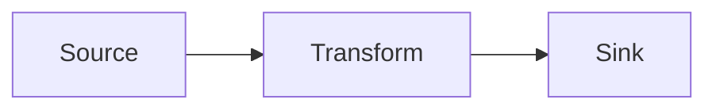

# GitHub Copilot Instructions for DataFlow

## Quick Navigation

**Start here based on your task:**

**For New Issues (All Workflows):**

**⚠️ CRITICAL - CHECK THE WORKFLOW LABEL FIRST:**
- **ALWAYS check the issue's workflow label BEFORE doing any other analysis**
- The workflow label (`workflow:triage`, `workflow:research`, `workflow:implementation`, etc.) **takes precedence over issue content**
- **DO NOT** assume workflow type from issue description - the label is the authoritative source
- **DO NOT** proceed without checking the label - this is your primary directive
- Query your workflow queue to find assigned issues
- See [Workflow Topology Guide](/.github/docs/WORKFLOW_TOPOLOGY_GUIDE.md) for querying and handover patterns

**Comment Prefix Convention:**
- Prefix ALL comments and responses with `[Copilot-Workflow: <workflow-name>]` to verify you've checked the label
- Example: `[Copilot-Workflow: Research] I've analyzed the approach...`
- This serves as confirmation that you followed the label-first directive

**By Workflow Type:**

1. **Triage Task** (assess and route new issues)
   → See `.team/prompts/TRIAGE_WORKFLOW.md`

2. **Research Task** (validate approaches, create specifications)
   → See `.team/prompts/RESEARCH_WORKFLOW.md`

3. **Implementation Task** (implement validated designs)
   → See `.team/prompts/IMPLEMENTATION_WORKFLOW.md`

4. **Tech Debt Task** (discover and address technical debt)
   → See `.team/prompts/TECH_DEBT_WORKFLOW.md`

5. **Product Prioritization** (prioritize backlog items)
   → See `.team/prompts/PRODUCT_PRIORITIZATION_WORKFLOW.md`

6. **Process Modeling Task** (improve workflows and processes)
   → See `.team/prompts/PROCESS_MODELING_WORKFLOW.md`

7. **POC Work** (evolving architecture exploration)
   → See section below, then follow appropriate workflow

8. **Continuing Existing Work**
   → Check `/implementation/plan.md` first

**⚠️ ALWAYS complete self-improvement evaluation before PR review** (see below)

**Multi-Phase Issues:**
- **ALWAYS check if your issue is part of a multi-phase plan** at workflow start
- See [Multi-Phase Issue Procedures](/.team/MULTI_PHASE_ISSUES.md) for complete guidance
- Update parent issue as work progresses
- Close parent automatically when completing last sub-issue

---

## ⚠️ CRITICAL: Workflow Labels and File Ownership

### Supported Workflow Labels

**⚠️ REQUIRED READING**: Before labeling any issues, you MUST read the authoritative label schema:

**📖 [Workflow Topology Guide - Label Schema](/.github/docs/WORKFLOW_TOPOLOGY_GUIDE.md#label-schema)**

**Critical Rules:**

1. **ONLY use labels from the Label Schema** - do not invent new ones
2. **Use exact format**: `workflow:<name>` with a colon (`:`) separator
3. **One workflow label per issue** - issues have exactly ONE workflow label at a time

**❌ Common Mistakes to Avoid:**
- `workflow-implementation` ❌ (incorrect - use `workflow:implementation`)
- `implementation-workflow` ❌ (incorrect - use `workflow:implementation`)
- `workflow_implementation` ❌ (incorrect - use `workflow:implementation`)
- Inventing new workflow labels not in the schema ❌

**The Label Schema is the single source of truth** - always reference it before creating or updating issue labels.

### Workflow File Ownership

**⚠️ CRITICAL - Process Modeling Owns Workflow Files:**

The following files are **EXCLUSIVELY OWNED** by the Process Modeling workflow:

- `.team/prompts/*_WORKFLOW.md` (all workflow documentation files)
- `.github/copilot-instructions.md` (this file)
- `.github/ISSUE_TEMPLATE/*.md` (issue templates)
- `.github/docs/WORKFLOW_TOPOLOGY_GUIDE.md` (workflow system docs)

**If you're in ANY other workflow and encounter tasks involving these files:**

1. ✅ **STOP** - Do not update these files yourself
2. ✅ **Create or update a Process Modeling issue** for the changes needed
3. ✅ **Hand over** to process modeling workflow
4. ✅ **Document** what workflow changes are needed and why

**Example Handover:**
```python
# Create process modeling issue for workflow changes
issue_write(
    method="create",
    owner="uniun-technology",
    repo="lib-dataflow",
    title="[Process Modeling] Update [Workflow Name] for [reason]",
    labels=["workflow:process-modeling"],
    body="""## Workflow Changes Needed

**Discovered During**: [Implementation/Research/etc.] issue #XXX

**Files to Update**:
- `.team/prompts/[NAME]_WORKFLOW.md`
- [other workflow files]

**Changes Needed**:
[Describe what needs to be updated and why]

**Context**:
[Explain the situation that revealed the need for these changes]
"""
)
```

**Why This Matters:**
- Workflow files are tested through tabletop simulation
- Changes need validation across all workflow scenarios
- Process modeling ensures consistency and quality
- Prevents workflow documentation from becoming fragmented or contradictory

---

## Self-Improvement Loop

**⚠️ CRITICAL**: Before marking ANY PR ready for review, you MUST complete the self-improvement evaluation.

### Required Steps Before PR Review

1. **Evaluate Workflow Effectiveness**: Reflect on the workflow you followed
   - Which workflow did you use? (Research, Implementation, POC, etc.)
   - Did the workflow guidance help or hinder progress?
   - Were there missing instructions that would have been helpful?

2. **Document What Worked Well**: Identify positive aspects
   - What workflow steps were clear and effective?
   - What guidance helped you avoid mistakes?
   - What tools or processes worked smoothly?

3. **Document What Didn't Work Well**: Identify pain points
   - What was unclear or confusing?
   - What steps were missing or incomplete?
   - What caused delays or required iteration?

4. **Propose Specific Improvements**: Be actionable and concrete
   - How could workflow documentation be improved?
   - What new guidance should be added?
   - Should issue templates be updated?

5. **Create Feedback Issue**:
   - Find the feedback tracker: Search for `[Workflow Feedback] Tracker` issue
   - Create child feedback issue with evaluation
   - **IMPORTANT**: Fill in all required fields (Date, Issue/PR, Workflow) - issues missing context may be deprioritized during triage
   - Link child to parent using `sub_issue_write` MCP tool

**Creating Feedback Issue:**
```python
# Find parent tracker
results = search_issues(
    owner="uniun-technology",
    repo="lib-dataflow",
    query='"[Workflow Feedback] Tracker" in:title state:open'
)

# Create feedback issue
# ⚠️ IMPORTANT: Fill in actual values for Date, Issue/PR, and Workflow
# Issues with placeholder values may be deprioritized or closed during triage
from datetime import datetime

child = issue_write(
    method="create",
    owner="uniun-technology",
    repo="lib-dataflow",
    title="[Brief description of improvement]",
    labels=["workflow:process-modeling"],
    body=f"""## Workflow Feedback Entry

**Date**: {datetime.now().strftime("%Y-%m-%d")}
**Issue/PR**: #{CURRENT_ISSUE_NUMBER}  # Replace with actual issue number
**Workflow**: [Workflow Name]  # Replace with actual workflow (Research, Implementation, etc.)

### What Worked Well
[List specific positives - what helped you succeed]

### What Didn't Work Well
[List specific issues - what caused delays or confusion]

### Suggested Improvement
[Specific, actionable improvements - be concrete]
"""
)

# Link to parent
sub_issue_write(
    method="add",
    owner="uniun-technology",
    repo="lib-dataflow",
    issue_number=results[0].number,
    sub_issue_id=child.id
)
```

**Note on Triage**: Feedback issues are periodically triaged (see `.team/prompts/PROCESS_MODELING_WORKFLOW.md` Step 3.5). Issues missing critical context (date, issue/PR, specific improvements) may be deprioritized or closed. Ensure your feedback is actionable and well-documented.

### Why This Matters

This self-improvement loop ensures our workflows continuously evolve based on real experiences. Every agent's feedback helps improve the process for future work.

---

## Repository Overview

**DataFlow** is a high-performance, pull-based data processing pipeline library built on modern .NET features using `System.Threading.Channels`. It provides a fluent API for building concurrent data processing pipelines with efficient backpressure handling.

### Key Architecture Principles

**Pull-Based Architecture:**
- Downstream blocks pull data from upstream when ready
- Provides natural backpressure
- All blocks communicate via `System.Threading.Channels`

**Block System:**
- **Source Blocks** - supply data (e.g., `ProducerBlock`)
- **Propagator Blocks** - process and pass data (e.g., `TransformBlock`, `BatchBlock`)
- **Target Blocks** - terminal consumers (e.g., `ProcessorBlock`)

**Dependency Injection & Scoping:**
- First-class DI support throughout
- Actor model: each concurrent worker runs in its own DI scope
- Allows scoped dependencies (like `DbContext`) to be used safely in concurrent processing

### Repository Structure

```
.github/
├── workflows/                       # GitHub Actions workflows
├── scripts/                         # Migration and utility scripts
├── copilot-instructions.md          # This file (navigation hub)
└── archive/                         # Archived files

.team/
├── workflows/                       # Workflow documentation
│   ├── TRIAGE_WORKFLOW.md          # Issue assessment and routing
│   ├── RESEARCH_WORKFLOW.md        # Research process
│   ├── IMPLEMENTATION_WORKFLOW.md  # Implementation process
│   ├── TECH_DEBT_WORKFLOW.md       # Tech debt discovery
│   ├── PRODUCT_PRIORITIZATION_WORKFLOW.md  # Backlog prioritization
│   └── PROCESS_MODELING_WORKFLOW.md        # Process improvements
└── scripts/
    └── workflow/                    # Workflow helper scripts
        ├── query-workflow-queue.sh  # Query issues by workflow
        ├── handover-issue.sh        # Transition between workflows
        ├── workflow-dashboard.sh    # View workflow state
        └── migrate-labels.sh        # One-time label migration

/research/                           # Research findings and handovers
├── FOLDER_STRUCTURE.md             # Research folder conventions
└── [topic]/                        # Per-topic research folders

/implementation/                     # In-flight implementation tracking
├── README.md                       # Implementation folder guide
├── plan.md                         # Current implementation plan (if any)
└── archive/                        # Completed implementation plans

**Note**: Product backlog items are now tracked as GitHub issues with the `workflow:product-backlog` label. See [Workflow Topology Guide](/.github/docs/WORKFLOW_TOPOLOGY_GUIDE.md) for querying backlog issues.

/poc/                               # POC code (evolving architecture)
/src/                               # Production code
```

---

## Coding Standards

### C# Style
- Use **file-scoped namespaces** (`namespace Uniun.DataFlow;`)
- Use **var** for local variable declarations when type is apparent
- Prefer **expression-bodied members** where appropriate
- Use **implicit object creation** when type is apparent (`new()`)
- Use **primary constructors** for simple cases
- Follow `.editorconfig` rules in `src/.editorconfig`
- 4 spaces for indentation
- Place `using` directives **inside namespace** (except global usings)

### Async/Await Patterns
- All data processing operations are async
- Use `IAsyncEnumerable<T>` for streaming operations
- Use `ValueTask<T>` for hot-path operations where appropriate
- Always respect `CancellationToken` - pass it through all async operations
- Use `ConfigureAwait(false)` in library code (not in test code)

### Testing Standards

**Test Categories:**
- `[UnitTest]` - Fast, isolated unit tests
- `[IntegrationTest]` - Tests involving multiple components
- `[Category("Performance")]` - Performance/benchmark tests
- `[Exploratory]` - Exploratory or diagnostic tests

**Test Pattern:**
```csharp
public class MyBlockTests
{
    private readonly ITestOutputHelper _testOutputHelper;
    
    public MyBlockTests(ITestOutputHelper testOutputHelper)
    {
        _testOutputHelper = testOutputHelper;
        Services = new ServiceCollection();
        AddDefaultServices();
    }

    private void AddDefaultServices()
    {
        Services.AddLogging(builder => builder.AddXUnit(Output));
        Services.AddDataFlows();
        Services.AddDataFlowMetrics();
    }
    
    public IServiceCollection Services { get; }
    public ITestOutputHelper Output => _testOutputHelper;
}
```

**Test Naming:** Use descriptive names like `Should_ProcessItemsConcurrently_When_MaxConcurrencyIsSet()`

**Assertions:** Use `Shouldly` - `result.ShouldBe(expected)`, `list.ShouldContain(item)`

---

## Research vs Implementation

**How to identify which workflow to follow:**

| Indicator | Research | Implementation |
| Indicator | Research | Implementation |
|-----------|----------|----------------|
| Issue label | `research` OR `workflow:research` | `implementation` OR `workflow:implementation` |
| Issue contains | "⚠️ This is a research issue" | "⚠️ This is an implementation issue" |
| Purpose | Validate approach, create specs | Implement validated design |
| Code fate | REVERTED after approval | MERGED into codebase |
| Primary output | Documentation + handover issue | Working code |
| Workflow doc | `.team/prompts/RESEARCH_WORKFLOW.md` | `.team/prompts/IMPLEMENTATION_WORKFLOW.md` |

**When in doubt:** Ask "Is this validating an approach (research) or implementing a validated design (implementation)?"

---

## Workflow Topology System

DataFlow uses a **GitHub label-based workflow topology system** to track which workflow an issue belongs to and provide formal handover mechanisms.

### Workflow Labels

All open issues have exactly ONE workflow label:

- `workflow:triage` - Awaiting assessment and routing
- `workflow:research` - Research and validation
- `workflow:implementation` - Implementation work
- `workflow:tech-debt` - Technical debt discovery/analysis
- `workflow:product-backlog` - Prioritization needed
- `workflow:process-modeling` - Process improvements

### Querying Your Workflow Queue

**Always start by querying your workflow queue to find assigned issues.**

**For Copilot Agents** (primary approach - use MCP tools):

See [Workflow Topology Guide](/.github/docs/WORKFLOW_TOPOLOGY_GUIDE.md) for comprehensive MCP tool documentation and examples.

Quick reference:
```python
# Query your workflow queue using MCP tools
list_issues(
    owner="uniun-technology",
    repo="lib-dataflow",
    labels=["workflow:research"],  # or workflow:implementation, etc.
    state="OPEN"
)
```

**For Manual/CI Use** (alternative - bash scripts):

```bash
# Using helper script
./.github/scripts/workflow/query-workflow-queue.sh <workflow-name>

# Direct GitHub CLI
gh issue list --label "workflow:<workflow-name>" --state open --json number,title,url
```

### Handing Over Issues

When transitioning an issue to a different workflow:

**For Copilot Agents** (primary approach - use MCP tools):

See [Workflow Topology Guide](/.github/docs/WORKFLOW_TOPOLOGY_GUIDE.md) for comprehensive handover examples.

Quick reference:
```python
# Update workflow label
issue_write(
    method="update",
    owner="uniun-technology",
    repo="lib-dataflow",
    issue_number=123,
    labels=["workflow:implementation"]  # New workflow label
)

# Add handover comment
add_issue_comment(
    owner="uniun-technology",
    repo="lib-dataflow",
    issue_number=123,
    body="🔄 Handover: research → implementation\n\nResearch complete. See /research/[topic]/ for details."
)
```

**For Manual Use** (alternative - GitHub CLI):

```bash
gh issue edit 123 --remove-label "workflow:research" --add-label "workflow:implementation"
gh issue comment 123 --body "Handover: research → implementation"
```

### Workflow State Dashboard

**For Manual Use:**

View the state of all workflows:

```bash
./.github/scripts/workflow/workflow-dashboard.sh
```

**For Copilot Agents:**

Query each workflow individually using `list_issues` MCP tool with different workflow labels.

**See**: [Workflow Topology Guide](/.github/docs/WORKFLOW_TOPOLOGY_GUIDE.md) for complete documentation on:
- GitHub MCP tools for Copilot agents
- Label schema
- Handover patterns
- Querying workflow queues
- Common transitions
- Troubleshooting

---

## POC Work Guidelines

The `/poc` folder contains evolving architectural explorations. Work in POC follows either:
- **Research workflow** if validating new approaches (code will be reverted)
- **Implementation workflow** if implementing validated designs (code will be merged)

### POC-Specific Requirements

When implementing in POC:

**Documentation Structure** (`/poc/docs/`):
- `/poc/docs/plans/` - Action plans and proposals
- `/poc/docs/design/` - Architecture and design docs
- `/poc/docs/guides/` - Implementation patterns
- `/poc/docs/adr/` - Architecture Decision Records
- `/poc/docs/POC_GLOSSARY.md` - Terminology (keep updated)

**Key Guidelines:**
1. Read `/poc/README.md` and `/poc/docs/POC_GLOSSARY.md` first
2. Create plan in `/poc/docs/plans/` for each POC implementation
3. Use ADRs in `/poc/docs/adr/` for significant decisions
4. Update glossary with new terminology
5. Use POC test projects (`DataFlow.POC.Tests`)
6. Document benchmarks in `/research/` if conducting performance analysis

See `/poc/README.md` for complete POC architecture details.

---

## Common Patterns

### Defining a Data Flow
```csharp
public class MyFlowConfig : IDataFlowConfiguration
{
    public void Configure(DataFlowBuilder builder)
    {
        builder
            .AddProducer<int>("source", sp => sp.GetRequiredService<MyProducer>())
            .AddBatch<int>("batcher", maxBatchSize: 100, windowPeriod: TimeSpan.FromSeconds(5))
            .ReceiveFrom("source")
            .AddProcessor<int[]>("writer", sp => sp.GetRequiredService<MyBatchWriter>())
            .ReceiveFrom("batcher");
    }
}
```

### Implementing Block Dependencies
```csharp
public class MyProducer : IProducer<int>
{
    private readonly ILogger<MyProducer> _logger;
    
    public MyProducer(ILogger<MyProducer> logger) => _logger = logger;
    
    public async IAsyncEnumerable<int> ProduceAsync(
        [EnumeratorCancellation] CancellationToken cancellationToken)
    {
        for (int i = 0; i < 100; i++)
        {
            cancellationToken.ThrowIfCancellationRequested();
            yield return i;
            await Task.Delay(10, cancellationToken);
        }
    }
}
```

---

## Documentation Standards

**📖 Read First**: [Document Hygiene Guide](/.team/DOCUMENT_HYGIENE.md) - Essential principles for maintainable documentation including separation of concerns, DRY principles, and when to use visual diagrams.

### Documentation Placement

When creating or updating documentation, follow this decision tree:

- **Research artifacts/analysis** → `/research/[topic]/`
- **Architecture Decision Records (ADRs)**:
  - POC code → `/poc/docs/adr/`
  - Production code → `/src/docs/adr/`
- **POC-specific implementation guides** → `/poc/docs/guides/`
- **Production user-facing documentation** → `/docs/`
- **Module/directory READMEs** → In the directory itself

**Examples:**
- Test helper usage guide → `/poc/docs/guides/testing-guide.md`
- ADR for design decision → `/poc/docs/adr/YYYY-MM-DD-decision-name.md`
- Research findings → `/research/topic-name/README.md`

**Navigation Updates**: After adding new documentation:
- Update `/poc/docs/INDEX.md` for POC guides
- Update main project README for production docs
- Create directory READMEs for new modules

See `.team/prompts/IMPLEMENTATION_WORKFLOW.md` for the complete documentation directory decision tree.

### Diagram Preferences

**ALWAYS prefer Mermaid diagrams** where visualization helps understanding:
- ✅ Use mermaid flowcharts for process flows and decision trees
- ✅ Use mermaid sequence diagrams for interaction flows
- ✅ Use mermaid graphs for architecture and data flow
- ❌ Avoid ASCII art diagrams (hard to maintain, less clear)

**Example:**
````markdown

````

---

## Don't Do

- Don't add new external dependencies without careful consideration
- Don't break the pull-based architecture principles
- Don't use synchronous blocking operations in async code paths
- Don't ignore cancellation tokens
- Don't modify working code without tests that validate the changes
- Don't use `Task.Result` or `.Wait()` - always use `await`
- Don't create new block types without discussing the design first

---

## Building and Testing

### Commands
```bash
# Restore tools
dotnet tool restore

# Build
dotnet build

# Run tests
dotnet test

# Run specific test category
dotnet test --filter "Category=UnitTest"

# Format code
dotnet format
```

### .NET SDK
- Target: .NET 8.0
- SDK requirement in `src/global.json`

---

## Performance Considerations

- **Concurrency**: Configurable max concurrency via actor pools
- **Backpressure**: Automatically handled via bounded channels
- **Memory**: Object pooling where appropriate (e.g., `BatchBlock`)
- **Order Preservation**:
  - Single transformer preserves order
  - Multiple concurrent transformers may interleave
  - Batch blocks maintain order

---

## License

**Dual-licensed project:**
- **Non-Commercial**: AGPL-3.0
- **Commercial**: Requires separate license

When suggesting code changes, ensure AGPL-3.0 compatibility.

---

## Helpful Context

- Similar to TPL Dataflow but with modern .NET features
- Performance competitive with TPL Dataflow (within ~10%)
- Builder pattern is fluent and chainable
- Blocks connected via `.ReceiveFrom()` for pipeline topology
- Emphasizes correctness and composability over raw speed

---

## Getting Help

**Workflow Questions:**
- All workflows: See "By Workflow Type" section at the top of this document
- Implementation tracking: `/implementation/README.md`

**Code Questions:**
- POC architecture: `/poc/README.md`
- Production code: `/src/` (consult specific README files)

**Process Improvements:**
- Create feedback issue under `[Workflow Feedback] Tracker` parent issue
- Self-improvement evaluation required before PR review
