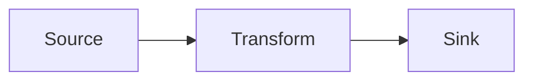

# GitHub Copilot Instructions for DataFlow

## Repository Overview

This is **DataFlow** - a high-performance, pull-based data processing pipeline library built on modern .NET features using `System.Threading.Channels`. It provides a fluent API for building concurrent data processing pipelines with efficient backpressure handling.

## Key Architecture Principles

### Pull-Based Architecture
- The library uses a pull-based model where downstream blocks pull data from upstream blocks when ready
- This provides natural backpressure - if a downstream block is slow, upstream blocks automatically slow down
- All blocks communicate via `System.Threading.Channels` for efficient async data flow

### Block System
The library is built around modular blocks that compose into pipelines:
- **Source Blocks** (e.g., `ProducerBlock`, `InputChannelBlock`) - supply data into the flow
- **Propagator Blocks** (e.g., `TransformBlock`, `BatchBlock`, `ProjectorBlock`) - process and pass data onwards
- **Target Blocks** (e.g., `ProcessorBlock`, `OutputBlock`) - terminal blocks that consume data

### Dependency Injection & Scoping
- First-class DI support throughout the pipeline
- Blocks use an "Actor" model where each concurrent worker runs in its own DI scope
- This allows scoped dependencies (like `DbContext`) to be used safely in concurrent processing
- Always use constructor injection for dependencies in `IProducer<T>`, `IProcessor<T>`, `ITransformer<TIn, TOut>`, etc.

## Code Organization

### Source Structure
```
src/
├── DataFlow/                    # Main library
│   ├── Blocks/                 # Block implementations
│   ├── Builder/                # Fluent builder API
│   ├── Actor/                  # Actor-based execution model
│   └── Metrics/                # Metrics and monitoring
├── DataFlow.OpenTelemetry/     # OpenTelemetry integration
├── Tests/                      # Unit and integration tests
├── Tests.Shared/               # Shared test utilities
└── Benchmarks/                 # Performance benchmarks
```

### Key Namespaces
- `Uniun.DataFlow` - Main library namespace
- `Uniun.DataFlow.Builder` - Fluent builder API
- `Uniun.DataFlow.Blocks` - Block implementations
- `Uniun.DataFlow.Metrics` - Metrics and monitoring

## Coding Standards

### C# Style
- Use **file-scoped namespaces** (`namespace Uniun.DataFlow;`)
- Use **var** for local variable declarations when type is apparent
- Prefer **expression-bodied members** where appropriate
- Use **implicit object creation** when type is apparent (`new()` instead of `new Type()`)
- Use **primary constructors** for simple cases
- Follow the `.editorconfig` rules in `src/.editorconfig`
- 4 spaces for indentation
- Place `using` directives **inside namespace** (except for global usings)

### Async/Await Patterns
- All data processing operations are async
- Use `IAsyncEnumerable<T>` for streaming operations
- Use `ValueTask<T>` for hot-path operations where appropriate
- Always respect `CancellationToken` - pass it through all async operations
- Use `ConfigureAwait(false)` in library code (not in test code)

### Testing Standards

#### Test Organization
Tests are in the `Tests` project and follow these conventions:

#### Test Categories
Use attributes to categorize tests:
- `[UnitTest]` - Fast, isolated unit tests
- `[IntegrationTest]` - Tests that involve multiple components or external dependencies
- `[Category("Performance")]` - Performance/benchmark tests
- `[Exploratory]` - Exploratory or diagnostic tests

#### Test Setup Pattern
Tests should use this pattern:
```csharp
public class MyBlockTests
{
    private readonly ITestOutputHelper _testOutputHelper;
    
    public MyBlockTests(ITestOutputHelper testOutputHelper)
    {
        _testOutputHelper = testOutputHelper;
        Services = new ServiceCollection();
        AddDefaultServices();
    }

    private void AddDefaultServices()
    {
        Services.AddLogging(builder => builder.AddXUnit(Output));
        Services.AddDataFlows();
        Services.AddDataFlowMetrics();
    }
    
    public IServiceCollection Services { get; }
    public ITestOutputHelper Output => _testOutputHelper;
}
```

#### Test Utilities
Reuse existing test helpers from `Tests.Shared`:
- **Processors**: `TestProcessor<T>` - configurable delay, callbacks, error injection
- **Producers**: 
  - `TestProducer<T>` - yields items with configurable delay and callbacks
  - `ConcurrencyTestProducer<T>` - tracks concurrency during production
  - `ErrorProducer<T>` - can throw errors based on predicates
- **Transformers**:
  - `TestProjector` - projects one item to many with callbacks
  - `PassthroughTransformer` - identity transformation
  - `NumberTransformer` - transforms numbers to strings

#### Test Naming
- Use descriptive test method names: `Should_ProcessItemsConcurrently_When_MaxConcurrencyIsSet()`
- Arrange-Act-Assert pattern
- Use `Shouldly` assertions: `result.ShouldBe(expected)`, `list.ShouldContain(item)`

## Building and Testing

### .NET SDK Version
- Target: .NET 8.0
- SDK requirement defined in `src/global.json`
- Use `dotnet tool restore` to restore required tools

### Build Commands
```bash
# Restore tools
dotnet tool restore

# Build
dotnet build

# Run tests
dotnet test

# Run specific test category
dotnet test --filter "Category=UnitTest"
```

### Linting and Formatting
- The project uses `dotnet format`
- Format code before committing: `dotnet format`
- EditorConfig rules are enforced

## Common Patterns

### Defining a Data Flow
```csharp
public class MyFlowConfig : IDataFlowConfiguration
{
    public void Configure(DataFlowBuilder builder)
    {
        builder
            .AddProducer<int>("source", sp => sp.GetRequiredService<MyProducer>())
            .AddBatch<int>("batcher", maxBatchSize: 100, windowPeriod: TimeSpan.FromSeconds(5))
            .ReceiveFrom("source")
            .AddProcessor<int[]>("writer", sp => sp.GetRequiredService<MyBatchWriter>())
            .ReceiveFrom("batcher");
    }
}
```

### Registering and Running
```csharp
// Register
services.AddDataFlows(maxConcurrentFlows: 4);
services.AddDataFlow<MyFlowConfig>();

// Execute
var executor = serviceProvider.GetRequiredService<FlowExecutor<MyFlowConfig>>();
await executor.ExecuteAsync(context, cancellationToken);
```

### Implementing Block Dependencies
```csharp
public class MyProducer : IProducer<int>
{
    private readonly ILogger<MyProducer> _logger;
    
    public MyProducer(ILogger<MyProducer> logger) => _logger = logger;
    
    public async IAsyncEnumerable<int> ProduceAsync(
        [EnumeratorCancellation] CancellationToken cancellationToken)
    {
        for (int i = 0; i < 100; i++)
        {
            cancellationToken.ThrowIfCancellationRequested();
            yield return i;
            await Task.Delay(10, cancellationToken);
        }
    }
}
```

## Metrics and Monitoring

- Built-in metrics support via `IDataFlowMetrics`
- OpenTelemetry integration available in `DataFlow.OpenTelemetry` package
- Channel buffer utilization, throughput, and processing time metrics
- Use `DataFlowMetricsTagsContext` for contextual tags

## Performance Considerations

- **Concurrency**: Each block can have configurable max concurrency via actor pools
- **Backpressure**: Automatically handled via bounded channels
- **Memory**: Blocks use object pooling where appropriate (e.g., `BatchBlock`)
- **Order Preservation**: 
  - Single transformer preserves order
  - Multiple concurrent transformers may interleave results
  - Batch blocks maintain order

## License

This is a **dual-licensed** project:
- **Non-Commercial**: AGPL-3.0
- **Commercial**: Requires separate license (contact repository owner)

When suggesting code changes, ensure they are compatible with AGPL-3.0 requirements.

## Don't Do

- Don't add new external dependencies without careful consideration
- Don't break the pull-based architecture principles
- Don't use synchronous blocking operations in async code paths
- Don't ignore cancellation tokens
- Don't modify working code without tests that validate the changes
- Don't use `Task.Result` or `.Wait()` - always use `await`
- Don't create new block types without discussing the design first

## When Making Changes

1. **Understand the flow**: Data flows from source → propagators → targets
2. **Test concurrency**: Many bugs only appear under concurrent load
3. **Check metrics**: Ensure metrics are properly tracked for new blocks
4. **Validate backpressure**: Ensure bounded channels work correctly
5. **Document new blocks**: Update README.md with new block types
6. **Add benchmarks**: Performance-sensitive changes should have benchmarks
7. **Follow the actor pattern**: New concurrent blocks should use the actor model

## Helpful Context

- The library is similar to TPL Dataflow but with modern .NET features
- Performance is competitive with TPL Dataflow (within ~10%)
- The builder pattern is fluent and chainable - maintain this style
- Blocks are connected via `.ReceiveFrom()` - this creates the pipeline topology
- The library emphasizes correctness and composability over raw speed

## Research Issue Identification

**⚠️ CRITICAL**: Before starting any work, check if the issue is labeled `research` or contains "⚠️ This is a research issue":

### How to Identify Research Issues

1. **Issue contains** "⚠️ This is a research issue" → Follow `/research/RESEARCH_WORKFLOW.md`
2. **Issue is about** validating/investigating approaches → Likely research
3. **Issue asks to** "validate", "explore", "investigate", "compare approaches" → Research workflow

### Documentation Standards for Research

#### Diagram Preferences
**ALWAYS prefer Mermaid diagrams** in documentation where visualization helps understanding:
- ✅ Use mermaid flowcharts for process flows and decision trees
- ✅ Use mermaid sequence diagrams for interaction flows  
- ✅ Use mermaid graphs for architecture and data flow
- ❌ Avoid ASCII art diagrams (hard to maintain, less clear)

**Example**:
````markdown

````

#### Workflow Improvement Feedback Loop

**⚠️ IMPORTANT**: When reviewers raise workflow-related feedback during research:

1. **Acknowledge the feedback** in your response
2. **Make requested changes** to research artifacts
3. **Update workflow documentation** to prevent the issue in future research:
   - Update `.github/copilot-instructions.md` if it's a general Copilot guidance issue
   - Update `/research/RESEARCH_WORKFLOW.md` if it's a research-specific process issue
   - Update issue templates in `.github/ISSUE_TEMPLATE/` if relevant
4. **Make the enhancement prominent** so it won't be missed by future agents

**Examples of workflow feedback**:
- "Prefer mermaid diagrams" → Update copilot instructions with diagram standards
- "Add test consolidation guidance" → Update research workflow with testing best practices
- "Clarify when to create ADRs" → Update research workflow decision documentation section

**Goal**: Continuous improvement of research processes based on real reviewer feedback.

### Research vs Implementation - Key Differences

| Aspect | Research Issue | Implementation Issue |
|--------|---------------|---------------------|
| **Purpose** | Validate approach, create specifications | Implement validated design |
| **Code Location During Work** | Can write in `/poc/` or `/src/` to validate | Code in `/poc/` or `/src/` for integration |
| **Code Fate** | **REVERTED** after reviewer approval | **MERGED** into codebase |
| **Primary Output** | Documentation + implementation issue | Working code |
| **Deliverables** | `/research/[topic]/` with docs + specs; ADRs in `/poc/docs/adr/` or `/src/docs/adr/` | Code changes in `/poc/` or `/src/` |

### Research Workflow Summary

**During Research:**
- ✅ Create `/research/[topic-name]/` folder structure
- ✅ Write exploratory code in `/poc/` or `/src/` to validate approaches
- ✅ Create tests to validate concepts
- ✅ Document findings, design decisions, and recommendations

**Before PR Merge (After Reviewer Approval):**
- ✅ Save important prototype code to `/research/[topic]/handover/prototype/`
- ✅ Create implementation-ready issue in `/research/[topic]/handover/`
- ✅ **REVERT all exploratory code changes** in `/poc/` and `/src/`
- ✅ Keep all documentation in `/research/[topic]/`

**When in doubt:** Ask "Is this validating an approach (research) or implementing a validated design (implementation)?"

## Implementation Team Workflow

**⚠️ CRITICAL**: Implementation issues work on VALIDATED designs from research handover or direct requirements.

### How to Identify Implementation Issues

1. **Issue contains** "⚠️ This is an implementation issue" → Follow implementation workflow
2. **Issue references** handover document in `/research/[topic]/handover/` → Implementation from research
3. **Issue has** clear requirements without need for validation → Direct implementation

### Implementation Workflow Overview

Implementation work can target either:
- **POC code** (`/poc/`) - Proof-of-concept implementations
- **Production code** (`/src/`) - Library implementations  
- **Both** - Changes spanning multiple codebases

**The handover document or issue context MUST clearly indicate the target codebase.**

### Starting Implementation Work

**Step 1: Identify Target Codebase**

Check the issue for:
- Explicit statement: "Target: POC" or "Target: Production" or "Target: Both"
- Handover document path (e.g., `/research/[topic]/handover/github-issue-*.md`)
- Context clues about which code is being modified

**⚠️ If target is unclear: STOP and ask the user to clarify before proceeding.**

**Step 2: Read Handover Document (if from research)**

If the issue references a handover document in `/research/[topic]/handover/`:
1. Read the handover document completely - it contains:
   - Problem context and background
   - Implementation guidance and recommended approach
   - API/interface designs
   - Test scenarios and edge cases
   - Performance requirements
   - Design references and ADRs
2. Read referenced documentation:
   - Research findings: `/research/[topic]/README.md`
   - Design docs: `/research/[topic]/design/`
   - ADRs: `/poc/docs/adr/` or `/src/docs/adr/`
   - Prototype code (if available): `/research/[topic]/handover/prototype/`

**Step 3: Understand the Codebase**

For **POC implementation** (`/poc/`):
- Read `/poc/README.md` - POC goals and architecture
- Review `/poc/docs/POC_GLOSSARY.md` - terminology
- Check relevant design docs in `/poc/docs/design/`
- Review existing ADRs in `/poc/docs/adr/`

For **Production implementation** (`/src/`):
- Review existing architecture in the target area
- Check existing tests and patterns
- Review relevant documentation in `/src/docs/`

**Step 4: Create Implementation Plan (for POC targets)**

If implementing in POC codebase, create a plan document:
- **Location**: `/poc/docs/plans/[descriptive-name].md`
- **Content**:
  - Objectives (from handover or requirements)
  - Implementation approach
  - Milestones with validation criteria
  - Testing strategy
  - Links to handover document and supporting docs

For production code, plan can be tracked in the issue itself.

**Step 5: Implement with Tests**

- Follow the guidance in the handover document (if applicable)
- Implement test scenarios documented in handover
- Handle edge cases identified in research
- Validate performance requirements (if specified)
- Update documentation as needed

**Step 6: Validate and Document**

- Run all tests (create new tests per handover guidance)
- Run benchmarks if performance requirements specified
- Update glossary if new concepts introduced (POC only)
- Update relevant documentation
- Create ADR if significant decisions made during implementation

### Implementation Without Research Handover

For direct implementation (no research phase):
1. Ensure requirements are clear in the issue
2. Identify target codebase explicitly
3. Follow same implementation process
4. Create plan document for POC work
5. Document decisions and findings

### Key Differences: POC vs Production Implementation

| Aspect | POC Implementation | Production Implementation |
|--------|-------------------|--------------------------|
| **Planning** | Create plan in `/poc/docs/plans/` | Plan in issue or brief doc |
| **Documentation** | Update glossary, create guides | Update API docs, guides |
| **Testing** | POC test projects | Production test projects |
| **Benchmarks** | POC benchmarks, research folder | Production benchmarks |
| **ADRs** | `/poc/docs/adr/` | `/src/docs/adr/` |
| **Exploratory** | More flexible, can iterate | More structured, stable APIs |

### Documentation Requirements by Target

**For POC Implementation:**
- Create or update plan in `/poc/docs/plans/`
- Update `/poc/docs/POC_GLOSSARY.md` with new terminology
- Create guides in `/poc/docs/guides/` for patterns
- Document benchmarks in `/research/` if conducting performance analysis
- Create ADRs in `/poc/docs/adr/` for significant decisions

**For Production Implementation:**
- Update API documentation
- Update user guides if needed
- Create ADRs in `/src/docs/adr/` for significant decisions
- Update CHANGELOG for breaking changes

### When to Ask for Clarification

**STOP and ask the user if:**
- Target codebase is not explicitly stated and cannot be inferred
- Handover document is referenced but doesn't exist or is incomplete
- Requirements are unclear or missing critical information
- Design decisions are needed but no guidance provided

### Success Criteria for Implementation

Implementation is complete when:
- [ ] All objectives from handover/requirements met
- [ ] Tests passing (including new tests from handover guidance)
- [ ] Performance requirements validated (if applicable)
- [ ] Edge cases handled (as documented in handover)
- [ ] Documentation updated (glossary, guides, API docs)
- [ ] Code review ready

## POC Work Guidelines

**⚠️ POC Context**: This section provides guidelines for understanding POC (Proof-of-Concept) work context.

The `/poc` folder contains evolving architectural explorations for the DataFlow library. Implementation work targeting POC code follows the **Implementation Team Workflow** above with POC-specific documentation requirements.

### When Working on POC Code

If you are implementing features or fixes in the `/poc` codebase:

**Follow the Implementation Team Workflow above**, noting these POC-specific requirements:

**Documentation Structure** (`/poc/docs/`):
- `/poc/docs/plans/` - Action plans and proposals (create one for each implementation)
- `/poc/docs/design/` - Architecture and design documentation  
- `/poc/docs/guides/` - Implementation patterns and how-to guides
- `/poc/docs/adr/` - Architecture Decision Records
- `/poc/docs/POC_GLOSSARY.md` - Terminology reference (keep updated)

**Key POC Guidelines**:
1. **Read First**: `/poc/README.md` and `/poc/docs/POC_GLOSSARY.md`
2. **Create Plan**: For each POC implementation, create a plan in `/poc/docs/plans/`
3. **Document Decisions**: Use ADRs in `/poc/docs/adr/` for significant choices
4. **Update Glossary**: Add new terminology to `/poc/docs/POC_GLOSSARY.md`
5. **Testing**: Use POC test projects (`DataFlow.POC.Tests`)
6. **Benchmarking**: Use POC benchmark projects, document results in `/research/`

**Research vs Implementation in POC**:
- Research on POC → Exploratory code, will be reverted, produces handover docs
- Implementation in POC → Code merged to POC codebase, guided by handover or requirements

For comprehensive POC workflow details, the information is integrated into:
- Implementation Team Workflow (this document, above)
- Research Workflow (`/research/RESEARCH_WORKFLOW.md`)

The POC has different documentation requirements than production code. Always maintain POC documentation structure when working in `/poc`.
