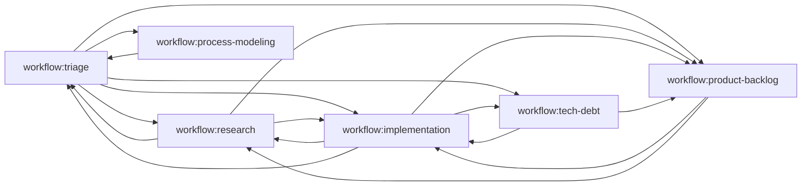

# Workflow Topology System Guide

**Purpose**: Centralized guide for using the GitHub label-based workflow topology system.

**Audience**: Copilot agents working on issues, human reviewers, and contributors.

---

## Overview

The workflow topology system uses **GitHub labels** to track which workflow an issue belongs to and provides helper scripts for querying and transitioning issues between workflows.

### Why This System?

**Before**: Workflow state was implicit (file-based, scattered across folders)
- Hard to query "all issues in research workflow"
- No formal handover mechanism
- Difficult to track workflow transitions

**After**: Workflow state is explicit (label-based, centralized on issues)
- Easy to query issues by workflow: `gh issue list --label "workflow:research"`
- Formal handover with audit trail
- Clear visibility into workflow state

---

## Label Schema

### Workflow Designation Labels

All open issues have exactly ONE workflow label:

| Label | Description | Color |
|-------|-------------|-------|
| `workflow:triage` | Awaiting assessment and routing | Green (`0E8A16`) |
| `workflow:research` | Designated to Research Workflow | Green (`0E8A16`) |
| `workflow:implementation` | Designated to Implementation Workflow | Green (`0E8A16`) |
| `workflow:tech-debt` | Designated to Tech Debt Workflow | Green (`0E8A16`) |
| `workflow:product-backlog` | Designated to Product Prioritization | Green (`0E8A16`) |
| `workflow:process-modeling` | Designated to Process Modeling Workflow | Green (`0E8A16`) |

**Rules**:
- New issues are automatically labeled with `workflow:triage`
- Issues transition between workflows via label changes
- An issue can only have ONE workflow label at a time
- Closed issues retain their last workflow label for historical tracking

---

## GitHub MCP Tooling (Copilot Agents)

**Primary Approach**: Copilot agents interact with GitHub issues using **GitHub MCP (Model Context Protocol) tools**.

### Setup

See `.github/docs/COPILOT_GITHUB_SETUP.md` for complete setup instructions including:
- Creating fine-grained Personal Access Token
- Configuring repository environment secrets
- Adding MCP server configuration
- Creating workflow labels

### Available MCP Tools

**Read Operations**:
- `list_issues` - Query issues by labels, state, filters
- `issue_read` - Get issue details, comments, labels, sub-issues
- `search_issues` - Advanced issue search across repositories

**Write Operations**:
- `issue_write` - Create new issues or update existing ones
- `add_issue_comment` - Add comments to issues
- `update_pull_request` - Update PR details and labels

### Querying Workflow Queues

**Using MCP Tools** (Copilot agents):
```python
# Query research workflow
list_issues(
    owner="uniun-technology",
    repo="lib-dataflow",
    labels=["workflow:research"],
    state="OPEN"
)

# Query with filters
list_issues(
    owner="uniun-technology",
    repo="lib-dataflow",
    labels=["workflow:research", "feature"],
    state="OPEN",
    perPage=50
)
```

**Using Helper Script** (manual/CI):
```bash
# Query research workflow
./.github/scripts/workflow/query-workflow-queue.sh research

# Query all workflows
for wf in triage research implementation tech-debt product-backlog process-modeling; do
  ./.github/scripts/workflow/query-workflow-queue.sh $wf
done
```

### Handing Over Issues

**Using MCP Tools** (Copilot agents - recommended):
```python
# Step 1: Update issue to change workflow label
issue_write(
    method="update",
    owner="uniun-technology",
    repo="lib-dataflow",
    issue_number=123,
    labels=["workflow:implementation", "feature"]  # Only workflow:implementation kept
)

# Step 2: Add handover comment
add_issue_comment(
    owner="uniun-technology",
    repo="lib-dataflow",
    issue_number=123,
    body="""🔄 **Handover: research → implementation**

Research validated approach. Ready for implementation.

**Research Deliverables**:
- Findings: `/research/caching-strategy/README.md`
- Design: `/research/caching-strategy/design/`
- Prototype: `/research/caching-strategy/handover/prototype/`

See workflow documentation: `.team/prompts/IMPLEMENTATION_WORKFLOW.md`"""
)
```

**Using GitHub CLI** (manual):
```bash
# Combined command
gh issue edit 123 \
  --remove-label "workflow:research" \
  --add-label "workflow:implementation"

gh issue comment 123 --body "🔄 **Handover: research → implementation**

Research validated approach. Ready for implementation.

**Research Deliverables**:
- Findings: \`/research/[topic]/README.md\`
- Design: \`/research/[topic]/design/[component].md\`

See workflow documentation: \`.team/prompts/IMPLEMENTATION_WORKFLOW.md\`"
```

### Viewing Workflow Dashboard

**Using Helper Script** (provides formatted view):
```bash
./.github/scripts/workflow/workflow-dashboard.sh
```

**Output**:
```
=== Workflow State Dashboard ===

Open Issues by Workflow:
------------------------
  workflow:triage          : 5 open issues
  workflow:research        : 2 open issues
  workflow:implementation  : 8 open issues
  workflow:tech-debt       : 1 open issues
  workflow:product-backlog : 12 open issues
  workflow:process-modeling: 0 open issues
------------------------
  Total: 28 open issues
```

---

## Helper Scripts

Simple command-line utilities for manual queries. Located in `.github/scripts/workflow/`

### query-workflow-queue.sh

Query all issues designated to a specific workflow.

**Usage**:
```bash
./.github/scripts/workflow/query-workflow-queue.sh <workflow-name>
```

### workflow-dashboard.sh

View high-level state of all workflows.

**Usage**:
```bash
./.github/scripts/workflow/workflow-dashboard.sh
```

**Note**: Copilot agents should use GitHub MCP tools directly instead of calling these scripts. See `.github/scripts/workflow/README.md` for complete documentation.

---

## Product Backlog Transition: Files to GitHub Issues

The workflow topology system enables **GitHub issues to replace the file-based product backlog** system (`/product/backlog/`).

### Why Transition to GitHub Issues?

**File-Based Backlog** (`/product/backlog/`) had limitations:
- Backlog items were disconnected from issue tracking
- Hard to query, filter, or search backlog items
- No built-in discussion/comments mechanism
- Manual synchronization needed between files and issues

**GitHub Issues with `workflow:product-backlog`** provides:
- Centralized tracking: backlog items ARE GitHub issues
- Easy querying: `gh issue list --label "workflow:product-backlog"`
- Built-in discussion via comments
- Linking to related issues
- Direct handover to implementation workflow

### How to Use GitHub Issues as Product Backlog

**Creating Backlog Items** (Using MCP Tools - Copilot agents):
```python
# Research workflow creates backlog item as GitHub issue
issue_write(
    method="create",
    owner="uniun-technology",
    repo="lib-dataflow",
    title="[Feature/Tech Debt/Bug]: Description",
    body="""## Summary
[Brief description]

## Context
[Background and rationale]

## Implementation Guidance
[Key requirements and approach]

## Handover Materials
Research deliverables available at:
- Findings: `/research/[topic]/README.md`
- Design: `/research/[topic]/design/[component].md`
- Prototypes: `/research/[topic]/handover/prototype/`
- Benchmarks: `/research/[topic]/benchmarks/`""",
    labels=["workflow:product-backlog", "tech-debt"]
)
```

**Creating Backlog Items** (Using GitHub CLI - manual):
```bash
gh issue create \
  --title "[Feature/Tech Debt/Bug]: Description" \
  --label "workflow:product-backlog" \
  --body "## Summary
[Brief description]

## Context
[Background and rationale]

## Implementation Guidance
[Key requirements and approach]

## Handover Materials
Research deliverables available at:
- Findings: \`/research/[topic]/README.md\`
- Design: \`/research/[topic]/design/[component].md\`
- Prototypes: \`/research/[topic]/handover/prototype/\`
- Benchmarks: \`/research/[topic]/benchmarks/\`"
```

**Adding Context to Backlog Items** (Using MCP Tools):
```python
# Add implementation notes
add_issue_comment(
    owner="uniun-technology",
    repo="lib-dataflow",
    issue_number=issue_number,
    body="""## Additional Context

Updated approach based on team feedback:
- [Details]

See updated design: `/research/[topic]/design/revised-approach.md`"""
)
```

**Adding Context to Backlog Items** (Using GitHub CLI):
```bash
# Add implementation notes
gh issue comment $ISSUE --body "## Additional Context

Updated approach based on team feedback:
- [Details]

See updated design: \`/research/[topic]/design/revised-approach.md\`"
```

**Enriching with Artifacts**:

Keep handover materials in the repository, link from issue:

```markdown
## Handover Materials

All research deliverables committed to repository:
- **Findings Report**: `/research/caching-strategy/README.md`
- **Design Documents**: `/research/caching-strategy/design/`
- **Prototype Code**: `/research/caching-strategy/handover/prototype/`
- **Performance Data**: `/research/caching-strategy/benchmarks/results.md`

Review these materials before implementation.
```

**Querying Product Backlog** (Using MCP Tools):
```python
# All backlog items
list_issues(
    owner="uniun-technology",
    repo="lib-dataflow",
    labels=["workflow:product-backlog"],
    state="OPEN"
)

# Filter by additional labels
list_issues(
    owner="uniun-technology",
    repo="lib-dataflow",
    labels=["workflow:product-backlog", "tech-debt"],
    state="OPEN"
)
```

**Querying Product Backlog** (Using GitHub CLI):
```bash
# All backlog items
gh issue list --label "workflow:product-backlog" --state open

# Filter by additional labels
gh issue list --label "workflow:product-backlog" --label "tech-debt"
gh issue list --label "workflow:product-backlog" --label "feature"

# Search backlog
gh issue list --label "workflow:product-backlog" --search "caching"
```

### Workflow Integration Pattern

**Research Workflow** → Creates GitHub issue with `workflow:product-backlog`:

Using MCP Tools:
```python
# After research complete, create backlog item
new_issue = issue_write(
    method="create",
    owner="uniun-technology",
    repo="lib-dataflow",
    title="Implement distributed caching layer",
    body="[Backlog item details with links to /research/caching/]",
    labels=["workflow:product-backlog", "feature"]
)

# Close research issue
add_issue_comment(
    owner="uniun-technology",
    repo="lib-dataflow",
    issue_number=research_issue,
    body=f"Research complete. Created backlog item #{new_issue}"
)
issue_write(
    method="update",
    owner="uniun-technology",
    repo="lib-dataflow",
    issue_number=research_issue,
    state="closed"
)
```

Using GitHub CLI:
```bash
# After research complete
gh issue create \
  --title "Implement distributed caching layer" \
  --label "workflow:product-backlog" \
  --body "[Backlog item details with links to /research/caching/]"

# Then close research issue (or hand over if continuing)
gh issue close $RESEARCH_ISSUE --comment "Research complete. Created backlog item #$NEW_ISSUE"
```

**Tech Debt Workflow** → Creates GitHub issues for findings:

Using MCP Tools:
```python
# For each finding, create backlog issue
for finding_id, finding_desc in findings:
    issue_write(
        method="create",
        owner="uniun-technology",
        repo="lib-dataflow",
        title=f"Tech Debt: {finding_id} - {finding_desc}",
        body=f"[Finding details with links to /research/tech-debt-2025-11-09/]",
        labels=["workflow:product-backlog", "tech-debt"]
    )
```

Using GitHub CLI:
```bash
# For each finding, create backlog issue
for finding in TD-001 TD-002 TD-003; do
  gh issue create \
    --title "Tech Debt: $finding description" \
    --label "workflow:product-backlog" \
    --body "[Finding details with links to /research/tech-debt-2025-11-09/]"
done
```

**Product Prioritization** → Queries and prioritizes GitHub issues:

Using MCP Tools:
```python
# Query backlog
backlog_issues = list_issues(
    owner="uniun-technology",
    repo="lib-dataflow",
    labels=["workflow:product-backlog"],
    state="OPEN"
)

# Prioritize by handing over to implementation
issue_write(
    method="update",
    owner="uniun-technology",
    repo="lib-dataflow",
    issue_number=selected_issue,
    labels=["workflow:implementation", "feature"]  # Removes product-backlog, adds implementation
)

add_issue_comment(
    owner="uniun-technology",
    repo="lib-dataflow",
    issue_number=selected_issue,
    body="🔄 **Handover: product-backlog → implementation**\n\nPrioritized for Q4 implementation."
)
```

Using GitHub CLI:
```bash
# Query backlog
gh issue list --label "workflow:product-backlog" --state open

# Prioritize by handing over to implementation
gh issue edit $SELECTED_ISSUE \
  --remove-label "workflow:product-backlog" \
  --add-label "workflow:implementation"
```

**Implementation Workflow** → Updates issue, references artifacts:

Using MCP Tools:
```python
# Query implementation queue (includes items from product backlog)
impl_issues = list_issues(
    owner="uniun-technology",
    repo="lib-dataflow",
    labels=["workflow:implementation"],
    state="OPEN"
)

# Implementation reads handover materials from links in issue
# Updates issue with progress via comments
add_issue_comment(
    owner="uniun-technology",
    repo="lib-dataflow",
    issue_number=issue_number,
    body="""✅ Implemented caching layer

**Changes**:
- Added CacheManager component
- Integrated with pipeline
- Added tests

**Referenced Materials**:
Used research deliverables from `/research/caching-strategy/` to guide implementation."""
)
```

Using GitHub CLI:
```bash
# Query implementation queue (includes items from product backlog)
gh issue list --label "workflow:implementation"

# Implementation reads handover materials from links in issue
# Updates issue with progress via comments
gh issue comment $ISSUE --body "✅ Implemented caching layer

Changes:
- Added cache service
- Integrated with existing data layer
- Tests passing

See PR #123 for implementation"

# Close when complete
gh issue close $ISSUE --comment "✅ Implementation complete, merged in PR #123"
```

### Migrating Existing Product Backlog Files

### Migrating Existing Product Backlog Files

**✅ Migration Complete**: All 7 existing backlog items have been migrated to GitHub issues (#221-227).

Original backlog files remain in `/product/backlog/` for historical reference. All new backlog items should be created directly as GitHub issues using the MCP tools or GitHub CLI as shown above.

### Best Practices

1. **Use issue body for summary** - Include all essential information in the issue itself
2. **Link to detailed artifacts in repo** - Use comments with links to `/research/`, `/product/backlog/`, etc.
3. **Add labels for categorization** - Use additional labels: `feature`, `tech-debt`, `bug`, `performance`
4. **Update via comments** - Don't edit issue body; add context via comments
5. **Close when complete** - Issue closed = backlog item resolved

### Legacy `/product/backlog/` System

The file-based system in `/product/backlog/` has been phased out:

- **New workflows**: Create GitHub issues directly using MCP tools
- **Existing files**: Migrated to GitHub issues (#221-227), files remain for historical reference
- **Current state**: GitHub issues are the single source of truth for backlog

---

## Handover Patterns

### Standard Handover

When transitioning an issue from one workflow to another:

1. **Identify destination workflow** based on current state
2. **Use MCP tools** (Copilot agents) or manual commands (humans)
3. **Provide clear reason** in the handover comment
4. **Include relevant context** (deliverables, findings, blockers)

**Using MCP Tools** (Copilot agents - recommended):
```python
# Update workflow label
issue_write(
    method="update",
    owner="uniun-technology",
    repo="lib-dataflow",
    issue_number=issue_number,
    labels=["workflow:implementation", "feature"]  # New workflow label
)

# Add handover comment
add_issue_comment(
    owner="uniun-technology",
    repo="lib-dataflow",
    issue_number=issue_number,
    body="""🔄 **Handover: research → implementation**

Research validated approach. Ready for implementation.

**Research Deliverables**:
- Findings: `/research/[topic]/README.md`
- Design: `/research/[topic]/design/`

See workflow documentation: `.team/prompts/IMPLEMENTATION_WORKFLOW.md`"""
)
```

**Using GitHub CLI** (manual):
```bash
# Update workflow label
gh issue edit $ISSUE --remove-label "workflow:research" --add-label "workflow:implementation"

# Add handover comment
gh issue comment $ISSUE --body "🔄 **Handover: research → implementation**

Research validated approach. Ready for implementation.

**Research Deliverables**:
- Findings: \`/research/[topic]/README.md\`
- Design: \`/research/[topic]/design/\`

See workflow documentation: \`.team/prompts/IMPLEMENTATION_WORKFLOW.md\`"
```

---

### Common Handover Scenarios

#### Triage → Any Workflow

After assessing a new issue, route to appropriate workflow.

**Using MCP Tools**:
```python
# Needs validation
issue_write(method="update", owner="uniun-technology", repo="lib-dataflow",
           issue_number=issue_number, labels=["workflow:research", "feature"])
add_issue_comment(owner="uniun-technology", repo="lib-dataflow",
                  issue_number=issue_number, body="🔄 **Handover: triage → research**\n\nNeeds approach validation")

# Ready to implement
issue_write(method="update", owner="uniun-technology", repo="lib-dataflow",
           issue_number=issue_number, labels=["workflow:implementation", "feature"])
add_issue_comment(owner="uniun-technology", repo="lib-dataflow",
                  issue_number=issue_number, body="🔄 **Handover: triage → implementation**\n\nClear requirements, ready to build")

# Discover tech debt
issue_write(method="update", owner="uniun-technology", repo="lib-dataflow",
           issue_number=issue_number, labels=["workflow:tech-debt", "tech-debt"])
add_issue_comment(owner="uniun-technology", repo="lib-dataflow",
                  issue_number=issue_number, body="🔄 **Handover: triage → tech-debt**\n\nLegacy code modernization needed")

# Needs prioritization
issue_write(method="update", owner="uniun-technology", repo="lib-dataflow",
           issue_number=issue_number, labels=["workflow:product-backlog", "feature"])
add_issue_comment(owner="uniun-technology", repo="lib-dataflow",
                  issue_number=issue_number, body="🔄 **Handover: triage → product-backlog**\n\nMultiple competing priorities")
```

**Using GitHub CLI**:
```bash
# Needs validation
gh issue edit $ISSUE --remove-label "workflow:triage" --add-label "workflow:research"

# Ready to implement
gh issue edit $ISSUE --remove-label "workflow:triage" --add-label "workflow:implementation"

# Discover tech debt
gh issue edit $ISSUE --remove-label "workflow:triage" --add-label "workflow:tech-debt"

# Needs prioritization
gh issue edit $ISSUE --remove-label "workflow:triage" --add-label "workflow:product-backlog"
```

#### Research → Implementation

Research validates approach and creates specifications.

**Using MCP Tools**:
```python
issue_write(
    method="update",
    owner="uniun-technology",
    repo="lib-dataflow",
    issue_number=issue_number,
    labels=["workflow:implementation", "feature"]
)

add_issue_comment(
    owner="uniun-technology",
    repo="lib-dataflow",
    issue_number=issue_number,
    body="""🔄 **Handover: research → implementation**

Research validated approach. See `/research/[topic]/` for details.

**Research Deliverables**:
- Findings report: `/research/[topic]/README.md`
- Design documents: `/research/[topic]/design/`
- Prototype code: `/research/[topic]/handover/prototype/`
- Benchmark results: `/research/[topic]/benchmarks/`

Review these materials before implementation."""
)
```

**Using GitHub CLI**:
```bash
gh issue edit $ISSUE --remove-label "workflow:research" --add-label "workflow:implementation"
gh issue comment $ISSUE --body "[Handover comment with deliverables]"
```

#### Implementation → Tech Debt

Implementation reveals technical debt.

**Using MCP Tools**:
```python
issue_write(
    method="update",
    owner="uniun-technology",
    repo="lib-dataflow",
    issue_number=issue_number,
    labels=["workflow:tech-debt", "tech-debt"]
)

add_issue_comment(
    owner="uniun-technology",
    repo="lib-dataflow",
    issue_number=issue_number,
    body="🔄 **Handover: implementation → tech-debt**\n\nImplementation revealed legacy code that needs modernization"
)
```

**Using GitHub CLI**:
```bash
gh issue edit $ISSUE --remove-label "workflow:implementation" --add-label "workflow:tech-debt"
gh issue comment $ISSUE --body "[Handover comment]"
```

#### Implementation → Research

Implementation uncovers unknowns.

**Using MCP Tools**:
```python
issue_write(
    method="update",
    owner="uniun-technology",
    repo="lib-dataflow",
    issue_number=issue_number,
    labels=["workflow:research", "feature"]
)

add_issue_comment(
    owner="uniun-technology",
    repo="lib-dataflow",
    issue_number=issue_number,
    body="🔄 **Handover: implementation → research**\n\nImplementation revealed unknowns requiring validation"
)
```

**Using GitHub CLI**:
```bash
gh issue edit $ISSUE --remove-label "workflow:implementation" --add-label "workflow:research"
gh issue comment $ISSUE --body "[Handover comment]"
```

#### Any Workflow → Triage

Requirements unclear, needs reassessment.

**Using MCP Tools**:
```python
issue_write(
    method="update",
    owner="uniun-technology",
    repo="lib-dataflow",
    issue_number=issue_number,
    labels=["workflow:triage", "feature"]
)

add_issue_comment(
    owner="uniun-technology",
    repo="lib-dataflow",
    issue_number=issue_number,
    body="🔄 **Handover: implementation → triage**\n\nRequirements became unclear during implementation"
)
```

**Using GitHub CLI**:
```bash
gh issue edit $ISSUE --remove-label "workflow:implementation" --add-label "workflow:triage"
gh issue comment $ISSUE --body "[Handover comment]"
```

#### Research/Implementation → Product Backlog

Work complete but needs prioritization.

**Using MCP Tools**:
```python
issue_write(
    method="update",
    owner="uniun-technology",
    repo="lib-dataflow",
    issue_number=issue_number,
    labels=["workflow:product-backlog", "feature"]
)

add_issue_comment(
    owner="uniun-technology",
    repo="lib-dataflow",
    issue_number=issue_number,
    body="🔄 **Handover: research → product-backlog**\n\nResearch complete, needs prioritization for implementation"
)
```

**Using GitHub CLI**:
```bash
gh issue edit $ISSUE --remove-label "workflow:research" --add-label "workflow:product-backlog"
gh issue comment $ISSUE --body "[Handover comment]"
```

---

## Creating Linked/Related Issues

Sometimes you need to create a **new, separate issue** instead of handing over the current issue. This is common when:

- Implementation discovers a separate tech debt item that should be tracked independently
- Work reveals a distinct feature request that should be prioritized separately
- A blocker issue needs its own tracking while the original continues
- You want to split concerns (e.g., keep implementation issue, create separate tech debt issue)

### When to Create a Linked Issue vs Handover

**Create a Linked Issue** when:
- The new work is separate/independent from the current issue
- Current issue should continue in its current workflow
- You want both issues tracked independently
- Example: Implementation finds tech debt that should be analyzed separately

**Handover Current Issue** when:
- Current work cannot proceed without the new work
- Current issue's workflow changes (e.g., needs research before continuing)
- The issues are the same concern, just in different workflow stage
- Example: Implementation needs research validation before continuing

### Creating a Linked Issue

**Using MCP Tools** (Copilot agents - recommended):

1. **Create the new issue** with appropriate labels:
   ```python
   # Create new tech debt issue from implementation work
   new_issue = issue_write(
       method="create",
       owner="uniun-technology",
       repo="lib-dataflow",
       title="Tech Debt: Modernize legacy data access patterns",
       body="""Discovered during implementation of #123.

## Context
While implementing feature X, found legacy data access code that should be modernized.

## Details
- Location: src/Data/
- Pattern: Old ADO.NET patterns
- Impact: Maintenance burden, inconsistent with current patterns

## Suggested Action
Tech Debt workflow should analyze and create backlog items.

Related to: #123""",
       labels=["workflow:triage", "tech-debt"]
   )
   ```

2. **Link from original issue**:
   ```python
   # Add comment to original issue
   add_issue_comment(
       owner="uniun-technology",
       repo="lib-dataflow",
       issue_number=original_issue,
       body=f"""Created linked tech debt issue #{new_issue} to track legacy patterns discovered during implementation.

Implementation will continue with current approach. Tech debt will be addressed separately."""
   )
   ```

**Using GitHub CLI** (manual):

1. **Create the new issue**:
   ```bash
   gh issue create \
     --title "Tech Debt: Modernize legacy data access patterns" \
     --body "Discovered during implementation of #123..." \
     --label "workflow:triage"
   ```

2. **Link from original issue**:
   ```bash
   gh issue comment $ORIGINAL_ISSUE --body "Created linked tech debt issue #$NEW_ISSUE to track legacy patterns discovered during implementation."
   ```

3. **The new issue goes to triage** (via auto-label), then triage routes it appropriately

### Example Scenarios

#### Implementation Creates Tech Debt Issue

**Using MCP Tools**:
```python
# Create separate tech debt issue
new_issue = issue_write(
    method="create",
    owner="uniun-technology",
    repo="lib-dataflow",
    title="Tech Debt: Eliminate CS0436 warnings in Data layer",
    body="Found while implementing #456...",
    labels=["workflow:triage", "tech-debt"]
)

# Link from original implementation issue
add_issue_comment(
    owner="uniun-technology",
    repo="lib-dataflow",
    issue_number=456,
    body=f"""Created tech debt issue #{new_issue} to track CS0436 warnings.

Implementation continuing with workaround. Tech debt tracked separately."""
)

# Implementation issue stays in workflow:implementation
# New issue gets triaged and likely routed to workflow:tech-debt
```

**Using GitHub CLI**:
```bash
# Create separate tech debt issue
NEW_ISSUE=$(gh issue create \
  --title "Tech Debt: Eliminate CS0436 warnings in Data layer" \
  --body "Found while implementing #456..." \
  --label "workflow:triage" \
  --json number --jq '.number')

# Link from original implementation issue
gh issue comment 456 --body "Created tech debt issue #$NEW_ISSUE to track CS0436 warnings."
```

#### Implementation Creates Separate Feature Request

**Using MCP Tools**:
```python
# Discovered related feature while implementing
NEW_ISSUE=$(gh issue create \
  --title "Feature: Add bulk import support" \
  --body "Discovered need during #789 implementation..." \
  --label "workflow:triage" \
  --json number --jq '.number')

# Link from original
gh issue comment 789 --body "Created feature request #$NEW_ISSUE for bulk import.

Current implementation provides single-item import. Bulk import tracked separately for prioritization."
```

#### Creating Issue That Goes Directly to Workflow

If you know the destination workflow, you can add the workflow label directly:

```bash
# Create issue directly in tech-debt workflow (skip triage)
gh issue create \
  --title "Tech Debt: Remove unused fields" \
  --body "Analysis complete, ready for backlog creation..." \
  --label "workflow:tech-debt"

# Or create for product prioritization
gh issue create \
  --title "Prioritize: Q4 backlog items" \
  --body "Requesting prioritization of 12 new backlog items..." \
  --label "workflow:product-backlog"
```

### Best Practices

1. **Always link related issues** - Use "Related to #123" or "Discovered during #456" in issue body
2. **Add context** - Explain why the separate issue was created
3. **Update original issue** - Comment that a linked issue was created
4. **Use workflow labels** - New issues get `workflow:triage` (auto-labeled), or specify if you know the destination
5. **Keep concerns separate** - Don't create linked issues just to avoid handover; use linked issues when concerns are truly separate

### Issue Relationships

GitHub doesn't have built-in relationship types, so use conventions in issue bodies and comments:

- **Related to**: General relationship
- **Blocked by**: Cannot proceed until other issue completes
- **Discovered during**: Found while working on another issue
- **Duplicate of**: Same as another issue (use GitHub's duplicate feature)
- **Supersedes**: Replaces an older issue

---

## Querying Workflow Queues

Each workflow should start by querying its queue to find assigned issues.

### At Workflow Entry

**Pattern** (add to each workflow documentation):

```markdown
## Workflow Queue

**Query issues designated to this workflow:**

```bash
gh issue list \
  --label "workflow:<workflow-name>" \
  --state open \
  --json number,title,url
```

**Or use the query script:**
```bash
./.github/scripts/workflow/query-workflow-queue.sh <workflow-name>
```

**Entry Points:**
- From Triage: [when triage routes here]
- From Other Workflow: [when handover happens]
```

### Filtering by Additional Criteria

```bash
# High priority implementation issues
gh issue list --label "workflow:implementation" --label "priority:high"

# Blocked research issues
gh issue list --label "workflow:research" --label "status:blocked"

# Recently created triage issues
gh issue list --label "workflow:triage" --sort created --order desc

# All workflow issues (across all workflows)
gh issue list --search "label:workflow:*" --state open
```

---

## Workflow State Transitions

### Valid Transitions



**Key Points**:
- Most workflows can hand back to Triage for reassessment
- Research and Implementation are tightly coupled (can go both directions)
- Product Backlog can route to Research or Implementation
- Process Modeling typically returns to Triage after workflow improvements

---

## Issue Lifecycle

### 1. Issue Created
- GitHub Actions automatically adds `workflow:triage`
- Issue appears in triage queue

### 2. Triage Assessment
- Triage agent queries triage queue
- Assesses issue and determines appropriate workflow
- Hands over to destination workflow

### 3. Workflow Processing
- Destination workflow agent queries their queue
- Finds issue and processes according to workflow
- May hand over to another workflow or close issue

### 4. Issue Closure
- Final workflow closes issue with completion comment
- Workflow label remains for historical tracking

### Example Full Lifecycle

```
1. New Issue Created
   → Auto-labeled: workflow:triage

2. Triage Agent
   → Queries: gh issue list --label "workflow:triage"
   → Assesses: Needs validation
   → Handover: workflow:triage → workflow:research

3. Research Agent
   → Queries: gh issue list --label "workflow:research"
   → Validates approach
   → Handover: workflow:research → workflow:implementation

4. Implementation Agent
   → Queries: gh issue list --label "workflow:implementation"
   → Implements solution
   → Closes issue with workflow:implementation label intact

5. Historical Record
   → Issue is closed with workflow:implementation label
   → Comment history shows full transition path
```

---

## Best Practices

### For Copilot Agents

1. **Always query your workflow queue first**
   ```bash
   ./.github/scripts/workflow/query-workflow-queue.sh <workflow-name>
   ```

2. **Use handover script for transitions**
   - Provides consistent audit trail
   - Ensures atomic label changes
   - Clear comment format

3. **Provide context in handover comments**
   - What was accomplished
   - Where artifacts are located
   - Why transitioning to next workflow

4. **Keep workflow labels accurate**
   - Remove old label before adding new
   - Only one workflow label at a time
   - Update label if workflow changes

### For Human Reviewers

1. **Use dashboard to monitor workflow state**
   ```bash
   ./.github/scripts/workflow/workflow-dashboard.sh
   ```

2. **Review handover comments for clarity**
   - Is the transition reason clear?
   - Is the context sufficient?
   - Are artifact locations provided?

3. **Check for stuck issues**
   - Issues in same workflow for extended time
   - Issues with `status:blocked` label
   - Issues without recent activity

4. **Validate label accuracy**
   - Issue should match its workflow label
   - No duplicate workflow labels
   - Labels match current state

---

## Troubleshooting

### Issue Not Auto-Labeled

**Symptom**: New issue doesn't have `workflow:triage` label

**Causes**:
- GitHub Actions workflow not deployed
- Workflow has insufficient permissions
- Action failed (check logs)

**Fix**:
```bash
# Manually add label
gh issue edit $ISSUE --add-label "workflow:triage"
```

### Query Returns No Results

**Symptom**: `query-workflow-queue.sh` returns empty

**Causes**:
- Label name typo (case-sensitive)
- All issues closed
- Wrong repository

**Fix**:
```bash
# Check label exists
gh label list | grep workflow

# Check all states
gh issue list --label "workflow:research" --state all

# Verify repository
gh repo view
```

### Multiple Workflow Labels

**Symptom**: Issue has multiple workflow labels

**Causes**:
- Manual label addition without removal
- Script error during transition

**Fix**:
```bash
# Remove all workflow labels
gh issue edit $ISSUE \
  --remove-label "workflow:triage" \
  --remove-label "workflow:research" \
  --remove-label "workflow:implementation" \
  --remove-label "workflow:tech-debt" \
  --remove-label "workflow:product-backlog" \
  --remove-label "workflow:process-modeling"

# Add correct label
gh issue edit $ISSUE --add-label "workflow:<correct-workflow>"
```

### Handover Script Fails

**Symptom**: `handover-issue.sh` exits with error

**Causes**:
- Invalid workflow name
- Missing GitHub CLI (`gh`)
- Insufficient permissions

**Fix**:
```bash
# Verify workflow name
./team/scripts/workflow/query-workflow-queue.sh --help

# Check gh is installed
which gh

# Check permissions
gh auth status
```

---

## Reference

### Quick Command Reference

```bash
# Query workflow queue
./.github/scripts/workflow/query-workflow-queue.sh <workflow>

# Handover issue
./.github/scripts/workflow/handover-issue.sh <issue> <from> <to> "<reason>"

# View dashboard
./.github/scripts/workflow/workflow-dashboard.sh

# Close issue
gh issue close $ISSUE --comment "✅ Complete. [Details]"
```

### Workflow Names (for scripts)

Use these names with scripts:
- `triage`
- `research`
- `implementation`
- `tech-debt`
- `product-backlog`
- `process-modeling`

### Related Documentation

- **Triage Workflow**: `.team/prompts/TRIAGE_WORKFLOW.md`
- **Research Workflow**: `.team/prompts/RESEARCH_WORKFLOW.md`
- **Implementation Workflow**: `.team/prompts/IMPLEMENTATION_WORKFLOW.md`
- **Tech Debt Workflow**: `.team/prompts/TECH_DEBT_WORKFLOW.md`
- **Product Prioritization**: `.team/prompts/PRODUCT_PRIORITIZATION_WORKFLOW.md`
- **Process Modeling**: `.team/prompts/PROCESS_MODELING_WORKFLOW.md`

---

## Bulk Processing and Sub-Issues

### When to Use Bulk Mode

Bulk processing is useful when:
- Processing multiple related backlog items together
- Creating multiple issues from a single discovery (e.g., tech debt analysis)
- Implementing a set of related features
- Reviewing multiple workflow improvements at once

### Approach 1: Query Multiple Issues by Label

Use `list_issues` to get all items matching criteria:

```python
# Get all open research backlog items
items = list_issues(
    owner="uniun-technology",
    repo="lib-dataflow",
    labels=["workflow:product-backlog", "research"],
    state="OPEN"
)

# Process each item
for item in items:
    # Process item...
```

### Approach 2: Use Sub-Issues

Link related issues as sub-issues to a parent issue:

```python
# Get parent issue with sub-issues
issue_data = issue_read(
    method="get_sub_issues",
    owner="uniun-technology",
    repo="lib-dataflow",
    issue_number=123
)

# Process sub-issues that match workflow label
for sub_issue in issue_data['sub_issues']:
    if "workflow:product-backlog" in sub_issue['labels']:
        # Process sub-issue...
```

### When to Use Sub-Issues

**Use sub-issues when:**
- Related work items that are part of a larger effort
- Need explicit grouping visible in GitHub UI
- Want to track progress of multi-part work
- Breaking down a large issue into smaller tasks

**Use labels/queries when:**
- Items are independent but share a category
- Want flexibility to re-categorize dynamically
- Don't need explicit parent-child relationship

### Examples

**Tech Debt Discovery**: Creates multiple backlog issues, can optionally link as sub-issues to discovery issue

**Process Modeling Bulk Mode**: Processes multiple workflow improvement entries - see `.team/prompts/PROCESS_MODELING_WORKFLOW.md` (lines 112-367) for complete bulk mode documentation

**Implementation Batch**: Multiple related features can be linked as sub-issues to an epic issue

---

**Last Updated**: 2025-11-09
**Version**: 1.0
