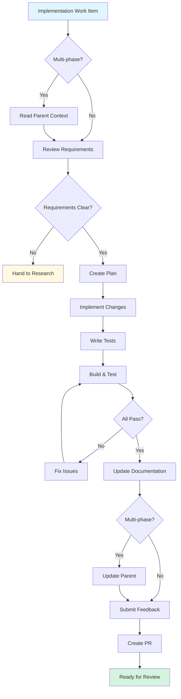

# Implementation Duty

**Purpose**: Implement validated designs and solutions from research handovers or direct requirements

**Layer**: 2 (Duty - specialized procedure)

**Version**: 1.0  
**Created**: 2025-11-12

---

## Required Context

**⚠️ IMPORTANT**: Read the following documents before proceeding:

- **[Semantic Language](../../docs/design/prompt-engineering/semantic-language.md)** - Semantic operations used below
- **[Kernel Layer](../kernel/README.md)** - Platform abstraction layer
- **[Getting Started Guide](../../../docs/guides/GETTING_STARTED.md)** - DataFlow coding standards and patterns
- **[Multi-Phase Work Items](../procedures/multi-phase-work-items.md)** - Parent-child work item management
- **[Handover Procedure](../procedures/handover.md)** - Transitioning work items between duties
- **[Work Item Creation Procedure](../procedures/work-item-creation.md)** - Creating new work items
- **[Comment Patterns Procedure](../procedures/comment-patterns.md)** - Standard comment formats
- **[Self-Improvement Procedure](../procedures/self-improvement.md)** - Feedback submission

**Semantic Operations Used**:
- `query_work_items_by_duty(duty)` - Find work items assigned to this duty
- `get_work_item_details(work_item_id)` - Retrieve work item information
- `get_work_item_duty(work_item_id)` - Get current duty assignment
- `assign_work_item_to_duty(work_item_id, duty)` - Change duty (handover)
- `add_work_item_comment(work_item_id, text)` - Add comment
- `update_work_item(work_item_id, fields)` - Update work item fields
- `get_parent_work_item(work_item_id)` - Get parent if exists
- `is_multi_phase(work_item_id)` - Check if part of multi-phase plan

---

## Overview

**Purpose**: Implement production-ready code, tests, and documentation from validated designs or clear requirements.

**Entry Point**: Work items with validated approaches (from research), clear requirements (from triage), or prioritized features (from product backlog)

**Typical Duration**: 1-5 days for single-phase work; multi-phase work varies by scope

**Key Principle**: Implementation produces **production-ready, tested, documented code** that can be merged into the codebase.

---

## Implementation Modes

### Single-Phase Implementation (Default)

**When**: Work item has clear, contained scope that can be completed in one PR

**Characteristics**:
- All work completed in a single PR
- Straightforward requirements
- No dependencies on other work
- Can be completed in 1-5 days

### Multi-Phase Implementation

**When**: Work item requires multiple phases or sub-tasks

**Characteristics**:
- Parent issue tracks overall implementation plan
- Sub-work-items for each phase
- Each phase produces a separate PR
- Coordinated progress updates

**See**: [Multi-Phase Work Items Procedure](../procedures/multi-phase-work-items.md)

---

## Quick Start

**Comment Prefix Convention:**
- Follow [Comment Patterns Procedure](../procedures/comment-patterns.md)
- Prefix ALL comments with `[Copilot-Duty: Implementation]`
- Example: `[Copilot-Duty: Implementation] Implementation complete. All tests passing.`

**Standard Implementation Flow**:
1. Query implementation queue and check for multi-phase plan
2. Review requirements and design references
3. Create implementation plan (if multi-phase)
4. Implement code changes
5. Write tests
6. Update documentation
7. Run linters, build, and tests
8. Submit self-improvement feedback
9. Create PR and mark ready for review

---

## Procedure

### Step 1: Query Implementation Queue

Use semantic operation to find work items assigned to implementation:

```python
# Query work items assigned to implementation duty
impl_items = query_work_items_by_duty(duty="implementation")

# Select your assigned work item
work_item = get_work_item_details(work_item_id)
```

_Implementation note: See [kernel operations](../kernel/README.md) for platform mapping._

---

### Step 2: Multi-Phase Work Item Check

**⚠️ ALWAYS**: Check if this work item is part of a multi-phase plan before starting implementation.

Follow [Multi-Phase Work Items Procedure](../procedures/multi-phase-work-items.md):

```python
# Check if work item is part of multi-phase plan
if is_multi_phase(work_item_id):
    parent_id = get_parent_work_item(work_item_id)
    if parent_id:
        # This is a sub-work-item - read parent context
        parent = get_work_item_details(parent_id)
        # Review parent to understand overall implementation plan
```

**If This is a Sub-Work-Item**:
1. ✅ Read parent to understand overall implementation plan
2. ✅ Note which phase this represents
3. ✅ Review completed phases for context
4. ✅ Update parent description as implementation progresses
5. ✅ Check if this is the last sub-work-item before finalizing

**If Creating Multi-Phase Plan**:
1. ✅ Create parent work item with overall plan
2. ✅ Create sub-work-items for each phase
3. ✅ Document dependencies between phases
4. ✅ Track progress in parent description

---

### Step 3: Review Requirements and Design

**Review Work Item Details**:
- Read work item description carefully
- Check for design references (research docs, ADRs, specs)
- Review acceptance criteria
- Identify any unknowns or missing information

**Review Research Handover** (if applicable):
- Read research documentation in `/research/[topic]/`
- Review recommended approach
- Check for prototype code in `/research/[topic]/handover/prototype/`
- Note any performance requirements or constraints

**Review Design Documents** (if referenced):
- Analysis documents in `/docs/analysis/`
- Design documents in `/docs/design/`
- ADRs in `/docs/adr/`

**If Requirements Unclear**:
```python
# Hand back to research or triage for clarification
assign_work_item_to_duty(work_item_id, "research")

add_work_item_comment(
    work_item_id,
    "[Copilot-Duty: Implementation] 🔄 Implementation → Research\n\n"
    "Requirements need clarification:\n"
    "- [Specific unclear point 1]\n"
    "- [Specific unclear point 2]\n\n"
    "Please research and clarify before implementation can proceed."
)
```

---

### Step 4: Create Implementation Plan

**For Single-Phase Work**:
- Mental plan or brief checklist in work item comment
- No formal plan document needed

**For Multi-Phase Work**:

Create implementation plan in work item (or separate document if complex):

```markdown
## Implementation Plan

### Phase 1: Core Functionality
- [ ] Implement base classes
- [ ] Add unit tests
- [ ] Update documentation

### Phase 2: Integration
- [ ] Add integration tests
- [ ] Update existing code to use new functionality
- [ ] Performance validation

### Phase 3: Documentation and Polish
- [ ] Add usage examples
- [ ] Update README
- [ ] Add migration guide (if breaking change)
```

Add plan as work item comment for tracking.

---

### Step 5: Implement Code Changes

**Follow DataFlow Coding Standards**:
- See [Getting Started Guide](../../../docs/guides/GETTING_STARTED.md) for:
  - C# coding style
  - Async/await patterns
  - Performance considerations
  - Common patterns

**Key Implementation Practices**:
- ✅ Write minimal, focused changes
- ✅ Follow existing code patterns
- ✅ Use meaningful names
- ✅ Handle errors appropriately
- ✅ Add XML documentation for public APIs
- ✅ Consider performance implications
- ✅ Respect cancellation tokens

**Anti-Patterns** (DON'T):
- ❌ Make unrelated changes
- ❌ Skip error handling
- ❌ Ignore cancellation tokens
- ❌ Use blocking sync code in async paths
- ❌ Break existing tests
- ❌ Add dependencies without consideration

---

### Step 6: Write Tests

**Test Requirements**:
- Unit tests for all new functionality
- Integration tests for component interactions
- Edge case coverage
- Error condition testing

**Test Categories**:
```csharp
[Trait("Category", "UnitTest")]
public class MyFeatureTests
{
    [Fact]
    public async Task Should_HandleNormalCase()
    {
        // Arrange
        // Act
        // Assert
    }
    
    [Fact]
    public async Task Should_HandleEdgeCase()
    {
        // Test edge conditions
    }
    
    [Fact]
    public async Task Should_ThrowOnInvalidInput()
    {
        // Test error handling
    }
}
```

**Test Standards**:
- See [Getting Started Guide](../../.team/GETTING_STARTED.md#testing-standards)
- Follow existing test patterns
- Use meaningful test names (Should_ExpectedBehavior_WhenCondition)
- Test behavior, not implementation details

---

### Step 7: Update Documentation

**Code Documentation**:
- XML comments for public APIs
- Inline comments for complex logic
- Usage examples in XML comments

**Repository Documentation**:
- Update README if adding new features
- Update relevant guides in `.team/`
- Create ADR for architectural decisions
- Update migration guides for breaking changes

**Formal Documentation** (when appropriate):
- Design documents in `/docs/design/`
- Analysis documents in `/docs/analysis/`
- ADRs in `/docs/adr/`

**See**: [Documentation Artifacts](../../../docs/DOCUMENTATION_ARTIFACTS.md)

---

### Step 8: Build, Lint, and Test

**Run Quality Checks**:

```bash
# Restore dependencies
dotnet restore

# Format code
dotnet format

# Build
dotnet build

# Run tests
dotnet test

# Run specific test category
dotnet test --filter "Category=UnitTest"
```

**Fix Issues**:
- Address build errors
- Fix failing tests
- Resolve linter warnings
- Ensure all tests pass

**Iterate Until Clean**:
- All builds succeed
- All tests pass
- No linter warnings
- Code formatted correctly

---

### Step 9: Update Multi-Phase Parent (If Applicable)

If this is a sub-work-item of a multi-phase plan:

```python
# Update parent description with phase progress
parent_id = get_parent_work_item(work_item_id)
if parent_id:
    parent = get_work_item_details(parent_id)
    
    # Update parent description (add phase completion note)
    updated_description = parent['description'] + """
    
## Phase N Status: ✅ Complete

**Implemented**:
- [Feature 1]
- [Feature 2]

**Tests**: All passing
**Documentation**: Updated
"""
    
    update_work_item(
        work_item_id=parent_id,
        description=updated_description
    )
```

**See**: [Multi-Phase Work Items Procedure](../procedures/multi-phase-work-items.md)

---

### Step 10: Submit Self-Improvement Feedback

**⚠️ REQUIRED**: Before marking work complete, submit self-improvement feedback.

Follow [Self-Improvement Procedure](../procedures/self-improvement.md):

```python
# Find feedback tracker
tracker = query_feedback_tracker()

# Add feedback comment
add_work_item_comment(
    tracker.id,
    f"""## Workflow Feedback Entry

**Date**: {current_date}
**Issue/PR**: #{work_item_id}
**Duty**: Implementation

### What Worked Well
[List specific positives about implementation process]

### What Didn't Work Well
[List specific issues or confusion points]

### Suggested Improvement
[Specific, actionable improvements to implementation duty documentation]
"""
)
```

---

### Step 11: Create PR and Mark Ready for Review

```python
# Add completion comment to work item
add_work_item_comment(
    work_item_id,
    "[Copilot-Duty: Implementation] ✅ Implementation Complete\n\n"
    "**Changes**:\n"
    "- [Summary of changes]\n\n"
    "**Tests**: All passing\n"
    "**Documentation**: Updated\n"
    "**Self-improvement feedback**: Submitted\n\n"
    "**Status**: Ready for review"
)
```

**Create PR** (using git/GitHub):
- Clear PR title referencing work item number
- Comprehensive PR description
- Link to work item in description
- Request reviewers if needed

**PR stays in implementation duty until merged** - do not change duty label.

---

## Handover Points

### → Research Duty

**When**: Discovered significant unknowns or technical questions during implementation

**How**:
```python
assign_work_item_to_duty(work_item_id, "research")

add_work_item_comment(
    work_item_id,
    "[Copilot-Duty: Implementation] 🔄 Implementation → Research\n\n"
    "Discovered unknowns requiring research:\n"
    "- [Unknown 1]\n"
    "- [Unknown 2]\n\n"
    "Pausing implementation until research clarifies approach."
)
```

### → Tech Debt Duty

**When**: Discovered significant tech debt that should be addressed separately

**How**:
```python
# Create tech debt work item
debt_id = create_work_item(
    type="tech-debt",
    title="Tech debt: [description]",
    description="Discovered during implementation of #{work_item_id}...",
    duty="tech-debt"
)

# Add reference comment to current work item
add_work_item_comment(
    work_item_id,
    f"[Copilot-Duty: Implementation] 📝 Tech Debt Identified\n\n"
    f"Created tech debt work item #{debt_id} for issues discovered during implementation."
)
```

---

## Common Implementation Patterns

### Pattern 1: Simple Feature Implementation

**Scenario**: Straightforward feature with clear requirements

**Steps**:
1. Review work item and acceptance criteria
2. Implement feature in single commit/PR
3. Write unit tests
4. Update documentation
5. Submit feedback and create PR

**Example Timeline**: 1-2 days

---

### Pattern 2: Research Handover Implementation

**Scenario**: Implementing validated design from research

**Steps**:
1. Review research documentation thoroughly
2. Study prototype code (if provided)
3. Implement production version based on research specifications
4. Add comprehensive tests (reference research test scenarios)
5. Validate performance requirements (if specified)
6. Submit feedback and create PR

**Example Timeline**: 3-5 days

---

### Pattern 3: Multi-Phase Implementation

**Scenario**: Large feature requiring multiple phases

**Steps**:
1. Create parent work item with overall plan
2. Create sub-work-items for each phase
3. Implement Phase 1:
   - Implement core functionality
   - Add tests
   - Update parent with progress
   - Create PR for Phase 1
4. Implement Phase 2 (after Phase 1 merged):
   - Build on Phase 1
   - Add tests
   - Update parent
   - Create PR for Phase 2
5. Continue for remaining phases
6. Close parent when all phases complete

**Example Timeline**: 1-3 weeks

**See**: [Multi-Phase Work Items Procedure](../procedures/multi-phase-work-items.md)

---

### Pattern 4: Bug Fix Implementation

**Scenario**: Fixing a reported bug

**Steps**:
1. Review bug report and reproduction steps
2. Write failing test that reproduces bug
3. Fix bug
4. Verify test now passes
5. Add regression tests for edge cases
6. Submit feedback and create PR

**Example Timeline**: 0.5-2 days

---

## Anti-Patterns

**❌ DON'T**:
- Implement without understanding requirements
- Skip writing tests
- Break existing tests
- Make unrelated changes
- Skip documentation updates
- Skip self-improvement feedback
- Create PR before running tests locally
- Ignore build or lint errors

**✅ DO**:
- Review requirements and design carefully
- Write comprehensive tests
- Keep changes focused and minimal
- Update relevant documentation
- Submit self-improvement feedback
- Validate locally before creating PR
- Address all build and lint issues

---

## Decision Tree



---

## References

**Procedures**:
- [Multi-Phase Work Items](../procedures/multi-phase-work-items.md)
- [Handover Procedure](../procedures/handover.md)
- [Work Item Creation Procedure](../procedures/work-item-creation.md)
- [Comment Patterns Procedure](../procedures/comment-patterns.md)
- [Self-Improvement Procedure](../procedures/self-improvement.md)

**Coding Standards**:
- [Getting Started Guide](../../../docs/guides/GETTING_STARTED.md)
- [Central Package Management](../../docs/guides/CENTRAL_PACKAGE_MANAGEMENT.md)
- [NuGet Dependency Updates](../../docs/guides/NUGET_DEPENDENCY_UPDATES.md)

**Documentation Standards**:
- [Documentation Artifacts](../../../docs/DOCUMENTATION_ARTIFACTS.md)
- [Documentation Standards](/.github/copilot-instructions.md#documentation-standards)

**Design References**:
- [Semantic Language](../../docs/design/prompt-engineering/semantic-language.md)
- [Core Concepts](../../docs/design/prompt-engineering/concepts.md)

---

## Version History

| Version | Date | Changes |
|---------|------|---------|
| 1.0 | 2025-11-12 | Initial implementation duty created from Phase 3 migration |
