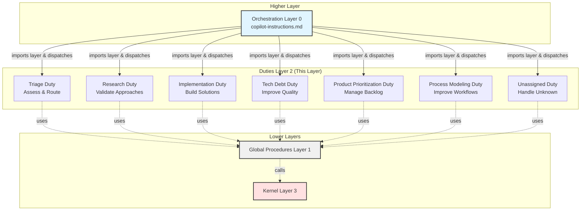

# Duties: Specialized Agent Responsibilities

**Version**: 1.0  
**Created**: 2025-11-12  
**Layer**: 2 (Duties - specialized procedures)

---

## Required Context

**⚠️ IMPORTANT**: Read the following documents before proceeding:

- **[Core Concepts](../../docs/design/prompt-engineering/concepts.md)** - Layer 2 definition and architectural principles
- **[Semantic Language](../../docs/design/prompt-engineering/semantic-language.md)** - Semantic operations that duties use
- **[Global Procedures](../procedures/README.md)** - Platform-agnostic procedures layer
- **[Kernel Layer](../kernel/README.md)** - Platform abstraction layer

---

## Purpose

The **duties layer** provides specialized responsibilities for different types of work. Each duty is optimized for a specific kind of task and follows a consistent pattern for work execution.

**Analogy**: Like applications in an operating system - each has a specific purpose and uses the same underlying libraries (procedures) and system calls (semantic operations).

---

## Architecture Overview



**Note**: Orchestration imports the entire duties layer (all duties available for dispatch), then dispatches to the appropriate duty based on work item assignment.

---

## Available Duties

### Core Work Processing Duties

1. **[Triage Duty](TRIAGE_DUTY.md)** - Initial assessment and routing of work items
2. **[Research Duty](RESEARCH_DUTY.md)** - Validate technical approaches and create specifications
3. **[Implementation Duty](IMPLEMENTATION_DUTY.md)** - Implement validated designs and solutions
4. **[Tech Debt Duty](TECH_DEBT_DUTY.md)** - Discover and address technical debt

### Meta Duties

5. **[Product Prioritization Duty](PRODUCT_PRIORITIZATION_DUTY.md)** - Prioritize backlog items
6. **[Process Modeling Duty](PROCESS_MODELING_DUTY.md)** - Improve workflows and processes
7. **[Unassigned Duty](UNASSIGNED_DUTY.md)** - Handle work items when duty cannot be inferred

---

## Duty Assignment Logic

Every work item is assigned to exactly **one duty** at a time.

**Assignment Process**:
1. Agent receives work item (via orchestration or direct assignment)
2. Orchestration uses **[Duty Assignment Procedure](../procedures/duty-assignment.md)** to determine duty
3. Agent follows the assigned duty's procedure
4. On completion or handover, duty assignment may change

**Duty Transitions**:
- Duties can hand over work to other duties
- Uses **[Handover Procedure](../procedures/handover.md)**
- Only one duty is active at a time

---

## Duty Structure

All duties follow a consistent structure:

### 1. Required Context
- Links to design documents, procedures, and kernel
- Lists semantic operations used
- Specifies work item fields required

### 2. Overview
- Purpose and scope
- Entry conditions
- Typical duration

### 3. Procedure
- Step-by-step instructions
- Decision points
- Examples and anti-patterns

### 4. Handover Points
- When to hand over to other duties
- How to create handover work items

### 5. Common Patterns
- Frequently used workflows
- Best practices

---

## Key Principles

### 1. Platform Agnostic

**ALL duties use ONLY semantic operations** - never platform-specific code.

✅ **Correct**:
```python
# Uses semantic operation
work_item_id = create_work_item(
    type="research",
    title="Investigate approach",
    duty="research"
)
```

❌ **Incorrect**:
```python
# Platform-specific GitHub code
issue_write(
    method="create",
    owner="uniun-technology",
    repo="lib-dataflow",
    labels=["workflow:research"]
)
```

### 2. Reuse Global Procedures

**Reference procedures** instead of duplicating logic:

✅ **Correct**:
```markdown
## Assigning Duty

Follow [Duty Assignment Procedure](../../procedures/duty-assignment.md).
```

❌ **Incorrect**:
```markdown
## Assigning Duty

To assign a duty, check the work item labels and...
[Duplicated content from duty-assignment procedure]
```

### 3. Clear Handovers

**Document handover points** to other duties:

```markdown
## Handover to Implementation

When research is complete:
1. Create implementation work item using [Work Item Creation Procedure](../../procedures/work-item-creation.md)
2. Hand over using [Handover Procedure](../../procedures/handover.md)
```

---

## Testing

**Test Methodology**: End-to-end scenario testing (tabletop simulation)

**Test Location**: `/research/workflow-modeling/scenarios/duties/`

**See**: [Testing Framework](../../docs/design/prompt-engineering/testing-framework.md#node-type-3-duty-procedures)

Each duty has:
- 3-5 end-to-end test scenarios covering typical workflows
- Edge case scenarios
- Handover scenarios
- Regression tests (selectively persisted)

---

## Change Procedures

**⚠️ IMPORTANT**: Changes to duties follow strict change control.

**See**: [Testing Framework - Duty Change Procedure](../../docs/design/prompt-engineering/testing-framework.md#duty-change-procedure)

**Required steps**:
1. Review duty's role and dependencies
2. Update duty procedure (semantic operations only)
3. Create 3-5 end-to-end test scenarios
4. Execute tabletop tests
5. Run kernel leak detection
6. Run dependency leak detection
7. Test handovers to other duties
8. Update graph representation (`.team/model-graph.yaml`)
9. Archive valuable test scenarios

**Who makes changes**: Process Modeling duty exclusively (for duty files themselves)

---

## Design References

This layer implements the design documented in:
- [Main Design Document](../../docs/design/prompt-engineering/README.md)
- [Core Concepts](../../docs/design/prompt-engineering/concepts.md) - Layer 2 definition
- [Testing Framework](../../docs/design/prompt-engineering/testing-framework.md) - Testing methodology

---

## Related Documentation

- **Lower Layers**:
  - [Global Procedures](../procedures/README.md) - Layer 1 (procedures to reuse)
  - [Kernel Layer](../kernel/README.md) - Layer 3 (platform abstraction)

- **Higher Layer**:
  - [Orchestration](../../.github/copilot-instructions.md) - Layer 0 (entry point)

---

## Migration Notes

**Phase 3 (Current)**: Duties migrated from legacy workflow files (`.team/prompts/*_WORKFLOW.md`)

**Key Changes**:
- Terminology: "Workflow" → "Duty" (to avoid overloading "workflow" term)
- Architecture: Now part of layered system
- Operations: Use semantic operations instead of platform-specific code
- Procedures: Reference global procedures instead of duplicating

**Legacy Files** (until Phase 5):
- Old workflow files remain at `.team/prompts/`
- Will be removed in Phase 5 cleanup
- Duties in `.team/duties/` are the active version

---

## Version History

| Version | Date | Changes |
|---------|------|---------|
| 1.0 | 2025-11-12 | Initial duties layer structure created from Phase 3 migration |
