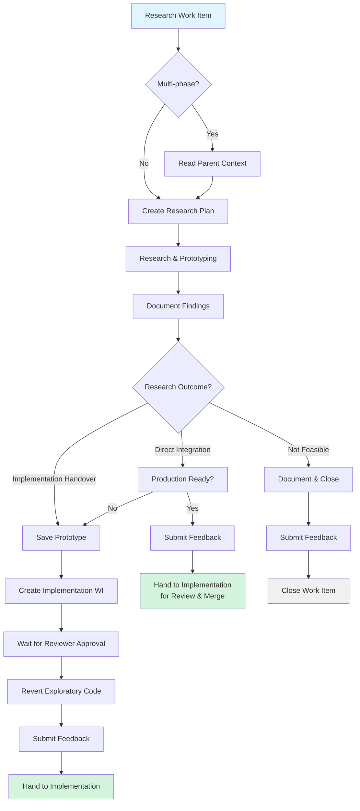

# Research Duty

**Purpose**: Validate technical approaches, investigate unknowns, and create implementation-ready specifications

**Layer**: 2 (Duty - specialized procedure)

**Version**: 1.0  
**Created**: 2025-11-12

---

## Required Context

**⚠️ IMPORTANT**: Read the following documents before proceeding:

- **[Semantic Language](../../docs/design/prompt-engineering/semantic-language.md)** - Semantic operations used below
- **[Kernel Layer](../kernel/README.md)** - Platform abstraction layer
- **[Handover Procedure](../procedures/handover.md)** - Transitioning work items between duties
- **[Work Item Creation Procedure](../procedures/work-item-creation.md)** - Creating new work items
- **[Comment Patterns Procedure](../procedures/comment-patterns.md)** - Standard comment formats
- **[Self-Improvement Procedure](../procedures/self-improvement.md)** - Feedback submission

**Semantic Operations Used**:
- `query_work_items_by_duty(duty)` - Find work items assigned to this duty
- `get_work_item_details(work_item_id)` - Retrieve work item information
- `get_work_item_duty(work_item_id)` - Get current duty assignment
- `assign_work_item_to_duty(work_item_id, duty)` - Change duty (handover)
- `add_work_item_comment(work_item_id, text)` - Add comment
- `update_work_item(work_item_id, fields)` - Update work item fields
- `get_parent_work_item(work_item_id)` - Get parent if exists
- `is_multi_phase(work_item_id)` - Check if part of multi-phase plan

---

## Overview

**Purpose**: Validate technical approaches through research and prototyping, then hand over implementation-ready specifications to implementation duty.

**Entry Point**: Work items with technical unknowns, feasibility questions, or requiring approach validation

**Typical Duration**: 3-10 days depending on research scope

**Key Principle**: Research produces **documentation and specifications**, not merged code. Exploratory code is for validation and learning, then gets reverted after reviewer approval.

---

## Research Outcomes

Research work can produce two distinct outcomes:

### Outcome 1: Implementation Handover (Primary)

**When**: Research validates approach and creates specifications for others to implement

**Deliverables**:
- Research documentation in `/research/[topic]/`
- Implementation-ready work item with full specifications
- Formal documentation (analysis, design, ADRs) in `/docs/`
- Prototype code saved in `/research/[topic]/handover/prototype/`
- All exploratory code changes REVERTED from `/poc/` and `/src/`

### Outcome 2: Direct Integration (Rare)

**When**: Research produces production-ready code that can be directly merged

**Deliverables**:
- Production-ready code in `/poc/` or `/src/`
- Tests and documentation
- Code is NOT reverted
- Hand over to implementation duty for final review and merge

**Note**: Most research follows Outcome 1. Only use Outcome 2 when explicitly validated with reviewer.

---

## Quick Start

**Comment Prefix Convention:**
- Follow [Comment Patterns Procedure](../procedures/comment-patterns.md)
- Prefix ALL comments with `[Copilot-Duty: Research]`
- Example: `[Copilot-Duty: Research] Research complete. See /research/caching-strategy/ for findings.`

**Standard Research Flow**:
1. Query research queue and check for multi-phase plan
2. Create research folder structure (`/research/[topic]/`)
3. Create research plan document
4. Conduct research and prototyping
5. Document findings and create formal documentation
6. Create implementation handover work item
7. Revert exploratory code (after reviewer approval)
8. Submit self-improvement feedback
9. Hand over to implementation duty

---

## Procedure

### Step 1: Query Research Queue

Use semantic operation to find work items assigned to research:

```python
# Query work items assigned to research duty
research_items = query_work_items_by_duty(duty="research")

# Select your assigned work item
work_item = get_work_item_details(work_item_id)
```

_Implementation note: See [kernel operations](../kernel/README.md) for platform mapping._

---

### Step 2: Multi-Phase Work Item Check

**⚠️ ALWAYS**: Check if this work item is part of a multi-phase plan before starting research.

Follow [Multi-Phase Work Items Procedure](../procedures/multi-phase-work-items.md):

```python
# Check if work item is part of multi-phase plan
if is_multi_phase(work_item_id):
    parent_id = get_parent_work_item(work_item_id)
    if parent_id:
        # This is a sub-work-item - read parent context
        parent = get_work_item_details(parent_id)
        # Review parent to understand overall research plan
```

**If This is a Sub-Work-Item**:
1. ✅ Read parent to understand overall research plan
2. ✅ Note which research phase this represents
3. ✅ Review completed phases for context
4. ✅ Update parent description as research progresses
5. ✅ Check if this is the last sub-work-item before finalizing

---

### Step 3: Research Planning and Setup

#### Create Research Folder Structure

Follow standard research folder convention:

```bash
/research/[topic]/
├── research-plan.md      # Start here - research objectives
├── README.md             # Research findings (create in Phase 3)
├── notes/                # Working notes during research
├── design/               # Approach analyses (if comparing options)
├── benchmarks/           # Performance validation (if needed)
└── handover/             # Implementation handover artifacts
    ├── README.md         # Implementation issue template
    └── prototype/        # Saved prototype code
```

**See**: `/research/FOLDER_STRUCTURE.md` for complete canonical folder structure.

#### Create Research Plan

Create `/research/[topic]/research-plan.md`:

```markdown
# Research Plan: [Topic]

## Research Objective
[What needs to be validated/explored]

## Research Questions
- Question 1
- Question 2

## Success Metrics
- **Quantitative**: Concrete measurements
- **Qualitative**: Subjective improvements
- **Baseline**: Current state to measure against
- **Validation**: How improvements will be demonstrated

## Validation Approach
[How will we validate/test approaches]

## Expected Outcomes
- Research documentation in /research/[topic]/
- Implementation-ready work item
- Formal documentation (analysis, design, ADRs)
- Prototype code (if applicable)

## Timeline
[Estimated research duration]
```

---

### Step 4: Research and Exploration

**Code Exploration**:
- Write exploratory code in `/poc/` or `/src/` to validate feasibility
- Create prototypes to test approaches
- Validate performance through benchmarks
- **Important**: This code is temporary and will be reverted after reviewer approval

**Documentation During Research**:
- Keep working notes in `/research/[topic]/notes/`
- Document what you try, what works, what doesn't
- Capture insights, performance data, trade-offs

**Prototyping Scope**:

| Research Question | Prototype Scope | Time |
|-------------------|----------------|------|
| "Can we do X with library Y?" | Minimal POC | Hours-1 day |
| "Is approach A faster than B?" | Working Prototype | 2-5 days |
| "Should we add this helper?" | Production-Ready | 1-2 weeks |
| "How complex is integration?" | Working Prototype | 2-5 days |

**Default**: Start with Minimal POC. Upgrade only if research questions require it.

**Comparative Testing** (Recommended):

Create "before/after" demo tests to validate improvements. These prove the approach works and demonstrate concrete value.

**Tests and Benchmarks**:
- Create tests to validate concepts
- Run benchmarks to measure performance
- Save benchmark data in `/research/[topic]/benchmarks/`
- Document test scenarios and benchmarks for implementation team

---

### Step 5: Document Research Findings

#### Create Research Documentation

Create `/research/[topic]/README.md`:

```markdown
# Research: [Topic]

## Research Objective
[What was being investigated]

## Approaches Explored

### Approach 1: [Name]
**Description**: [What was tried]
**Findings**: [What was learned]
**Performance**: [If measured]
**Pros/Cons**: 
- ✅ Advantage 1
- ❌ Disadvantage 1

### Approach 2: [Name]
[Same structure]

## Recommended Approach
[Which approach to use and why]

## Success Metrics Results
[How did we do against our success criteria?]

## Implementation Guidance
[Specific guidance for implementation team]

## References
- Prototype: `/research/[topic]/handover/prototype/`
- Benchmarks: `/research/[topic]/benchmarks/`
- Design: [Link to formal design doc if created]
```

#### Create Formal Documentation

**⚠️ Important**: Research also creates formal documentation that is NOT reverted:

Use [Documentation Artifacts System](../../.team/DOCUMENTATION_ARTIFACTS.md):

**Analysis Documents** (`/docs/analysis/[topic]/`):
- Formal investigations
- Benchmark results
- Performance studies

**Design Documents** (`/docs/design/[topic]/`):
- Solution proposals
- Architecture plans

**ADRs** (`/docs/adr/`):
- Architectural decisions
- For POC: `/docs/adr/poc/YYYY-MM-DD-title.md`
- For production: `/docs/adr/YYYY-MM-DD-title.md`

**See**: [Documentation Standards](/.github/copilot-instructions.md#documentation-standards)

---

### Step 6: Create Implementation Handover

Follow [Work Item Creation Procedure](../procedures/work-item-creation.md):

```python
# Create implementation work item
impl_work_item_id = create_work_item(
    type="implementation",
    title="Implement [feature] based on research findings",
    description="""
# Implementation: [Feature]

**Research Reference**: #[RESEARCH_ISSUE_NUMBER]
**Research Documentation**: `/research/[topic]/`

## Objective
[What needs to be implemented]

## Approach (Validated by Research)
[Recommended approach from research]

## Success Criteria
[Clear, testable criteria]

## Test Scenarios
[Critical test scenarios from research]

## Performance Requirements
[If applicable]

## Design References
- Research: `/research/[topic]/README.md`
- [Any formal docs created]

## Implementation Checklist
- [ ] Implement core functionality
- [ ] Add tests for critical scenarios
- [ ] Validate performance requirements
- [ ] Update documentation
""",
    duty="implementation"
)

# Add handover comment to research work item
add_work_item_comment(
    work_item_id,
    "[Copilot-Duty: Research] 🔄 Research → Implementation\n\n"
    f"Research complete. Created implementation work item #{impl_work_item_id}\n\n"
    "**Research Findings**: See `/research/[topic]/` for complete documentation\n\n"
    "**Next Steps**: Implementation duty will complete the work based on research specifications."
)
```

_Implementation note: See [Handover Procedure](../procedures/handover.md) for complete handover patterns._

---

### Step 7: Save Prototype and Revert Exploratory Code

**⚠️ CRITICAL**: This step happens AFTER reviewer approval, not before.

**Save Prototype**:

```bash
# Create handover/prototype directory
mkdir -p /research/[topic]/handover/prototype

# Save prototype code
cp -r [prototype-files] /research/[topic]/handover/prototype/

# Create README for prototype
cat > /research/[topic]/handover/prototype/README.md << 'EOF'
# Prototype Code

This is the working prototype from research validation.

## Purpose
[What this prototype demonstrates]

## Key Files
- [file1.cs] - [description]
- [file2.cs] - [description]

## How to Use
[Instructions for implementation team]
EOF
```

**Revert Exploratory Code**:

**⚠️ Only after reviewer approval of research findings:**

```bash
# Revert all exploratory code changes from /poc/ and /src/
git checkout HEAD -- poc/ src/

# Keep research artifacts and formal documentation
# Do NOT revert:
# - /research/[topic]/ (research artifacts)
# - /docs/ (formal documentation)
```

**Why Revert?**
- Research code is for validation, not production
- Prevents half-baked code from entering codebase
- Implementation team builds production version from specifications
- Clean separation between research and implementation

---

### Step 8: Submit Self-Improvement Feedback

**⚠️ REQUIRED**: Before marking work complete, submit self-improvement feedback.

Follow [Self-Improvement Procedure](../procedures/self-improvement.md):

```python
# Find feedback tracker
tracker = query_feedback_tracker()

# Add feedback comment
add_work_item_comment(
    tracker.id,
    f"""## Workflow Feedback Entry

**Date**: {current_date}
**Issue/PR**: #{work_item_id}
**Duty**: Research

### What Worked Well
[List specific positives about research process]

### What Didn't Work Well
[List specific issues or confusion points]

### Suggested Improvement
[Specific, actionable improvements to research duty documentation]
"""
)
```

**See**: [Self-Improvement Procedure](../procedures/self-improvement.md) for complete feedback submission process.

---

### Step 9: Complete and Hand Over

```python
# Update research work item status
update_work_item(
    work_item_id,
    status="completed"
)

# Add completion comment
add_work_item_comment(
    work_item_id,
    "[Copilot-Duty: Research] ✅ Research Complete\n\n"
    "**Deliverables**:\n"
    "- Research documentation: `/research/[topic]/`\n"
    "- Implementation work item: #[IMPL_ISSUE]\n"
    "- Formal documentation: [links]\n"
    "- Prototype code: `/research/[topic]/handover/prototype/`\n\n"
    "**Status**: Ready for implementation"
)

# Close work item
# (Implementation will be tracked via new work item)
```

---

## Handover Points

### → Implementation Duty

**When**: Research validates approach and creates implementation specifications

**How**:
1. Create implementation work item using [Work Item Creation Procedure](../procedures/work-item-creation.md)
2. Include all research documentation references
3. Hand over using [Handover Procedure](../procedures/handover.md)

### → Research Duty (Additional Research)

**When**: Research reveals additional unknowns requiring separate investigation

**How**:
1. Create new research work item for additional investigation
2. Reference original research work item for context

### → Tech Debt Duty

**When**: Research identifies significant technical debt requiring cleanup

**How**:
1. Create tech debt work item documenting issues found
2. Reference research documentation

---

## Common Research Patterns

### Pattern 1: Performance Validation Research

**Scenario**: Validate if approach meets performance requirements

**Steps**:
1. Create research plan with performance metrics
2. Build working prototype with realistic data
3. Run benchmarks and document results
4. Create implementation work item with performance requirements
5. Revert prototype code after approval

**Example**:
```markdown
## Research Question
Can caching layer improve API response time by 50%?

## Success Metrics
- Baseline: 200ms average response time
- Target: <100ms with caching
- Validation: Benchmark with 1000 requests

## Outcome
✅ Achieved 75ms average (62% improvement)
→ Create implementation work item with caching specifications
```

---

### Pattern 2: Multiple Approach Comparison

**Scenario**: Evaluate multiple technical approaches

**Steps**:
1. Document each approach in `/research/[topic]/design/`
2. Create comparison matrix
3. Build minimal POC for each approach
4. Recommend best approach with rationale
5. Create implementation work item for recommended approach

**Example**:
```markdown
## Approaches Evaluated
- Approach A: Redis caching (Fast, complex setup)
- Approach B: In-memory caching (Simple, limited scale)
- Approach C: Hybrid (Balanced)

## Recommendation
Approach C (Hybrid) balances performance and complexity
→ Create implementation work item with hybrid approach specifications
```

---

### Pattern 3: Feasibility Research

**Scenario**: Validate if approach is technically feasible

**Steps**:
1. Create minimal POC (hours to 1 day)
2. Document feasibility findings
3. If feasible: Create implementation work item
4. If not feasible: Document blockers and close research

**Example**:
```markdown
## Research Question
Can we integrate with external API X?

## Findings
✅ API supports required operations
✅ Authentication works
❌ Rate limits too restrictive for our use case

## Outcome
Not feasible due to rate limits
→ Close research, document findings for future reference
```

---

### Pattern 4: Direct Integration Research

**Scenario**: Research produces production-ready code (rare)

**Steps**:
1. Build production-ready implementation during research
2. Include tests and documentation
3. Get reviewer approval to keep code
4. Hand over to implementation duty for final review and merge
5. Do NOT revert code

**Example**:
```markdown
## Research Outcome
Created production-ready test helper utility

## Deliverables
- Production code in /src/DataFlow.Tests/Helpers/
- Unit tests
- Documentation

## Status
Code approved for direct integration
→ Hand over to implementation for final review and merge
```

---

## Anti-Patterns

**❌ DON'T**:
- Revert code before reviewer approval
- Skip creating research folder structure
- Merge exploratory code without implementation review
- Skip documentation
- Skip self-improvement feedback
- Over-engineer prototypes that will be reverted
- Create benchmarks for non-performance-sensitive work

**✅ DO**:
- Create comprehensive research documentation
- Save valuable prototype code for implementation reference
- Document all approaches tried (even failures)
- Create clear implementation specifications
- Follow handover procedure completely
- Submit self-improvement feedback

---

## Decision Tree



---

## References

**Procedures**:
- [Handover Procedure](../procedures/handover.md)
- [Work Item Creation Procedure](../procedures/work-item-creation.md)
- [Comment Patterns Procedure](../procedures/comment-patterns.md)
- [Self-Improvement Procedure](../procedures/self-improvement.md)
- [Multi-Phase Work Items](../procedures/multi-phase-work-items.md)

**Documentation Standards**:
- [Documentation Artifacts](../../.team/DOCUMENTATION_ARTIFACTS.md)
- [Documentation Standards](/.github/copilot-instructions.md#documentation-standards)
- [Research Folder Structure](/research/FOLDER_STRUCTURE.md)

**Design References**:
- [Semantic Language](../../docs/design/prompt-engineering/semantic-language.md)
- [Core Concepts](../../docs/design/prompt-engineering/concepts.md)

---

## Version History

| Version | Date | Changes |
|---------|------|---------|
| 1.0 | 2025-11-12 | Initial research duty created from Phase 3 migration |
