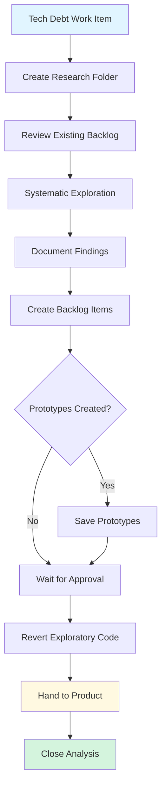

# Tech Debt Duty

**Purpose**: Systematically discover, analyze, and document technical debt for prioritization

**Layer**: 2 (Duty - specialized procedure)

**Version**: 1.0  
**Created**: 2025-11-12

---

## Required Context

**⚠️ IMPORTANT**: Read the following documents before proceeding:

- **[Semantic Language](../../docs/design/prompt-engineering/semantic-language.md)** - Semantic operations used below
- **[Kernel Layer](../kernel/README.md)** - Platform abstraction layer
- **[Handover Procedure](../procedures/handover.md)** - Transitioning work items between duties
- **[Work Item Creation Procedure](../procedures/work-item-creation.md)** - Creating new work items
- **[Comment Patterns Procedure](../procedures/comment-patterns.md)** - Standard comment formats

**Semantic Operations Used**:
- `query_work_items_by_duty(duty)` - Find work items assigned to this duty
- `get_work_item_details(work_item_id)` - Retrieve work item information
- `create_work_item(...)` - Create product backlog items for findings
- `add_work_item_comment(work_item_id, text)` - Add comment
- `update_work_item(work_item_id, fields)` - Update work item fields
- `query_work_items_by_duty("product-backlog")` - Check existing backlog before creating duplicates

---

## Overview

**Purpose**: Systematically discover and document technical debt, creating product backlog items for prioritization.

**Entry Point**: Work items requesting code quality review, debt discovery, or architecture improvement

**Typical Duration**: 3-7 days for comprehensive analysis

**Key Principle**: Tech debt analysis is a specialized form of research that produces **findings report + product backlog items**, not merged code. All findings go to the product backlog for prioritization.

---

## Tech Debt Analysis Outcome

**Deliverables**:
- Comprehensive findings report in `/research/tech-debt-[date]/`
- Product backlog items for **all** findings (created with `workflow:product-backlog` label)
- Prototype fixes (if applicable) saved in handover folder
- All exploratory code changes REVERTED from `/poc/` and `/src/`

**What Happens Next**:
- Product team prioritizes backlog items using Product Prioritization Duty
- High-priority items move to Implementation Duty
- Low-priority items remain in backlog

---

## Quick Start

**Comment Prefix Convention:**
- Follow [Comment Patterns Procedure](../procedures/comment-patterns.md)
- Prefix ALL comments with `[Copilot-Duty: Tech Debt]`
- Example: `[Copilot-Duty: Tech Debt] Analysis complete. Created 5 product backlog items for findings.`

**Standard Tech Debt Flow**:
1. Query tech debt queue
2. Create research folder structure
3. Review existing backlog to avoid duplicates
4. Conduct systematic exploration
5. Document all findings with verification checks
6. Create product backlog items for findings
7. Save prototype fixes
8. Revert exploratory code (after reviewer approval)
9. Hand over to product prioritization

---

## Procedure

### Step 1: Query Tech Debt Queue

```python
# Query work items assigned to tech debt duty
debt_items = query_work_items_by_duty(duty="tech-debt")

# Select your assigned work item
work_item = get_work_item_details(work_item_id)
```

---

### Step 2: Create Research Folder Structure

Create `/research/tech-debt-[date]/`:

```bash
/research/tech-debt-YYYY-MM-DD/
├── findings-report.md     # Main findings document
├── notes/                 # Working notes
└── handover/              # Product backlog items and prototypes
    ├── README.md          # Handover summary
    └── prototype/         # Prototype fixes (if applicable)
```

---

### Step 3: Review Existing Backlog

**⚠️ IMPORTANT**: Before exploring, check existing backlog to avoid duplicate findings.

```python
# Query existing backlog items
backlog = query_work_items_by_duty("product-backlog")

# Review titles and descriptions to avoid duplicates
# Note any existing related items
```

---

### Step 4: Systematic Exploration

Explore these areas systematically:

**Code Quality**:
- Duplicated code patterns
- Complex methods/classes (high cyclomatic complexity)
- Code smells (long parameter lists, god classes, etc.)
- Inconsistent naming conventions

**Architecture**:
- Tight coupling
- Missing abstractions
- Architectural inconsistencies
- Violation of SOLID principles

**Testing**:
- Missing test coverage
- Brittle tests
- Slow tests
- Test code duplication

**Documentation**:
- Missing/outdated documentation
- Unclear API documentation
- Missing architecture diagrams

**Performance**:
- Known performance bottlenecks
- Memory leaks
- Inefficient algorithms

**Dependencies**:
- Outdated packages
- Security vulnerabilities
- Unused dependencies

---

### Step 5: Document Findings

Create `/research/tech-debt-[date]/findings-report.md`:

```markdown
# Tech Debt Findings Report

**Date**: YYYY-MM-DD
**Scope**: [What was analyzed]

## Summary

Total findings: [N]
- Critical: [N]
- High: [N]
- Medium: [N]
- Low: [N]

## Findings

### Finding 1: [Title]

**Category**: Code Quality
**Severity**: High
**Location**: [File/class/method]

**Description**:
[What is the issue?]

**Impact**:
- Maintainability: [Impact description]
- Performance: [If applicable]
- Risk: [If applicable]

**Verification**:
[How to confirm this issue still exists]
Example:
- Check file X, lines Y-Z
- Run command: `dotnet test --filter "Category=SlowTest"`

**Proposed Solution**:
[How to fix it]

**Effort Estimate**: [Small/Medium/Large]

**Prototype**: [Path if created, or "None"]

---

### Finding 2: [Title]
[Same structure]
```

**Include Verification Checks**:

Every finding must include:
- ✅ How to locate the issue
- ✅ How to verify it still exists
- ✅ Specific code locations or commands

This allows others to validate and prioritize findings.

---

### Step 6: Create Product Backlog Items

**For EVERY finding**, create a product backlog item:

```python
# Create backlog item for each finding
backlog_id = create_work_item(
    type="tech-debt",
    title="Tech Debt: [Finding title]",
    description="""
# Tech Debt: [Finding Title]

**Discovered**: Tech debt analysis YYYY-MM-DD (#[DEBT_ISSUE])
**Category**: [Code Quality / Architecture / Testing / etc.]
**Severity**: [Critical / High / Medium / Low]

## Issue Description
[What is the problem?]

## Impact
- **Maintainability**: [Impact]
- **Risk**: [If applicable]
- **Performance**: [If applicable]

## Verification
[How to confirm issue exists]

## Proposed Solution
[How to fix it]

## Effort Estimate
[Small / Medium / Large]

## References
- Findings report: `/research/tech-debt-YYYY-MM-DD/findings-report.md`
- Prototype: [Path if exists]
""",
    duty="product-backlog",  # Goes to product backlog for prioritization
    labels=["tech-debt"]
)
```

**Track Created Items**:

Add to handover README:

```markdown
# Tech Debt Handover

## Product Backlog Items Created

1. #[ID] - [Title] (Severity: High)
2. #[ID] - [Title] (Severity: Medium)
3. #[ID] - [Title] (Severity: Low)

## Next Steps

Product team will prioritize using Product Prioritization Duty.
```

---

### Step 7: Save Prototype Fixes (If Created)

If you created prototype fixes during exploration:

```bash
# Save to handover/prototype/
mkdir -p /research/tech-debt-YYYY-MM-DD/handover/prototype

# Copy prototype files
# Create README explaining prototypes
```

---

### Step 8: Wait for Reviewer Approval

**Reviewer approves findings and backlog items**

---

### Step 9: Revert Exploratory Code

**⚠️ Only after reviewer approval:**

```bash
# Revert all exploratory code changes from /poc/ and /src/
git checkout HEAD -- poc/ src/

# Keep research artifacts - DO NOT revert:
# - /research/tech-debt-YYYY-MM-DD/ (findings and handover)
```

---

### Step 10: Hand Over to Product Prioritization

```python
# Add summary comment to tech debt work item
add_work_item_comment(
    work_item_id,
    "[Copilot-Duty: Tech Debt] ✅ Analysis Complete\n\n"
    "**Findings**: Discovered [N] technical debt items\n"
    "**Product Backlog Items Created**: #[ID1], #[ID2], #[ID3]...\n\n"
    "**Documentation**: `/research/tech-debt-YYYY-MM-DD/findings-report.md`\n\n"
    "**Next Steps**: Product team will prioritize findings"
)

# Close tech debt analysis work item
update_work_item(
    work_item_id,
    status="completed"
)

# Product backlog items remain open for prioritization
```

---

## Handover Points

### → Product Prioritization Duty

**When**: All findings documented and backlog items created

**How**: Backlog items automatically in product backlog queue (created with `duty="product-backlog"`)

### → Research Duty

**When**: Findings require deeper investigation or validation

**How**:
```python
research_id = create_work_item(
    type="research",
    title="Research: [Investigation topic]",
    description="Investigation needed from tech debt finding...",
    duty="research"
)
```

---

## Common Tech Debt Patterns

### Pattern 1: Code Quality Review

**Scope**: Review codebase for code quality issues

**Focus Areas**:
- Code duplication
- Complex methods
- Code smells

**Output**: 5-15 backlog items

---

### Pattern 2: Architecture Review

**Scope**: Review architectural patterns and decisions

**Focus Areas**:
- Coupling and cohesion
- SOLID principle violations
- Missing abstractions

**Output**: 3-8 backlog items

---

### Pattern 3: Test Coverage Analysis

**Scope**: Analyze test coverage and test quality

**Focus Areas**:
- Missing tests
- Brittle tests
- Slow tests

**Output**: 5-10 backlog items

---

## Anti-Patterns

**❌ DON'T**:
- Skip verification checks in findings
- Create implementation issues directly (use product backlog)
- Skip documenting minor findings
- Duplicate existing backlog items
- Revert code before reviewer approval

**✅ DO**:
- Include verification for every finding
- Create backlog items for ALL findings
- Check existing backlog before exploration
- Document even small issues
- Save valuable prototype fixes

---

## Decision Tree



---

## References

**Procedures**:
- [Handover Procedure](../procedures/handover.md)
- [Work Item Creation Procedure](../procedures/work-item-creation.md)
- [Comment Patterns Procedure](../procedures/comment-patterns.md)

**Design References**:
- [Semantic Language](../../docs/design/prompt-engineering/semantic-language.md)
- [Core Concepts](../../docs/design/prompt-engineering/concepts.md)

---

## Version History

| Version | Date | Changes |
|---------|------|---------|
| 1.0 | 2025-11-12 | Initial tech debt duty created from Phase 3 migration |
