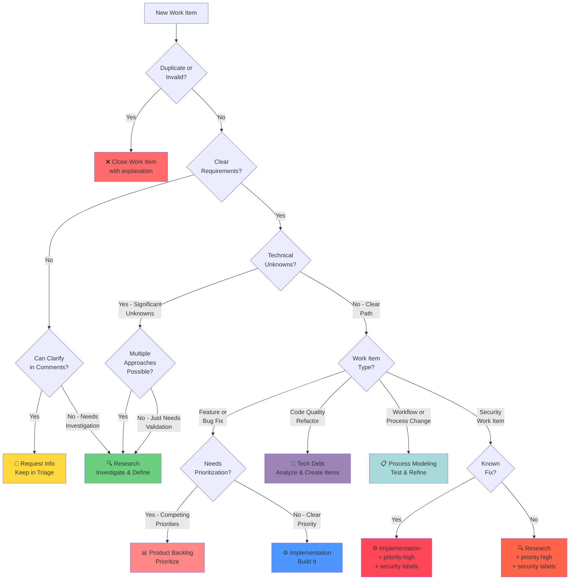

# Triage Duty

**Purpose**: Initial assessment and routing of work items to appropriate duties

**Layer**: 2 (Duty - specialized procedure)

**Version**: 1.0  
**Created**: 2025-11-12

---

## Required Context

**⚠️ IMPORTANT**: Read the following documents before proceeding:

- **[Semantic Language](../../docs/design/prompt-engineering/semantic-language.md)** - Semantic operations used below
- **[Kernel Layer](../kernel/README.md)** - Platform abstraction layer
- **[Duty Assignment Procedure](../procedures/duty-assignment.md)** - How to assign duties to work items
- **[Handover Procedure](../procedures/handover.md)** - Transitioning work items between duties
- **[Work Item Creation Procedure](../procedures/work-item-creation.md)** - Creating new work items
- **[Comment Patterns Procedure](../procedures/comment-patterns.md)** - Standard comment formats
- **[Multi-Phase Work Items](../procedures/multi-phase-work-items.md)** - Parent-child work item management

**Semantic Operations Used**:
- `query_work_items_by_duty(duty)` - Find work items assigned to this duty
- `query_unlabeled_work_items(status)` - Find work items without workflow labels (need initial triage)
- `get_work_item_details(work_item_id)` - Retrieve work item information
- `get_work_item_duty(work_item_id)` - Get current duty assignment
- `assign_work_item_to_duty(work_item_id, duty)` - Change duty (handover)
- `add_work_item_comment(work_item_id, text)` - Add comment
- `get_parent_work_item(work_item_id)` - Get parent if exists
- `is_multi_phase(work_item_id)` - Check if part of multi-phase plan
- `update_work_item(work_item_id, fields)` - Update work item fields

---

## Overview

**Purpose**: Assess new work items and designate them to the appropriate duty (research, implementation, tech debt, product prioritization, or process modeling).

**Entry Point**: Work items automatically assigned to triage duty when created

**Typical Duration**: 5-15 minutes per work item (single mode) or 30-90 minutes (bulk mode)

---

## Triage Modes

The triage duty supports two modes:

### Single Work Item Mode (Default)

**When to use**: You're assigned to a specific work item that needs triage

**Behavior**:
- Process the assigned work item only
- Assess and designate to appropriate duty
- Stop after completing this one work item

### Bulk Triage Mode

**When to use**: You're assigned to a "Bulk Triage" work item

**Behavior**:
- Query ALL work items in triage duty queue
- Exclude the bulk triage work item itself
- Process each work item sequentially
- Update the bulk triage work item with progress summaries
- Continue until queue is empty
- Close the bulk triage work item when complete

**How to identify bulk mode**:
- Work item title starts with `[Triage] Bulk triage`
- Work item body contains "Bulk Triage Instructions"
- Work item explicitly requests processing the entire triage queue

---

## Quick Start

**Single Work Item Mode**:
1. Check if part of multi-phase plan (see [Multi-Phase Check](#multi-phase-work-item-check))
2. Read and assess the assigned work item
3. Determine appropriate duty (see [Decision Tree](#decision-tree))
4. Handover to designated duty using [Handover Procedure](../procedures/handover.md)

**Bulk Triage Mode**:
1. Query all work items needing triage:
   - `query_work_items_by_duty("triage")` for explicitly assigned items
   - `query_unlabeled_work_items()` for items without workflow labels
   - Combine and deduplicate the results
2. For each work item: read, assess, and handover (see [Decision Tree](#decision-tree))
3. Update bulk triage work item with summary
4. Close bulk triage work item when done

**⚠️ Comment Prefix Convention:**
- Follow [Comment Patterns Procedure](../procedures/comment-patterns.md)
- Prefix ALL comments with `[Copilot-Duty: Triage]`
- Example: `[Copilot-Duty: Triage] After reviewing this work item, I recommend...`

---

## Procedure

### Step 1: Query Triage Queue

Use semantic operation to find work items in triage:

```python
# Query work items assigned to triage duty
triage_items = query_work_items_by_duty(duty="triage")

# Filter out bulk triage work items if in bulk mode
work_items = [item for item in triage_items 
              if not item['title'].startswith('[Triage] Bulk triage')]
```

_Implementation note: See [kernel operations](../kernel/README.md) for platform mapping._

---

### Step 2: Label Cleanup (Before Starting Triage)

**⚠️ IMPORTANT**: Before triaging work items, check for conflicting duty labels.

Follow the [Duty Assignment Procedure](../procedures/duty-assignment.md) to:
1. Check work item for multiple duty designations (label pollution)
2. Identify conflicts
3. Determine correct duty
4. Clean up labels
5. Add cleanup comment

**Why this matters**: Work items should have exactly ONE duty at a time. Multiple duties create confusion about ownership.

---

### Step 3: Multi-Phase Work Item Check

**⚠️ ALWAYS**: Check if this work item is part of a multi-phase plan before starting triage work.

Follow [Multi-Phase Work Items Procedure](../procedures/multi-phase-work-items.md):

```python
# Check if work item is part of multi-phase plan
if is_multi_phase(work_item_id):
    parent_id = get_parent_work_item(work_item_id)
    if parent_id:
        # This is a sub-work-item - read parent context
        parent = get_work_item_details(parent_id)
        # Review parent to understand overall plan
```

**If This is a Sub-Work-Item**:
1. ✅ Read parent to understand overall triage plan
2. ✅ Note which triage phase this represents
3. ✅ Review completed phases for context
4. ✅ Update parent description as triage progresses
5. ✅ Check if this is the last sub-work-item before finalizing

---

### Step 4: Assessment Criteria

For each work item, assess the following:

#### Work Item Type

**Bug Report**:
- Is this a defect in existing functionality?
- Is the bug reproducible?
- What is the severity/priority?

**Feature Request**:
- Is this a new feature or enhancement?
- Is the requirement clear?
- Is research needed to validate feasibility?

**Research Question**:
- Does this need investigation or prototyping?
- Are there unknown unknowns?

**Tech Debt**:
- Does this address code quality, maintainability, or architecture?
- Is this a refactoring or cleanup task?

**Process Improvement**:
- Does this relate to workflows, tooling, or team processes?
- Is this a meta-work-item about how we work?

#### Clarity & Scope

- [ ] Requirements are clear and specific
- [ ] Scope is well-defined
- [ ] Success criteria are stated
- [ ] No significant unknowns

#### Complexity Assessment

**Low**: Simple change, clear path forward → Implementation Duty  
**Medium**: Some unknowns, may need design → Research or Implementation  
**High**: Significant unknowns, needs validation → Research Duty

---

### Step 5: Duty Designation

Based on assessment, designate to appropriate duty using the [Decision Tree](#decision-tree).

#### → Research Duty

**When to use**:
- Significant unknowns or technical uncertainty
- Needs prototyping or proof-of-concept
- Multiple approaches need evaluation
- Feasibility needs validation

**Handover**:
```python
# Follow Handover Procedure
assign_work_item_to_duty(work_item_id, "research")

add_work_item_comment(
    work_item_id,
    "[Copilot-Duty: Triage] 🔄 Triage → Research\n\n"
    "This work item requires research to validate feasibility and approach.\n\n"
    "**Research Questions**:\n"
    "- [Question 1]\n"
    "- [Question 2]"
)
```

_Implementation note: Handover procedure details in [../procedures/handover.md](../procedures/handover.md)_

---

#### → Implementation Duty

**When to use**:
- Requirements are clear and specific
- No significant technical unknowns
- Straightforward bug fix or enhancement
- Design is already validated

**Handover**:
```python
assign_work_item_to_duty(work_item_id, "implementation")

add_work_item_comment(
    work_item_id,
    "[Copilot-Duty: Triage] 🔄 Triage → Implementation\n\n"
    "Requirements are clear. Ready for implementation.\n\n"
    "**Summary**: [Brief description]"
)
```

---

#### → Tech Debt Duty

**When to use**:
- Code quality or maintainability work item
- Refactoring or cleanup needed
- Architecture improvement
- Test coverage gap

**Handover**:
```python
assign_work_item_to_duty(work_item_id, "tech-debt")

add_work_item_comment(
    work_item_id,
    "[Copilot-Duty: Triage] 🔄 Triage → Tech Debt\n\n"
    "This is a technical debt item requiring analysis and prioritization.\n\n"
    "**Debt Category**: [Code Quality / Architecture / Testing / Documentation]"
)
```

---

#### → Product Prioritization Duty

**When to use**:
- Multiple competing priorities
- Needs business value assessment
- Resource allocation decision needed
- Part of larger backlog needing prioritization

**Handover**:
```python
assign_work_item_to_duty(work_item_id, "product-backlog")

add_work_item_comment(
    work_item_id,
    "[Copilot-Duty: Triage] 🔄 Triage → Product Prioritization\n\n"
    "This item needs prioritization against other backlog items.\n\n"
    "**Context**: [Business context or dependency info]"
)
```

---

#### → Process Modeling Duty

**When to use**:
- Workflow or process improvement
- Tooling enhancement
- Team process optimization
- Meta-work-item about how we work

**Handover**:
```python
assign_work_item_to_duty(work_item_id, "process-modeling")

add_work_item_comment(
    work_item_id,
    "[Copilot-Duty: Triage] 🔄 Triage → Process Modeling\n\n"
    "This is a process improvement item.\n\n"
    "**Area**: [Workflow / Tooling / Documentation / Other]"
)
```

---

#### → Close Work Item

**When to close**:
- Duplicate of existing work item
- Invalid or not reproducible
- Out of scope
- Won't fix

**Close**:
```python
update_work_item(
    work_item_id,
    {"status": "closed"}
)

add_work_item_comment(
    work_item_id,
    "[Copilot-Duty: Triage] ❌ Closing Work Item\n\n"
    "**Reason**: [Duplicate of #123 / Invalid / Out of Scope / Won't Fix]\n\n"
    "[Additional context if needed]"
)
```

---

## Decision Tree

### Quick Visual Guide

Use this decision tree to quickly determine the appropriate duty for a work item:

> **Accessibility Note:** Color is used in the diagram below as a supplementary visual aid. All decision paths are clearly labeled with text, so you can follow the workflow without relying on color.



### Decision Tree Legend

| Symbol | Duty | When to Use |
|--------|------|-------------|
| 🔍 | **Research** | Unknowns, multiple approaches, needs validation |
| ⚙️ | **Implementation** | Clear requirements, known approach, ready to build |
| 🔧 | **Tech Debt** | Code quality, refactoring, architecture improvements |
| 📊 | **Product Backlog** | Needs prioritization among competing items |
| 📋 | **Process Modeling** | Workflow improvements, process changes |
| 💬 | **Stay in Triage** | Needs clarification before routing |
| ❌ | **Close** | Duplicate, invalid, out of scope, won't fix |

### Key Decision Points

The decision tree considers these factors in order:

1. **Validity**: Is this a duplicate or invalid work item?
2. **Clarity**: Are requirements clear enough to proceed?
3. **Unknowns**: Are there significant technical unknowns?
4. **Type**: What category of work is this?
5. **Priority**: Does it need prioritization vs clear path?
6. **Security**: Does it require special handling?

---

## Common Triage Patterns

### Pattern 1: Feature Request with Clear Requirements

**Indicators**:
- Specific feature description
- Clear acceptance criteria
- No architectural concerns
- Straightforward implementation

**Example**:
```
Work Item: "Add support for cancellation tokens in BatchBlock"
Details: Constructor accepts CancellationToken, batch window respects it
Acceptance: Unit tests, docs updated, no breaking changes
```

**Decision**: `implementation` duty

**Rationale**: Requirements are clear, approach is standard, no unknowns. Ready to build.

---

### Pattern 2: Feature Request with Technical Unknowns

**Indicators**:
- General idea but unclear approach
- Multiple possible implementations
- Architecture impact unclear
- Feasibility questions

**Example**:
```
Work Item: "Add distributed caching support"
Questions: Which caching technology? How to integrate? Performance impact?
Approaches: Redis vs Memcached vs in-memory distributed cache
```

**Decision**: `research` duty

**Rationale**: Multiple approaches exist, need prototyping and benchmarking to determine best fit.

---

### Pattern 3: Clear Bug Report (Reproducible)

**Indicators**:
- Reproducible steps provided
- Expected vs actual behavior clear
- Root cause identifiable
- Known fix pattern

**Example**:
```
Work Item: "NullReferenceException in BatchBlock when maxBatchSize=0"
Reproduction: Create BatchBlock(maxBatchSize: 0), add items
Expected: Exception on construction or graceful handling
Actual: NullRef during processing
```

**Decision**: `implementation` duty

**Rationale**: Clear bug, reproducible, fix location known. No investigation needed.

---

### Pattern 4: Bug Report (Unclear or Intermittent)

**Indicators**:
- Cannot reproduce consistently
- Unclear root cause
- Missing information
- Could be user error or actual bug

**Example**:
```
Work Item: "TransformBlock occasionally drops items"
Details: Sometimes output < input with high concurrency
Reproduction: Inconsistent, no clear pattern
```

**Decision**: 
- **Option 1**: Stay in `triage` - Request clarification (reproduction steps, minimal example)
- **Option 2**: `research` duty - If enough detail to investigate but root cause unclear

**Rationale**: Need more information before routing. After clarification, re-triage.

---

### Pattern 5: Code Quality / Refactoring

**Indicators**:
- Working code, no functional changes needed
- Modernization or cleanup
- Architecture improvements
- Test coverage gaps

**Example**:
```
Work Item: "Refactor ActorPool to use modern C# patterns"
Context: Working code but uses old-style constructors, verbose properties
Goal: Apply modern C# 12 features for maintainability
```

**Decision**: `tech-debt` duty

**Rationale**: This is technical debt - code quality improvement.

---

### Pattern 6: Multiple Competing Feature Requests

**Indicators**:
- Several valid feature requests
- Resource constraints
- Need to determine priority
- Business value assessment needed

**Example**:
```
Work Item: "Add metrics collection" (one of 4 observability requests)
Others: Distributed tracing (#145), Logging (#167), Health checks (#201)
Context: All valuable, limited resources
```

**Decision**: `product-backlog` duty

**Rationale**: Valid feature but needs prioritization. Product workflow assesses business value and dependencies.

---

### Pattern 7: Workflow or Process Improvement

**Indicators**:
- About team workflows, not code
- Process optimization
- Documentation improvement
- Tooling enhancement

**Example**:
```
Work Item: "Add visual decision tree to research workflow"
Details: Improve workflow docs with diagrams
Impact: Makes workflow easier to understand
```

**Decision**: `process-modeling` duty

**Rationale**: Meta-work-item about improving workflows.

---

### Pattern 8: Security or Critical Work Items

**Indicators**:
- Security vulnerability
- Data integrity risk
- High severity/urgency
- Could be clear fix OR need investigation

**Example Clear Fix**:
```
Work Item: "Race condition in ActorPool channel access"
Details: Two threads access channel without locking
Fix: Add lock around channel operations
```

**Decision**: `implementation` duty + priority:high + security labels

**Rationale**: Clear fix, implement immediately.

**Example Needs Investigation**:
```
Work Item: "Potential memory leak in long-running pipelines"
Details: Memory grows over time, unclear cause
Needs: Profiling, investigation
```

**Decision**: `research` duty + priority:high + security labels

**Rationale**: Root cause unclear, needs investigation before fix.

---

## Bulk Triage Procedure

When assigned to bulk triage work item:

### Step 1: Query Triage Queue

```python
# Get work items explicitly assigned to triage duty
triage_items = query_work_items_by_duty(duty="triage")

# Also get work items with NO workflow labels (need initial triage)
unlabeled_items = query_unlabeled_work_items(status="open")

# Combine both sets
all_items_to_triage = triage_items + unlabeled_items

# Filter out the bulk triage work item itself
current_work_item_id = get_current_work_item_id()  # From context
work_items = [item for item in all_items_to_triage 
              if item['id'] != current_work_item_id]

# Remove duplicates (shouldn't happen, but be safe)
seen_ids = set()
unique_work_items = []
for item in work_items:
    if item['id'] not in seen_ids:
        seen_ids.add(item['id'])
        unique_work_items.append(item)

# Sort by creation date (oldest first)
unique_work_items.sort(key=lambda x: x['created_at'])

work_items = unique_work_items
```

**Why This Matters**:
- `query_work_items_by_duty("triage")` finds items explicitly labeled for triage
- `query_unlabeled_work_items()` finds newly created items without any workflow labels
- Together, these ensure **complete coverage** - no work items are missed
- The combination handles both:
  1. Items intentionally routed to triage
  2. New items needing initial assessment

---

### Step 2: Process Each Work Item

For each work item in the queue:

```python
for work_item in work_items:
    # 1. Get details
    details = get_work_item_details(work_item['id'])
    
    # 2. Assess (follow decision tree)
    target_duty = assess_work_item(details)  # Your logic here
    
    # 3. Handover
    assign_work_item_to_duty(work_item['id'], target_duty)
    
    # 4. Add comment
    add_work_item_comment(
        work_item['id'],
        f"[Copilot-Duty: Triage] 🔄 Triage → {target_duty.title()}\n\n"
        f"[Rationale for assignment]"
    )
```

---

### Step 3: Update Bulk Triage Work Item

After each batch (e.g., every 5 work items), update the bulk triage work item:

```python
# Update progress
add_work_item_comment(
    bulk_triage_work_item_id,
    f"[Copilot-Duty: Triage] 📊 Progress Update\n\n"
    f"Processed {processed_count}/{total_count} work items:\n"
    f"- Research: {research_count}\n"
    f"- Implementation: {impl_count}\n"
    f"- Tech Debt: {debt_count}\n"
    f"- Product Backlog: {product_count}\n"
    f"- Process Modeling: {process_count}\n"
    f"- Closed: {closed_count}"
)
```

---

### Step 4: Complete Bulk Triage

When queue is empty:

```python
# Final summary
add_work_item_comment(
    bulk_triage_work_item_id,
    f"[Copilot-Duty: Triage] ✅ Bulk Triage Complete\n\n"
    f"Total work items processed: {total_count}\n"
    f"- Research: {research_count}\n"
    f"- Implementation: {impl_count}\n"
    f"- Tech Debt: {debt_count}\n"
    f"- Product Backlog: {product_count}\n"
    f"- Process Modeling: {process_count}\n"
    f"- Closed: {closed_count}\n\n"
    f"All work items have been triaged and routed to appropriate duties."
)

# Close bulk triage work item
update_work_item(
    bulk_triage_work_item_id,
    {"status": "closed"}
)
```

---

## Quality Metrics

### Good Triage Indicators

| Metric | Target | Description |
|--------|--------|-------------|
| **Time to Triage** | < 24 hours | Time from work item creation to duty assignment |
| **Re-triage Rate** | < 10% | Percentage of work items sent back to triage from other duties |
| **Clarification Rate** | < 20% | Percentage of work items needing clarification |
| **Handover Completeness** | 100% | All handovers include clear reasoning |
| **Duplicate Detection** | > 95% | Duplicates caught before routing to duties |

### Poor Triage Indicators

- ❌ Work items sit in triage for days without action
- ❌ Frequent re-triage (same work item bounces between duties)
- ❌ Handover comments lack context or reasoning
- ❌ Implementation receives unclear requirements
- ❌ Research receives work items with no real unknowns

---

## Handover Points

### To Research Duty

**When**: Significant technical unknowns, needs validation, multiple approaches

**Follow**: [Handover Procedure](../procedures/handover.md)

**Additional Context**: Include research questions in handover comment

---

### To Implementation Duty

**When**: Clear requirements, no unknowns, ready to build

**Follow**: [Handover Procedure](../procedures/handover.md)

**Additional Context**: Include brief summary of requirements

---

### To Tech Debt Duty

**When**: Code quality, refactoring, architecture improvement

**Follow**: [Handover Procedure](../procedures/handover.md)

**Additional Context**: Include debt category (code quality, architecture, testing, documentation)

---

### To Product Prioritization Duty

**When**: Needs prioritization among competing items

**Follow**: [Handover Procedure](../procedures/handover.md)

**Additional Context**: Include business context or dependency information

---

### To Process Modeling Duty

**When**: Workflow improvement, process change, tooling enhancement

**Follow**: [Handover Procedure](../procedures/handover.md)

**Additional Context**: Include area (workflow, tooling, documentation, other)

---

## Testing

**Test Methodology**: End-to-end scenario testing

**Test Location**: `.team/duties/tests/triage/`

**Test Scenarios**:
1. Single work item triage (clear requirements)
2. Single work item triage (needs research)
3. Bulk triage mode (multiple work items)
4. Multi-phase triage (parent-child work items)
5. Label cleanup scenario (conflicting duties)

**See**: [Testing Framework](../../docs/design/prompt-engineering/testing-framework.md#node-type-3-duty-procedures)

---

## Design References

This duty implements:
- [Main Design Document](../../docs/design/prompt-engineering/README.md)
- [Core Concepts](../../docs/design/prompt-engineering/concepts.md) - Layer 2 definition
- [Semantic Language](../../docs/design/prompt-engineering/semantic-language.md) - Operations used

---

## Related Documentation

- **Procedures Used**:
  - [Duty Assignment](../procedures/duty-assignment.md)
  - [Handover](../procedures/handover.md)
  - [Work Item Creation](../procedures/work-item-creation.md)
  - [Comment Patterns](../procedures/comment-patterns.md)
  - [Multi-Phase Work Items](../procedures/multi-phase-work-items.md)

- **Other Duties**:
  - Research Duty - Handover target (pending migration, see issue #374)
  - Implementation Duty - Handover target (pending migration, see issue #374)
  - Tech Debt Duty - Handover target (pending migration, see issue #374)
  - Product Prioritization Duty - Handover target (pending migration, see issue #374)
  - Process Modeling Duty - Handover target (pending migration, see issue #374)

---

## Version History

| Version | Date | Changes |
|---------|------|---------|
| 1.0 | 2025-11-12 | Initial triage duty migrated from TRIAGE_WORKFLOW.md |
