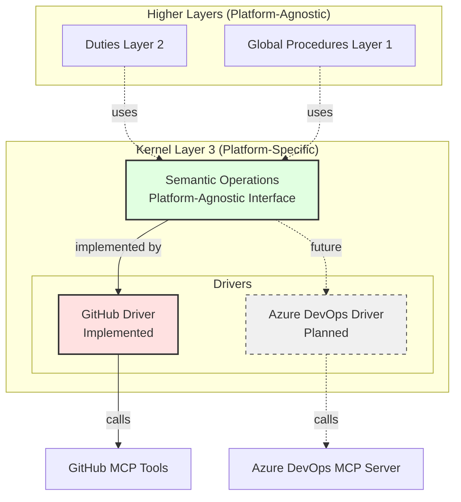

# Kernel Layer: Platform Abstraction

**Version**: 1.0  
**Created**: 2025-11-12  
**Layer**: 3 (Kernel - lowest layer, platform-specific)

---

## Purpose

The **kernel layer** encapsulates all platform-specific operations for work tracking systems. It provides a unified semantic interface that procedures and duties can use without knowing the underlying platform.

**Analogy**: Like an operating system kernel that abstracts hardware differences, our kernel abstracts work tracker differences.

---

## Architecture Overview



---

## Semantic Operations

The kernel provides **13 semantic operations** that abstract work item management:

### Work Item CRUD Operations

1. **`create_work_item`** - Create a new work item with duty assignment
2. **`get_work_item_details`** - Retrieve full work item information
3. **`update_work_item`** - Update work item fields
4. **`add_work_item_comment`** - Add a comment to a work item

### Duty Operations

5. **`get_work_item_duty`** - Extract duty designation from work item
6. **`assign_work_item_to_duty`** - Change duty assignment (handover)
7. **`query_work_items_by_duty`** - Find all work items for a specific duty
8. **`query_unlabeled_work_items`** - Find all work items without workflow labels (need initial triage)

### Multi-Phase Operations

9. **`create_child_work_item`** - Create a sub-work item linked to parent
10. **`get_parent_work_item`** - Get parent work item ID if exists
11. **`is_multi_phase`** - Check if work item is part of multi-phase plan
12. **`list_child_work_items`** - Get all children of a work item

### Feedback Operations

13. **`submit_feedback`** - Submit self-improvement feedback

**Complete Specification**: See [Semantic Language Reference](../../docs/design/prompt-engineering/semantic-language.md)

---

## Platform Drivers

### GitHub Driver (Current)

**Path**: `.team/kernel/github/`  
**Status**: ✅ Implemented  
**Platform**: GitHub Issues with MCP Tools

**Documentation**:
- [GitHub Driver Overview](github/README.md)
- [Operation Mappings](github/operations.md)
- [Usage Examples](github/examples.md)

### Azure DevOps Driver (Future)

**Path**: `.team/kernel/azuredevops/`  
**Status**: 📋 Planned  
**Platform**: Azure DevOps Boards with [Azure DevOps MCP Server](https://github.com/microsoft/azure-devops-mcp)

*Not yet implemented. Will use the Azure DevOps MCP Server for platform integration.*

---

## Configuration

**Active Platform**: Configured in [`config.yaml`](config.yaml)

```yaml
platform: github  # Current active platform
```

**Domain Registry**: See [`domains.yaml`](domains.yaml) for all available/planned drivers.

---

## Usage in Procedures and Duties

**Key Principle**: Higher layers (procedures, duties) should **ONLY** use semantic operations, never platform-specific calls.

### ✅ Correct (Platform-Agnostic)

```python
# In a procedure or duty
work_items = query_work_items_by_duty(
    duty="research",
    status="open"
)
```

### ❌ Incorrect (Platform-Specific)

```python
# DON'T do this in procedures/duties - this is kernel-level code
list_issues(
    owner="uniun-technology",
    repo="lib-dataflow",
    labels=["workflow:research"],
    state="OPEN"
)
```

**Why**: Using semantic operations allows switching platforms (GitHub → Azure DevOps) without rewriting all procedures and duties.

---

## Kernel Development

### Adding a New Semantic Operation

1. **Update Specification**: Add to [Semantic Language Reference](../../docs/design/prompt-engineering/semantic-language.md)
2. **Implement for GitHub**: Update [github/operations.md](github/operations.md)
3. **Add Examples**: Add to [github/examples.md](github/examples.md)
4. **Create Tests**: Add to [tests/](tests/) directory
5. **Future**: Implement for Azure DevOps when that driver is added

### Adding a New Platform Driver

1. **Create Directory**: `.team/kernel/{platform}/`
2. **Register Domain**: Add to [domains.yaml](domains.yaml)
3. **Implement Operations**: Create `operations.md` with all 12 semantic operations
4. **Add Examples**: Create `examples.md`
5. **Create Tests**: Test suite in `tests/{platform}/`
6. **Update Config**: Add platform configuration to [config.yaml](config.yaml)

---

## Testing

**Test Directory**: [tests/](tests/)

**Test Methodology**: Semantic contract testing
- Verify each semantic operation behaves correctly
- Test platform-specific implementations match specification
- Validate error handling
- Check configuration changes

**See**: [Testing Framework](../../docs/design/prompt-engineering/testing-framework.md#node-type-1-kernel)

---

## Design References

This kernel layer implements the design documented in:
- [Main Design Document](../../docs/design/prompt-engineering/README.md)
- [Core Concepts](../../docs/design/prompt-engineering/concepts.md)
- [Semantic Language Specification](../../docs/design/prompt-engineering/semantic-language.md)

---

## Related Documentation

- **Higher Layers**:
  - [Global Procedures](../procedures/README.md) - Layer 1 (planned for Phase 2)
  - [Duties](../duties/README.md) - Layer 2 (planned for Phase 3)
  - [Orchestration](../../.github/copilot-instructions.md) - Layer 0 (planned for Phase 4)

- **Current Workflows** (Pre-Migration):
  - [Workflow Files](../prompts/) - Current workflow system (will migrate to duties)

---

## Version History

| Version | Date | Changes |
|---------|------|---------|
| 1.0 | 2025-11-12 | Initial kernel layer structure, GitHub driver implementation |
