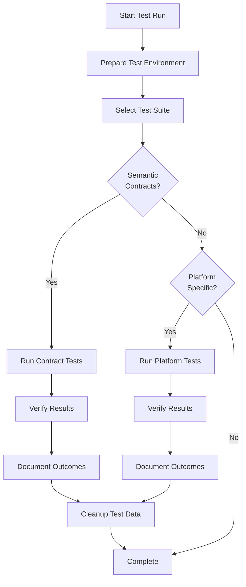

# Kernel Test Execution Procedure

**Version**: 1.0  
**Created**: 2025-11-12  
**Test Type**: Semantic Contract Testing

---

## Overview

This document describes how to execute kernel tests to validate semantic operation implementations.

---

## Prerequisites

**Required**:
- Access to test GitHub repository or mock environment
- GitHub MCP tools available
- Copilot agent with kernel layer access
- Test data preparation capability

**Optional**:
- Dedicated test repository
- Test user account
- Automated test runner

---

## Test Execution Workflow



---

## Execution Modes

### Mode 1: Manual Tabletop Testing

**Best for**: Initial validation, understanding behavior

**Process**:
1. Read test scenario
2. Manually execute semantic operations
3. Observe actual behavior
4. Compare to expected behavior
5. Document results

**Example**:
```python
# Read scenario: test-create-work-item.md
# Execute Test Case 1 manually

work_item_id = create_work_item(
    type="research",
    title="TEST: Investigate caching strategy",
    description="Test description for validation",
    duty="research",
    labels=["test", "performance"]
)

# Observe: Check GitHub for created issue
# Verify: Labels include "workflow:research", "research", "test", "performance"
# Document: Test Case 1 - PASS
```

---

### Mode 2: Automated Testing (Future)

**Best for**: Regression testing, CI/CD integration

**Status**: Planned (not yet implemented)

**Approach**:
- Create test runner script
- Mock platform responses
- Validate kernel mappings
- Generate test reports

---

## Running Semantic Contract Tests

### Step 1: Select Test

Choose semantic operation to test:
```bash
cd .team/kernel/tests/semantic-contracts
ls test-*.md
```

**Available Tests**:
- `test-create-work-item.md`
- `test-get-work-item-details.md`
- (etc., one per semantic operation)

### Step 2: Review Test Scenario

Read the test file completely:
- Understand semantic operation purpose
- Note expected inputs and outputs
- Review platform-specific mappings
- Understand pass criteria

### Step 3: Prepare Test Environment

**For GitHub Testing**:
1. Identify test repository (default: lib-dataflow)
2. Prepare test data labels (prefix with "TEST:")
3. Note current state (existing issues)

**For Mock Testing**:
1. Set up mock platform responses
2. Configure kernel to use mocks
3. Prepare expected responses

### Step 4: Execute Test Cases

**For each test case in the scenario**:

1. **Execute Semantic Operation**:
   ```python
   result = <semantic_operation>(<test_parameters>)
   ```

2. **Capture Result**:
   - Record return value
   - Note any errors or exceptions
   - Check execution time (optional)

3. **Verify Platform Behavior**:
   ```python
   # Query created/modified resource
   details = get_work_item_details(result)
   
   # Verify state matches expected
   ```

4. **Document Outcome**:
   - PASS or FAIL
   - Actual vs expected
   - Any deviations or issues

### Step 5: Verify Pass Criteria

Check all pass criteria from test scenario:
- [ ] Return value correct
- [ ] Platform state correct
- [ ] Error handling works
- [ ] Edge cases handled

### Step 6: Cleanup

**Remove Test Data**:
```python
# Close or delete test work items
update_work_item(work_item_id=test_id, status="closed")

# Or add comment marking as test
add_work_item_comment(
    work_item_id=test_id,
    text="🧪 TEST DATA - Can be deleted"
)
```

### Step 7: Document Results

Update test scenario file:

```markdown
## Test Results

**Last Run**: 2025-11-12 14:30 UTC
**Platform**: GitHub
**Status**: All test cases passed

**Results**:
- Test Case 1: PASS ✓
- Test Case 2: PASS ✓
- Test Case 3: PASS ✓
- Test Case 4: PASS ✓
- Test Case 5: PASS ✓

**Notes**: All semantic operations mapped correctly to GitHub APIs
```

---

## Running Platform-Specific Tests

### GitHub-Specific Tests

**Location**: `tests/github/`

**Examples**:
- Label format validation
- Sub-issue relationship handling
- Feedback tracker auto-creation

**Process**: Similar to semantic contract tests, but focus on platform details

---

## Test Data Management

### Marking Test Data

**Label Convention**: Prefix titles with "TEST:"

```python
create_work_item(
    type="research",
    title="TEST: Caching investigation",  # Clearly marked
    description="Test scenario for validation",
    duty="research"
)
```

### Cleanup Strategy

**Option 1**: Delete immediately after test
```python
# After verification
update_work_item(work_item_id=test_id, status="closed")
```

**Option 2**: Batch cleanup
- Mark all test items with "test" label
- Periodically close/delete all test items
- Automated cleanup script (future)

---

## Recording Test Results

### Individual Test Results

Update each test scenario file with:
- Execution date/time
- Platform tested
- Pass/fail for each test case
- Notes on any issues

### Test Suite Summary

Create summary in `tests/README.md`:

```markdown
## Test Execution Results

**Latest Run**: 2025-11-12
**Platform**: GitHub
**Status**: 10/12 operations tested

**Coverage**:
- create_work_item: PASS ✓
- get_work_item_details: PASS ✓
- update_work_item: PASS ✓
- assign_work_item_to_duty: PASS ✓
- query_work_items_by_duty: PASS ✓
- (etc.)

**Pass Rate**: 10/10 (100%)
**Issues Found**: None
```

---

## Regression Testing

### When to Run Regression Tests

- **Before kernel changes**: Baseline current behavior
- **After kernel changes**: Verify no regressions
- **Before adding new driver**: Validate GitHub still works
- **Periodic validation**: Monthly or quarterly checks

### Regression Test Process

1. **Archive Current Results**: Copy test results to `tests/archive/YYYY-MM-DD/`
2. **Run Full Suite**: Execute all semantic contract tests
3. **Compare to Baseline**: Check for any deviations
4. **Document Changes**: Note any behavior changes
5. **Update Baseline**: If changes are intentional

---

## Troubleshooting

### Test Failures

**Issue**: Semantic operation returns unexpected result

**Debug Steps**:
1. Verify inputs are correct
2. Check platform state before operation
3. Inspect actual platform call (GitHub API)
4. Review kernel implementation mapping
5. Check for platform API changes

**Issue**: Platform-specific mapping incorrect

**Debug Steps**:
1. Review `github/operations.md` mapping
2. Test platform call directly
3. Verify configuration (`config.yaml`)
4. Check for API version differences

---

## Best Practices

1. **Always prefix test items**: Use "TEST:" in titles
2. **Clean up after testing**: Don't leave orphaned test data
3. **Document thoroughly**: Record results and observations
4. **Test edge cases**: Don't just test happy path
5. **Verify error handling**: Ensure failures are handled gracefully
6. **Keep tests current**: Update when semantic operations change
7. **Archive passing tests**: Build regression suite over time

---

## Related Documentation

- [Test Suite README](README.md)
- [Semantic Language Reference](../../../docs/design/prompt-engineering/semantic-language.md)
- [Testing Framework](../../../docs/design/prompt-engineering/testing-framework.md#node-type-1-kernel)
- [Kernel Overview](../README.md)

---

## Version History

| Version | Date | Changes |
|---------|------|---------|
| 1.0 | 2025-11-12 | Initial test execution procedure |
