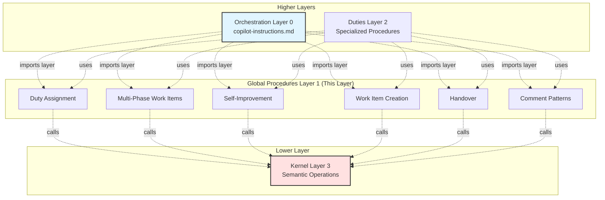

# Global Procedures: Universal Agent Knowledge

**Version**: 1.0  
**Created**: 2025-11-12  
**Layer**: 1 (Global Procedures - platform-agnostic, duty-independent)

---

## Required Context

**⚠️ IMPORTANT**: Read the following documents before proceeding:

- **[Core Concepts](../../docs/design/prompt-engineering/concepts.md)** - Layer 1 definition and architectural principles
- **[Semantic Language](../../docs/design/prompt-engineering/semantic-language.md)** - Semantic operations that procedures use
- **[Kernel Layer](../kernel/README.md)** - Platform abstraction layer that provides semantic operations

---

## Purpose

The **global procedures layer** provides platform-agnostic procedures that all duties use. These procedures define common patterns for work item management, duty assignment, and self-improvement.

**Analogy**: Like a standard library (C stdlib, Python stdlib) that all applications can use.

---

## Architecture Overview



**Note**: Orchestration imports the entire procedures layer (all procedures available), while individual duties selectively use specific procedures as needed.

---

## Available Procedures

### Core Work Item Management

1. **[Duty Assignment](duty-assignment.md)** - How to infer and assign duty from work item
2. **[Multi-Phase Work Items](multi-phase-work-items.md)** - Managing parent-child work item relationships
3. **[Work Item Successor](work-item-successor.md)** - Creating successor work items during implementation
4. **[Work Item Creation](work-item-creation.md)** - Common patterns for creating work items
5. **[Handover](handover.md)** - Transitioning work items between duties

### Communication & Feedback

6. **[Comment Patterns](comment-patterns.md)** - Standard comment formats and conventions
7. **[Self-Improvement](self-improvement.md)** - Submitting workflow feedback

---

## Key Principles

### 1. Platform Agnostic

**ALL procedures use ONLY semantic operations** - never platform-specific code.

✅ **Correct**:
```python
# Uses semantic operation
work_item_id = create_work_item(
    type="research",
    title="Investigate approach",
    duty="research"
)
```

❌ **Incorrect**:
```python
# Platform-specific GitHub code
issue_write(  # ❌ Don't use platform-specific operations
    method="create",
    owner="uniun-technology",  # ❌ Platform-specific parameter
    repo="lib-dataflow",  # ❌ Platform-specific parameter
    labels=["workflow:research"]  # ❌ Don't use platform-specific labels
)
```

### 2. Required Context

Each procedure specifies what kernel context is needed:
- Which semantic operations are used
- What work item fields are required
- What assumptions are made

### 3. Clear Instructions

Procedures provide:
- Step-by-step instructions
- Decision criteria
- Examples and anti-patterns
- Edge case handling

---

## Using Procedures

### In Orchestration Layer (Layer 0)

Import and use procedures for common tasks:

```markdown
**Duty Assignment**: See [Duty Assignment Procedure](../procedures/duty-assignment.md)

**Multi-Phase Check**: See [Multi-Phase Work Items Procedure](../procedures/multi-phase-work-items.md)
```

### In Duties (Layer 2)

Reference procedures for reusable logic:

```markdown
## Creating Handover Work Item

Follow [Work Item Creation Procedure](../../procedures/work-item-creation.md) with:
- Type: "implementation"
- Duty: "implementation"
- Include research findings in description
```

---

## Testing

**Test Methodology**: Scenario-based tabletop testing

**Test Location**: `.team/procedures/tests/`

**See**: [Testing Framework](../../docs/design/prompt-engineering/testing-framework.md#node-type-2-global-procedures)

Each procedure has:
- 3-5 test scenarios covering main cases
- Edge case scenarios
- Regression tests (selectively persisted)

---

## Change Procedures

**⚠️ IMPORTANT**: Changes to global procedures follow strict change control.

**See**: [Testing Framework - Global Procedure Change Procedure](../../docs/design/prompt-engineering/testing-framework.md)

**Required steps**:
1. Analyze change impact
2. Create test scenarios (3-5 per changed procedure)
3. Execute tabletop tests
4. Refine based on test results
5. **Verify document references use correct edge type**:
   - For each linked document, determine if it's a required or optional dependency
   - Use ⚠️ IMPORTANT convention for required dependencies
   - Use standard markdown links for optional/cross-references
   - Example required: `**[Document Name](path)** - Why it's required`
   - Example optional: `[Document Name](path) - Additional context`
6. Run kernel leak detection (results posted as issue comment)
7. Run dependency leak detection (results posted as issue comment)
8. Update graph representation (`.team/model-graph.yaml`)
9. Archive valuable test scenarios

**Document Reference Conventions**:
- **Required dependencies**: Use ⚠️ IMPORTANT section at top with bold links
- **Optional references**: Use standard markdown links in context
- Always verify edge type matches actual dependency relationship

**Leak Detection**:
- Patterns defined in `.team/kernel/domains.yaml`
- Results posted as comments on the work item, not retained as files in repo
- Report should include: patterns checked, occurrences found, context analysis

**Who makes changes**: Process Modeling duty exclusively

---

## Design References

This layer implements the design documented in:
- [Main Design Document](../../docs/design/prompt-engineering/README.md)
- [Core Concepts](../../docs/design/prompt-engineering/concepts.md) - Layer 1 definition
- [Semantic Language](../../docs/design/prompt-engineering/semantic-language.md) - Operations to use

---

## Related Documentation

- **Lower Layer**:
  - [Kernel Layer](../kernel/README.md) - Platform abstraction

- **Higher Layers**:
  - [Duties](../duties/README.md) - Layer 2 (planned for Phase 3)
  - [Orchestration](../../.github/copilot-instructions.md) - Layer 0 (planned for Phase 4)

---

## Version History

| Version | Date | Changes |
|---------|------|---------|
| 1.0 | 2025-11-12 | Initial global procedures layer structure with 6 core procedures |
