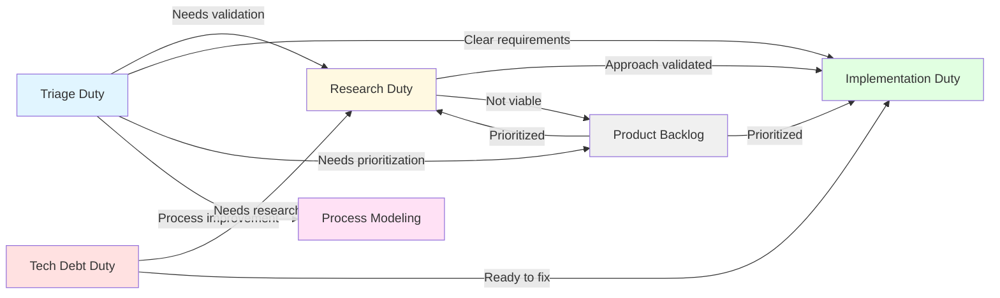

# Handover Procedure

**Purpose**: Transition work items between duties

**Layer**: 1 (Global Procedure)

**Used By**: All duties (Layer 2)

---

## Overview

Handovers occur when work completes in one duty and transitions to another. This procedure defines how to properly hand over work with complete context and clear requirements.

---

## Required Context

**⚠️ IMPORTANT**: Before using this procedure, understand:

- **[Semantic Language](../../docs/design/prompt-engineering/semantic-language.md)** - Definitions of semantic operations used below
- **[Kernel Layer](../kernel/README.md)** - Platform abstraction that implements semantic operations

**Semantic Operations Used**:
- `create_work_item(type, title, description, duty, ...)` - Create handover work item
- `assign_work_item_to_duty(work_item_id, duty)` - Change duty assignment
- `update_work_item(work_item_id, status, ...)` - Update work item
- `add_work_item_comment(work_item_id, text)` - Add handover comment
- `get_work_item_details(work_item_id)` - Get current work item info

**Work Item Fields**:
- `duty` - Current and target duty
- `status` - Work item status
- `description` - Handover context
- `title` - Handover work item title

---

## Common Handover Paths



---

## Procedure: Research → Implementation Handover

**Most common handover**: Research validates approach, implementation builds it

### Step 1: Complete Research Work

Before handing over:
- [ ] Research findings documented in `/research/[topic]/`
- [ ] Approach validated or invalidated
- [ ] Trade-offs analyzed
- [ ] Recommendation made
- [ ] Implementation requirements identified

### Step 2: Create Handover Document

Create handover document in research folder:

**Path**: `/research/[topic]/handover/implementation-handover.md`

**Template**:
```markdown
# Implementation Handover: [Feature Name]

**Research Issue**: #[research-issue-number]  
**Created**: [date]

## Research Summary

[2-3 paragraph summary of what was investigated and key findings]

## Recommended Approach

**Approach**: [Name of validated approach]

**Why**: [Brief rationale for this approach vs alternatives]

## Implementation Requirements

### Core Requirements
- [ ] Requirement 1
- [ ] Requirement 2
- [ ] Requirement 3

### Edge Cases to Handle
- [ ] Edge case 1
- [ ] Edge case 2

### Non-Functional Requirements
- [ ] Performance: [criteria]
- [ ] Security: [criteria]
- [ ] Maintainability: [criteria]

## Design Reference

[Link to design doc, ADR, or detailed analysis]

## Trade-offs & Constraints

**Accepted Trade-offs**:
- Trade-off 1: [description]
- Trade-off 2: [description]

**Constraints**:
- Constraint 1: [description]
- Constraint 2: [description]

## Testing Guidance

**Test Scenarios**:
1. Scenario 1: [description]
2. Scenario 2: [description]

**Performance Criteria**: [if applicable]

## Multi-Phase Assessment

**Recommendation**: [ ] Single-Phase  [x] Multi-Phase

**If Multi-Phase**:
- Phase 1: [name] - [deliverables]
- Phase 2: [name] - [deliverables]
- Phase 3: [name] - [deliverables]

## Open Questions

- [ ] Question 1 (if any)
- [ ] Question 2 (if any)

## References

- Research folder: `/research/[topic]/`
- Design doc: [link]
- Benchmarks: [link if applicable]
```

### Step 3: Create Implementation Work Item

```python
impl_work_item_id = create_work_item(
    type="implementation",
    title="Implement [Feature Name]",
    description=f"""
**Research Handover**: /research/[topic]/handover/implementation-handover.md

## Research Summary
[Brief summary from handover]

## Recommended Approach
[Approach name and brief why]

## Implementation Requirements
[Copy requirements from handover]

## Success Criteria
- [ ] All requirements implemented
- [ ] Edge cases handled
- [ ] Tests passing (see handover for test scenarios)
- [ ] Performance criteria met
- [ ] Documentation updated

## References
- Research: #{{research_issue_number}}
- Research folder: /research/[topic]/
- Handover doc: /research/[topic]/handover/implementation-handover.md
""",
    duty="implementation",
    labels=["from-research"]
)
```

### Step 4: Close Research Work Item

```python
# Add handover comment
add_work_item_comment(
    work_item_id=research_work_item_id,
    text=f"""
🔄 **Handover: research → implementation**

Research complete. Implementation work item created: #{impl_work_item_number}

**Handover Document**: /research/[topic]/handover/implementation-handover.md

**Recommendation**: {approach_name}

See handover document for complete requirements and implementation guidance.
"""
)

# Close research work item
update_work_item(
    work_item_id=research_work_item_id,
    status="closed"
)
```

---

## Procedure: Triage → Research Handover

**When**: Triage determines work needs validation before implementation

### Step 1: Complete Triage Assessment

- [ ] Work item assessed
- [ ] Research questions identified
- [ ] Scope boundaries defined

### Step 2: Create Research Work Item

```python
research_work_item_id = create_work_item(
    type="research",
    title="Investigate [Technology/Approach] for [Purpose]",
    description="""
**From Triage**: #{triage_issue_number}

## Research Goal
[What questions need answering]

## Context
[Why this research is needed]

## Success Criteria
- [ ] Approach validated or invalidated
- [ ] Trade-offs documented
- [ ] Recommendation made
- [ ] Implementation handover created (if approved)

## Scope
**In Scope**: [what to investigate]
**Out of Scope**: [what not to investigate]
""",
    duty="research",
    labels=["investigation"]
)
```

### Step 3: Close Triage Work Item

```python
add_work_item_comment(
    work_item_id=triage_work_item_id,
    text=f"""
🔄 **Handover: triage → research**

Triage complete. Requires validation before implementation.

Research work item created: #{research_work_item_number}
"""
)

update_work_item(
    work_item_id=triage_work_item_id,
    status="closed"
)
```

---

## Procedure: Triage → Implementation Handover

**When**: Triage determines requirements are clear, no research needed

### Step 1: Complete Triage Assessment

- [ ] Requirements clear
- [ ] No validation needed
- [ ] Ready for implementation

### Step 2: Create Implementation Work Item

```python
impl_work_item_id = create_work_item(
    type="implementation",
    title="Implement [Feature]",
    description="""
**From Triage**: #{triage_issue_number}

## Overview
[What needs to be implemented]

## Requirements
[Clear requirements from triage]

## Success Criteria
- [ ] Feature working as specified
- [ ] Tests passing
- [ ] Documentation updated
""",
    duty="implementation",
    labels=["feature"]
)
```

### Step 3: Close Triage Work Item

```python
add_work_item_comment(
    work_item_id=triage_work_item_id,
    text=f"""
🔄 **Handover: triage → implementation**

Triage complete. Requirements clear, ready for implementation.

Implementation work item created: #{impl_work_item_number}
"""
)

update_work_item(
    work_item_id=triage_work_item_id,
    status="closed"
)
```

---

## Procedure: Research → Product Backlog (Not Viable)

**When**: Research determines approach is not viable

### Step 1: Document Research Findings

- [ ] Why approach not viable
- [ ] What was learned
- [ ] Alternative approaches (if any)

### Step 2: Update Research Work Item

```python
add_work_item_comment(
    work_item_id=research_work_item_id,
    text="""
📋 **Research Complete: Approach Not Viable**

Research determined this approach is not viable.

**Findings**: /research/[topic]/

**Key Learnings**:
- [Learning 1]
- [Learning 2]

**Recommendation**: Archive for future reference, no implementation needed at this time.
"""
)

update_work_item(
    work_item_id=research_work_item_id,
    status="closed"
)
```

---

## Examples

### Example 1: Research → Implementation (Single-Phase)

```python
# Step 1: Create handover document
# (Created in /research/caching-strategy/handover/implementation-handover.md)

# Step 2: Create implementation work item
impl_id = create_work_item(
    type="implementation",
    title="Implement Redis caching for distributed pipelines",
    description="""
**Research Handover**: /research/caching-strategy/handover/implementation-handover.md

## Research Summary
Research evaluated Redis vs Memcached for distributed pipeline caching. Redis selected for better .NET integration and persistence options.

## Recommended Approach
Use StackExchange.Redis with IDistributedCache wrapper

## Implementation Requirements
- [ ] StackExchange.Redis integration
- [ ] IDistributedCache wrapper
- [ ] Pipeline builder configuration
- [ ] Unit tests
- [ ] Integration tests
- [ ] Documentation

## Success Criteria
- [ ] Distributed pipelines can share state via Redis
- [ ] Tests passing
- [ ] Performance <10ms per cache operation
- [ ] Documentation complete

## References
- Research: #456
- Handover: /research/caching-strategy/handover/implementation-handover.md
""",
    duty="implementation",
    labels=["feature", "distributed"]
)

# Step 3: Close research work item
add_work_item_comment(
    work_item_id="456",
    text=f"""
🔄 **Handover: research → implementation**

Research complete. Redis selected for distributed caching.

Implementation work item: #{impl_number}
Handover: /research/caching-strategy/handover/implementation-handover.md

Recommended approach: StackExchange.Redis with IDistributedCache wrapper
"""
)

update_work_item(work_item_id="456", status="closed")
```

### Example 2: Research → Implementation (Multi-Phase)

```python
# Create parent for multi-phase implementation
parent_id = create_work_item(
    type="plan",
    title="Implement Distributed Caching System",
    description="""
**Research Handover**: /research/caching-strategy/handover/implementation-handover.md

## Multi-Phase Plan
- [ ] Phase 1: Core Redis Integration
- [ ] Phase 2: Cache Invalidation
- [ ] Phase 3: Performance Optimization

[Phase details from handover]
""",
    duty="product-backlog"
)

# Create Phase 1
phase1_id = create_child_work_item(
    parent_id=parent_id,
    type="implementation",
    title="[Phase 1] Distributed Caching - Core Redis Integration",
    description="[Phase 1 requirements from handover]",
    duty="implementation"
)

# Close research
add_work_item_comment(
    work_item_id="456",
    text=f"""
🔄 **Handover: research → implementation (multi-phase)**

Research complete. Multi-phase implementation plan created.

Parent: #{parent_number}
Phase 1: #{phase1_number}

Handover: /research/caching-strategy/handover/implementation-handover.md
"""
)

update_work_item(work_item_id="456", status="closed")
```

---

## Edge Cases

### Case 1: Handover Information Incomplete

**Scenario**: Research handover missing critical information

**Resolution**:
1. Implementation duty should create comment requesting clarification
2. Reopen research work item or create new research work item
3. Don't proceed with incomplete information

### Case 2: Implementation Discovers Research Invalid

**Scenario**: During implementation, discover research approach won't work

**Resolution**:
1. Document specific issue discovered
2. Create new research work item to investigate alternative
3. Update original research work item with findings
4. Don't continue with known-bad approach

### Case 3: Multiple Handovers from Single Research

**Scenario**: Research validates multiple independent implementations

**Resolution**:
1. Create separate implementation work items for each
2. Link all to same research work item
3. Each implementation work item references handover

---

## Anti-Patterns

### ❌ Don't: Handover Without Proper Documentation

```python
# Wrong - no handover document
impl_id = create_work_item(
    type="implementation",
    title="Implement feature X",
    description="Research said to do it",  # Too vague
    duty="implementation"
)
```

✅ **Correct**: Create complete handover document with requirements

### ❌ Don't: Leave Source Work Item Open

```python
# Wrong - research work item left open after handover
create_work_item(...)  # Implementation work item created
# Research work item NOT closed - WRONG
```

✅ **Correct**: Close source work item after successful handover

### ❌ Don't: Reassign Instead of Handover

```python
# Wrong - changing duty of existing work item
assign_work_item_to_duty(
    work_item_id=research_work_item_id,
    duty="implementation"  # WRONG - this is research work, not implementation
)
```

✅ **Correct**: Create NEW work item for target duty, close source work item

### ❌ Don't: Use Platform-Specific Code

```python
# Wrong - using GitHub-specific API
issue_write(  # ❌ Don't use platform-specific operations
    method="create",
    labels=["workflow:implementation", "from-research"]  # ❌ Don't use platform-specific labels
)
```

✅ **Correct**: Use semantic operations

---

## Success Criteria

- [ ] Handover document created (if research → implementation)
- [ ] Target work item created with complete context
- [ ] Requirements clearly specified
- [ ] Source work item closed
- [ ] Handover comment added to source work item
- [ ] Links between work items established
- [ ] Semantic operations used exclusively

---

## Related Procedures

- [Work Item Creation](work-item-creation.md) - Creating handover work items
- [Multi-Phase Work Items](multi-phase-work-items.md) - Multi-phase handovers
- [Duty Assignment](duty-assignment.md) - Correct duty for target work item
- [Comment Patterns](comment-patterns.md) - Standard handover comments

---

## Testing

**Test Scenarios**: `.team/procedures/tests/handover/`

**Key Scenarios**:
1. Research → Implementation (single-phase)
2. Research → Implementation (multi-phase)
3. Triage → Research
4. Triage → Implementation
5. Research → Backlog (not viable)
