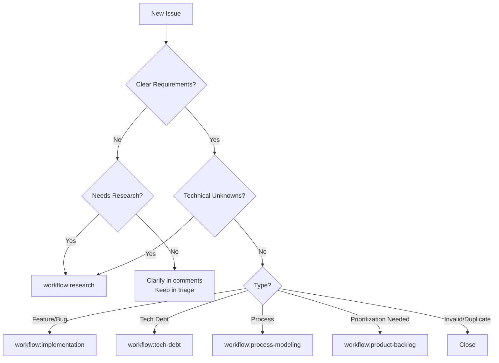
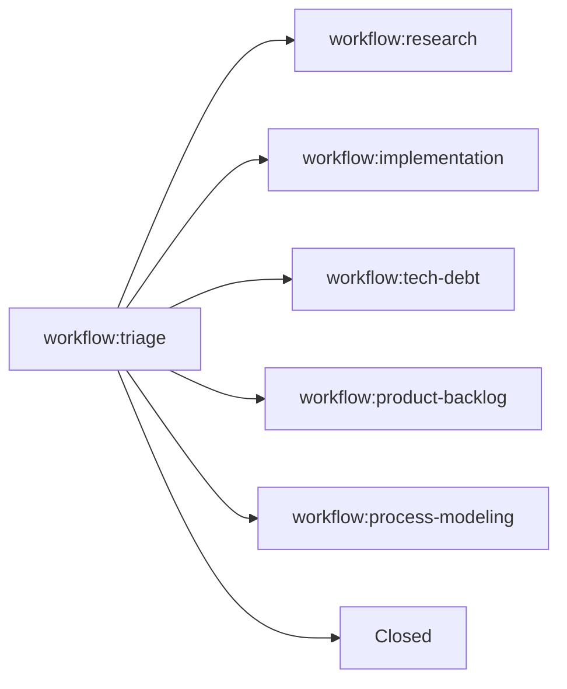

# Triage Workflow

This workflow guides the initial assessment of new issues and designation to appropriate workflows.

---

## Overview

**Purpose**: Assess new issues and designate them to the appropriate workflow (research, implementation, tech debt, product prioritization, or process modeling).

**Entry Point**: Issues automatically labeled with `workflow:triage` when created.

**Typical Duration**: 5-15 minutes per issue

---

## Quick Start

1. Query issues in triage queue
2. Read and assess each issue
3. Determine appropriate workflow
4. Handover to designated workflow with comment

---

## Step 1: Query Triage Queue

**For Copilot Agents** (use MCP tools):

```python
list_issues(
    owner="uniun-technology",
    repo="lib-dataflow",
    labels=["workflow:triage"],
    state="OPEN"
)
```

**For Manual/CI Use** (GitHub CLI):

```bash
gh issue list \
  --label "workflow:triage" \
  --state open \
  --json number,title,url,createdAt
```

---

## Step 2: Assessment Criteria

For each issue, assess the following:

### Issue Type

**Bug Report**:
- Is this a defect in existing functionality?
- Is the bug reproducible?
- What is the severity/priority?

**Feature Request**:
- Is this a new feature or enhancement?
- Is the requirement clear?
- Is research needed to validate feasibility?

**Research Question**:
- Does this need investigation or prototyping?
- Are there unknown unknowns?

**Tech Debt**:
- Does this address code quality, maintainability, or architecture?
- Is this a refactoring or cleanup task?

**Process Improvement**:
- Does this relate to workflows, tooling, or team processes?
- Is this a meta-issue about how we work?

### Clarity & Scope

- [ ] Requirements are clear and specific
- [ ] Scope is well-defined
- [ ] Success criteria are stated
- [ ] No significant unknowns

### Complexity Assessment

**Low**: Simple change, clear path forward → `workflow:implementation`
**Medium**: Some unknowns, may need design → `workflow:research` or `workflow:implementation`
**High**: Significant unknowns, needs validation → `workflow:research`

---

## Step 3: Workflow Designation

Based on assessment, designate to appropriate workflow:

### → Research Workflow

**When to use**:
- Significant unknowns or technical uncertainty
- Needs prototyping or proof-of-concept
- Multiple approaches need evaluation
- Feasibility needs validation

**Example handover**:
```bash
gh issue edit $ISSUE \
  --remove-label "workflow:triage" \
  --add-label "workflow:research"

gh issue comment $ISSUE --body "🔍 **Triage → Research**

This issue requires research to validate feasibility and approach.

**Research Questions**:
- [Question 1]
- [Question 2]

See \`.team/prompts/RESEARCH_WORKFLOW.md\` for research process."
```

---

### → Implementation Workflow

**When to use**:
- Requirements are clear and specific
- No significant technical unknowns
- Straightforward bug fix or enhancement
- Design is already validated

**Example handover**:
```bash
gh issue edit $ISSUE \
  --remove-label "workflow:triage" \
  --add-label "workflow:implementation"

gh issue comment $ISSUE --body "⚙️ **Triage → Implementation**

Requirements are clear. Ready for implementation.

**Summary**: [Brief description]

See \`.team/prompts/IMPLEMENTATION_WORKFLOW.md\` for implementation process."
```

---

### → Tech Debt Workflow

**When to use**:
- Code quality or maintainability issue
- Refactoring or cleanup needed
- Architecture improvement
- Test coverage gap

**Example handover**:
```bash
gh issue edit $ISSUE \
  --remove-label "workflow:triage" \
  --add-label "workflow:tech-debt"

gh issue comment $ISSUE --body "🔧 **Triage → Tech Debt**

This is a technical debt item requiring analysis and prioritization.

**Debt Category**: [Code Quality / Architecture / Testing / Documentation]

See \`.team/prompts/TECH_DEBT_WORKFLOW.md\` for tech debt process."
```

---

### → Product Prioritization Workflow

**When to use**:
- Multiple competing priorities
- Needs business value assessment
- Resource allocation decision needed
- Part of larger backlog needing prioritization

**Example handover**:
```bash
gh issue edit $ISSUE \
  --remove-label "workflow:triage" \
  --add-label "workflow:product-backlog"

gh issue comment $ISSUE --body "📊 **Triage → Product Prioritization**

This item needs prioritization against other backlog items.

**Context**: [Business context or dependency info]

See \`.team/prompts/PRODUCT_PRIORITIZATION_WORKFLOW.md\` for prioritization process."
```

---

### → Process Modeling Workflow

**When to use**:
- Workflow or process improvement
- Tooling enhancement
- Team process optimization
- Meta-issue about how we work

**Example handover**:
```bash
gh issue edit $ISSUE \
  --remove-label "workflow:triage" \
  --add-label "workflow:process-modeling"

gh issue comment $ISSUE --body "📋 **Triage → Process Modeling**

This is a process improvement item.

**Area**: [Workflow / Tooling / Documentation / Other]

See \`.team/prompts/PROCESS_MODELING_WORKFLOW.md\` for process modeling workflow."
```

---

### → Close Issue

**When to close**:
- Duplicate of existing issue
- Invalid or not reproducible
- Out of scope
- Won't fix

**Example close**:
```bash
gh issue close $ISSUE --comment "❌ **Closing Issue**

**Reason**: [Duplicate of #123 / Invalid / Out of Scope / Won't Fix]

[Additional context if needed]"
```

---

## Step 4: Handover Methods

**For Copilot Agents** (use MCP tools):

```python
# Update workflow label
issue_write(
    method="update",
    owner="uniun-technology",
    repo="lib-dataflow",
    issue_number=ISSUE_NUMBER,
    labels=["workflow:TARGET_WORKFLOW"]
)

# Add handover comment
add_issue_comment(
    owner="uniun-technology",
    repo="lib-dataflow",
    issue_number=ISSUE_NUMBER,
    body="🔄 Triage → [Target Workflow]\n\nReason for handover"
)
```

**For Manual Use** (GitHub CLI):

Use the examples shown in Step 3 above, or:

```bash
gh issue edit ISSUE_NUMBER --remove-label "workflow:triage" --add-label "workflow:TARGET_WORKFLOW"
gh issue comment ISSUE_NUMBER --body "🔄 Triage → [Target Workflow]\n\nReason for handover"
```

**Example**:
```bash
gh issue edit 123 --remove-label "workflow:triage" --add-label "workflow:research"
gh issue comment 123 --body "🔄 Triage → Research\n\nNeeds validation of approach before implementation"
```

---

## Common Patterns

### Feature Request with Unknowns

```
Issue: "Add support for X feature"
Assessment: Unclear if X is feasible with current architecture
Designation: workflow:research
Reason: "Need to validate if X is compatible with pull-based architecture"
```

### Clear Bug Report

```
Issue: "NullReferenceException in BatchBlock when maxBatchSize=0"
Assessment: Reproducible bug, clear fix needed
Designation: workflow:implementation
Reason: "Clear bug with known fix location"
```

### Code Quality Issue

```
Issue: "Refactor ActorPool to use modern C# patterns"
Assessment: Tech debt, code cleanup
Designation: workflow:tech-debt
Reason: "Refactoring task to improve maintainability"
```

### Competing Priorities

```
Issue: "Add feature Y" (one of many feature requests)
Assessment: Valid feature but needs prioritization
Designation: workflow:product-backlog
Reason: "Valid feature request needing business value assessment"
```

---

## Decision Tree



---

## Best Practices

### Do:
- ✅ Read the full issue context before designating
- ✅ Ask clarifying questions if requirements are unclear
- ✅ Provide clear reasoning in handover comment
- ✅ Link to relevant documentation or similar issues
- ✅ Assess urgency and add priority labels if needed

### Don't:
- ❌ Rush to designate without understanding context
- ❌ Send unclear issues to implementation
- ❌ Overthink simple issues (bugs usually go to implementation)
- ❌ Skip the handover comment (audit trail is important)

---

## Edge Cases

### Issue Needs Clarification

If issue is unclear:
1. Add comment requesting clarification
2. Keep in `workflow:triage`
3. Wait for response
4. Re-assess after clarification

```bash
gh issue comment $ISSUE --body "❓ **Clarification Needed**

To properly triage this issue, please provide:
- [Specific information needed]

Keeping in triage until clarified."
```

### Multiple Workflows Applicable

If issue could go to multiple workflows:
1. Choose the **first** necessary workflow
2. Note in handover that additional workflows may follow
3. Trust the workflow to hand over appropriately

**Example**: Research → Implementation → Tech Debt (if research reveals debt)

### Issue Already in Progress

If someone is already working on it:
1. Verify they're following the appropriate workflow
2. Update label to match current workflow
3. Add comment noting the correction

---

## Monitoring

### View Triage Queue Status

```bash
./.github/scripts/workflow/workflow-dashboard.sh
```

### Find Stale Triage Issues

```bash
gh issue list \
  --label "workflow:triage" \
  --state open \
  --json number,title,createdAt \
  --jq '.[] | select(.createdAt | fromdateiso8601 < (now - 604800)) | "Issue #\(.number) (>7 days old): \(.title)"'
```

---

## Success Metrics

**Good Triage**:
- Issues move to appropriate workflow within 24 hours
- Clear handover comments with reasoning
- Low rate of re-triage (issue sent to wrong workflow)
- Minimal back-and-forth for clarification

**Poor Triage**:
- Issues sit in triage for days
- Issues frequently re-triaged
- Handover comments lack context
- Implementation gets unclear issues

---

## Integration with Other Workflows

### From Triage



### To Triage (Re-triage)

Any workflow can send an issue back to triage if:
- Requirements change significantly
- Initial assessment was incorrect
- Issue needs re-evaluation

---

## References

- **Integration Patterns**: `/research/workflow-topology-design/design/integration-patterns.md`
- **Workflow Topology ADR**: `.team/adr/2025-11-09-workflow-state-storage.md`
- **Research Findings**: `/research/workflow-topology-design/README.md`
- **Helper Scripts**: `/research/workflow-topology-design/handover/prototype/`

---

## Quick Reference

**Query triage queue** (Copilot agents):
```python
list_issues(owner="uniun-technology", repo="lib-dataflow", labels=["workflow:triage"], state="OPEN")
```

**Query triage queue** (manual):
```bash
gh issue list --label "workflow:triage" --state open
```

**Handover to research** (Copilot agents):
```python
issue_write(method="update", owner="uniun-technology", repo="lib-dataflow", issue_number=ISSUE, labels=["workflow:research"])
add_issue_comment(owner="uniun-technology", repo="lib-dataflow", issue_number=ISSUE, body="🔄 Triage → Research\n\nReason")
```

**Handover to research** (manual):
```bash
gh issue edit ISSUE --remove-label "workflow:triage" --add-label "workflow:research"
gh issue comment ISSUE --body "🔄 Triage → Research\n\nReason"
```

**Handover to implementation** (Copilot agents):
```python
issue_write(method="update", owner="uniun-technology", repo="lib-dataflow", issue_number=ISSUE, labels=["workflow:implementation"])
add_issue_comment(owner="uniun-technology", repo="lib-dataflow", issue_number=ISSUE, body="🔄 Triage → Implementation\n\nReason")
```

**Handover to implementation** (manual):
```bash
gh issue edit ISSUE --remove-label "workflow:triage" --add-label "workflow:implementation"
gh issue comment ISSUE --body "🔄 Triage → Implementation\n\nReason"
```
