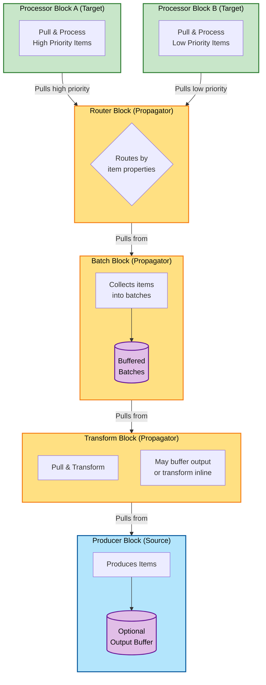

## DataFlow Library

A high-performance, pull-based data processing pipeline library built on modern .NET features. This library provides a fluent API for building concurrent data processing pipelines using `System.Threading.Channels`, offering great performance and backpressure handling.

## Key Features

- 🔄 **Pull-based Architecture** - Built on `System.Threading.Channels` for efficient backpressure handling
- 🧱 **Modular Block System** - Compose pipelines from reusable blocks (Producer, Batch, Transform, Route, Process)
- 💉 **First-class DI Support** - Full dependency injection support with proper scope management
- 🔧 **Fluent Configuration** - Builder API for constructing pipelines
- 📊 **Concurrency Control** - Fine-grained control over parallel processing (max concurrency settings)
- 🎯 **Type Safety** - Strong typing throughout the pipeline

- ## Architecture Overview

The following shows an example DataFlow constructed with this library, illustrating the **pull-based architecture** where downstream blocks pull data from upstream blocks.



**Key Concepts:**
- **Pull-Based Flow**: Downstream blocks pull data using `GetAsyncEnumerable()` - arrows show the pull direction
- **Natural Backpressure**: If a downstream block is slow, upstream blocks automatically slow down
- **Optional Buffering**: Blocks may buffer output (like Producer, Batch) or transform inline (like InlineTransform)
- **Routing**: Router blocks can split flows based on item properties to different downstream processors

## How It Works
The DataFlow library enables you to build efficient data processing pipelines by connecting specialized blocks. Each block acts as either a source of data for the next block, or a terminal block that only processes the data without passing it on.

- Source Blocks (e.g., Producer, InputChannel) supply data to the flow, outputting it to their buffer. If their buffer is full, they asynchronously wait for space to become available when writing to their buffer, accommodating backpressure.
- Propagator Blocks (e.g., Batch, Transform) **pull data from upstream blocks**, process it, and write results to their own output buffer for downstream blocks to pull from.
- Target Blocks (e.g., Processor, Output) **pull and process data from upstream blocks** - they are the terminal blocks in the flow and do not pass data on.

**Pull-Based Architecture**: Downstream blocks pull data from upstream blocks using `GetAsyncEnumerable()`. This provides natural backpressure - if a downstream block is processing slowly, upstream blocks automatically slow down because their output buffers fill up.

## Quick Start

1. Install the package:

```
dotnet add package Uniun.DataFlow
```

2. Define a class that implements `IDataFlowConfiguration` and use it to define your data flow.

```csharp
public class NumberProcessingFlowConfig : IDataFlowConfiguration
{
    public void Configure(DataFlowBuilder builder)
    {
        builder
            .AddProducer<int>("source", sp => new NumberProducer())
            .AddBatch<int>("batcher", 
                maxBatchSize: 100,            
                windowPeriod: TimeSpan.FromSeconds(5))
            .ReceiveFrom("source")
            .AddProcessor<int[], DatabaseWriter>("writer")
            .ReceiveFrom("batcher");
    }
}
```

3. Add the data flow to the services collection in `Startup.cs`.
```csharp
services.AddDataFlows(maxConcurrentFlows: 4); // called once to configure global options
services.AddDataFlow<NumberProcessingFlowConfig>(); // called to register each particular data flow you have
```

4. Run the data flow.
```csharp   
var executor = serviceProvider.GetRequiredService<FlowExecutor<NumberProcessingFlowConfig>>();
await executor.ExecuteAsync(context);

```

## What about TPL Dataflow?
While TPL Dataflow is a mature library, this implementation offers several advantages:

- Built on modern `System.Threading.Channels`.
- Fluent builder for constructing data flows (TPL DataFlow doesn't have one).
- Uses a pull based model for simplfied backpressure handling, overall a simpler model than TPL in many ways.
- First-class DI support with proper scope management (don't underestimate this).
  - TPL DataFlow is very awkward to try and use with depencencies it predates the modern DI system in .NET.
  - This library adopts an "Actor" based model where each block can initiate a new scope for its `Actor` to run in, allowing for scoped depencencies to be used by actors, and allowing them to run concurrently without interfering with each other.
    - For example, a Transform block can have multiple concurrent `ITransformer<TIn, TOut>` implementations running concurrently, each in their own scope. You can scale the number of concurrent transformers to tune throughput, with max concurrency settings to throttle things.
- Better structured for typical ETL and data processing scenarios
  - TPL Offers a lot of flexibility, but can be overkill for simple ETL scenarios. For example it offers a synchronous API for posting data to a block, which will fail immediately when buffers are full - which is not really appropriate for most ETL scenarios, but is more applicable for real-time stock trading scenarios. This library is more focused on reliable and efficient processing of data volumes ETL / data processing scenarios.
- Simpler concurrency model focused on async/await patterns throughout.
- Metrics out of the box.


### Performance Comparison with Microsoft TPL DataFlow

We have conducted some simple and early benchmarks, comparing **Uniun DataFlow** against **Microsoft TPL DataFlow** using **BenchmarkDotNet**. 
The test involved a minimal pipeline with a **source block feeding data to a processor block**, measuring the time taken to process a fixed number of items asynchronously over many iterations.

#### **Results**
| Method                   | Mean Time | StdDev  | Ratio |
|------------------------- |---------:|--------:|------:|
| **TPL_DataFlow_BufferBlock** | **9.100 ms** | 0.1879 ms | **1.00x** |
| **Uniun_DataFlow_Minimal**   | **9.974 ms** | 0.1779 ms | **1.10x** |

#### **Analysis**
- Uniun DataFlow performs **within ~10% of TPL DataFlow**, despite having additional features such as **fluent builder, dependency injection, structured flow management, and monitoring**.
- `InputChannelBlock` plus a `Processor` block is very close to TPL's `BufferBlock` plus an `ActionBlock` for example, despite the fact that this library adds features.

These early results confirm that **Uniun DataFlow maintains high performance while offering a more structured and modern API, and application level features like DI, actors, and metrics, out of the box**.

#### **Next Steps**
Further benchmarks for various scenarios will continue to be added.


## Specific Block Implementations

| Block Name        |  Is Source         | Is Target | Description                                                                                                                                                                                                                                                                       |
|-------------------|------------------------------|-----------|-----------------------------------------------------------------------------------------------------------------------------------------------------------------------------------------------------------------------------------------------------------------------------------|
| InputChannelBlock | Yes | No        | Allows you to directly supply input data into the flow, by acting as a source block over which you can supply data by writing to its ChannelWriter<T>. Data is then bufferred in the channel, for downstream target blocks to consume.                                            | 
| ProducerBlock     | Yes | No        | A source block that allows you to supply data via  `IProducer<T>` dependencies. You can supply an enumerable of these and they will be executed concurrently honouring max concurrency settings.                                                                                  |
| ProcessorBlock    | No | Yes       | Perform some processing on each item received. No data is propogated onwards.                                                                                                                                                                                                     |
| TransformBlock    | Yes | Yes       | Allows you to adapt the source / input stream to a new output stream utilising `IStreamTransformer<TIn, TOut>` with concurrency options. Can spawn multiple concurrent transformer actors for CPU-intensive work. |
| InlineTransformBlock | Yes | Yes    | Lightweight inline transformation with zero output buffering. Work happens inline during downstream enumeration. Best for simple 1-to-1 transforms. |
| BatchBlock        | Yes | Yes       | Collects incoming items into batches based on max batch size and/or time window criteria. Emits batches as arrays when either the max batch size is reached or the time window elapses. Useful for optimizing downstream processing efficiency. |
| RateLimitBlock    | Yes | Yes       | Propagator block that rate-limits the flow of items using a token bucket algorithm. Controls throughput to prevent overwhelming downstream systems. |
| PersistentRoutingBlock | No | Yes  | Routes items to dynamically created target data flows based on routing keys. Manages persistent routes with automatic cleanup. |
| OutputBlock       | No | Yes       | A terminal block that allows the application to receive the output of the data flow (each item) via a supplied `Func<T>`. Similar to a Processor Block but does not require implementing an `IProcessor`.    |


### Producer Block (Source Block)

Producer blocks:-
- are source blocks that supply data into the dataflow.
- depends on you supplying one or many `IProducer<T>` to supply the data items. Each producer will be called in parallel with the others (honouring block max parallism) but a single producer will be called serially.
- Implements `ISourceBlock<T>` interface so that downstream blocks can be linked to it.

### Input Channel Block (Source Block)

- can be used to supply data into the flow via a `ChannelWriter<T>` which your application holds a reference to and writes items to as needed.
- Implements `ISourceBlock<T>` interface so that downstream blocks can be linked to it.

## Transform Block

Transform blocks:-
- are propagator blocks that allow:-
  - adapting the input stream into an output stream of a different type
  - outputting 0, 1 or many items - e.g you could optionally filter data or change the cardinality.
- **pull items from upstream** source blocks via GetAsyncEnumerable()
- activate concurrent `IStreamTransformer<TIn, TOut>` actors to transform items in parallel
- write transformed results to an output channel buffer (default capacity: 100)
- Important Notes
  - To preserve order, you should use a single `IStreamTransformer<TIn, TOut>` (MaxConcurrency=1). If you use multiple concurrent transformers, they are competing consumers, and their results will be interleaved in the output channel - potentially losing the original order. Therefore only add concurrent transformers where:
     - You don't need to preserve order of the stream.
     - Your transformation logic is expensive and expected to not "keep pace" with the input stream - in other words you want to add concurrent transformers to alleviate backpressure.

### Processor Block

Processor blocks:-
- are terminal blocks in the data flow, used to process items that do not flow onwards.
- **pull items from upstream** source blocks via GetAsyncEnumerable()
- activate (using DI scope) a specified number of concurrent `IStreamProcessor<T>` actors to process received items concurrently.
- Implements `ITargetBlock<T>` interface so that items can be passed to it in the flow.

### Batch Block

Batch blocks:-
- are propagator blocks that group incoming items into batches based on specified criteria
- emit batches as arrays when either:
  - The maximum batch size is reached
  - The specified time window period has elapsed since the first item in the current batch 
  - The source completes (any remaining items are flushed as a final batch)
- process items serially to maintain order
- uses an efficient object pool for managing batch collections with zero locking.
- implements IPropagatorBlock<TIn, TIn[]> interface
- particularly useful for:
  - Optimizing downstream processing by reducing the number of operations
  - Controlling throughput and resource usage
  - Accumulating items for bulk operations like database writes

Key features:
- Configurable maximum batch size - controls how many items can accumulate before a batch is emitted
- Configurable window period - ensures batches are emitted even if max size isn't reached, important when a fixed batch size isn't guaranteed otherwise it would wait indefinitely for a complete batch.
- Automatic handling of partial batches when source completes
- Thread-safe batch accumulation and emission that doesn't use locking
- Memory-efficient batch collection management using object pooling
- Proper handling of cancellation and errors
- Ordered processing of items to maintain sequence

Example usage for batching database writes:
```csharp
builder.AddProducer<string>("source", sp => new ItemProducer())
    .AddBatch<string>("batcher", 
        maxBatchSize: 100,            // Emit batches when 100 items accumulated  
        windowPeriod: TimeSpan.FromSeconds(5))  // Or after 5 seconds
    .ReceiveFrom("source")
    .AddProcessor<string[], DatabaseBatchWriter>()
    .ReceiveFrom("batcher");

## Walkthrough - Building a Data Flow

1. Define a class that implements `IDataFlowConfiguration` interface and use this to define your data flow.

```csharp
  private class NumberProcessingFlowConfig : IDataFlowConfiguration
    {
        public void Configure(DataFlowBuilder builder)
        {
            // add blocks for standard ETL flow
            builder
                   .AddProducer<int, NumberProducer>("source")
                   .AddTransform<int, string, NumberToStringTransformer>("transform")
                    .ReceiveFrom("source") // connects the block
                   .AddProcessor<string, NumberProcessor>("processor")
                    .ReceiveFrom("transform"); // connects the block
        }
    }
```