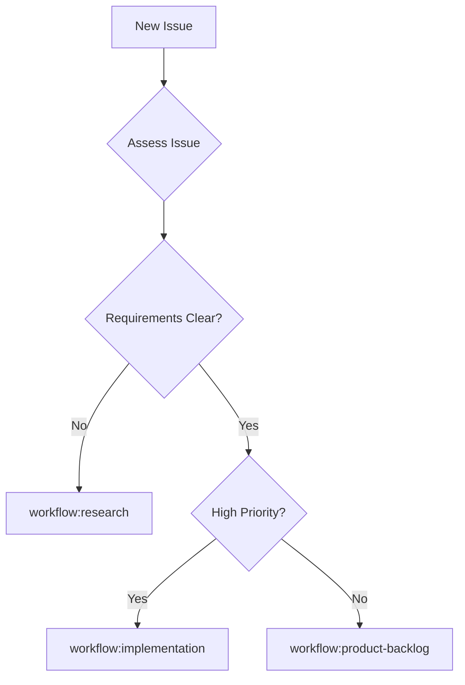

# Recommendation: Triage Process Modeling for Workflow Designation

**Date**: 2025-11-10
**Context**: Issue comment requesting triage process modeling to designate issues into appropriate workflow input queues
**Related PR**: Tidy up after workflow migration to github issues

## User Request

> @copilot can we work on a triage process modeling improvement for this, so we can designate issues into the appropriate workflow input queue?

## Current State

### Existing Triage Workflow
Location: `.team/prompts/TRIAGE_WORKFLOW.md`

**Current Capabilities:**
- Assesses new issues for workflow assignment
- Evaluates complexity, risk, and requirements clarity
- Routes to one of 6 workflows:
  - `workflow:research` - Needs approach validation
  - `workflow:implementation` - Ready for implementation
  - `workflow:tech-debt` - Technical debt analysis
  - `workflow:product-backlog` - Needs prioritization
  - `workflow:process-modeling` - Workflow improvements

**Current Process** (502 lines of guidance):
1. Read issue completely
2. Assess characteristics (complexity, unknowns, scope)
3. Apply decision tree for workflow selection
4. Update issue with appropriate `workflow:*` label
5. Add handover comment with routing rationale

### Workflow Topology System
Location: `.github/docs/WORKFLOW_TOPOLOGY_GUIDE.md`

**Provides:**
- Formal workflow queue system using GitHub issues
- Label-based workflow designation
- MCP tools for Copilot agents to query and hand over
- Entry/exit criteria for each workflow
- Handover patterns between workflows

## Gap Analysis

### What Works Well
✅ Triage workflow exists with comprehensive guidance (502 lines)
✅ Decision tree for workflow selection is documented
✅ Label-based system (`workflow:*`) provides clear queue mechanism
✅ MCP tools support programmatic workflow designation
✅ Issue templates guide users to self-triage when creating issues

### Potential Improvements

#### 1. **Triage Decision Tree Visualization**
**Current**: Text-based decision logic in TRIAGE_WORKFLOW.md
**Improvement**: Add Mermaid flowchart for visual decision tree

**Example:**


#### 2. **Triage Automation Hints**
**Current**: Manual triage by Copilot or team member
**Improvement**: Add guidance for future automation
- Issue title patterns → suggested workflow
- Issue template used → default workflow
- Label combinations → triage hints

#### 3. **Triage Quality Metrics**
**Current**: No metrics on triage accuracy
**Improvement**: Track triage outcomes
- How often issues get re-triaged?
- What percentage go to correct workflow first time?
- Which workflows have unclear entry criteria?

#### 4. **Self-Service Triage Guidance**
**Current**: Issue templates have basic workflow hints
**Improvement**: Enhanced issue template guidance
- Quick assessment checklist in template
- "Not sure which workflow?" help section
- Link to decision tree visualization

## Recommended Approach

### Option A: Process Modeling Improvement (Recommended)

**Create a process modeling issue** to enhance the triage workflow:

**Title**: Process Modeling: Enhance Triage Workflow Decision Process

**Scope:**
1. Add visual decision tree (Mermaid diagram) to TRIAGE_WORKFLOW.md
2. Enhance issue templates with self-triage guidance
3. Document common triage patterns and edge cases
4. Add triage quality metrics framework (for future tracking)
5. Create triage decision examples (5-10 scenarios)

**Deliverables:**
- Updated TRIAGE_WORKFLOW.md with visual decision tree
- Updated issue templates with enhanced guidance
- New document: `.team/prompts/TRIAGE_EXAMPLES.md`
- New section in TRIAGE_WORKFLOW.md: "Common Patterns"
- ADR documenting triage decision criteria

**Why this approach:**
- Uses existing Process Modeling workflow
- Improves documentation quality
- Doesn't require code changes
- Can be done incrementally
- Provides immediate value

### Option B: Workflow Improvement Research

**Create a research issue** to validate automation approaches:

**Title**: Research: Automated Triage Assistance

**Scope:**
1. Research GitHub Actions for auto-labeling
2. Explore issue classification patterns
3. Validate ML-based triage assistance tools
4. Benchmark manual vs assisted triage

**Deliverables:**
- Research findings on automation tools
- Cost-benefit analysis of automation
- Implementation plan if validated
- Prototype if approach is viable

**Why this approach:**
- Addresses long-term scalability
- Could reduce manual triage burden
- Requires research to validate ROI
- Higher effort, higher potential payoff

### Option C: Quick Win - Visual Decision Tree Only

**Create a simple update** to add visual decision tree:

**Scope:**
1. Create Mermaid flowchart decision tree
2. Add to TRIAGE_WORKFLOW.md
3. Reference from issue templates

**Deliverables:**
- Visual decision tree diagram
- Updated documentation

**Why this approach:**
- Smallest scope, fastest delivery
- Immediate usability improvement
- No research or process modeling needed
- Can be done in single PR

## Recommendation

**Start with Option A (Process Modeling Improvement)**

**Rationale:**
1. **Fits existing workflows**: Uses Process Modeling workflow as intended
2. **Addresses the request**: Improves triage process for workflow designation
3. **Incremental improvement**: Enhances what already works well
4. **Low risk**: Documentation-only changes
5. **High value**: Better decision support for triage
6. **Foundation for future**: Creates framework for metrics and automation later

**Next Steps:**
1. Create process modeling issue using `.github/ISSUE_TEMPLATE/workflow-improvements.md`
2. Assign to `workflow:process-modeling` queue
3. Scope includes:
   - Visual decision tree
   - Enhanced self-triage guidance
   - Common pattern documentation
   - Example scenarios
   - Triage quality framework

**Later Consideration:**
- After Option A is complete, evaluate Option B (automation) based on:
  - Volume of issues requiring triage
  - Re-triage frequency (quality metric)
  - Team bandwidth for manual triage

## Draft Issue: Process Modeling for Triage Enhancement

```markdown
---
name: Workflow Improvement
about: Improve workflow processes and documentation
title: '[Process Modeling] Enhance Triage Workflow Decision Process'
labels: ['workflow:process-modeling']
assignees: ''
---

## Improvement Context

**This is a process modeling issue.** @copilot Follow `.team/prompts/PROCESS_MODELING_WORKFLOW.md`.

### Target Workflow
**Workflow**: Triage (`.team/prompts/TRIAGE_WORKFLOW.md`)

### Problem Statement

The current triage workflow effectively routes issues to appropriate workflow queues, but the decision process could be enhanced with:

1. **Visual decision tree** - Currently text-only, hard to quickly reference
2. **Self-service guidance** - Users creating issues could benefit from triage hints
3. **Common patterns** - Document frequently seen scenarios
4. **Example scenarios** - Real-world triage decision examples
5. **Quality framework** - Foundation for tracking triage accuracy

**Current state**: Triage works well but decision logic is embedded in prose
**Desired state**: Visual, example-driven guidance that's easier to apply

### Proposed Improvements

1. **Visual Decision Tree**
   - Create Mermaid flowchart showing triage decision flow
   - Include all 6 workflows as possible outcomes
   - Show key decision points (clarity, priority, complexity, risk)

2. **Self-Service Triage Guidance**
   - Add "Which workflow?" guidance section to issue templates
   - Create quick assessment checklist
   - Link to visual decision tree

3. **Common Patterns Documentation**
   - Document 5-10 common triage scenarios
   - Include rationale for workflow selection
   - Cover edge cases (re-triage situations)

4. **Triage Quality Framework**
   - Define metrics for triage effectiveness
   - Document re-triage patterns
   - Create foundation for future analytics

5. **Example Scenarios**
   - Create `.team/prompts/TRIAGE_EXAMPLES.md`
   - Include 10 example issues with triage decisions
   - Cover all 6 target workflows
   - Explain decision rationale

### Success Criteria

- [ ] Visual decision tree added to TRIAGE_WORKFLOW.md
- [ ] Issue templates enhanced with triage guidance
- [ ] Common patterns section added to TRIAGE_WORKFLOW.md
- [ ] TRIAGE_EXAMPLES.md created with 10 scenarios
- [ ] Quality framework documented
- [ ] All new documentation follows Document Hygiene guidelines
- [ ] Mermaid diagrams used for visualization (not ASCII art)

### Related Documentation

- Current triage workflow: `.team/prompts/TRIAGE_WORKFLOW.md` (502 lines)
- Workflow topology: `.github/docs/WORKFLOW_TOPOLOGY_GUIDE.md`
- Document hygiene: `.team/DOCUMENT_HYGIENE.md`

### Expected Outcome

Enhanced triage process that:
- Is easier to apply (visual decision tree)
- Supports self-service (user guidance)
- Documents common patterns (learning resource)
- Enables quality tracking (metrics framework)
- Maintains current effectiveness while improving usability
```

## Implementation Notes

If this recommendation is accepted:

1. **Use existing Process Modeling workflow** - Already designed for this type of improvement
2. **Follow document hygiene** - Use Mermaid diagrams, avoid duplication
3. **Reference don't duplicate** - Link to existing docs rather than copying
4. **Test scenarios** - Validate decision tree against real issues
5. **Incremental delivery** - Can be done in phases if needed

## Conclusion

The triage workflow is already functional and well-documented. The requested improvement fits perfectly into the Process Modeling workflow. 

**Recommended action**: Create a process modeling issue (draft provided above) to enhance the triage decision process with visual aids, examples, and better self-service guidance.

This addresses the user's request to "designate issues into the appropriate workflow input queue" by making the triage decision process clearer and more accessible.
