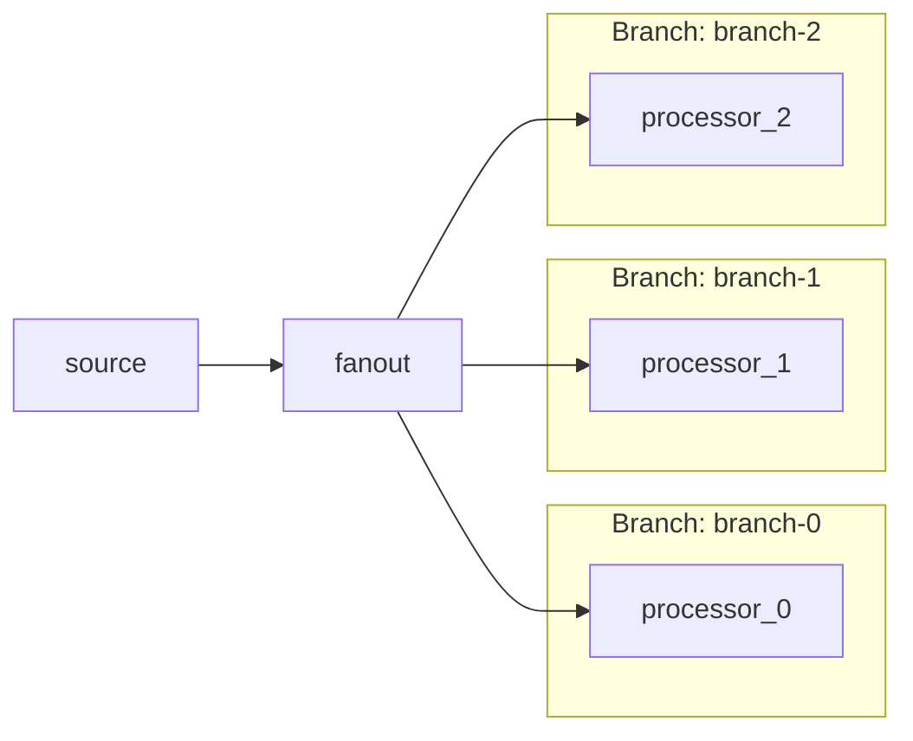
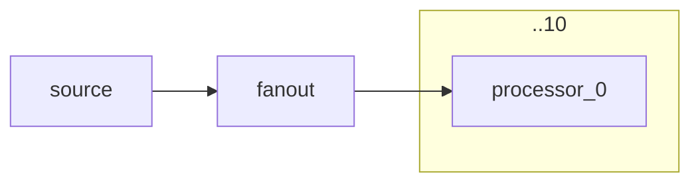

# Branch Builder Feature

This document explains the branch builder feature which allows you to create named branches in your DataFlow pipelines. Branches are particularly useful when combined with BroadcastBlock to create concurrent processing paths.

## What Are Branches?

Branches are named, independent paths in your DataFlow pipeline. Each branch:
- Has its own unique name (explicit or auto-generated)
- Maintains independent block chaining
- Can contain multiple blocks in sequence
- Is tracked in the graph with metadata

Branches enable you to create complex flow topologies where data can be processed through multiple parallel paths.

## Creating Branches

### Option 1: Explicit Branch Names

```csharp
for (int i = 0; i < 5; i++)
{
    var branch = builder.AddBranch($"processing-branch-{i}");
    branch.AddProcessor<int>($"processor-{i}", sp => new MyProcessor())
        .ReceiveFrom("fanout");
}
```

### Option 2: Auto-Generated Branch Names (Recommended)

```csharp
for (int i = 0; i < 5; i++)
{
    var branch = builder.AddBranch(); // Auto-generates: "FlowName-fanout-branch-0", etc.
    branch.AddProcessor<int>($"processor-{i}", sp => new MyProcessor())
        .ReceiveFrom("fanout");
}
```

When no branch name is provided, names are automatically generated using: `{flowName}-{currentBlock}-branch-{index}`

## Using Branches with BroadcastBlock

Branches work naturally with BroadcastBlock to create concurrent processing paths. When you broadcast to multiple branches, **each branch receives ALL items** (broadcast semantics).

### Basic Example: Broadcast to Multiple Branches

```csharp
var builder = new StructuredDataFlowBuilder(sp, "MyFlow");

// Source
builder.AddProducer<int>("source", sp => new MyProducer());

// Broadcast enables fanout
builder.AddBroadcast<int>("fanout")
    .ReceiveFrom("source");

// Create 5 concurrent branches
// Each branch receives ALL items from the broadcast
for (int i = 0; i < 5; i++)
{
    var branch = builder.AddBranch(); // Auto-generated names
    branch.AddProcessor<int>($"processor-{i}", sp => new MyProcessor())
        .ReceiveFrom("fanout");
}
```

### ⚠️ Important: Broadcast Semantics

When using BroadcastBlock with branches:
- **Each branch receives ALL items** (data replication)
- 10 items → 5 branches = **50 total operations** (10 per branch)
- This is **not** load distribution - it's broadcast/fanout

**Example use cases:**
- Send invoice to: validator + archiver + notifier (different logic per branch)
- Process data through multiple independent pipelines simultaneously
- Fan-out for parallel transformations with different outputs

## Multi-Stage Branch Pipelines

Each branch can contain multiple blocks in sequence, creating complex processing pipelines:

```csharp
var builder = new StructuredDataFlowBuilder(sp, "InvoiceProcessing");

// Source
builder.AddProducer<Invoice>("invoices", sp => new InvoiceProducer());

// Broadcast for fanout
builder.AddBroadcast<Invoice>("fanout")
    .ReceiveFrom("invoices");

// Create 5 branches, each with a multi-stage pipeline
for (int i = 0; i < 5; i++)
{
    var branch = builder.AddBranch(); // Auto-generated names
    
    // Stage 1: Validate
    branch.AddTransform<Invoice, ValidatedInvoice>($"validator-{i}",
        sp => new InvoiceValidator())
        .ReceiveFrom("fanout");
    
    // Stage 2: Enrich
    branch.AddTransform<ValidatedInvoice, EnrichedInvoice>($"enricher-{i}",
        sp => new InvoiceEnricher())
        .ReceiveFrom($"validator-{i}");
    
    // Stage 3: Save
    branch.AddProcessor<EnrichedInvoice>($"saver-{i}",
        sp => new InvoiceSaver())
        .ReceiveFrom($"enricher-{i}");
}

var flow = builder.Build();
await flow.ExecuteAsync(context);
```

## Branch Diagram Rendering

Branches are rendered as subgraphs in Mermaid diagrams, with smart collapsing for high concurrency:

### Diagram Options

```csharp
var diagram = builder.Graph.ToMermaidDiagram(
    options: new DiagramRenderOptions 
    { 
        CollapseConcurrentBranches = true,
        MaxBranchesToShowIndividually = 5,
        GroupBranchesInSubgraphs = true
    });
```

### Rendering Behavior

**3 branches (below threshold):** Shows all individually in subgraphs


**10 branches (above threshold):** Collapses to simplified notation


## Benefits

1. **Explicit Structure**: Branches are visible in the graph and diagrams
2. **Independent Monitoring**: Each branch can be observed separately
3. **Composability**: Build complex multi-stage pipelines within each branch
4. **DI Scoping**: Each branch block gets its own DI scope automatically

## Future Enhancements

### BufferBlock for Competing Consumers

A planned BufferBlock implementation will enable competing consumer semantics (load distribution) with branches:

```csharp
// Future: Competing consumers with branches
builder.AddBufferBlock<int>("buffer").ReceiveFrom("source");

for (int i = 0; i < 5; i++) {
    var branch = builder.AddBranch();
    branch.AddProcessor<int>($"processor-{i}", sp => new MyProcessor())
        .ReceiveFrom("buffer"); // Competes with other branches for items
}
```

This would provide load distribution (each item processed by ONE branch) instead of broadcast (each item processed by ALL branches).
