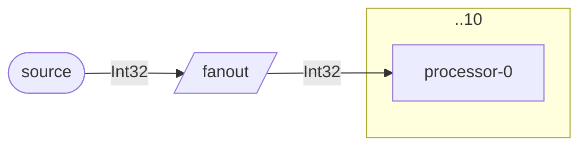
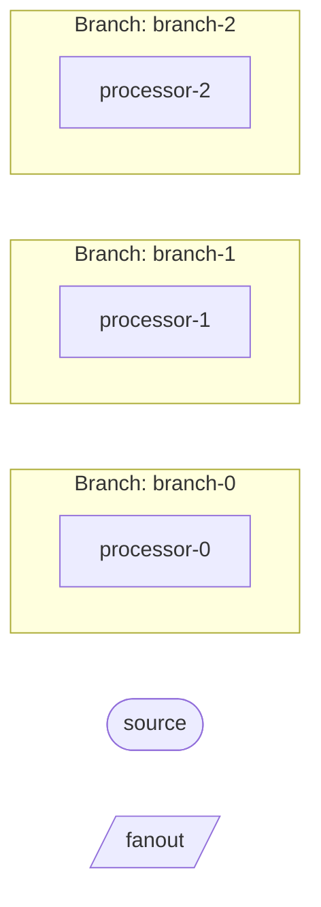

# DAG-Based Diagram Rendering Architecture

This document describes the refactored diagram rendering architecture implemented in response to issue #[issue-number].

## Overview

The diagram rendering system has been refactored from a linear iteration approach to a DAG-based (Directed Acyclic Graph) architecture with composable renderers using callback interfaces.

## Key Components

### 1. `IBlockRenderContext`

A callback-based interface that replaces direct `StringBuilder` access for renderers.

**Benefits:**
- Allows outer renderers to intercept and modify content from inner renderers
- Provides consistent indentation management
- Enables composable rendering with proper nesting

**Key Methods:**
- `AppendLine(string content)` - Adds a line with automatic indentation
- `CreateNested(string additionalIndent)` - Creates a nested context with increased indentation

### 2. `DataFlowGraphIterator`

A DAG iterator for systematic graph traversal.

**Features:**
- Topological ordering of blocks (dependencies before dependents)
- Parent/child relationship queries
- Branch detection and grouping
- Branching point identification

**Methods:**
- `IterateTopologically()` - Returns blocks in dependency order
- `GetChildren(block)` - Returns downstream blocks
- `GetParents(block)` - Returns upstream blocks
- `IsBranchingPoint(block)` - Detects if a block has multiple downstream targets
- `GroupByBranch()` - Returns two collections: blocks grouped by their branch name (from metadata), and blocks that don't belong to any branch. This enables separate rendering logic for branched vs unbranched blocks.

### 3. `BranchMermaidRenderer`

Dedicated renderer for branch groups with intelligent collapsing.

**Features:**
- Renders branches individually or as collapsed groups
- Supports subgraph grouping
- Handles branch families (branches from the same source)

**Rendering Modes:**
- Individual branches as subgraphs
- Collapsed branches with `[×N]` notation
- Mixed mode based on threshold

### 4. Updated `IMermaidBlockRenderer`

Refactored to use callback-based rendering.

**Changes:**
- New primary method: `RenderCustomContent(IBlockRenderContext context)`
- Old StringBuilder-based method has been removed

## Architecture Improvements

### Before (Linear Iteration)

```csharp
// Direct StringBuilder manipulation
foreach (var block in graph.BlockDefinitions.Values)
{
    var shape = GetBlockShape(block);
    sb.AppendLine($"    {block.Name}{shape.Open}\"{label}\"{shape.Close}");
}

// Custom renderers have direct access to StringBuilder
renderer.RenderCustomContent(sb, block, direction, serviceProvider);
```

### After (DAG-Based with Callbacks)

```csharp
// DAG-based iteration
var iterator = new DataFlowGraphIterator(graph);
var (branchGroups, unbranchedBlocks) = iterator.GroupByBranch();

// Render using context callbacks
foreach (var block in unbranchedBlocks)
{
    RenderBlockNode(rootContext, block);
}

// Composable rendering with context
var blockContext = new BlockRenderContext(sb, block, direction, serviceProvider, "    ");
renderer.RenderCustomContent(blockContext);
```

## Branch-Aware Rendering

The new architecture detects branching situations and delegates to specialized branch renderers:

1. **Detection**: Uses `DataFlowGraphIterator.GroupByBranch()` to identify branch groups
2. **Family Grouping**: Groups branches by their source block
3. **Collapse Decision**: Based on `DiagramRenderOptions.MaxBranchesToShowIndividually`
4. **Rendering**: `BranchMermaidRenderer` handles branch-specific rendering logic

### Collapsed Branch Example

When 10 branches exceed the threshold of 5:



### Individual Branch Example

When 3 branches are below the threshold:



## Renderer Interface

Custom renderers should implement the callback-based interface:

```csharp
public void RenderCustomContent(IBlockRenderContext context)
{
    context.AppendLine($"%% Custom content for {context.Block.Name}");
    
    // For nested content (e.g., within a subgraph)
    // CreateNested() increases indentation for proper Mermaid formatting
    var nested = context.CreateNested();
    nested.AppendLine("Nested block content");  // Rendered with additional indentation
}
```

## Testing

New comprehensive test suite in `DataFlowGraphIteratorTests`:

- Topological iteration correctness
- Dependency order validation
- Parent/child relationship queries
- Branch detection
- Branch grouping

All existing tests continue to pass, validating backward compatibility.

## Benefits

1. **Separation of Concerns**: DAG iteration logic separate from rendering logic
2. **Composability**: Renderers can nest and augment each other's output
3. **Extensibility**: Easy to add new renderer types or traversal patterns
4. **Testability**: DAG iteration can be tested independently
5. **Maintainability**: Clear responsibility boundaries between components

## Future Enhancements

Potential improvements enabled by this architecture:

1. **Custom Traversal Orders**: Different iteration strategies (breadth-first, by layer, etc.)
2. **Conditional Rendering**: Skip or transform blocks based on context
3. **Multi-Format Support**: Same DAG iteration for DOT, PlantUML, etc.
4. **Dynamic Indentation**: Context-aware spacing and alignment
5. **Renderer Pipelines**: Chain multiple renderers with middleware pattern
