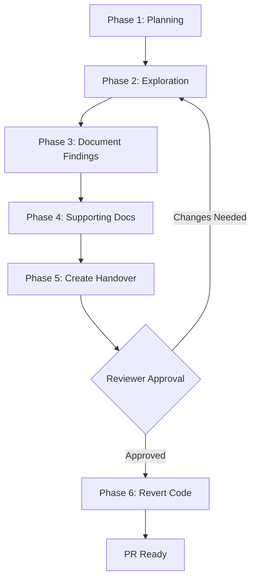
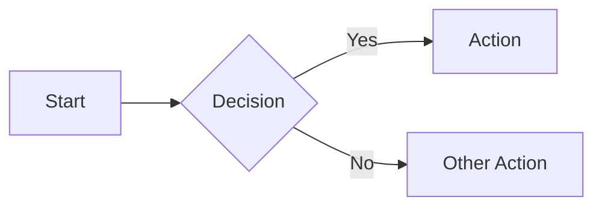
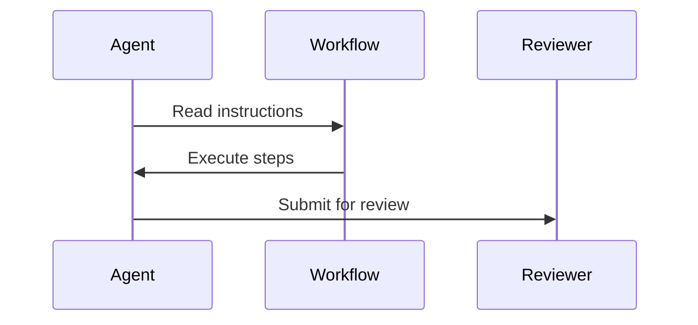
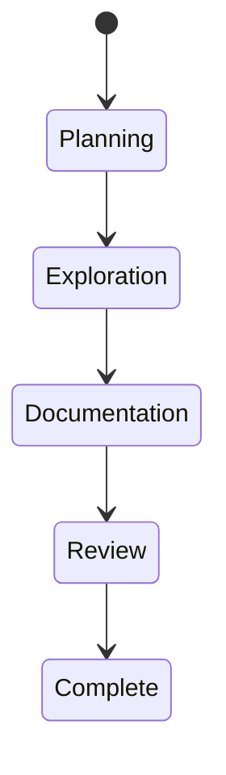
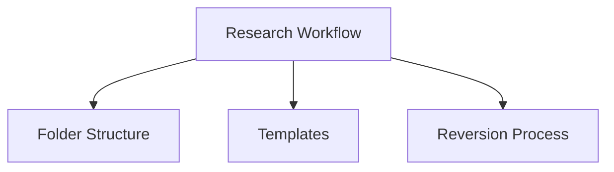

# Document Hygiene and Maintainability Guide

## Purpose

This guide ensures documentation remains maintainable, focused, and valuable over time. Well-factored documentation reduces churn, improves discoverability, and prevents information decay.

---

## Core Principles

### 1. Separation of Concerns

Each document should have a **single, clear purpose**. When a document starts serving multiple purposes, it becomes harder to maintain and find information.

**Signs a document needs splitting**:
- Document exceeds 1000 lines
- Table of contents has more than 10 top-level sections
- Multiple unrelated topics covered in one file
- Frequent cross-referencing between unrelated sections
- Readers ask "where do I find X?" despite documentation existing

**Example - Before (conflated)**:
```
workflows/WORKFLOW_GUIDE.md
├── Research workflow
├── Implementation workflow  
├── Tech debt workflow
├── Code review checklist
├── Git commit guidelines
└── PR templates
```

**Example - After (well-factored)**:
```
duties/
├── RESEARCH_DUTY.md              # Single purpose: research process
├── IMPLEMENTATION_DUTY.md        # Single purpose: implementation process
├── TECH_DEBT_DUTY.md             # Single purpose: tech debt discovery
├── TRIAGE_DUTY.md                # Single purpose: work item assessment
└── README.md                     # Index to all duties
```

### 2. DRY (Don't Repeat Yourself)

Avoid duplicating information across documents. Instead, reference the canonical source.

**Bad**:
```markdown
<!-- In RESEARCH_DUTY.md -->
Research folder structure:
/research/[topic]/
├── README.md
├── research-plan.md
└── notes/

<!-- In TECH_DEBT_DUTY.md -->
Tech debt folder structure:
/research/tech-debt-[date]/
├── README.md
├── research-plan.md
└── notes/
```

**Good**:
```markdown
<!-- In RESEARCH_DUTY.md -->
See [Research Folder Structure](/research/FOLDER_STRUCTURE.md) for canonical layout.

<!-- In TECH_DEBT_DUTY.md -->
Follow standard research folder structure (see `/research/FOLDER_STRUCTURE.md`).
```

### 3. Visual Communication

Use diagrams for complex relationships, processes, and architectures. Replace verbose text with clear visualizations.

**When to use Mermaid diagrams**:
- ✅ Process flows with decision points
- ✅ State machines or workflows
- ✅ System architecture or component relationships
- ✅ Data flow or sequence diagrams
- ✅ Any concept requiring >3 paragraphs to explain

**Example - Before (verbose text)**:
```markdown
The research workflow has six phases. First, you plan the research by creating
a folder and research plan. Then you conduct exploration by writing code and
running tests. Next, you document findings in the README. After that, you create
supporting documentation like design docs and ADRs. Then you create an
implementation-ready issue in the handover folder. Finally, after reviewer
approval, you revert exploratory code changes while keeping documentation.
```

**Example - After (visual)**:
```markdown
## Research Workflow Phases


```

### 4. Hierarchical Information

Structure documents from general to specific. Readers should find what they need quickly.

**Document structure pattern**:
```markdown
# Title

## Quick Start / TL;DR
[Most common use case in 3-5 steps]

## Overview
[High-level purpose and when to use]

## Detailed Sections
[In-depth information, organized by topic]

## Reference
[Tables, templates, examples]
```

### 5. Clear Ownership

Every document should have clear ownership and update responsibility.

Add to document frontmatter:
```markdown
---
**Owner**: [Team/Role]
**Last Updated**: YYYY-MM-DD
**Review Cycle**: [Quarterly/As-needed]
---
```

---

## Refactoring Exercise Example

### Scenario: Duty Documentation Growing Too Large

**Initial State**:
`RESEARCH_DUTY.md` is 800 lines and covers:
- Research duty process (primary purpose)
- Research folder structure
- Implementation issue template format
- Code reversion procedures
- Self-improvement evaluation process

**Problem Indicators**:
- Document is hard to navigate
- Folder structure info needed by multiple duties
- Template format is referenced from other places
- Code reversion is shared across duties

**Refactoring Steps**:

1. **Identify concerns**:
   - Core duty process (keep in RESEARCH_DUTY.md)
   - Folder structure (extract to FOLDER_STRUCTURE.md)
   - Issue templates (extract to IMPLEMENTATION_ISSUE_TEMPLATE.md)
   - Reversion process (could stay or extract if shared)
   - Self-improvement (already in procedures/self-improvement.md)

2. **Extract standalone documents**:
   ```bash
   # Create focused documents
   touch research/FOLDER_STRUCTURE.md
   touch research/IMPLEMENTATION_ISSUE_TEMPLATE.md
   ```

3. **Update primary document**:
   Replace detailed content with references:
   ```markdown
   ## Research Folder Structure
   
   See [Research Folder Structure](/research/FOLDER_STRUCTURE.md) 
   for the canonical folder layout and naming conventions.
   ```

4. **Update cross-references**:
   Update all documents referencing the extracted content to point to new locations.

5. **Add index if needed**:
   If many related documents, create an index/README:
   ```markdown
   # Research Documentation
   
   - [Research Duty](RESEARCH_DUTY.md) - Main process
   - [Folder Structure](FOLDER_STRUCTURE.md) - Canonical layout
   - [Issue Templates](IMPLEMENTATION_ISSUE_TEMPLATE.md) - Handover format
   ```

---

## Diagram Usage Guidelines

### When to Create a Diagram

**Create a diagram when**:
- Explaining a process with 3+ steps
- Showing relationships between 3+ components
- Illustrating conditional logic or branches
- Visualizing state transitions
- Depicting data or message flow

**Keep as text when**:
- Simple lists (use markdown lists)
- Linear processes with 1-2 steps
- Single relationships (just describe)

### Diagram Types

**Flowcharts** - Processes and decisions:


**Sequence Diagrams** - Interactions over time:


**State Diagrams** - State transitions:


**Class/Architecture Diagrams** - Component structure:


### Diagram Best Practices

1. **Keep diagrams simple** - If it needs >10 nodes, consider splitting
2. **Use consistent styling** - Same shapes for same concepts
3. **Label clearly** - All nodes and edges should be self-explanatory
4. **Include diagram source** - Always use Mermaid (not images) for maintainability
5. **Test rendering** - Verify diagrams render correctly in GitHub

---

## Maintenance Practices

### Regular Review

**Quarterly Review Checklist**:
- [ ] Is the document still accurate?
- [ ] Are there duplicate sections across documents?
- [ ] Could any text be replaced with diagrams?
- [ ] Are cross-references still valid?
- [ ] Is the document <500 lines? If not, should it be split?
- [ ] Are examples up to date?

### When Creating New Documentation

**Before creating a new document**:
1. Check if information belongs in existing document
2. If yes, add it there (avoid duplication)
3. If no, ensure new document has clear single purpose
4. Create index entry if adding to a collection
5. Update related documents with cross-references

**After creating a new document**:
1. Add to relevant README or index
2. Add cross-references from related documents
3. Ensure canonical source is clear (no duplication)
4. Add ownership and review cycle info

### Deprecating Documents

When a document becomes obsolete:
1. Add deprecation notice at top
2. Link to replacement (if applicable)
3. Move to `archive/` folder after 1 quarter
4. Update all cross-references

---

## Anti-Patterns to Avoid

### ❌ The Mega-Document

**Problem**: One massive document trying to cover everything
**Solution**: Factor into focused, single-purpose documents

### ❌ Scattered Information

**Problem**: Same information repeated across 5 different places
**Solution**: Create canonical source, reference from others

### ❌ Stale Cross-References

**Problem**: Links to moved/renamed/deleted documents
**Solution**: Regular link validation, update references when restructuring

### ❌ Wall of Text

**Problem**: Pages of dense paragraphs explaining a process
**Solution**: Use diagrams, bullet points, tables for clarity

### ❌ Missing Context

**Problem**: Document assumes reader knows where it fits in
**Solution**: Add brief overview and links to related documents

---

## Integration with Workflows

### For Copilot Agents

**When creating or updating documentation**:
1. Read this guide first (mandatory)
2. Check for existing documents on the topic
3. Determine if new document needed or update existing
4. Follow separation of concerns principle
5. Use diagrams where appropriate
6. Add cross-references to related documents
7. Keep document focused and <500 lines

**When refactoring documentation**:
1. Identify conflated concerns
2. Extract into separate focused documents
3. Update all cross-references
4. Verify no information lost
5. Test all links still work

### In Workflow Documentation

All workflow documents should reference this guide:

```markdown
## Documentation Standards

When creating or updating documentation during this workflow, 
follow [Document Hygiene Guidelines](/.github/DOCUMENT_HYGIENE.md).

Key points:
- Keep documents focused (single purpose)
- Use diagrams for complex processes
- Reference canonical sources (don't duplicate)
- Maintain clear document structure
```

---

## Examples from This Repository

### Well-Factored Documentation

```
.team/duties/
├── RESEARCH_DUTY.md              # Single purpose: research process
├── IMPLEMENTATION_DUTY.md        # Single purpose: implementation  
├── TECH_DEBT_DUTY.md             # Single purpose: tech debt discovery
└── PROCESS_MODELING_DUTY.md      # Single purpose: process modeling

research/
├── FOLDER_STRUCTURE.md           # Canonical: folder layout
├── IMPLEMENTATION_ISSUE_TEMPLATE.md  # Canonical: issue format
└── [topic]/                      # Individual research folders
```

**Why this works**:
- Each duty document has single clear purpose
- Shared concerns (folder structure, templates) extracted
- Easy to find what you need
- Updates to shared concerns happen in one place

### Using Diagrams Effectively

See `RESEARCH_DUTY.md` for examples of:
- Flowchart showing 6-phase process
- Decision tree for when to use duty
- Folder structure visualization

See `TECH_DEBT_WORKFLOW.md` for examples of:
- Findings categorization flowchart
- Backlog management process diagram

---

## Summary

**Good documentation is**:
- **Focused** - Single, clear purpose per document
- **DRY** - No duplication, clear canonical sources
- **Visual** - Diagrams over walls of text
- **Hierarchical** - General to specific structure
- **Maintained** - Regular reviews, deprecation process

**When in doubt**:
1. Is this document trying to do too much? → Split it
2. Is this information duplicated elsewhere? → Reference it
3. Would a diagram make this clearer? → Create one
4. Is the structure logical? → Reorganize hierarchically
5. Will someone be able to maintain this? → Simplify

---

**Related Documentation**:
- [Research Duty](duties/RESEARCH_DUTY.md) - References this for doc standards
- [Implementation Duty](duties/IMPLEMENTATION_DUTY.md) - References this for doc standards
- [Self-Improvement Procedure](procedures/self-improvement.md) - Tracks documentation improvement suggestions
