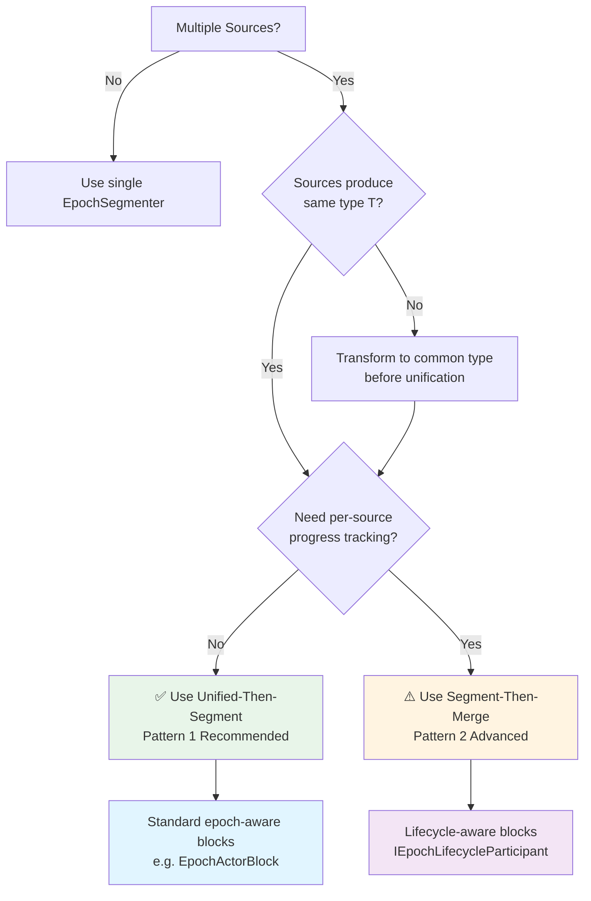

# ADR-002: Multi-Source Segmentation Strategy with Decoupled Design

**Date**: 2025-11-05  
**Status**: Proposed  
**Context**: Flow Composability Research - Multi-Source Scenarios  
**Related**: ADR-001 (Epoch-Aware Block Pattern)

## Context

The decoupled epoch segmentation (PR #146) fundamentally changed how epochs are created - segmentation is now external to sources rather than source-centric. This raises questions about the recommended patterns for multi-source scenarios.

### Key Questions

1. How should multiple sources be handled with decoupled segmentation?
2. Should we use unified-then-segment or segment-then-merge patterns?
3. What are the type requirements for multiple sources?
4. Do we need graph validation to prevent unsupported compositions?

## Decision

We adopt **Unified-Then-Segment** as the recommended pattern for multi-source scenarios, with Segment-Then-Merge as an advanced option for cases requiring per-source progress tracking.

### Pattern 1: Unified-Then-Segment (Recommended)

**Architecture**:
```
Source1 → ┐
         ├→ UnionBlock → EpochSegmenter("unified") → EpochBlocks
Source2 → ┘
```

**Characteristics**:
- All sources unified into single stream before segmentation
- Single sourceId in all epoch vectors
- No multi-source epochs, no ancestry tracking
- Works with standard epoch-aware blocks (from research prototype)

**Type Requirement**: All sources must produce (or be transformable to) the same type `T`.

### Pattern 2: Segment-Then-Merge (Advanced)

**Architecture**:
```
Source1 → EpochSegmenter("s1") → ┐
                                 ├→ MergeBlock → LifecycleAwareBlocks
Source2 → EpochSegmenter("s2") → ┘
```

**Characteristics**:
- Each source segmented independently
- Multi-source epoch vectors at merge points
- Requires epoch vector subsumption tracking
- Requires lifecycle-aware blocks (`IEpochLifecycleParticipant`)

**Type Requirement**: Streams must converge to same type before merge.

## Rationale

### Why Unified-Then-Segment is Recommended

1. **Simplicity**: Eliminates epoch vector ancestry complexity
   - Old (Source-Centric): Merge creates ancestry → subsumption tracking required
   - New (Decoupled): Unify then segment → single-source epochs, no ancestry

2. **Efficiency**: 
   - No epoch vector merge operations
   - No context promotion at merge points
   - Standard epoch-aware blocks work without modification

3. **Clarity**: 
   - Clear transaction boundaries (epoch stream = epoch)
   - Easier to reason about data flow
   - Matches mental model: "batch of orders" not "batch from source A or source B"

4. **Implementation Cost**:
   - Prototype blocks (SimpleEpochBatchBlock, etc.) work as-is
   - No need for lifecycle-aware variants
   - Lower maintenance burden

### When to Use Segment-Then-Merge

Only when **per-source progress tracking** is a hard requirement:
- Need separate watermarks per source
- Source-specific recovery/checkpoint requirements
- Regulatory requirements for audit trails per source

**Trade-offs Accepted**:
- Higher implementation complexity
- Requires lifecycle-aware block variants
- Performance overhead from epoch vector operations

## Decision Tree



## Decision Tree


## Implications

### Type Constraints

**Decision**: We accept that Pattern 1 requires type unification before segmentation.

**Rationale**:
- This is a reasonable constraint (sources typically produce same domain type)
- Transformations can be applied before unification if needed
- Simplicity benefit outweighs this constraint

**Example**:
```csharp
// Valid: Same type
PlainSourceBlock<Order> + PlainSourceBlock<Order> → Unified

// Requires transformation first
PlainSourceBlock<CsvRow> → Transform<Order> ─┐
                                             ├→ Unified
PlainSourceBlock<ApiResponse> → Transform<Order> ─┘
```

### Graph Validation

**Decision**: Defer graph validation to future work.

**Current State**: No hard constraints preventing unsupported compositions like:
- Multiple segmenters on same stream
- Mixing plain and epoch streams incorrectly

**Rationale**:
1. POC features are still evolving
2. Early constraints might limit experimentation
3. Type system provides some protection (compile errors for type mismatches)
4. Runtime errors are acceptable during POC phase

**Future Work** (after POC stabilizes):
- Implement graph validation to detect:
  - Duplicate segmentation
  - Type mismatches
  - Invalid merge configurations
- Provide clear error messages guiding users to supported patterns

### Producer Groups

**Decision**: Apply segmentation at the group level, not per-producer.

```csharp
ProducerGroup(4 producers, max 2 concurrent) → EpochSegmenter("group")
```

**Rationale**:
- Matches unified-then-segment philosophy
- Simpler than per-producer segmentation
- Acceptable trade-off: lose per-producer tracking, gain simplicity

**Alternative** (if per-producer tracking needed):
Segment each producer separately and use Pattern 2 (segment-then-merge).

## Consequences

### Positive

1. **Simplified Mental Model**: Most users use Pattern 1, avoiding ancestry complexity
2. **Lower Implementation Burden**: Standard blocks work for 90% of cases
3. **Better Performance**: Single-source epochs are more efficient
4. **Clearer Documentation**: One recommended path, one advanced path

### Negative

1. **Type Constraint**: Sources must produce compatible types
2. **Loss of Per-Source Tracking**: Pattern 1 doesn't track individual source progress
3. **Advanced Pattern Complexity**: Pattern 2 users face steep learning curve
4. **Delayed Validation**: Graph validation deferred, potential for confusing runtime errors

### Neutral

1. **Prototype Scope Validated**: Research prototype correctly focused on Pattern 1 (single-source case)
2. **Future Extension Path Clear**: Lifecycle-aware blocks for Pattern 2 when needed

## Implementation Guidance

### For Pattern 1 (Recommended)

1. **Unification**: Use `UnionBlock` or similar to merge plain streams
2. **Segmentation**: Apply single `EpochSegmenterBlock` with unified sourceId
3. **Processing**: Use standard epoch-aware blocks from prototype

### For Pattern 2 (Advanced)

1. **Segmentation**: Apply `EpochSegmenterBlock` per source with unique sourceIds
2. **Merging**: Use `MergeBlock` to create multi-source epoch streams
3. **Processing**: Use lifecycle-aware blocks (`IEpochLifecycleParticipant`)
4. **Context Management**: Handle context promotion at merge points

## Validation

Experimental tests demonstrate both patterns:
- `/research/flow-composability-unification/handover/prototype/MultiSourceSegmentationExperiments.cs`

Key validations:
- ✅ Pattern 1 creates single-source epochs
- ✅ Pattern 2 creates multi-source epochs with ancestry
- ✅ Producer groups work with Pattern 1
- ✅ Type unification works as expected

## Related Decisions

- **ADR-001**: Epoch-Aware Block Pattern (addresses single-source composability)
- **Phase-6**: Epoch lifecycle events (provides foundation for Pattern 2)
- **PR #146**: Decoupled segmentation (enables this simplified multi-source model)

## Open Questions

1. **Graph Validation Timeline**: When should we implement validation?
   - Recommendation: After Phase-7 (benchmarks) and POC feature freeze

2. **UnionBlock/MergeBlock**: Should these be standardized blocks?
   - Recommendation: Yes, add to block library for Pattern 1 and Pattern 2

3. **Lifecycle-Aware Variants**: Priority for implementation?
   - Recommendation: Low priority (Pattern 2 is advanced, fewer users)

## Epoch Granularity Considerations

**Key Consideration**: Epoch granularity affects batching efficiency and transaction boundaries.

### The Trade-off

- **Granular epochs** (per-entity, e.g., per-invoice): 
  - ✅ Fine-grained transactional consistency per business entity
  - ❌ Fragments batching → many small database transactions
  - ❌ Reduces bulk operation efficiency
  
- **Coarse epochs** (per-batch, e.g., per 10K items):
  - ✅ Enables bulk operations (bulk insert, bulk update)
  - ✅ Optimizes throughput
  - ❌ Reduces transactional granularity

### Strategies

1. **Align with Transaction Requirements**
   - Use **coarse epochs** when bulk database operations are critical
   - Use **granular epochs** when per-entity consistency is required
   - Don't mix both in the same pipeline

2. **Hierarchical Epochs** (Advanced)
   - Outer epochs for database transaction boundaries
   - Inner epochs for business logic tracking
   - Requires custom lifecycle-aware blocks

3. **Design Principle**
   - Typically choose **epoch-driven** (consistency per entity) OR **batch-driven** (throughput optimization)
   - Rarely both - accept the trade-off

### Example

**Scenario**: Invoice processing with 10 lines per invoice, needing bulk insert for performance.

**Problem**: Per-invoice epochs (granular) fragment batching:
```csharp
// Granular epochs (per-invoice)
Invoice1[Lines 1-10] Invoice2[Lines 11-20] Invoice3[Lines 21-30] ...
→ Many small DB transactions (3 lines, 10 items each)
```

**Solution**: Use coarse epochs aligned with bulk insert requirements:
```csharp
// Coarse epochs (per batch)
Batch1[Invoices 1-1000, ~10K lines] Batch2[Invoices 1001-2000, ~10K lines]
→ Fewer large DB transactions (bulk insert 10K items)
```

**Recommendation**: When bulk operations are critical, set epoch granularity based on transaction needs, not business entity boundaries.

## Migration Path

For users of old source-centric model:
1. Replace epoch-aware sources with plain sources
2. Add explicit EpochSegmenterBlock after unification
3. Use standard epoch-aware blocks for processing

**Example**:
```csharp
// Old (Source-Centric)
EpochSource1 → ┐
              ├→ Merge → EpochTransformer
EpochSource2 → ┘

// New (Decoupled, Pattern 1)
PlainSource1 → ┐
              ├→ Union → EpochSegmenter → EpochTransformer
PlainSource2 → ┘
```

## Review and Approval

**Proposed By**: Research on Flow Composability  
**Requires Review**: Architecture team, POC maintainers  
**Status**: Proposed (pending validation in implementation phase)

## References

- Research: `/research/flow-composability-unification/README.md`
- Usage Guide: `/research/flow-composability-unification/handover/epoch-segmenter-multi-source-usage.md`
- Experiments: `/research/flow-composability-unification/handover/prototype/MultiSourceSegmentationExperiments.cs`
- Related Research: `/research/epoch-stream-separation/`
