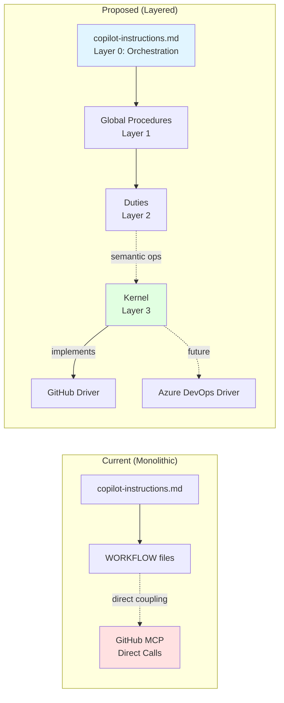
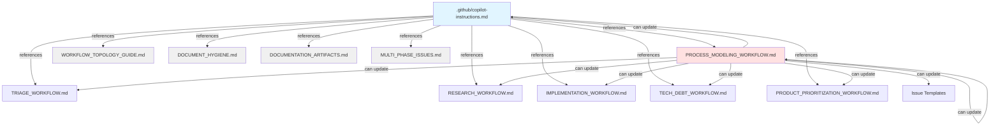
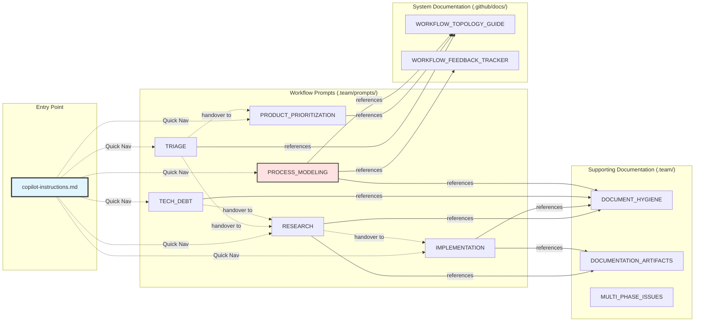
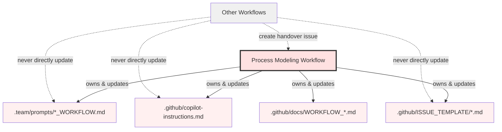
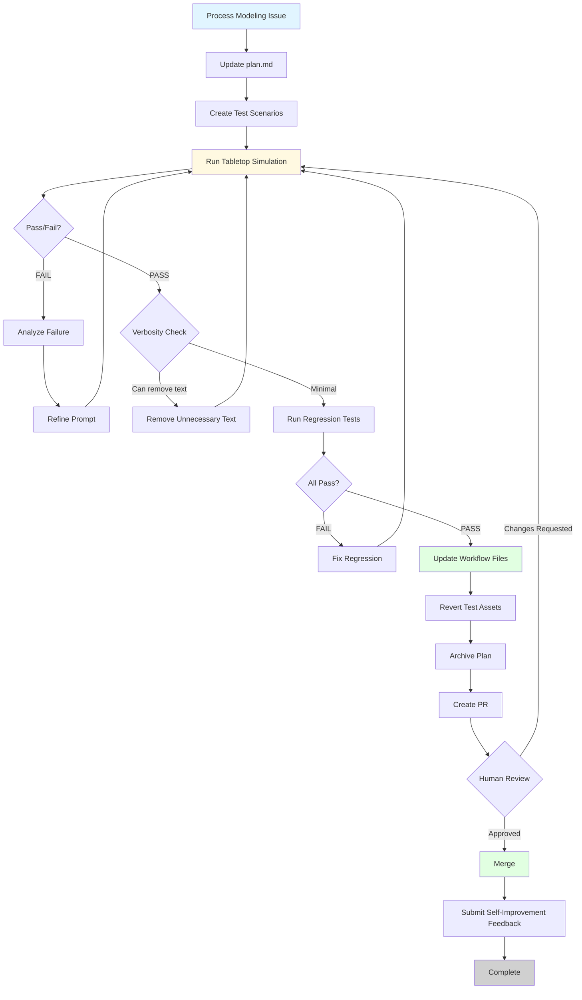
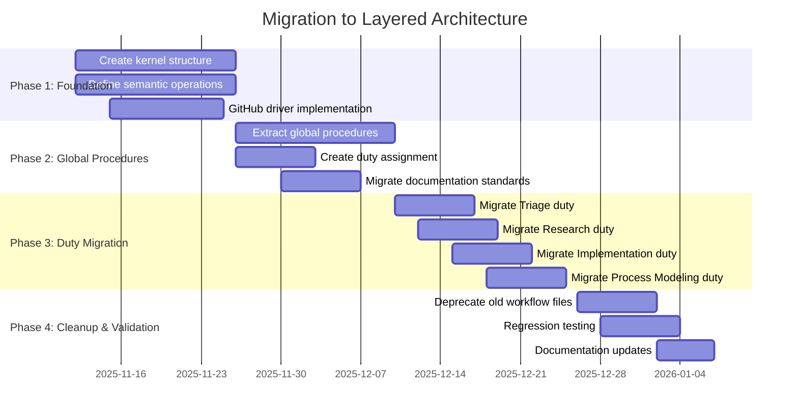

# Prompt Engineering Design Principles

**Status**: Draft  
**Created**: 2025-11-11  
**Updated**: 2025-11-12 (Added graph-wide dependency management and standardized reference formats)  
**Related Issue**: uniun-technology/lib-dataflow#361

---

## Document Navigation

**Main Documents:**
- **[This Document](README.md)** - Complete design with architecture, principles, and migration strategy
- **[Core Concepts](concepts.md)** - Foundational concepts, terminology, and the layered model explained
- **[Semantic Language Reference](semantic-language.md)** - Complete semantic operations specification
- **[Testing Framework](testing-framework.md)** - Comprehensive testing methodology with kernel & dependency leak detection

**Quick Links:**
- [Executive Summary](#executive-summary) - High-level overview
- [Layered Architecture](#layered-architecture) - The 4-layer model
- [Migration Strategy](#migration-strategy) - 5-phase transition plan
- [Design Principles](#design-principles) - 8 core principles
- [Testing Framework](testing-framework.md) - Unit tests, integration tests, change procedures, leak detection, graph management

---

## Executive Summary

This design formalizes a **layered, platform-agnostic architecture** for Copilot agent prompts that enables:

1. **Platform Portability** - Abstract away platform-specific operations (GitHub Issues, Azure DevOps) into a kernel layer
2. **Layered Knowledge Model** - Separate concerns across distinct layers (Kernel → Global Procedures → Duties → Orchestration)
3. **Semantic Language** - Define approved terminology that works across platforms
4. **Systematic Evolution** - Provide migration path from current to proposed architecture
5. **Quality & Testing** - Maintain rigorous testing while improving maintainability
6. **Graph-Based Testing** - Node-specific test methodologies with dependency-aware impact analysis
7. **Leak Detection** - Systematic checks to prevent leaks (kernel-specific and dependency-wide)
8. **Graph Management** - Explicit DAG representation with standardized, parseable reference formats

### Key Innovation

Instead of coupling prompts directly to GitHub Issues operations, we introduce a **kernel abstraction layer** that maps semantic operations (e.g., "assign work item to duty") to platform-specific implementations. This allows the bulk of our prompt model to remain portable.

**Leak Detection** ensures architectural integrity by:
- **Kernel Leaks**: Platform-specific operations don't leak into procedures/duties
- **Dependency Leaks**: Content from dependencies isn't duplicated in dependents
- **Graph Validation**: Explicit graph representation prevents implicit dependencies

**Standardized References** enable:
- **Human-Readable**: Clear documentation with proper context
- **Machine-Parseable**: CLI tools can infer and validate graph structure
- **Edge Types**: Required Context (must-read) vs Optional Context (supplemental)

### Supporting Documents

- **[Core Concepts](concepts.md)** - Detailed explanation of layers, terminology, and the OS analogy
- **[Semantic Language](semantic-language.md)** - Complete specification of all semantic operations
- **[Testing Framework](testing-framework.md)** - Graph-based testing methodology with node-specific procedures, kernel & dependency leak detection, and graph management

---

## Objective

Formalize the methodology for designing, maintaining, and evolving Copilot agent prompts with:

**Primary Goals:**
- Platform-agnostic architecture supporting multiple work tracking systems
- Layered knowledge model with clear separation of concerns
- Systematic design principles and testability standards
- Migration strategy from current GitHub-coupled implementation

**Process Modeling Enablement:**
- Make informed decisions when modifying prompts
- Understand layered dependencies and semantic boundaries
- Apply consistent design principles across all documentation
- Validate changes through rigorous tabletop testing
- Maintain quality while evolving the architecture

---

## Problem Statement

### Current State

The Process Modeling workflow successfully enables Copilot agents to improve their own prompts and conduct tabletop testing. However, **the current architecture is tightly coupled to GitHub Issues**, creating several problems:

**Platform Coupling Issues:**
1. **GitHub-Specific Operations** - Direct use of `issue_write`, `list_issues`, `workflow:` labels throughout prompts
2. **Hard to Port** - Switching to Azure DevOps Boards would require rewriting significant portions of all workflows
3. **Mixed Abstraction Levels** - Kernel-level operations (GitHub MCP tools) mixed with high-level procedures
4. **Tight Integration** - Platform semantics (issues, labels, comments) embedded in workflow logic

**Architectural Issues:**
5. **No Layered Separation** - Global procedures, workflow-specific procedures, and platform operations are intermingled
6. **Unclear Dependencies** - How prompts reference each other without clear layer boundaries
7. **Duty Assignment Implicit** - How agents map requests to workflows is not formalized
8. **Semantic Ambiguity** - Terms like "workflow" are overloaded (process vs GitHub label)

**Quality Issues:**
9. **Design quality** - What makes a prompt clear, maintainable, and effective?
10. **Testing rigor** - How should tabletop testing be conducted to catch regressions?
11. **Evolution strategy** - How should prompts evolve while maintaining backward compatibility?

### Impact

Without formal design principles and platform abstraction:
- **Vendor Lock-in** - Cannot migrate to Azure DevOps without major rewrite
- **Maintenance Burden** - Changes to platform operations ripple through all workflows
- **Reduced Clarity** - Mixed abstraction levels make prompts harder to understand
- **Evolution Risk** - Architectural debt accumulates, making improvements harder

---

## Constraints

### Technical Constraints

- **File ownership model**: Process Modeling workflow has exclusive ownership of workflow files
- **Markdown format**: All prompts are written in Markdown
- **Token budget**: Prompts must fit within LLM context windows (currently ~1M tokens, but smaller is better)
- **Platform tools**: Must support GitHub MCP tools initially, Azure DevOps in future
- **No runtime**: Prompts have no runtime validation - only tabletop testing pre-merge
- **Backward compatibility**: Must provide migration path from current GitHub-coupled implementation

### Quality Constraints

- **Clarity**: Instructions must be unambiguous and actionable
- **Discoverability**: Related information must be easy to find
- **Maintainability**: Changes should be localized and surgical
- **Testability**: Changes must be validatable through tabletop simulation
- **Consistency**: Similar concepts should be expressed similarly across layers
- **Platform Agnostic**: Procedures should use semantic language, not kernel operations

### Testing Constraints

- **Tabletop simulation**: All changes validated through realistic scenarios
- **Regression coverage**: Existing scenarios must continue to pass
- **Edge case testing**: Unusual scenarios must be explicitly tested
- **Verbosity checks**: Test removing portions to verify necessity
- **Cross-platform validation**: Ensure semantic abstractions work for multiple platforms

### Process Constraints

- **Document Hygiene**: Follow principles in `.team/DOCUMENT_HYGIENE.md`
- **Version control**: All changes tracked via Git
- **PR review**: Human review required before merge
- **Feedback loop**: Self-improvement evaluation required after each change
- **Phased Migration**: Cannot break existing workflows during transition to new architecture

---

## Core Concepts

### Terminology

To avoid confusion and enable platform portability, we define precise terminology:

| Term | Definition | Replaces | Notes |
|------|------------|----------|-------|
| **Work Item** | Unit of work to be completed | "Issue" | Platform-agnostic: GitHub Issue, Azure DevOps Work Item, etc. |
| **Duty** | Specific responsibility or workflow type | "Workflow" (when referring to agent processes) | Avoids overloading "workflow" |
| **Duty Assignment** | Process of mapping work item to duty | "Label checking" | Abstract the label mechanism |
| **Work Tracker** | Platform for managing work items | "GitHub Issues" | Could be GitHub, Azure DevOps, etc. |
| **Kernel** | Platform-specific operations layer | N/A | Like OS kernel: handles hardware specifics |
| **Procedure** | Reusable process using semantic language | N/A | Kernel-agnostic instructions |
| **Semantic Operation** | Abstract work item operation | "MCP tool call" | e.g., "assign_work_item_to_duty" |

### The Overloaded "Workflow" Problem

Current usage conflates multiple meanings:
- **GitHub Workflow** - CI/CD automation (`.github/workflows/`)
- **Duty Workflow** - Agent responsibility process (what we mean)
- **Workflow Label** - GitHub label format (`workflow:research`)

**Solution**: Use "Duty" for agent responsibilities, reserve "Workflow" for CI/CD context.

---

## Layered Architecture

### Overview

The prompt system is organized into **4 distinct layers**, inspired by operating system architecture:

```mermaid
flowchart TD
    subgraph "Layer 0: Orchestration"
        ORCH[copilot-instructions.md<br/>Import layers & dispatch to duty]
    end
    
    subgraph "Layer 1: Global Procedures"
        GP1[Duty Assignment]
        GP2[Multi-Phase Work Items]
        GP3[Self-Improvement Loop]
        GP4[Documentation Standards]
    end
    
    subgraph "Layer 2: Duty Procedures"
        D1[Triage Duty]
        D2[Research Duty]
        D3[Implementation Duty]
        D4[Process Modeling Duty]
        D5[Unassigned Duty]
    end
    
    subgraph "Layer 3: Kernel"
        K1[Work Tracker Driver<br/>GitHub | Azure DevOps]
        K2[Semantic Mappings]
    end
    
    ORCH --> GP1
    ORCH --> GP2
    ORCH --> K1
    
    GP1 -.->|uses| K2
    GP2 -.->|uses| K2
    
    GP1 -->|assigns| D1
    GP1 -->|assigns| D2
    GP1 -->|assigns| D3
    GP1 -->|assigns| D4
    GP1 -->|assigns| D5
    
    D1 -.->|uses| K2
    D2 -.->|uses| K2
    D3 -.->|uses| K2
    D4 -.->|uses| K2
    D5 -.->|uses| K2
    
    K2 -->|calls| K1
    
    style ORCH fill:#e1f5ff,stroke:#333,stroke-width:3px
    style K1 fill:#ffe1e1,stroke:#333,stroke-width:2px
    style K2 fill:#fff0f0
```

**Key Principle**: Information flows downward through layers. Higher layers use semantic operations; only the kernel knows platform specifics.

### Layer 3: Kernel (Platform-Specific)

**Purpose**: Encapsulate all platform-specific operations

**Responsibilities**:
- Implement work tracker driver (GitHub Issues, Azure DevOps, etc.)
- Provide semantic operation mappings
- Handle platform authentication and API calls

**Analogy**: Like an OS kernel that abstracts hardware differences

**Example - Current GitHub Kernel Operations**:
```python
# KERNEL LEVEL - Platform-specific (should only be in kernel layer)
issue_write(
    method="create",
    owner="uniun-technology",
    repo="lib-dataflow",
    labels=["workflow:research"],
    body="..."
)

list_issues(
    owner="uniun-technology",
    repo="lib-dataflow",
    labels=["workflow:research"],
    state="OPEN"
)
```

**Example - Proposed Semantic Operations** (defined in kernel, used in procedures):
```python
# SEMANTIC LEVEL - Platform-agnostic (used in procedures)
create_work_item(
    type="research",
    title="...",
    description="...",
    duty="research"
)

query_work_items_by_duty(
    duty="research",
    status="open"
)
```

**Kernel Responsibilities**:
1. **Map semantic operations to platform APIs**
2. **Handle platform authentication**
3. **Translate duty names to platform labels/tags**
4. **Provide platform-specific helpers** (GitHub MCP tools, Azure DevOps REST API, etc.)

### Layer 1: Global Procedures

**Purpose**: Universal agent knowledge applicable to all duties

**Responsibilities**:
- Duty assignment (map work item → duty)
- Multi-phase work item handling
- Self-improvement feedback loop
- Documentation standards
- Common work item operations

**Analogy**: Like employee onboarding - general company procedures before specific job duties

**Key Procedures**:

1. **Duty Assignment Procedure** (Global)
   - Read work item metadata
   - Extract duty designation (via semantic operation)
   - Validate single duty assignment
   - Load appropriate duty procedure
   - Handle "unassigned" case

2. **Multi-Phase Work Item Procedure** (Global)
   - Check if work item is part of multi-phase plan
   - Read parent work item context
   - Update parent progress
   - Handle last phase completion

3. **Self-Improvement Loop** (Global)
   - Evaluate workflow effectiveness
   - Document what worked/didn't work
   - Submit feedback via semantic operation

4. **Documentation Standards** (Global)
   - Document Hygiene principles
   - Cross-reference patterns
   - Mermaid diagram usage

**Example - Current vs Proposed**:

**Current (GitHub-coupled)**:
```markdown
## Query Your Duty Queue

```python
list_issues(
    owner="uniun-technology",
    repo="lib-dataflow",
    labels=["workflow:research"],
    state="OPEN"
)
```
```

**Proposed (Semantic)**:
```markdown
## Query Your Duty Queue

```python
query_work_items_by_duty(
    duty="research",
    status="open"
)
```

_Implementation note: This semantic operation is mapped to platform-specific calls in the kernel layer._
```

### Layer 2: Duty Procedures

**Purpose**: Specific responsibilities and procedures for each duty type

**Responsibilities**:
- Define duty role and purpose
- Document duty-specific procedures
- Use semantic operations (never kernel operations directly)
- Reference global procedures where applicable

**Analogy**: Like a job description with specific duties and procedures

**Duty Types**:
1. **Triage Duty** - Assess and route new work items
2. **Research Duty** - Validate approaches, create specifications
3. **Implementation Duty** - Implement validated designs
4. **Tech Debt Duty** - Discover and address technical debt
5. **Product Prioritization Duty** - Prioritize backlog items
6. **Process Modeling Duty** - Improve prompts and processes
7. **Unassigned Duty** - Handle work items without clear duty assignment

**Example Duty Structure** (Research Duty):
```markdown
# Research Duty

## Role
Validate technical approaches and create implementation specifications

## Purpose
Ensure proposed solutions are feasible before implementation investment

## Prerequisites
- [Global Procedures](../global/README.md) - Duty assignment, documentation standards
- [Kernel Operations](../kernel/README.md) - Available semantic operations

## Procedure

### Phase 1: Setup
1. Verify duty assignment (use global procedure)
2. Create research folder using `create_research_folder()` semantic operation
3. Document research plan

### Phase 2: Investigation
... (duty-specific procedures)

### Phase 3: Handover
1. Create implementation work item using `create_work_item(type="implementation")`
2. Link to research documentation
3. Transition duty using `assign_work_item_to_duty(duty="implementation")`
```

**Key Principle**: Duties use **only semantic operations**, never platform-specific kernel calls.

### Layer 0: Orchestration

**Purpose**: Entry point that imports layers and dispatches to appropriate duty

**Responsibilities**:
- Import kernel layer (platform-specific)
- Import global procedures
- Execute duty assignment procedure
- Dispatch to assigned duty or unassigned duty

**File**: `.github/copilot-instructions.md`

**Proposed Structure**:
```markdown
# GitHub Copilot Instructions for DataFlow

## Layer Import

1. **Kernel Layer** - [Work Tracker Kernel](kernel/README.md)
   - Platform: GitHub Issues (current)
   - Semantic operations available

2. **Global Procedures** - [Universal Agent Knowledge](global/README.md)
   - Duty assignment
   - Multi-phase work items
   - Self-improvement loop
   - Documentation standards

## Execution Flow

1. **Duty Assignment** (Global Procedure)
   - Extract duty from work item
   - Validate single duty
   - Load duty procedure

2. **Duty Execution**
   - [Triage Duty](duties/TRIAGE_DUTY.md)
   - [Research Duty](duties/RESEARCH_DUTY.md)
   - [Implementation Duty](duties/IMPLEMENTATION_DUTY.md)
   - [Process Modeling Duty](duties/PROCESS_MODELING_DUTY.md)
   - [Unassigned Duty](duties/UNASSIGNED_DUTY.md)

## For Agents

Execute in order:
1. Import kernel and global procedures
2. Run duty assignment (global procedure)
3. Execute assigned duty procedure
4. Complete self-improvement loop (global procedure)
```

**Analogy**: Like a main() function that initializes the system and routes execution

---

## Proposed Architecture

### Semantic Language Definition

To achieve platform portability, we define a **semantic language** that abstracts work tracker operations:

#### Work Item Operations

| Semantic Operation | Purpose | GitHub Implementation | Azure DevOps Implementation |
|--------------------|---------|----------------------|----------------------------|
| `create_work_item(type, title, description, duty)` | Create new work item | `issue_write(method="create", labels=[f"workflow:{duty}"])` | `POST /wit/workitems` with tags |
| `query_work_items_by_duty(duty, status)` | Find work items for duty | `list_issues(labels=[f"workflow:{duty}"], state=status)` | Query work items by tag |
| `assign_work_item_to_duty(work_item_id, duty)` | Change duty assignment | Update issue labels | Update work item tags |
| `get_work_item_duty(work_item_id)` | Get current duty | Extract from labels | Extract from tags |
| `create_child_work_item(parent_id, ...)` | Create sub-item | Create issue with parent link | Create child work item |
| `get_work_item_details(work_item_id)` | Read work item | `issue_read(method="get")` | `GET /wit/workitems/{id}` |
| `update_work_item(work_item_id, fields)` | Update work item | `issue_write(method="update")` | `PATCH /wit/workitems/{id}` |
| `add_work_item_comment(work_item_id, text)` | Add comment | `add_issue_comment()` | Add comment to work item |

#### Duty Designation

| Semantic Operation | Purpose | GitHub Implementation | Azure DevOps Implementation |
|--------------------|---------|----------------------|----------------------------|
| `get_duty_queue(duty)` | Get all open work items for duty | Query by `workflow:` label | Query by tag |
| `is_multi_phase(work_item_id)` | Check if has parent | Check parent relationship | Check parent link |
| `get_parent_work_item(work_item_id)` | Get parent if exists | Get parent issue | Get parent work item |

#### Platform Configuration

The kernel layer includes configuration for the active platform:

```yaml
# .team/kernel/config.yaml
platform: github  # or "azuredevops"

github:
  owner: uniun-technology
  repo: lib-dataflow
  duty_label_prefix: "workflow:"
  
azuredevops:
  organization: uniun-technology
  project: lib-dataflow
  duty_tag_prefix: "duty:"
```

**Key Principle**: Procedures NEVER reference platform specifics. They only use semantic operations.

### Proposed File Organization

```
.github/
├── copilot-instructions.md          # Layer 0: Orchestration (main entry point)
└── docs/
    └── ... (existing docs)

.team/
├── kernel/                           # Layer 3: Platform-Specific
│   ├── README.md                    # Kernel overview and semantic mappings
│   ├── config.yaml                  # Platform configuration
│   ├── github/                      # GitHub Issues driver
│   │   ├── README.md               # GitHub-specific implementation
│   │   ├── operations.md           # Semantic → GitHub MCP mapping
│   │   └── examples.md             # Usage examples
│   └── azuredevops/                 # Azure DevOps driver (future)
│       ├── README.md               # Azure DevOps implementation
│       ├── operations.md           # Semantic → Azure API mapping
│       └── examples.md             # Usage examples
│
├── procedures/                       # Layer 1: Global Procedures
│   ├── README.md                    # Overview of global procedures
│   ├── duty-assignment.md          # How to map work item → duty
│   ├── multi-phase-work-items.md   # Handling parent/child work items
│   ├── self-improvement.md         # Feedback loop procedure
│   └── documentation-standards.md  # Doc hygiene, cross-references
│
├── duties/                           # Layer 2: Duty-Specific Procedures
│   ├── README.md                    # Overview of duty system
│   ├── TRIAGE_DUTY.md              # Assess and route work items
│   ├── RESEARCH_DUTY.md            # Validate approaches
│   ├── IMPLEMENTATION_DUTY.md      # Implement designs
│   ├── TECH_DEBT_DUTY.md           # Address technical debt
│   ├── PRODUCT_PRIORITIZATION_DUTY.md  # Prioritize backlog
│   ├── PROCESS_MODELING_DUTY.md    # Improve prompts/processes
│   └── UNASSIGNED_DUTY.md          # Handle unclear duty assignment
│
└── prompts/                          # (Deprecated - keep during migration)
    └── *_WORKFLOW.md                # Old workflow files (will migrate to duties/)
```

**Migration Note**: During transition, both old (`prompts/`) and new (`duties/`) structures coexist. Procedures gradually migrate from kernel operations to semantic operations.

### Current vs. Proposed Architecture Comparison



**Benefits of Proposed Architecture**:
1. ✅ **Platform Portable** - Swap GitHub → Azure DevOps by changing kernel only
2. ✅ **Clear Separation** - Each layer has distinct responsibility
3. ✅ **Easier Maintenance** - Changes localized to appropriate layer
4. ✅ **Better Testing** - Can test procedures independent of platform
5. ✅ **Reduced Coupling** - Procedures don't know about GitHub specifics

### Prompt File Hierarchy

The workflow prompt system has a clear hierarchical structure:



**Key Architectural Principles:**

1. **Hub Pattern**: `copilot-instructions.md` serves as the navigation hub
2. **Single Source of Truth**: Each concept documented in exactly one place
3. **Unidirectional Flow**: Workflows reference supporting docs, not vice versa
4. **Exclusive Ownership**: Only Process Modeling workflow can update prompt files

### Dependency Graph

Understanding how prompts reference each other prevents circular dependencies and maintains clarity:



**Legend:**
- Solid arrows (→) = Direct reference/dependency
- Dotted arrows (-.→) = Navigational reference or workflow handover

**Dependency Rules:**

1. **No circular dependencies**: If A references B, B cannot reference A
2. **Minimize coupling**: Workflows should be independently understandable
3. **Clear ownership**: Each document has exactly one purpose
4. **Explicit references**: Use markdown links with relative paths

### File Ownership Model



**Ownership Principles:**

1. **Exclusive editing rights**: Only Process Modeling updates prompt files
2. **Handover pattern**: Other workflows create issues for prompt changes
3. **Exception for typos**: Minor single-word fixes allowed, noted in PR
4. **Testing requirement**: All changes must pass tabletop simulation

### Tabletop Testing Lifecycle



**Testing Principles:**

1. **Realistic scenarios**: Test scenarios must reflect actual workflow usage
2. **Edge cases**: Test unusual but valid scenarios (pivots, failures, conflicts)
3. **Regression coverage**: All existing scenarios must continue to pass
4. **Verbosity checks**: Trial removing portions and retest to verify necessity
5. **Clean state**: Revert temporary test assets after validation
6. **Human review**: Final gate before merge

---

## Design Principles

### 1. Clarity

**Principle**: Instructions must be unambiguous and actionable.

**Guidelines:**

- Use imperative mood for actions ("Create folder", not "Folder should be created")
- Provide concrete examples, not just abstract descriptions
- Use visual diagrams (Mermaid) for complex concepts
- Avoid jargon without defining terms first
- Break complex instructions into numbered steps

**Example - Poor Clarity:**
```markdown
The workflow should follow a process involving research and documentation.
```

**Example - Good Clarity:**
```markdown
## Research Workflow Steps

1. Create research folder: `/research/[topic]/`
2. Write research plan in `research-plan.md`
3. Conduct exploration (write code, run tests)
4. Document findings in `README.md`
5. Create handover issue for implementation
```

### 2. Modularity

**Principle**: Each document has a single, clear purpose.

**Guidelines:**

- **Separation of Concerns**: One topic per document
- **DRY (Don't Repeat Yourself)**: Reference canonical sources
- **Bounded Size**: Documents exceeding 1000 lines should be split
- **Clear Boundaries**: Each workflow owns its specific process

**File Organization:**
```
.team/prompts/
├── TRIAGE_WORKFLOW.md           # Single purpose: triage process
├── RESEARCH_WORKFLOW.md         # Single purpose: research process
├── IMPLEMENTATION_WORKFLOW.md   # Single purpose: implementation process
└── [workflow]_WORKFLOW.md      # One file per workflow

.team/
├── DOCUMENT_HYGIENE.md         # Single purpose: doc standards
├── DOCUMENTATION_ARTIFACTS.md  # Single purpose: artifact system
└── MULTI_PHASE_ISSUES.md       # Single purpose: multi-phase guidance
```

### 3. Cross-Reference Architecture

**Principle**: Information lives in exactly one place; everything else references it.

**Guidelines:**

- **Canonical Source**: Each concept has ONE authoritative document
- **Relative Links**: Use relative markdown links (not absolute URLs)
- **Clear Anchor Text**: Link text should describe what's linked
- **Bidirectional Links**: Reference parent from child, child from parent

**Cross-Reference Patterns:**

From `copilot-instructions.md`:
```markdown
**By Workflow Type:**

1. **Triage Task** (assess and route new issues)
   → See `.team/prompts/TRIAGE_WORKFLOW.md`

2. **Research Task** (validate approaches, create specifications)
   → See `.team/prompts/RESEARCH_WORKFLOW.md`
```

From workflow file back to copilot-instructions:
```markdown
**Entry Point**: This workflow is invoked via the instructions in 
`.github/copilot-instructions.md` when an issue has the 
`workflow:research` label.
```

### 4. Testability

**Principle**: All prompt changes must be validatable through tabletop simulation.

**Guidelines:**

- **Scenario-Based Testing**: Create realistic scenario descriptions
- **Expected Behavior**: Document expected agent actions and outputs
- **Pass/Fail Criteria**: Clear definition of success
- **Edge Cases**: Test unusual but valid scenarios
- **Regression Suite**: Archive successful scenarios for future testing

**Scenario Structure:**
```markdown
# Scenario: [Name]

## Context
[Describe the situation]

## Issue Description
[What the issue asks for]

## Expected Behavior
1. Agent should [first action]
2. Agent should [second action]
3. Agent should produce [expected output]

## Pass Criteria
- [ ] Criterion 1
- [ ] Criterion 2
- [ ] Criterion 3

## Test Results
**Date**: YYYY-MM-DD
**Outcome**: PASS / FAIL
**Notes**: [Observations]
```

### 5. Consistency

**Principle**: Similar concepts expressed similarly across workflows.

**Guidelines:**

- **Terminology**: Use consistent terms (e.g., always "workflow label", not "label" or "workflow tag")
- **Formatting**: Consistent section structure across workflow files
- **Code Examples**: Consistent Python/bash style in examples
- **Emoji Usage**: Consistent use of ⚠️ for critical, ✅ for good, ❌ for bad
- **Comment Prefixes**: All workflows use `[Copilot-Workflow: Name]` pattern

**Standard Section Order:**
1. Critical warnings/ownership
2. Workflow queue (how to query)
3. Overview (purpose and when to use)
4. Entry points and initiation methods
5. Process steps
6. Testing requirements
7. Completion criteria
8. Related documentation

### 6. Verbosity Control

**Principle**: Every word must earn its place through testing.

**Guidelines:**

- **Trial Removal**: Test removing sections to verify necessity
- **Avoid Redundancy**: Don't repeat what's in referenced docs
- **Precision over Length**: Shorter is better if equally clear
- **Examples over Explanation**: Show, don't tell
- **Progressive Disclosure**: Core info first, details in linked docs

**Verbosity Testing Process:**
1. Identify potentially redundant section
2. Create test scenario that would use that section
3. Run tabletop simulation WITHOUT the section
4. If agent still succeeds, remove the section
5. If agent fails or struggles, keep the section

### 7. Error Prevention

**Principle**: Design prompts to prevent common mistakes.

**Guidelines:**

- **Explicit Warnings**: Use ⚠️ for critical instructions
- **Examples of Mistakes**: Show what NOT to do
- **Guard Rails**: Prevent destructive actions via explicit checks
- **Default Paths**: Provide safe defaults for uncertain situations
- **Validation Steps**: Include self-check steps before critical actions

**Error Prevention Pattern:**
```markdown
## ⚠️ CRITICAL: Check Workflow Label First

**ALWAYS check the issue's workflow label BEFORE doing any other analysis**

**Why**: The workflow label is the authoritative source of which workflow owns the issue.

**Common Mistakes to Avoid:**
- ❌ Assuming workflow from issue description
- ❌ Proceeding without checking label
- ❌ Using wrong workflow for the issue

**Correct Pattern:**
```python
# Query issue to get label
issue = issue_read(...)
workflow_label = [l for l in issue.labels if l.startswith("workflow:")]
```
```

### 8. Evolvability

**Principle**: Prompts must be able to evolve without breaking existing workflows.

**Guidelines:**

- **Additive Changes**: Prefer adding new sections over modifying existing ones
- **Deprecation Notice**: Mark deprecated patterns with clear alternatives
- **Backward Compatibility**: Ensure changes work with existing scenarios
- **Version Awareness**: Document when significant changes were made
- **Migration Paths**: Provide clear upgrade instructions when patterns change

**Evolution Pattern:**
```markdown
## ⚠️ DEPRECATED: Old Pattern (before 2025-11-XX)

This pattern is deprecated. Use the new pattern below instead.

**Old Pattern:**
```python
# Old way (still works but discouraged)
```

**New Pattern:**
```python
# New way (preferred)
```

**Why Changed**: [Explanation of improvement]
```

---

## Impacted Components

### Workflow Files

All workflow documentation files are impacted by these design principles:

- ✅ `.team/prompts/TRIAGE_WORKFLOW.md`
- ✅ `.team/prompts/RESEARCH_WORKFLOW.md`
- ✅ `.team/prompts/IMPLEMENTATION_WORKFLOW.md`
- ✅ `.team/prompts/TECH_DEBT_WORKFLOW.md`
- ✅ `.team/prompts/PRODUCT_PRIORITIZATION_WORKFLOW.md`
- ✅ `.team/prompts/PROCESS_MODELING_WORKFLOW.md`

### Navigation and Instructions

- ✅ `.github/copilot-instructions.md` - Navigation hub and entry point
- ✅ `.github/docs/WORKFLOW_TOPOLOGY_GUIDE.md` - Workflow system documentation

### Supporting Documentation

- ✅ `.team/DOCUMENT_HYGIENE.md` - Documentation standards
- ✅ `.team/DOCUMENTATION_ARTIFACTS.md` - Artifact system
- ✅ `.team/MULTI_PHASE_ISSUES.md` - Multi-phase guidance
- ✅ `.github/docs/WORKFLOW_FEEDBACK_TRACKER.md` - Feedback system

### Issue Templates

All templates for creating workflow-related issues:

- ✅ `.github/ISSUE_TEMPLATE/workflow-improvement-suggestion.md`
- ✅ `.github/ISSUE_TEMPLATE/design-document.md`
- ✅ `.github/ISSUE_TEMPLATE/analysis-document.md`
- ✅ `.github/ISSUE_TEMPLATE/adr.md`

### Testing Infrastructure

- ✅ `/research/workflow-modeling/scenarios/` - Tabletop test scenarios
- ✅ `/research/workflow-modeling/regression-tests/` - Regression test suite
- ✅ `/research/workflow-modeling/plan.md` - Current work tracking

---

## Migration Strategy

### Overview

Migrating from the current monolithic GitHub-coupled architecture to the layered, platform-agnostic model requires a **phased approach** that maintains backward compatibility.

### Migration Phases



### Phase 1: Foundation (Kernel Layer)

**Goal**: Create kernel structure and GitHub driver without breaking existing workflows

**Tasks**:

1. **Create Kernel Directory Structure**
   ```bash
   mkdir -p .team/kernel/github
   ```

2. **Define Semantic Operations**
   - Create `.team/kernel/README.md` documenting semantic language
   - List all semantic operations with signatures
   - Document mapping principle (semantic → platform-specific)

3. **Implement GitHub Driver**
   - Create `.team/kernel/github/operations.md`
   - Map each semantic operation to GitHub MCP tools
   - Provide examples for each operation

4. **Add Platform Configuration**
   - Create `.team/kernel/config.yaml`
   - Document active platform (GitHub initially)

**Example - Semantic Operation Definition**:

`.team/kernel/README.md`:
```markdown
# Kernel Layer: Platform Abstraction

## Semantic Operations

### create_work_item

**Signature**:
```python
create_work_item(
    type: str,           # "research", "implementation", "bug", etc.
    title: str,
    description: str,
    duty: str,          # "research", "implementation", etc.
    labels: list = []   # Additional platform-agnostic labels
) -> work_item_id
```

**Purpose**: Create a new work item assigned to a specific duty

**Platform Implementations**:
- GitHub: See [github/operations.md#create_work_item](github/operations.md)
- Azure DevOps: See [azuredevops/operations.md#create_work_item](azuredevops/operations.md)
```

`.team/kernel/github/operations.md`:
```markdown
# GitHub Driver Implementation

## create_work_item

**Semantic Operation**: `create_work_item(type, title, description, duty, labels)`

**GitHub Implementation**:
```python
def create_work_item(type, title, description, duty, labels=[]):
    """
    Maps semantic create_work_item to GitHub Issues API
    """
    github_labels = [f"workflow:{duty}"]
    
    # Map type to GitHub labels if needed
    if type:
        github_labels.append(type)
    
    # Add additional labels
    github_labels.extend(labels)
    
    return issue_write(
        method="create",
        owner="uniun-technology",
        repo="lib-dataflow",
        title=title,
        body=description,
        labels=github_labels
    )
```
```

**Validation**: Kernel layer created, documented, but NOT YET used by workflows

### Phase 2: Global Procedures Layer

**Goal**: Extract platform-agnostic global procedures

**Tasks**:

1. **Create Procedures Directory**
   ```bash
   mkdir -p .team/procedures
   ```

2. **Extract Duty Assignment Procedure**
   - Analyze current duty assignment logic across workflows
   - Create `.team/procedures/duty-assignment.md`
   - Rewrite using semantic operations
   - Document mapping from work item → duty

3. **Extract Multi-Phase Procedure**
   - Create `.team/procedures/multi-phase-work-items.md`
   - Rewrite using semantic operations
   - Remove GitHub-specific parent/child logic

4. **Extract Self-Improvement Procedure**
   - Create `.team/procedures/self-improvement.md`
   - Rewrite feedback submission using semantic operations

5. **Migrate Documentation Standards**
   - Move `.team/DOCUMENT_HYGIENE.md` → `.team/procedures/documentation-standards.md`
   - Ensure no platform-specific references

**Example - Duty Assignment Rewrite**:

**Current (in copilot-instructions.md)**:
```markdown
**⚠️ CRITICAL - CHECK THE WORKFLOW LABEL FIRST:**
- **ALWAYS check the issue's workflow label BEFORE doing any other analysis**
- The workflow label (`workflow:triage`, `workflow:research`, etc.) **takes precedence**
```

**Proposed (.team/procedures/duty-assignment.md)**:
```markdown
# Duty Assignment Procedure

## Purpose
Map work items to appropriate duties based on duty designation

## Procedure

1. **Extract Duty Designation**
   ```python
   duty = get_work_item_duty(work_item_id)
   ```

2. **Validate Single Duty**
   - Work items must have exactly ONE duty
   - If multiple or none, assign to "unassigned" duty

3. **Load Duty Procedure**
   - Map duty name to duty file: `.team/duties/{DUTY}_DUTY.md`
   - If duty unknown, use `.team/duties/UNASSIGNED_DUTY.md`

## Semantic Operations Used
- `get_work_item_duty(work_item_id)` → Extract duty designation
- `get_work_item_details(work_item_id)` → Read work item metadata
```

**Validation**: Global procedures created and can be referenced, old locations still work

### Phase 3: Duty Migration

**Goal**: Migrate each workflow file to new duty structure

**Tasks** (per duty):

1. **Create Duty Directory**
   ```bash
   mkdir -p .team/duties
   ```

2. **Migrate One Duty File**
   - Copy `.team/prompts/RESEARCH_WORKFLOW.md` → `.team/duties/RESEARCH_DUTY.md`
   - Rename "workflow" → "duty" throughout
   - Replace GitHub MCP calls with semantic operations
   - Reference global procedures
   - Add kernel operation usage notes

3. **Maintain Backward Compatibility**
   - Keep old workflow file with deprecation notice
   - Old file redirects to new duty file
   - Both work during transition

4. **Test Migration**
   - Run tabletop simulations with new duty file
   - Ensure semantic operations work correctly
   - Validate against regression tests

**Example - Research Duty Migration**:

**Old** (`.team/prompts/RESEARCH_WORKFLOW.md`):
```markdown
## Query Your Workflow Queue

```python
list_issues(
    owner="uniun-technology",
    repo="lib-dataflow",
    labels=["workflow:research"],
    state="OPEN"
)
```
```

**New** (`.team/duties/RESEARCH_DUTY.md`):
```markdown
## Query Your Duty Queue

```python
# Semantic operation (platform-agnostic)
work_items = query_work_items_by_duty(
    duty="research",
    status="open"
)
```

_Implementation: This semantic operation is implemented in the kernel layer. 
See [kernel operations](../kernel/README.md#query_work_items_by_duty) for platform mappings._
```

**Deprecation Notice** (keep in old location):
```markdown
# Research Workflow

**⚠️ DEPRECATED**: This file has been migrated to the new duty-based architecture.

**Please use**: [Research Duty](../duties/RESEARCH_DUTY.md)

This file will be removed after 2026-01-31.

---

[Include redirect/link to new location]
```

**Migration Order**:
1. Triage Duty (simplest, fewest dependencies)
2. Research Duty
3. Implementation Duty
4. Tech Debt Duty
5. Product Prioritization Duty
6. Process Modeling Duty (most complex, updates other duties)
7. Unassigned Duty (new, handles edge cases)

### Phase 4: Orchestration Update

**Goal**: Update copilot-instructions.md to use layered architecture

**Tasks**:

1. **Restructure copilot-instructions.md**
   - Add "Layer Import" section
   - Reference kernel layer
   - Reference global procedures
   - Update duty dispatch logic

2. **Update Quick Navigation**
   - Change "By Workflow Type" → "By Duty Type"
   - Link to duty files instead of workflow files

3. **Remove GitHub-Specific References**
   - Replace direct MCP tool examples with semantic operation examples
   - Add kernel reference for implementation details

**Example - New Structure**:

```markdown
# GitHub Copilot Instructions for DataFlow

## Architecture Overview

This system uses a **layered architecture** for platform portability:

- **Layer 3 (Kernel)**: Platform-specific operations → [Kernel Documentation](.team/kernel/README.md)
- **Layer 1 (Global Procedures)**: Universal agent knowledge → [Procedures](.team/procedures/README.md)
- **Layer 2 (Duties)**: Specific responsibilities → [Duties](.team/duties/README.md)
- **Layer 0 (This File)**: Orchestration and dispatch

## For Agents: Execution Flow

1. **Initialize**
   - Import kernel operations
   - Import global procedures

2. **Duty Assignment**
   - Execute [Duty Assignment Procedure](.team/procedures/duty-assignment.md)
   - Extract duty from current work item

3. **Duty Execution**
   - [Triage Duty](.team/duties/TRIAGE_DUTY.md) - Assess and route
   - [Research Duty](.team/duties/RESEARCH_DUTY.md) - Validate approaches
   - [Implementation Duty](.team/duties/IMPLEMENTATION_DUTY.md) - Build solutions
   - [Process Modeling Duty](.team/duties/PROCESS_MODELING_DUTY.md) - Improve system
   - [Unassigned Duty](.team/duties/UNASSIGNED_DUTY.md) - Handle unclear cases

4. **Complete**
   - Execute [Self-Improvement Procedure](.team/procedures/self-improvement.md)
```

### Phase 5: Cleanup & Validation

**Goal**: Remove deprecated files and validate migration

**Tasks**:

1. **Remove Old Workflow Files**
   - Delete `.team/prompts/*_WORKFLOW.md` files
   - Keep prompts/ directory for any non-migrated content

2. **Update All Cross-References**
   - Search for references to old workflow files
   - Update to point to new duty files
   - Fix broken links

3. **Comprehensive Regression Testing**
   - Run all tabletop scenarios
   - Test each duty with semantic operations
   - Validate kernel mappings work correctly

4. **Documentation Updates**
   - Update all README files
   - Update issue templates
   - Update WORKFLOW_TOPOLOGY_GUIDE.md

5. **Prepare for Azure DevOps**
   - Create stub `.team/kernel/azuredevops/` structure
   - Document required semantic operation implementations
   - Provide migration guide for adding new platforms

### Migration Validation Checklist

- [ ] **Phase 1: Foundation**
  - [ ] Kernel directory structure created
  - [ ] Semantic operations documented
  - [ ] GitHub driver implemented and tested
  - [ ] Platform configuration file created

- [ ] **Phase 2: Global Procedures**
  - [ ] Procedures directory created
  - [ ] Duty assignment procedure extracted and tested
  - [ ] Multi-phase procedure using semantic operations
  - [ ] Self-improvement procedure migrated
  - [ ] Documentation standards consolidated

- [ ] **Phase 3: Duty Migration**
  - [ ] All 7 duties migrated to new structure
  - [ ] Semantic operations used consistently
  - [ ] Backward compatibility maintained
  - [ ] Tabletop tests passing for each duty

- [ ] **Phase 4: Orchestration**
  - [ ] copilot-instructions.md restructured
  - [ ] Layer import documentation added
  - [ ] GitHub-specific references removed
  - [ ] Duty dispatch logic updated

- [ ] **Phase 5: Cleanup**
  - [ ] Old workflow files removed
  - [ ] Cross-references updated
  - [ ] Regression tests all passing
  - [ ] Documentation complete
  - [ ] Azure DevOps preparation done

### Rollback Plan

If issues arise during migration:

1. **Phase 3-4**: Old workflow files still exist → revert references
2. **Phase 5**: Git history preserves old files → restore from commit
3. **Critical Issue**: Keep both old and new structures, use feature flag in copilot-instructions.md

**Feature Flag Pattern**:
```markdown
## Configuration

<!-- Migration feature flag -->
USE_LAYERED_ARCHITECTURE=false  <!-- Set to true when ready -->

## Duty/Workflow Selection


  [Use new duty files]

  [Use old workflow files]

```

---

## Implementation Guidance

### For Process Modeling Workflow

When making prompt changes, follow this systematic approach:

#### Phase 1: Planning

1. **Understand the Request**
   - Read issue thoroughly
   - Identify which workflows are affected
   - Note any constraints or requirements

2. **Update Plan**
   - Update `/research/workflow-modeling/plan.md`
   - Document proposed changes
   - List affected files

3. **Design the Change**
   - Apply design principles (clarity, modularity, etc.)
   - Check for circular dependencies
   - Ensure single source of truth
   - Plan cross-references

#### Phase 2: Scenario Creation

1. **Create Test Scenarios**
   - Realistic situations that would exercise the change
   - Edge cases and unusual scenarios
   - Regression scenarios from existing test suite

2. **Define Success Criteria**
   - What should the agent do?
   - What should the agent produce?
   - How do we know it passed?

3. **Organize Scenarios**
   - Place in `/research/workflow-modeling/scenarios/[workflow]/`
   - Use clear naming: `scenario-NNN-description.md`
   - Link to parent issue

#### Phase 3: Initial Testing

1. **Run Tabletop Simulation**
   - Read scenario as if you're the agent
   - Follow the proposed prompt changes
   - Note where instructions are unclear
   - Document pass/fail and observations

2. **Analyze Results**
   - Identify failures or confusion points
   - Note where instructions were insufficient
   - Check for ambiguous language
   - Verify examples work correctly

3. **Refine Prompts**
   - Address failures found in testing
   - Improve clarity based on observations
   - Add examples where needed
   - Simplify complex instructions

#### Phase 4: Verbosity Check

1. **Identify Candidates**
   - Long explanatory sections
   - Potentially redundant information
   - Detailed examples that might not be needed

2. **Trial Removal**
   - Remove candidate section
   - Re-run tabletop simulation
   - Note if agent struggles without it

3. **Make Decision**
   - Keep if agent fails or struggles
   - Remove if agent still succeeds
   - Shorten if partial removal works

#### Phase 5: Regression Testing

1. **Run Existing Scenarios**
   - Execute all regression tests
   - Note any failures
   - Document which scenarios broke

2. **Fix Regressions**
   - Analyze why scenario failed
   - Adjust prompts to fix
   - Ensure fix doesn't break new functionality

3. **Update Regression Suite**
   - Add new successful scenarios
   - Archive valuable test cases
   - Update scenario documentation

#### Phase 6: Implementation

1. **Update Workflow Files**
   - Make changes to actual prompt files
   - Ensure cross-references are correct
   - Update related documentation

2. **Revert Test Assets**
   - Remove temporary test files
   - Clean up mock data
   - Keep only archived scenarios

3. **Update Tracking**
   - Update plan.md with completion status
   - Archive plan to `/research/workflow-modeling/archive/`
   - Update history.md with one-line summary

#### Phase 7: Review and Merge

1. **Create PR**
   - Clear description of changes
   - Link to test scenarios
   - Document test results
   - Reference issue

2. **Self-Improvement Evaluation**
   - Complete feedback evaluation
   - Submit to Workflow Feedback Tracker
   - Note what worked and what didn't

3. **Human Review**
   - Address review comments
   - Re-test if significant changes
   - Merge when approved

### For Other Workflows

When you discover a need for prompt changes while in a different workflow:

#### Handover Pattern

1. **Recognize the Boundary**
   - You're in Implementation/Research/etc. workflow
   - You encounter a need to update workflow files
   - ⚠️ STOP - don't update prompt files directly

2. **Document the Need**
   - What workflow file needs updating?
   - Why does it need updating?
   - What specific changes are needed?
   - What context led to this discovery?

3. **Create Handover Issue**
   ```python
   issue_write(
       method="create",
       owner="uniun-technology",
       repo="lib-dataflow",
       title="[Process Modeling] Update [Workflow Name] for [Reason]",
       labels=["workflow:process-modeling"],
       body="""## Workflow Changes Needed

   **Discovered During**: [Your workflow] issue #XXX

   **Files to Update**:
   - `.team/prompts/[NAME]_WORKFLOW.md`
   - [other files]

   **Changes Needed**:
   [Describe what needs to be updated and why]

   **Context**:
   [Explain the situation that revealed the need for these changes]

   **Proposed Updates**:
   [Specific suggestions if you have them]

   **References**:
   - Original issue: #XXX
   - Related PR: #XXX (if applicable)
   """
   )
   ```

4. **Complete Your Work**
   - Finish your implementation/research/etc.
   - Note in your PR that workflow updates are tracked separately
   - Link to the handover issue you created

### Testing Methodology

#### Tabletop Simulation Process

**Purpose**: Validate prompt changes by manually simulating agent behavior

**Process:**

1. **Assume Agent Role**
   - Put yourself in the agent's position
   - Forget what you know about the implementation
   - Read only what's in the prompt

2. **Read the Scenario**
   - Understand the situation
   - Note the issue description
   - Review any constraints

3. **Follow the Prompt**
   - Execute instructions as written
   - Note where you're uncertain
   - Document questions that arise
   - Record what you would do

4. **Compare to Expected**
   - Check against expected behavior
   - Verify pass criteria met
   - Note any deviations

5. **Document Results**
   - PASS or FAIL with reasoning
   - Detailed observations
   - Suggestions for improvement
   - Example agent responses

**Example Tabletop Test:**

```markdown
# Tabletop Test: Scenario 001 - Basic Research

## Setup
- Scenario: `/research/workflow-modeling/scenarios/research-workflow/scenario-001-basic-research.md`
- Prompt Version: v1.2 (before changes)
- Tester: @copilot-agent
- Date: 2025-11-11

## Execution

**Step 1: Agent reads issue**
- ✅ Identified workflow label as `workflow:research`
- ✅ Used comment prefix `[Copilot-Workflow: Research]`

**Step 2: Agent creates research folder**
- ✅ Created `/research/new-feature-analysis/`
- ⚠️ Unclear if should create `research-plan.md` or `plan.md`
  - Prompt says "research plan" but doesn't specify filename
  - Agent guessed based on examples
  
**Step 3: Agent conducts research**
- ✅ Wrote exploratory code
- ✅ Documented findings
- ❌ ISSUE: Agent didn't know code would be reverted
  - Spent time on production-quality code
  - Should have been mentioned earlier in prompt

## Results

**Outcome**: FAIL (minor issues)

**Issues Found**:
1. Filename for research plan not explicit
2. Code reversion not mentioned early enough
3. Agent expectations not set correctly

**Suggested Fixes**:
1. Add explicit filename: "Create `research-plan.md`"
2. Add warning at top: "⚠️ Code in research will be reverted"
3. Add section on "Difference from Implementation" early

**Retry Required**: Yes, after fixes
```

#### Regression Test Management

**Purpose**: Ensure changes don't break previously working scenarios

**Process:**

1. **Identify Regression Candidates**
   - Successful scenarios from previous work
   - Edge cases that were tricky to get right
   - Common workflow patterns

2. **Archive Good Scenarios**
   - Move to `/research/workflow-modeling/regression-tests/[workflow]/`
   - Add metadata (date archived, what it tests)
   - Keep organized by workflow

3. **Run Before Major Changes**
   - Execute all regression tests for affected workflows
   - Document baseline results
   - Note any existing failures (to avoid false positives)

4. **Run After Changes**
   - Execute same regression tests
   - Compare to baseline
   - Investigate any new failures

5. **Update Suite**
   - Add new successful scenarios
   - Remove obsolete scenarios
   - Document test coverage

**Regression Test Example:**

```markdown
# Regression Test Suite: Research Workflow

## Test Inventory

| ID | Scenario | Purpose | Status |
|----|----------|---------|--------|
| R001 | Basic research flow | Validate core process | PASS |
| R002 | Research with pivot | Handle scope changes | PASS |
| R003 | Multi-doc handover | Multiple design docs | PASS |
| R004 | Research abandonment | Handling dead ends | PASS |

## Last Run

**Date**: 2025-11-11
**Prompt Version**: v1.3
**Results**: 4/4 PASS
**Notes**: All scenarios passed without issues
```

---

## Alternative Approaches Considered

### Alternative 1: Informal Guidelines

**Approach**: Keep prompt engineering guidelines informal, documented in process modeling workflow only

**Pros**:
- Less upfront work
- More flexible
- Easier to change quickly

**Cons**:
- ❌ No formal design principles to reference
- ❌ Inconsistent application across workflows
- ❌ Harder to onboard new contributors
- ❌ No systematic approach to testing

**Decision**: Rejected - formalization provides necessary structure

### Alternative 2: Code-Based Validation

**Approach**: Write actual tests that parse and validate prompt files

**Pros**:
- Automated validation
- Catches structural errors
- CI/CD integration

**Cons**:
- ❌ Can't validate semantic correctness
- ❌ Significant implementation effort
- ❌ Doesn't replace human tabletop testing
- ❌ Over-engineering for current needs

**Decision**: Rejected - tabletop testing sufficient for now, revisit if quality issues arise

### Alternative 3: Centralized Mega-Document

**Approach**: Combine all workflow documentation into one large file

**Pros**:
- Single place to look
- No cross-references needed
- Easy to search

**Cons**:
- ❌ Violates modularity principle
- ❌ Harder to maintain
- ❌ Harder to navigate
- ❌ Doesn't scale
- ❌ Conflicts with Document Hygiene

**Decision**: Rejected - violates core design principles

### Alternative 4: Workflow-Specific Languages

**Approach**: Create DSLs for each workflow, compiled to markdown

**Pros**:
- Type safety
- Formal validation
- Guaranteed consistency

**Cons**:
- ❌ Massive implementation effort
- ❌ Adds complexity
- ❌ Harder to edit
- ❌ Overkill for current scale
- ❌ Requires build tooling

**Decision**: Rejected - markdown is sufficient and simpler

---

## Success Criteria

How will we know this design is successful?

### Process Modeling Workflow

- ✅ Process modeling agents reference this design when making prompt changes
- ✅ Design principles are consistently applied across all workflow updates
- ✅ Prompt changes are systematically tested using tabletop methodology
- ✅ Cross-references are clean and non-circular
- ✅ Verbosity is controlled through trial removal testing

### Workflow Quality

- ✅ Prompt files remain under 1500 lines each
- ✅ No circular dependencies between prompt files
- ✅ Clear single source of truth for each concept
- ✅ Consistent terminology across all workflows
- ✅ Regression test suite exists and is maintained

### Agent Effectiveness

- ✅ Copilot agents successfully complete workflow tasks on first attempt >80% of the time
- ✅ Agents correctly identify which workflow they're in
- ✅ Agents correctly hand over to other workflows when needed
- ✅ Agents provide useful feedback in self-improvement evaluations
- ✅ Reduced confusion about where information lives

### Testing Rigor

- ✅ All prompt changes validated through tabletop simulation
- ✅ Edge cases explicitly tested
- ✅ Regression tests pass before and after changes
- ✅ Verbosity checks performed before finalization
- ✅ Test scenarios archived for future use

### Documentation Health

- ✅ Document Hygiene principles followed
- ✅ Cross-links work correctly (no 404s)
- ✅ Diagrams stay up-to-date with text
- ✅ Examples match actual behavior
- ✅ Deprecated patterns clearly marked

---

## Related Documentation

### Foundation Documents

- [Document Hygiene Guide](../../.team/DOCUMENT_HYGIENE.md) - Core documentation principles
- [Documentation Artifacts System](../../.team/DOCUMENTATION_ARTIFACTS.md) - Global doc structure
- [Design Documentation](../README.md) - Design document conventions

### Workflow System

- [Workflow Topology Guide](../../.github/docs/WORKFLOW_TOPOLOGY_GUIDE.md) - Label-based workflow system
- [Process Modeling Workflow](../../.team/prompts/PROCESS_MODELING_WORKFLOW.md) - Workflow that uses this design
- [Workflow Feedback Tracker Guide](../../.github/docs/WORKFLOW_FEEDBACK_TRACKER.md) - Feedback system

### Testing

- [Process Modeling Workflow - Testing](../../.team/prompts/PROCESS_MODELING_WORKFLOW.md#tabletop-testing) - Tabletop methodology
- [Scenario Lifecycle](../../.team/prompts/PROCESS_MODELING_WORKFLOW.md#scenario-lifecycle) - Test scenario management

---

## Revision History

| Date | Version | Changes | Author |
|------|---------|---------|--------|
| 2025-11-11 | 1.0 | Initial design | @copilot |

---

## Appendix: Quick Reference

### Design Checklist

When making prompt changes, verify:

- [ ] **Clarity**: Instructions are unambiguous and actionable
- [ ] **Modularity**: Each file has single clear purpose
- [ ] **Cross-References**: Single source of truth, no circular deps
- [ ] **Testability**: Changes validatable through tabletop testing
- [ ] **Consistency**: Similar concepts expressed similarly
- [ ] **Verbosity**: Trial removal performed
- [ ] **Error Prevention**: Common mistakes prevented
- [ ] **Evolvability**: Changes are backward compatible

### Testing Checklist

Before finalizing prompt changes:

- [ ] **Scenarios Created**: Realistic scenarios cover the change
- [ ] **Initial Testing**: Tabletop simulation performed
- [ ] **Failures Addressed**: All test failures fixed
- [ ] **Verbosity Check**: Trial removal tested
- [ ] **Regression Tests**: Existing scenarios still pass
- [ ] **Edge Cases**: Unusual scenarios tested
- [ ] **Clean State**: Temporary test assets reverted
- [ ] **Documentation**: Test results documented

### Common Patterns

**Cross-Reference Pattern:**
```markdown
**See**: [Document Name](../../path/to/doc.md) for complete details
```

**Warning Pattern:**
```markdown
**⚠️ CRITICAL**: [Important instruction]
```

**Example Pattern:**
```markdown
**Example:**
```python
# Concrete code example
```
```

**Handover Pattern:**
```python
issue_write(
    method="create",
    owner="uniun-technology",
    repo="lib-dataflow",
    title="[Process Modeling] Update [Workflow] for [Reason]",
    labels=["workflow:process-modeling"],
    body="..."
)
```

---

## Feedback

This design is living documentation. If you encounter issues or have suggestions:

1. Use this design in Process Modeling workflow
2. Note what worked and what didn't
3. Submit feedback to [Workflow Feedback Tracker](../../.github/docs/WORKFLOW_FEEDBACK_TRACKER.md)
4. Propose improvements through Process Modeling issues
