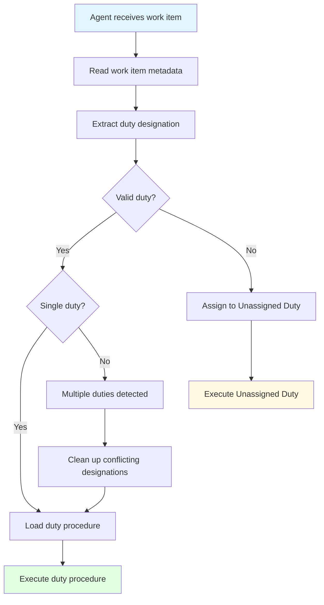

# Core Concepts: Layered Architecture for Prompt Engineering

**Purpose**: Define the conceptual model and terminology for the layered prompt architecture

**Related**: [Main Design Document](README.md)

---

## Overview

The prompt engineering system is built on a **layered architecture** that separates concerns and enables platform portability. This document defines the core concepts that underpin the design.

---

## The Operating System Analogy

Think of the prompt system like an **operating system**:

| OS Component | Prompt System Equivalent | Purpose |
|--------------|-------------------------|---------|
| **Hardware** | Work Tracking Platform (GitHub Issues, Azure DevOps) | The underlying system we need to abstract |
| **Kernel/Driver** | Kernel Layer | Translates generic operations to hardware-specific calls |
| **System Calls** | Semantic Operations | Standard interface applications use |
| **Libraries** | Global Procedures | Reusable functionality all programs need |
| **Applications** | Duties | Specific programs that do actual work |
| **Shell** | Orchestration (copilot-instructions.md) | Entry point that launches applications |

**Key Insight**: Just as Linux can run on different hardware (Intel, ARM, RISC-V) by swapping drivers, our prompt system can work with different platforms (GitHub, Azure DevOps) by swapping kernel implementations.

---

## Layer Definitions

### Layer 3: Kernel (Platform-Specific)

**Conceptual Role**: The "device driver" that knows how to talk to specific hardware

**Real World Examples**:
- Linux has drivers for different network cards
- Our system has drivers for different work trackers

**What Lives Here**:
- Platform-specific API calls (GitHub MCP tools, Azure DevOps REST API)
- Authentication and connection handling
- Mapping semantic operations → platform operations
- Platform configuration

**Who Uses It**:
- Procedures (Layer 1) through semantic operations
- Duties (Layer 2) through semantic operations
- **NOT directly used by** higher layers - only through semantic operations

**Analogy**: Like how applications call `open()` instead of directly talking to disk controllers

**File Location**: `.team/kernel/`

**Key Principle**: **Encapsulation** - Platform specifics NEVER leak out of this layer

---

### Layer 1: Global Procedures

**Conceptual Role**: The "standard library" that all applications can use

**Real World Examples**:
- C standard library (malloc, printf, etc.)
- Python standard library (os, sys, json, etc.)

**What Lives Here**:
- Duty assignment (map work item → duty)
- Multi-phase work item handling (parent/child relationships)
- Self-improvement feedback loop
- Documentation standards
- Common work item operations

**Who Uses It**:
- Orchestration layer (Layer 0) imports and uses
- Duties (Layer 2) reference and reuse
- **NOT platform-specific** - uses semantic operations only

**Analogy**: Like how every C program can use `malloc()` without knowing OS memory management details

**File Location**: `.team/procedures/`

**Key Principle**: **Reusability** - Write once, use in all duties

---

### Layer 2: Duties (Specialized Procedures)

**Conceptual Role**: The "applications" that do specific jobs

**Real World Examples**:
- Web browser application
- Text editor application
- Email client application

**What Lives Here**:
- Triage Duty - Assess and route work items
- Research Duty - Validate technical approaches
- Implementation Duty - Build solutions
- Process Modeling Duty - Improve the system
- Unassigned Duty - Handle edge cases

**Who Uses It**:
- Orchestration layer dispatches to appropriate duty
- Duties may reference global procedures
- **NOT directly called by other duties** - handover via work item creation

**Analogy**: Like how clicking a `.pdf` launches PDF reader, not Word

**File Location**: `.team/duties/`

**Key Principle**: **Specialization** - Each duty has a specific responsibility

---

### Layer 0: Orchestration

**Conceptual Role**: The "shell" or "init system" that starts everything

**Real World Examples**:
- bash shell that runs commands
- systemd that starts services

**What Lives Here**:
- Layer imports (load kernel, procedures)
- Duty assignment invocation
- Duty dispatch logic
- Entry point for agents

**Who Uses It**:
- This is the entry point - agents start here
- No other layer calls orchestration

**Analogy**: Like `main()` in a C program

**File Location**: `.github/copilot-instructions.md`

**Key Principle**: **Coordination** - Tie all layers together

---

## The "Workflow" Overloading Problem

### Current Conflated Meanings

The term "workflow" currently means multiple things:

1. **GitHub Actions Workflow** (`.github/workflows/ci.yml`) - CI/CD automation
2. **Agent Workflow** (`RESEARCH_WORKFLOW.md`) - Agent process/procedure
3. **Workflow Label** (`workflow:research`) - GitHub label format

This creates confusion:
- "Update the workflow" - Which one?
- "Workflow failed" - CI or agent?
- "Workflow queue" - GitHub Actions or agent duties?

### Solution: Semantic Separation

| Concept | Old Term | New Term | Context |
|---------|----------|----------|---------|
| CI/CD automation | Workflow | **Workflow** | Keep for `.github/workflows/` |
| Agent process | Workflow | **Duty** | Agent responsibilities |
| GitHub label | workflow:name | **Duty designation** | Abstract the label mechanism |

**Example Transformations**:

**Before**:
> "Check the issue's workflow label to determine which workflow to execute"

**After**:
> "Check the work item's duty designation to determine which duty to execute"

---

## Semantic Operations vs. Kernel Operations

### The Abstraction Principle

**Problem**: If procedures call platform-specific operations directly, we can't change platforms

**Solution**: Procedures call semantic operations; kernel maps to platform

### Example: Creating a Work Item

**Semantic Operation** (what procedures use):
```python
create_work_item(
    type="research",
    title="Investigate approach X",
    description="Need to validate...",
    duty="research"
)
```

**Kernel Implementation - GitHub**:
```python
def create_work_item(type, title, description, duty):
    return issue_write(
        method="create",
        owner="uniun-technology",
        repo="lib-dataflow",
        title=title,
        body=description,
        labels=[f"workflow:{duty}", type]
    )
```

**Kernel Implementation - Azure DevOps**:
```python
def create_work_item(type, title, description, duty):
    return azuredevops_api.create_work_item(
        project="lib-dataflow",
        work_item_type=type,
        title=title,
        description=description,
        tags=[f"duty:{duty}"]
    )
```

**Key Insight**: The procedure code stays the same. Only the kernel changes.

---

## Duty Assignment Conceptual Model

### Purpose

Map incoming work items to the appropriate duty based on metadata

### Process Flow



### Duty Designation Mechanisms

| Platform | Mechanism | Example |
|----------|-----------|---------|
| GitHub Issues | Labels with prefix | `workflow:research` |
| Azure DevOps | Tags with prefix | `duty:research` |
| Jira | Custom field | `duty=research` |

**Key Principle**: Procedures use `get_work_item_duty()` semantic operation, kernel handles platform details

---

## Separation of Concerns

### Why Layering Matters

**Without Layers** (Current State):
```
[Procedure] --> [GitHub MCP Tools]
```
- Tight coupling
- Can't change platforms
- Platform logic mixed with business logic

**With Layers** (Proposed):
```
[Procedure] --> [Semantic Ops] --> [Kernel] --> [Platform]
```
- Loose coupling
- Swap platforms by changing kernel
- Clear separation of concerns

### What Goes Where?

**❌ Anti-Pattern** - Platform operations in procedures:
```markdown
<!-- In RESEARCH_DUTY.md -->
Create handover issue:
```python
issue_write(
    method="create",
    owner="uniun-technology",
    repo="lib-dataflow",
    labels=["workflow:implementation"],
    body="..."
)
```
```

**✅ Correct Pattern** - Semantic operations in procedures:
```markdown
<!-- In RESEARCH_DUTY.md -->
Create handover work item:
```python
create_work_item(
    type="implementation",
    title="Implement validated design",
    description="...",
    duty="implementation"
)
```

_Implementation note: See [kernel operations](../kernel/README.md#create_work_item) for platform mapping._
```

---

## Platform Portability

### The Vision

Change platforms by swapping only the kernel layer:

**Current Platform (GitHub)**:
```
.team/kernel/
├── config.yaml          # platform: github
└── github/
    └── operations.md    # GitHub MCP tool mappings
```

**Future Platform (Azure DevOps)**:
```
.team/kernel/
├── config.yaml          # platform: azuredevops
└── azuredevops/
    └── operations.md    # Azure DevOps API mappings
```

**Everything else stays the same**:
- ✅ Global procedures - unchanged
- ✅ Duty procedures - unchanged
- ✅ Orchestration - unchanged
- ✅ Design principles - unchanged

### Platform Switch Process

1. Implement new kernel driver (`.team/kernel/azuredevops/`)
2. Update config (`.team/kernel/config.yaml` → `platform: azuredevops`)
3. **Done** - All procedures work with new platform

**Estimated Effort**:
- Without layering: **Rewrite 80% of all procedures** (~40-60 hours)
- With layering: **Implement kernel driver only** (~8-12 hours)

---

## Key Takeaways

1. **Layers separate concerns**: Each layer has a distinct responsibility
2. **Kernel encapsulates platform**: Only layer that knows GitHub vs Azure DevOps
3. **Semantic operations abstract details**: Procedures use generic operations
4. **Duties are specialized**: Each handles specific work type
5. **Global procedures are reusable**: Shared across all duties
6. **Platform portability is the goal**: Swap platforms with minimal effort

---

## Further Reading

- [Main Design Document](README.md) - Complete design with principles and migration
- [Semantic Language Reference](semantic-language.md) - All semantic operations defined
- [Migration Guide](migration-guide.md) - Step-by-step transition plan
