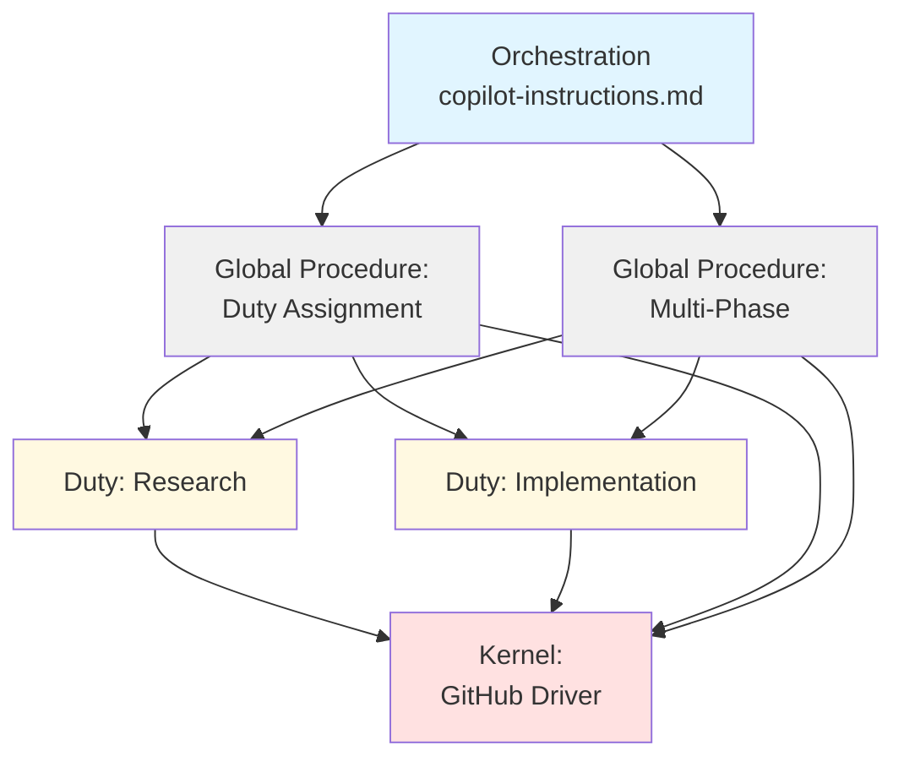
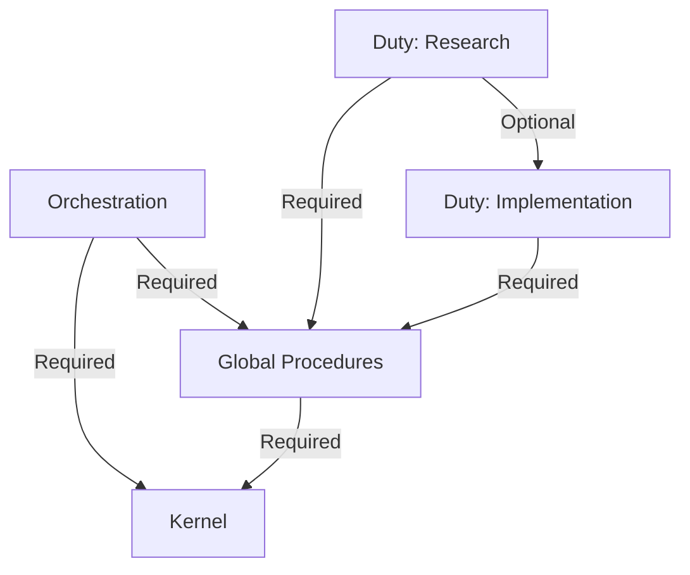
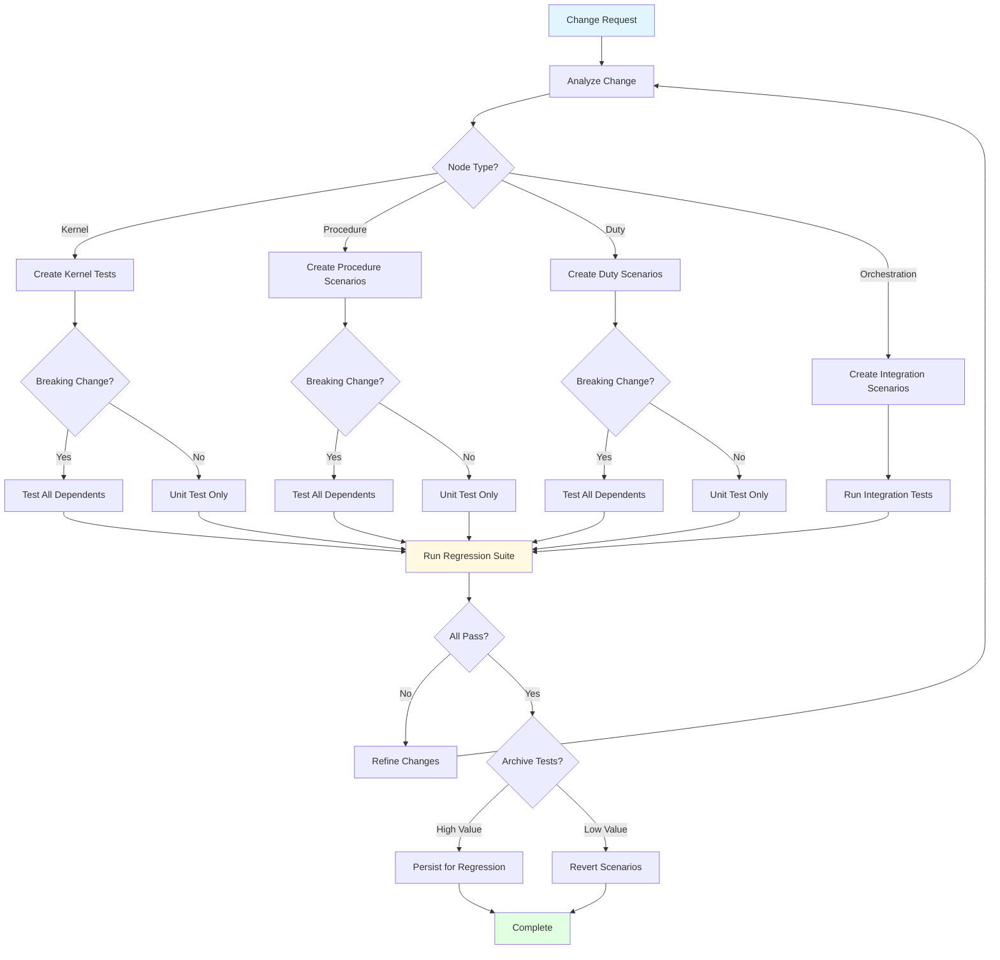

# Testing Framework for Layered Prompt Architecture

**Purpose**: Define comprehensive testing methodology for validating changes to the layered prompt system

**Related**: [Main Design Document](README.md) | [Core Concepts](concepts.md)

---

## Overview

Testing a prompt-based AI agent system requires a different approach than traditional software testing. This document defines a **graph-based testing framework** where each node type (kernel, procedures, duties) has specific test methodologies, and dependencies between nodes determine test scope.

**Key Principle**: Tests are **fuzzy** (generative AI responses) but **valuable** - they force agents to think through scenarios and catch issues that would otherwise be missed.

---

## Testing Philosophy for AI Agents

### Why Tabletop Tests Work Despite Being "Fuzzy"

**The Question**: If generative AI can hallucinate any answer, why are scenario tests meaningful?

**The Answer**: Tabletop tests work through **constrained reasoning**:

1. **Context Constraint**: The scenario provides specific context that limits the solution space
2. **Procedure Constraint**: The agent must follow documented procedures step-by-step
3. **Verification Constraint**: Expected outcomes are defined, forcing the agent to match them
4. **Documentation Constraint**: The agent reviews actual prompt files, not memory

**Analogy**: Like a human developer doing a code review - they could "fake it", but the act of methodically working through scenarios reveals real issues.

**What Tabletop Tests Catch**:
- ✅ Missing instructions or steps
- ✅ Ambiguous language that leads to wrong interpretations
- ✅ Circular references or broken links
- ✅ Gaps in logic or decision points
- ✅ Conflicting guidance between documents
- ✅ Edge cases not handled

**What They Don't Catch**:
- ❌ Runtime platform errors (no actual GitHub API calls)
- ❌ Performance issues
- ❌ Concurrency problems

**Value Proposition**: Better than no testing. Forces systematic thinking. Catches >70% of issues before human review.

---

## Graph-Based Testing Model

The prompt system is a **directed acyclic graph (DAG)** where:
- **Nodes**: Kernel, Global Procedures, Duty Procedures, Orchestration
- **Edges**: Dependencies (e.g., Duty → Procedure → Kernel)
- **Changes**: Flow through the graph based on dependency impact



**Dependency Rules**:
- **Upstream changes** (kernel) impact downstream (procedures, duties)
- **Breaking changes** require testing all dependents
- **Additive changes** only require unit testing
- **Orchestration changes** require full integration testing

---

## Node Types and Test Methodologies

### Node Type 1: Kernel

**What Lives Here**: Platform-specific drivers (GitHub, Azure DevOps)

**Unit Test Methodology**: **Semantic Contract Testing**

**Test Focus**:
- Each semantic operation behaves correctly
- Platform-specific implementation matches specification
- Error handling for platform failures
- Configuration changes work correctly

**Test Creation Process**:

1. **Identify Changed Operations**
   - Which semantic operations were added/modified/removed?
   - Is change additive (new operation) or breaking (signature change)?

2. **Create Kernel Test Scenarios**
   - For each operation, create scenario testing:
     - Success case
     - Failure case (platform error)
     - Edge case (empty results, large results)

3. **Mock Platform Responses**
   - Simulate GitHub/Azure DevOps responses
   - Test kernel logic without actual API calls

**Example Kernel Test Scenario**:

```markdown
# Kernel Test: create_work_item - Success Case

## Semantic Operation
`create_work_item(type="research", title="Test", description="...", duty="research")`

## Expected GitHub Implementation
```python
issue_write(
    method="create",
    owner="uniun-technology",
    repo="lib-dataflow",
    title="Test",
    body="...",
    labels=["workflow:research", "research"]
)
```

## Mock Platform Response
```json
{
    "id": "123",
    "number": 123,
    "state": "open"
}
```

## Expected Semantic Result
`work_item_id = "123"`

## Test Execution
1. Load kernel with GitHub driver
2. Call semantic operation
3. Verify platform call matches expected
4. Verify result matches expected

## Pass Criteria
- ✅ Correct platform API called
- ✅ Parameters correctly mapped
- ✅ Result correctly returned
```

**Persistence Strategy**: **Always persist kernel tests**
- High value for regression testing
- Platform changes can break implementations
- Reference for implementing new drivers

**Test Location**: `.team/kernel/tests/`

**Change Impact Analysis**:

| Change Type | Example | Test Scope |
|-------------|---------|------------|
| **New operation (additive)** | Add `archive_work_item()` | Unit test new operation only |
| **Signature change (breaking)** | Change `create_work_item()` parameters | Unit test + test all dependents |
| **Implementation fix (internal)** | Fix bug in mapping logic | Unit test operation only |
| **New driver** | Add Azure DevOps driver | Full test suite for new driver |

---

### Node Type 2: Global Procedures

**What Lives Here**: Universal agent knowledge (duty assignment, multi-phase, self-improvement)

**Unit Test Methodology**: **Scenario-Based Tabletop Testing**

**Test Focus**:
- Procedures are clear and unambiguous
- No missing steps or logical gaps
- Edge cases are handled
- Semantic operations used correctly

**Test Creation Process**:

1. **Analyze Change**
   - What procedure was added/modified?
   - What scenarios does it need to handle?
   - What edge cases exist?

2. **Create Test Scenarios**
   - Baseline: Current state (if modifying existing)
   - Improved: With proposed changes
   - Edge Cases: Boundary conditions
   - Regression: Ensure no side effects

3. **Execute Tabletop Simulation**
   - Read scenario as if you're an agent
   - Follow procedure step-by-step
   - Note where instructions are unclear
   - Verify expected outcome

**Example Global Procedure Test Scenario**:

```markdown
# Scenario: Duty Assignment - Multiple Labels

## Context
Work item has multiple duty designations (label pollution)

## Starting State
- Work item #123 exists
- Has labels: `workflow:research`, `workflow:implementation`
- Agent receives work item

## Procedure to Follow
[Duty Assignment Procedure](../procedures/duty-assignment.md)

## Steps
1. Call `get_work_item_duty(work_item_id="123")`
2. Procedure detects multiple duties
3. Should provide clear guidance on cleanup

## Expected Outcome
- Agent recognizes multiple duties as conflict
- Removes conflicting labels
- Keeps correct duty based on context
- Adds cleanup comment to work item

## Success Criteria
- [ ] Conflict detected clearly
- [ ] Cleanup steps are unambiguous
- [ ] Agent knows which duty to keep
- [ ] No agent confusion or backtracking

## Test Result
**Status**: PASS/FAIL
**Agent Observations**: [What happened when following procedure]
**Issues Found**: [Unclear steps, missing info, etc.]
```

**Persistence Strategy**: **Selective persistence based on value**

Keep if:
- ✅ Tests complex decision logic (multiple conditions)
- ✅ High regression risk (frequently used procedure)
- ✅ Time-consuming to recreate (>30 min)
- ✅ Reference value for future development

Revert if:
- ❌ One-time validation (improvement confirmed)
- ❌ Simple verification
- ❌ Low regression risk

**Test Location**: 
- Active testing: `/research/workflow-modeling/scenarios/procedures/`
- Archived: `/research/workflow-modeling/regression-tests/procedures/`

**Change Impact Analysis**:

| Change Type | Example | Test Scope |
|-------------|---------|------------|
| **New procedure** | Add "conflict resolution" | 3-5 scenarios covering main cases |
| **Modify procedure** | Update duty assignment logic | Retest all scenarios + add new edge cases |
| **Fix ambiguity** | Clarify unclear step | Retest scenarios that hit that step |
| **Breaking change** | Change semantic operation used | Test procedure + all duties using it |

---

### Node Type 3: Duty Procedures

**What Lives Here**: Specialized responsibilities (Triage, Research, Implementation, etc.)

**Unit Test Methodology**: **End-to-End Scenario Testing**

**Test Focus**:
- Complete duty flow works correctly
- Handovers to other duties work
- Semantic operations used correctly
- Agent can complete assigned work

**Test Creation Process**:

1. **Identify Duty Scope**
   - What is this duty responsible for?
   - What are typical work items it handles?
   - What edge cases exist?

2. **Create Representative Scenarios**
   - Happy path: Typical work item processed successfully
   - Edge case: Unusual but valid scenario
   - Handover: Transitioning to another duty
   - Error handling: What if something goes wrong?

3. **Execute Tabletop Simulation**
   - Start from duty assignment
   - Follow duty procedure end-to-end
   - Verify semantic operations used correctly
   - Confirm expected outcome

**Example Duty Test Scenario**:

```markdown
# Scenario: Research Duty - Successful Investigation

## Context
Work item requests research on caching strategy

## Starting State
- Work item #456 with duty designation "research"
- Title: "Investigate caching approach"
- Description: "Evaluate Redis vs in-memory"

## Procedure to Follow
[Research Duty](../duties/RESEARCH_DUTY.md)

## Steps
1. Agent assigned to research duty
2. Creates research folder using semantic operation
3. Documents research plan
4. Conducts investigation
5. Creates handover work item for implementation
6. Transitions duty using `assign_work_item_to_duty()`

## Expected Outcome
- Research folder created at `/research/caching-strategy/`
- Research plan documented
- Findings documented
- Implementation work item created with duty="implementation"
- Original work item closed

## Success Criteria
- [ ] Clear guidance for each phase
- [ ] Semantic operations used correctly
- [ ] Handover process clear
- [ ] No missing steps

## Test Result
**Status**: PASS/FAIL
**Agent Observations**: [Following duty procedure]
**Semantic Operations Used**:
- `create_research_folder()`
- `create_work_item(type="implementation", duty="implementation")`
- `assign_work_item_to_duty(work_item_id, duty="closed")`
**Issues Found**: [Problems encountered]
```

**Persistence Strategy**: **Keep high-value regression tests**

Keep if:
- ✅ Tests complete duty flow
- ✅ Tests complex handover scenarios
- ✅ Tests edge cases likely to regress

Revert if:
- ❌ Simple verification scenarios
- ❌ One-time feature validation

**Test Location**:
- Active: `/research/workflow-modeling/scenarios/duties/[duty-name]/`
- Archived: `/research/workflow-modeling/regression-tests/duties/[duty-name]/`

**Change Impact Analysis**:

| Change Type | Example | Test Scope |
|-------------|---------|------------|
| **New duty** | Add "Unassigned Duty" | 4-7 scenarios covering duty scope |
| **Modify duty logic** | Change research folder structure | Retest affected scenarios + add new ones |
| **Change semantic op usage** | Switch to new work item creation API | Test duty + verify kernel mapping |
| **Breaking change** | Require new field in handover | Test duty + all duties it hands over to |

---

### Node Type 4: Orchestration

**What Lives Here**: Entry point (copilot-instructions.md)

**Unit Test Methodology**: **Integration Scenario Testing**

**Test Focus**:
- Correct duty assignment from work item
- Layer imports work correctly
- Dispatch to appropriate duty succeeds
- End-to-end flow from entry to completion

**Test Creation Process**:

1. **Create Full-Stack Scenarios**
   - Start from agent receiving work item
   - Include copilot-instructions dispatch
   - Follow through duty execution
   - Verify complete flow

2. **Test Layer Integration**
   - Kernel loads correctly
   - Global procedures accessible
   - Duty dispatch works
   - Semantic operations bridge correctly

**Example Orchestration Test Scenario**:

```markdown
# Integration Test: End-to-End Research Flow

## Context
Agent receives work item, processes through complete system

## Starting Point
- Fresh agent instance (no prior context)
- Work item #789 with duty="research"

## System Components in Scope
- Orchestration (copilot-instructions.md)
- Global Procedure (duty assignment)
- Research Duty
- Kernel (GitHub driver)

## Steps
1. Agent starts at copilot-instructions.md
2. Imports kernel and procedures
3. Runs duty assignment procedure
4. Extracts duty="research" from work item
5. Loads Research Duty procedure
6. Executes research duty
7. Uses semantic operations (kernel handles)

## Expected Outcome
- Correct duty identified
- Research duty executed
- Semantic operations translated to GitHub
- Work completed successfully

## Success Criteria
- [ ] Clear integration between layers
- [ ] No broken references
- [ ] Semantic operations work end-to-end
- [ ] Complete flow successful

## Test Result
**Status**: PASS/FAIL
**Layer Integration**: [How well layers worked together]
**Issues Found**: [Integration problems]
```

**Persistence Strategy**: **Always keep integration tests**
- High value for system-level validation
- Catch integration issues between layers
- Reference for understanding complete flow

**Test Location**: `/research/workflow-modeling/regression-tests/integration/`

---

## Change Procedures by Node Type

Each node type has specific guidance for making changes:

### Kernel Change Procedure

**Before Making Changes**:
1. ✅ Review semantic operation specification
2. ✅ Check if change is additive or breaking
3. ✅ Identify impacted procedures/duties
4. ✅ Review platform documentation (GitHub API, etc.)

**During Changes**:
1. ✅ Update implementation
2. ✅ Update semantic mapping documentation
3. ✅ Create/update unit tests
4. ✅ Verify backward compatibility (if applicable)

**After Changes**:
1. ✅ Run kernel unit tests
2. ✅ If breaking: Identify and test all dependents
3. ✅ If additive: Test new operation only
4. ✅ Update kernel README with examples
5. ✅ Document in change log

### Global Procedure Change Procedure

**Before Making Changes**:
1. ✅ Understand current procedure behavior
2. ✅ Identify what's changing and why
3. ✅ Check which duties use this procedure
4. ✅ Review existing test scenarios

**During Changes**:
1. ✅ Make procedure changes
2. ✅ Ensure semantic operations used (not kernel calls)
3. ✅ Create test scenarios (3-5 typical)
4. ✅ Document expected behavior clearly

**After Changes**:
1. ✅ Run tabletop simulations
2. ✅ Refine based on FAIL results
3. ✅ **Run kernel leak detection check** (see [Kernel Leak Detection](#kernel-leak-detection))
4. ✅ Run regression tests if available
5. ✅ Test impacted duties if breaking change
6. ✅ Archive valuable scenarios

### Duty Change Procedure

**Before Making Changes**:
1. ✅ Review duty's role and responsibilities
2. ✅ Check what procedures it references
3. ✅ Understand handover points to other duties
4. ✅ Review existing test scenarios

**During Changes**:
1. ✅ Update duty procedure
2. ✅ Use semantic operations only
3. ✅ Create end-to-end test scenarios
4. ✅ Document handover processes clearly

**After Changes**:
1. ✅ Run duty test scenarios
2. ✅ Test handovers to other duties
3. ✅ **Run kernel leak detection check** (see [Kernel Leak Detection](#kernel-leak-detection))
4. ✅ Verify semantic operations work
5. ✅ Run regression tests if available
6. ✅ Archive valuable scenarios

### Orchestration Change Procedure

**Before Making Changes**:
1. ✅ Understand current dispatch logic
2. ✅ Check layer import dependencies
3. ✅ Review duty assignment procedure
4. ✅ Plan integration test scenarios

**During Changes**:
1. ✅ Update orchestration logic
2. ✅ Ensure layer imports correct
3. ✅ Verify dispatch logic accurate
4. ✅ Create integration test scenarios

**After Changes**:
1. ✅ Run full integration tests
2. ✅ Test each duty dispatch path
3. ✅ **Run kernel leak detection check** (see [Kernel Leak Detection](#kernel-leak-detection))
4. ✅ Verify end-to-end flows
5. ✅ Run all regression tests
6. ✅ Archive integration scenarios

---

## Kernel Leak Detection

### Overview

**Critical Principle**: Kernel-level concepts must **never leak** into dependent nodes (procedures, duties, orchestration).

**Why This Matters**:
- Maintains platform portability
- Prevents tight coupling to specific platforms
- Enables adding new kernel domains without changing dependents
- Ensures semantic abstraction integrity

### What is a "Kernel Leak"?

A kernel leak occurs when platform-specific operations or terminology appear outside the kernel layer.

**Examples of Kernel Leaks** (❌ Anti-Patterns):

```markdown
<!-- In Global Procedure (WRONG) -->
To create a work item:
```python
issue_write(
    method="create",
    owner="uniun-technology",
    repo="lib-dataflow",
    labels=["workflow:research"]
)
```
```

**Problem**: Uses GitHub-specific MCP tool directly instead of semantic operation.

```markdown
<!-- In Duty Procedure (WRONG) -->
Query the GitHub Issues API to find work items with the workflow:research label.
```

**Problem**: References platform-specific terminology (GitHub Issues, workflow: label format).

**Correct Approach** (✅ Using Semantic Operations):

```markdown
<!-- In Global Procedure (CORRECT) -->
To create a work item:
```python
create_work_item(
    type="research",
    title="...",
    description="...",
    duty="research"
)
```

_Implementation: See [kernel operations](../kernel/README.md#create_work_item) for platform mapping._
```

```markdown
<!-- In Duty Procedure (CORRECT) -->
Query work items assigned to this duty using the semantic operation.
```

### Leak Detection Check Procedure

**When to Run**: After ANY change to non-kernel nodes (procedures, duties, orchestration)

**Process**:

1. **Identify Changed Files**
   - List all modified files outside `.team/kernel/`
   - Include procedures, duties, orchestration

2. **Review for Platform-Specific References**
   
   **Search for Kernel-Specific Terms**:
   - GitHub-specific: `issue_write`, `issue_read`, `list_issues`, `GitHub Issues`, `workflow:` (label format)
   - Azure DevOps-specific: `work item API`, `DevOps`, `tags:`
   - Platform URLs, authentication details
   - Any MCP tool calls (should only be in kernel)

3. **Categorize Findings**
   
   For each finding, determine:
   - ✅ **False Positive**: Reference is in documentation/examples pointing to kernel
   - ⚠️ **Legitimate Kernel Reference**: Cross-reference to kernel docs (acceptable if properly documented)
   - ❌ **Kernel Leak**: Direct use of platform-specific operation or terminology

4. **Refactor Kernel Leaks**
   
   For each leak found:
   
   **Step 1**: Identify the semantic operation needed
   - What is the intent? (create work item, query items, etc.)
   - Check [semantic language reference](semantic-language.md) for existing operation
   
   **Step 2**: Use semantic operation
   - Replace platform-specific call with semantic operation
   - Add implementation note pointing to kernel docs
   
   **Step 3**: Verify semantic operation exists in kernel
   - Check kernel implements the operation
   - If missing, add to kernel first, then use in dependent

5. **Document Check Results**
   
   Add to change commit message:
   ```
   ✅ Kernel Leak Check: PASS
   - Reviewed [N] files outside kernel
   - Found [N] references (all legitimate cross-references)
   - No leaks detected
   ```
   
   Or if leaks found and fixed:
   ```
   ✅ Kernel Leak Check: FIXED
   - Found [N] kernel leaks in [files]
   - Refactored to use semantic operations: [list operations]
   - Verified kernel implementations exist
   ```

### Automated Leak Detection Pattern

**For Process Modeling Workflow** (when reviewing changes):

```python
# Pseudo-code for leak detection
def check_for_kernel_leaks(changed_files):
    """
    Check for kernel leaks in changed files outside kernel layer.
    """
    # Define kernel-specific patterns per domain
    kernel_patterns = {
        "github": [
            r"issue_write\(",
            r"issue_read\(",
            r"list_issues\(",
            r"add_issue_comment\(",
            r"GitHub Issues",
            r"workflow:[a-z-]+",  # Label format
            r"github\.com"
        ],
        "azuredevops": [
            r"work item API",
            r"DevOps",
            r"tags:[a-z-]+",
            r"dev\.azure\.com"
        ]
        # Add new kernel domains here
    }
    
    leaks = []
    
    for file in changed_files:
        # Skip kernel files
        if file.startswith(".team/kernel/"):
            continue
        
        content = read_file(file)
        
        # Check against all kernel domain patterns
        for domain, patterns in kernel_patterns.items():
            for pattern in patterns:
                matches = find_matches(content, pattern)
                
                for match in matches:
                    # Check if it's a legitimate reference
                    if is_legitimate_reference(match, content):
                        continue
                    
                    # Kernel leak detected
                    leaks.append({
                        "file": file,
                        "domain": domain,
                        "pattern": pattern,
                        "match": match,
                        "line": get_line_number(content, match)
                    })
    
    return leaks

def is_legitimate_reference(match, content):
    """
    Check if reference is legitimate (e.g., in documentation pointing to kernel).
    """
    # Check if in a cross-reference comment
    if "See [kernel" in context_around(match, content):
        return True
    
    # Check if in implementation note
    if "_Implementation:" in context_around(match, content):
        return True
    
    # Check if in example showing what NOT to do
    if "❌" in context_around(match, content) or "WRONG" in context_around(match, content):
        return True
    
    return False
```

### Extensible Kernel Domain Pattern

**Design Goal**: Support adding new kernel domains (e.g., Artifacts subsystem) without modifying change procedures.

**Implementation Pattern**:

1. **Kernel Domain Registry**
   
   Create `.team/kernel/domains.yaml`:
   ```yaml
   # Registry of kernel domains
   domains:
     - name: github
       path: .team/kernel/github/
       patterns:
         - "issue_write"
         - "issue_read"
         - "list_issues"
         - "GitHub Issues"
       
     - name: artifacts
       path: .team/kernel/artifacts/
       patterns:
         - "artifact_store"
         - "upload_artifact"
         - "download_artifact"
   
     # Add new domains here
   ```

2. **Generic Leak Detection**
   
   Leak detection automatically checks against ALL registered domains:
   
   ```python
   # Load domains from registry
   domains = load_kernel_domains(".team/kernel/domains.yaml")
   
   # Check against all domains
   for file in changed_files:
       if not is_in_kernel(file, domains):
           check_for_leaks(file, domains)
   ```

3. **Adding New Kernel Domain**
   
   **Steps**:
   - Create new kernel driver: `.team/kernel/[domain]/`
   - Define semantic operations for domain
   - Register domain in `domains.yaml`
   - **No changes needed** to procedures, duties, or orchestration
   - Leak detection automatically includes new domain

**Example - Adding Artifacts Kernel Domain**:

```yaml
# .team/kernel/domains.yaml
domains:
  - name: github
    path: .team/kernel/github/
    patterns: [...]
  
  - name: artifacts
    path: .team/kernel/artifacts/
    patterns:
      - "artifact_upload"
      - "artifact_download"
      - "artifact_store"
      - "S3"
      - "Azure Blob"
    semantic_operations:
      - store_artifact
      - retrieve_artifact
      - list_artifacts
```

**Procedure using artifacts** (platform-agnostic):
```markdown
## Storing Research Artifacts

Store research findings using:
```python
store_artifact(
    type="research",
    name="performance-analysis.pdf",
    content=research_report,
    metadata={"issue": work_item_id}
)
```

_Implementation: See [artifacts kernel](../kernel/artifacts/README.md) for storage platform mapping._
```

**Kernel implements** (platform-specific):
```python
# .team/kernel/artifacts/operations.md

def store_artifact(type, name, content, metadata):
    """
    Stores artifact in configured storage platform.
    
    Current Platform: Azure Blob Storage
    Alternative: AWS S3, Local Filesystem
    """
    if platform == "azureblob":
        return blob_client.upload_blob(
            container=f"artifacts-{type}",
            name=name,
            data=content,
            metadata=metadata
        )
    elif platform == "s3":
        return s3_client.put_object(
            Bucket=f"artifacts-{type}",
            Key=name,
            Body=content,
            Metadata=metadata
        )
```

### Integration with Process Modeling Workflow

**Add to Process Modeling Workflow** (`.team/prompts/PROCESS_MODELING_WORKFLOW.md`):

#### Kernel Leak Detection (Required Step)

**When**: After making changes to any non-kernel files (procedures, duties, orchestration)

**Procedure**:

1. **Run Leak Detection Check**
   ```python
   # List changed files
   changed_files = get_changed_files()
   
   # Filter to non-kernel files
   non_kernel_files = [f for f in changed_files if not f.startswith(".team/kernel/")]
   
   # Check for leaks
   leaks = check_for_kernel_leaks(non_kernel_files)
   ```

2. **Review Findings**
   - If no leaks: ✅ Proceed to testing
   - If leaks found: ⚠️ Must refactor before testing

3. **Refactor Leaks**
   - Replace each leak with appropriate semantic operation
   - Verify semantic operation exists in kernel
   - Add implementation notes

4. **Re-run Check**
   - Verify all leaks resolved
   - Document in commit message

**Success Criteria**:
- ✅ Zero kernel leaks in non-kernel files
- ✅ All platform-specific operations use semantic layer
- ✅ Cross-references to kernel properly documented

### Anti-Patterns to Avoid

❌ **Direct Platform API Calls in Procedures**
```markdown
# In duty procedure (WRONG)
issue_write(method="create", owner="...", repo="...", labels=["workflow:research"])
```

✅ **Use Semantic Operations**
```markdown
# In duty procedure (CORRECT)
create_work_item(type="research", duty="research", ...)
```

---

❌ **Platform-Specific Terminology in Duties**
```markdown
# In duty (WRONG)
"Check the GitHub workflow:research label to confirm assignment"
```

✅ **Platform-Agnostic Terminology**
```markdown
# In duty (CORRECT)
"Verify work item duty assignment using get_work_item_duty()"
```

---

❌ **Mixing Kernel and Semantic Operations**
```markdown
# In procedure (WRONG)
duty = get_work_item_duty(work_item_id)  # Semantic
issue_write(method="update", ...)         # Kernel - LEAK!
```

✅ **Consistent Semantic Operations**
```markdown
# In procedure (CORRECT)
duty = get_work_item_duty(work_item_id)      # Semantic
update_work_item(work_item_id, status=...)   # Semantic
```

### Benefits of Leak Detection

1. **Platform Portability**: Switch platforms without modifying procedures/duties
2. **Extensibility**: Add new kernel domains (artifacts, notifications, etc.) without breaking existing code
3. **Clear Architecture**: Enforces separation of concerns
4. **Easier Maintenance**: Platform changes isolated to kernel layer
5. **Better Testing**: Procedures testable independent of platform
6. **Documentation Quality**: Forces explicit semantic operation usage

---

## Graph-Wide Dependency Management

### Overview

Building on the kernel leak detection concept, we extend leak detection to the **entire dependency graph**. This ensures that:
- Dependent nodes don't duplicate content from dependencies
- Dependencies are properly referenced, not copied
- The graph structure remains explicit and parseable

### Dependency Graph Structure

The prompt system is a **Directed Acyclic Graph (DAG)** where:
- **Nodes**: Kernel drivers, Global Procedures, Duty Procedures, Orchestration
- **Edges**: Dependencies between nodes (e.g., Duty → Procedure → Kernel)
- **Edge Types**: Required Context (must-read) vs Optional Context (supplemental)

**Example Graph**:


### Edge Types: Required vs Optional Context

**Two Types of Dependencies**:

1. **Required Context** - Must be loaded before proceeding
2. **Optional Context** - Useful to reference, may not be needed

#### Required Context

**When to Use**:
- Dependency contains procedures that **must** be followed
- Dependency defines terminology or operations **essential** to understanding
- Without this context, the dependent cannot function correctly

**Examples**:
- Duty → Global Procedures (duty must know multi-phase procedures)
- Global Procedures → Kernel (procedures must use semantic operations)
- Orchestration → Duty Assignment Procedure (orchestration must dispatch correctly)

**Standard Format** (top of document):
```markdown
## Required Context

**⚠️ IMPORTANT**: Read the following documents before proceeding:

- **[Document Name](../path/to/document.md)** - Brief description of why it's required
- **[Another Document](../path/to/another.md)** - Another brief description

---
```

**Characteristics**:
- Declared at **top of document** (after title, before main content)
- Agent **must stop and read** before continuing
- **Recursive**: If required doc also has required dependencies, load those too
- Use ⚠️ emoji for visibility

#### Optional Context

**When to Use**:
- Dependency provides supplemental information
- Dependency is relevant for specific scenarios only
- Dependency shows examples or alternative approaches

**Examples**:
- Duty → Another Duty (for handover reference)
- Procedure → Analysis Document (for background context)
- Any node → ADR (architectural decision rationale)

**Standard Format** (inline where relevant):
```markdown
For more details on [specific topic], see [Document Name](../path/to/document.md).

_Supplemental: [Document Name](../path/to/document.md) provides additional context on [topic]._
```

**Characteristics**:
- Appear **inline** where relevant
- Agent reads **if needed** for current scenario
- Brief description encouraged
- No special emoji required

### Standard Reference Formats

**Design Goal**: References must be:
1. **Human-Readable** - Clear in documentation
2. **Machine-Parseable** - Detectable by CLI tools/scripts
3. **Consistent** - Same pattern across all documents

#### Required Context Reference Format

**Template**:
```markdown
## Required Context

**⚠️ IMPORTANT**: Read the following documents before proceeding:

- **[{Document Name}]({relative/path/to/file.md})** - {Brief description of why required}
```

**Parsing Pattern**:
```bash
# Regex to detect required context section
^## Required Context$

# Extract required dependencies
\*\*\[(.*?)\]\((.*?)\)\*\* - (.*)
# Captures: [1] = Document Name, [2] = Path, [3] = Description
```

**Example**:
```markdown
## Required Context

**⚠️ IMPORTANT**: Read the following documents before proceeding:

- **[Duty Assignment Procedure](../procedures/duty-assignment.md)** - Explains how to infer duty from work item labels
- **[Multi-Phase Work Items](../procedures/multi-phase-work-items.md)** - Required for creating parent-child work item relationships
```

#### Optional Context Reference Format

**Template**:
```markdown
{Context sentence with link}: see [{Document Name}]({relative/path/to/file.md})

_Supplemental: [{Document Name}]({relative/path/to/file.md}) provides {brief description}_
```

**Parsing Pattern**:
```bash
# Inline links
see \[(.*?)\]\((.*?)\)
# Captures: [1] = Document Name, [2] = Path

# Supplemental references
_Supplemental: \[(.*?)\]\((.*?)\) provides (.*)_
# Captures: [1] = Document Name, [2] = Path, [3] = Description
```

**Example**:
```markdown
For handover procedures to Implementation duty, see [Implementation Duty](../duties/IMPLEMENTATION_DUTY.md).

_Supplemental: [Research Methodology Guide](../guides/research-methodology.md) provides detailed guidance on validation approaches._
```

### Graph Representation Management

**Convention**: The Process Modeling workflow maintains an **explicit graph representation** of the prompt system.

**Graph File**: `.team/model-graph.yaml`

```yaml
# Prompt System Dependency Graph
# Updated: YYYY-MM-DD
# Maintained by: Process Modeling Duty

nodes:
  - id: orchestration
    type: orchestration
    path: /.github/copilot-instructions.md
    
  - id: kernel-github
    type: kernel
    path: .team/kernel/github/README.md
    
  - id: proc-duty-assignment
    type: global-procedure
    path: .team/procedures/duty-assignment.md
    
  - id: duty-research
    type: duty
    path: .team/duties/RESEARCH_DUTY.md

edges:
  - from: orchestration
    to: kernel-github
    type: required
    reason: "Loads platform driver for work item operations"
    
  - from: orchestration
    to: proc-duty-assignment
    type: required
    reason: "Must assign duty before dispatching to duty procedure"
    
  - from: proc-duty-assignment
    to: kernel-github
    type: required
    reason: "Uses get_work_item_duty() semantic operation"
    
  - from: duty-research
    to: proc-duty-assignment
    type: optional
    reason: "Reference for understanding how duty was assigned"
```

**Graph Inference**:

Script to infer graph from standardized references:

```bash
#!/bin/bash
# .team/scripts/infer-graph.sh
# Infers dependency graph from standardized references in prompt files

GRAPH_FILE=".team/model-graph.yaml"

echo "# Auto-Generated Prompt System Dependency Graph" > "$GRAPH_FILE"
echo "# Generated: $(date -u +%Y-%m-%dT%H:%M:%SZ)" >> "$GRAPH_FILE"
echo "" >> "$GRAPH_FILE"
echo "nodes:" >> "$GRAPH_FILE"

# Find all prompt files
find .team .github -name "*.md" | while read -r file; do
    # Extract node info
    node_id=$(basename "$file" .md | tr '[:upper:]' '[:lower:]' | tr '_' '-')
    node_type=$(infer_type_from_path "$file")
    
    echo "  - id: $node_id" >> "$GRAPH_FILE"
    echo "    type: $node_type" >> "$GRAPH_FILE"
    echo "    path: $file" >> "$GRAPH_FILE"
done

echo "" >> "$GRAPH_FILE"
echo "edges:" >> "$GRAPH_FILE"

# Extract required dependencies
find .team .github -name "*.md" | while read -r file; do
    # Find "## Required Context" section
    in_required=false
    while IFS= read -r line; do
        if [[ "$line" =~ ^##\ Required\ Context$ ]]; then
            in_required=true
            continue
        fi
        
        if [[ "$in_required" == true && "$line" =~ ^\*\*\[(.*)\]\((.*)\)\*\*\ -\ (.*) ]]; then
            doc_name="${BASH_REMATCH[1]}"
            doc_path="${BASH_REMATCH[2]}"
            reason="${BASH_REMATCH[3]}"
            
            from_id=$(basename "$file" .md | tr '[:upper:]' '[:lower:]' | tr '_' '-')
            to_id=$(basename "$doc_path" .md | tr '[:upper:]' '[:lower:]' | tr '_' '-')
            
            echo "  - from: $from_id" >> "$GRAPH_FILE"
            echo "    to: $to_id" >> "$GRAPH_FILE"
            echo "    type: required" >> "$GRAPH_FILE"
            echo "    reason: \"$reason\"" >> "$GRAPH_FILE"
        fi
        
        # Exit required section on next header
        if [[ "$in_required" == true && "$line" =~ ^## ]]; then
            break
        fi
    done < "$file"
done
```

**Usage**:
```bash
# Infer graph from references
./.team/scripts/infer-graph.sh

# Validate graph (check for cycles, orphans)
./.team/scripts/validate-graph.sh .team/model-graph.yaml

# Visualize graph
./.team/scripts/visualize-graph.sh .team/model-graph.yaml > graph.mermaid
```

### Graph-Wide Dependency Leak Detection

**Extended Principle**: Not just kernel leaks, but **any dependency content leaking into dependents**.

#### What is a Dependency Leak?

A dependency leak occurs when a dependent node duplicates content from a dependency instead of referencing it.

**Examples**:

❌ **Leak in Duty Procedure**:
```markdown
<!-- In RESEARCH_DUTY.md -->

## Creating Multi-Phase Work Items

To create a parent work item with child work items:
1. Create parent with `create_work_item(...)`
2. For each child, call `create_child_work_item(parent_id, ...)`
3. Link children to parent

<!-- This is DUPLICATING the multi-phase-work-items.md procedure! -->
```

✅ **Correct Reference**:
```markdown
<!-- In RESEARCH_DUTY.md -->

## Required Context

**⚠️ IMPORTANT**: Read the following documents before proceeding:

- **[Multi-Phase Work Items](../procedures/multi-phase-work-items.md)** - Required for creating parent-child work item relationships

## Creating Multi-Phase Work Items

Follow the [Multi-Phase Work Items](../procedures/multi-phase-work-items.md) procedure.
```

#### Dependency Leak Detection Procedure

**When to Run**: After ANY change to ANY non-root node (nodes with incoming edges)

**Process**:

1. **Identify Node and Dependencies**
   ```bash
   # Get dependencies for changed file
   changed_file="$1"
   dependencies=$(get_dependencies_from_graph "$changed_file")
   ```

2. **Extract Content Signatures**
   
   For each dependency, extract **key content signatures**:
   - Section headers (##, ###)
   - Code blocks with semantic operations
   - Step-by-step procedures (1., 2., 3.)
   - Defined terminology

3. **Check for Content Duplication**
   
   ```python
   def check_dependency_leak(dependent_file, dependency_file):
       """
       Check if dependent duplicates content from dependency.
       """
       # Read both files
       dependent_content = read_file(dependent_file)
       dependency_content = read_file(dependency_file)
       
       # Extract signatures from dependency
       dep_signatures = extract_signatures(dependency_content)
       
       # Check for duplicates in dependent
       leaks = []
       for signature in dep_signatures:
           if signature_appears_in(signature, dependent_content):
               # Check if it's a legitimate reference
               if not is_reference_to_dependency(signature, dependent_content, dependency_file):
                   leaks.append({
                       "signature": signature,
                       "dependency": dependency_file,
                       "issue": "Content duplicated instead of referenced"
                   })
       
       return leaks
   
   def extract_signatures(content):
       """
       Extract key content that shouldn't be duplicated.
       """
       signatures = []
       
       # Extract section headers
       signatures.extend(re.findall(r'^#{2,}\s+(.+)$', content, re.MULTILINE))
       
       # Extract numbered steps
       signatures.extend(re.findall(r'^\d+\.\s+(.{20,})$', content, re.MULTILINE))
       
       # Extract code blocks with semantic operations
       code_blocks = re.findall(r'```.*?\n(.*?)```', content, re.DOTALL)
       for block in code_blocks:
           if any(op in block for op in SEMANTIC_OPERATIONS):
               signatures.append(block)
       
       return signatures
   
   def is_reference_to_dependency(signature, dependent_content, dependency_path):
       """
       Check if signature appears as a reference, not duplication.
       """
       # Context around signature
       context = get_context_around(signature, dependent_content, lines=3)
       
       # Check for reference indicators
       reference_patterns = [
           f"[{dependency_path}]",
           "see [",
           "Follow the [",
           "_Supplemental:",
           "## Required Context"
       ]
       
       return any(pattern in context for pattern in reference_patterns)
   ```

4. **Categorize Findings**
   
   For each finding:
   - ✅ **False Positive**: Signature is common phrase, not specific content
   - ⚠️ **Legitimate Reference**: Signature appears near link to dependency
   - ❌ **Dependency Leak**: Content duplicated without reference

5. **Refactor Dependency Leaks**
   
   **Options**:
   
   **Option A: Replace with Reference**
   ```markdown
   <!-- Before (Leak) -->
   To create multi-phase work:
   1. Create parent
   2. Create children
   3. Link them
   
   <!-- After (Reference) -->
   To create multi-phase work, follow [Multi-Phase Work Items](../procedures/multi-phase-work-items.md).
   ```
   
   **Option B: Add as Required Context**
   ```markdown
   ## Required Context
   
   **⚠️ IMPORTANT**: Read the following documents before proceeding:
   
   - **[Multi-Phase Work Items](../procedures/multi-phase-work-items.md)** - Required for parent-child relationships
   ```

6. **Update Graph Representation**
   
   If leak detection reveals missing edges, update graph:
   ```yaml
   # Add missing edge to .team/model-graph.yaml
   edges:
     - from: duty-research
       to: proc-multi-phase
       type: required
       reason: "Uses multi-phase work item procedures"
   ```

7. **Document Check Results**
   
   Add to commit message:
   ```
   ✅ Dependency Leak Check: PASS
   - Checked 3 dependencies for RESEARCH_DUTY.md
   - Found 1 leak (multi-phase procedure duplicated)
   - Refactored to use Required Context reference
   - Updated model-graph.yaml with missing edge
   ```

### Recursive Context Loading

**Principle**: When loading required context, **recursively** load dependencies of dependencies.

**Algorithm**:

```python
def load_required_context(document_path, visited=None):
    """
    Recursively load all required context for a document.
    """
    if visited is None:
        visited = set()
    
    # Prevent cycles
    if document_path in visited:
        return []
    
    visited.add(document_path)
    
    # Load this document
    context = [read_file(document_path)]
    
    # Extract required dependencies
    required_deps = extract_required_dependencies(document_path)
    
    # Recursively load each dependency
    for dep in required_deps:
        dep_context = load_required_context(dep, visited)
        context.extend(dep_context)
    
    return context

def extract_required_dependencies(document_path):
    """
    Extract required dependencies from ## Required Context section.
    """
    content = read_file(document_path)
    
    # Find "## Required Context" section
    required_section = extract_section(content, "## Required Context")
    
    if not required_section:
        return []
    
    # Extract markdown links
    deps = re.findall(r'\*\*\[(.*?)\]\((.*?)\)\*\*', required_section)
    
    # Return just the paths
    return [resolve_path(document_path, path) for name, path in deps]
```

**Example**:

```
Orchestration
  └─ Required: Global Procedures
      └─ Required: Kernel
          └─ (no more dependencies)
```

When loading Orchestration:
1. Load `copilot-instructions.md`
2. See Required Context: Global Procedures
3. Load `procedures/duty-assignment.md`
4. See Required Context: Kernel
5. Load `kernel/github/README.md`
6. No more required context
7. Return all 3 documents in dependency order

### Integration with Change Procedures

**Add to ALL Change Procedures** (after kernel leak check):

#### Graph-Wide Dependency Leak Check (Required Step)

**When**: After making changes to any node with dependencies

**Procedure**:

1. **Identify Dependencies**
   ```bash
   # Get dependencies from graph
   dependencies=$(./team/scripts/get-dependencies.sh "$changed_file")
   ```

2. **Run Leak Detection**
   ```bash
   # Check for content duplication
   ./team/scripts/check-dependency-leaks.sh "$changed_file"
   ```

3. **Review Findings**
   - If no leaks: ✅ Proceed
   - If leaks found: ⚠️ Must refactor

4. **Refactor Leaks**
   - Replace duplication with references
   - Add to Required Context if necessary
   - Update graph if missing edges discovered

5. **Validate Graph**
   ```bash
   # Ensure graph is still valid (no cycles, all edges present)
   ./team/scripts/validate-graph.sh
   ```

6. **Document Results**
   
   Add to commit message:
   ```
   ✅ Dependency Leak Check: PASS
   - Checked dependencies: [list]
   - Leaks found and fixed: [N]
   - Graph updated: [yes/no]
   ```

### Benefits of Graph-Wide Leak Detection

1. **Single Source of Truth**: Each concept defined once, referenced everywhere
2. **Easier Maintenance**: Update dependency once, all dependents stay current
3. **Clear Dependencies**: Graph makes relationships explicit
4. **Better Modularity**: Forces proper separation of concerns
5. **Automated Validation**: Scripts can verify graph integrity
6. **Improved Clarity**: References make information flow obvious

### Anti-Patterns to Avoid

❌ **Duplicating Procedure Steps**
```markdown
<!-- In DUTY.md (WRONG) -->
## Multi-Phase Work

To create multi-phase work:
1. Create parent with create_work_item()
2. Create children with create_child_work_item()
<!-- Duplicating procedure! -->
```

✅ **Reference Procedure**
```markdown
<!-- In DUTY.md (CORRECT) -->
## Required Context

**⚠️ IMPORTANT**: Read the following documents before proceeding:

- **[Multi-Phase Work Items](../procedures/multi-phase-work-items.md)** - Required for parent-child relationships
```

---

❌ **Copying Semantic Operation Definitions**
```markdown
<!-- In PROCEDURE.md (WRONG) -->
`create_work_item(type, title, ...)` creates a work item.
<!-- Copying kernel definition! -->
```

✅ **Reference Kernel**
```markdown
<!-- In PROCEDURE.md (CORRECT) -->
Use semantic operation `create_work_item()` - see [Kernel Operations](../kernel/github/README.md#create_work_item).
```

---

❌ **Implicit Dependencies**
```markdown
<!-- No Required Context section, but uses procedures from dependency -->
```

✅ **Explicit Dependencies**
```markdown
## Required Context

**⚠️ IMPORTANT**: Read the following documents before proceeding:

- **[Document](../path.md)** - Why it's needed
```

---

## Test Selection Strategy

### Always-Run Tests (High-Value)

**Category**: Critical Path
- Duty assignment for each duty type
- Basic semantic operations (create, read, query)
- End-to-end integration for main flows

**Run When**: Any change to system

### Selective Tests (Context-Based)

**Category**: Edge Cases
- Unusual scenarios
- Error handling
- Boundary conditions

**Selection Strategy**:
1. **Related to change**: Tests that exercise changed code
2. **Random sampling**: 20% of edge case tests
3. **High risk**: Tests for frequently regressed areas

### Regression Tests (Archived)

**Category**: Proven Scenarios
- Complex multi-step workflows
- Previously failing scenarios (now fixed)
- Integration scenarios

**Run When**:
- Breaking changes to dependencies
- Major refactoring
- Before release/merge

---

## Test Documentation Format

### Scenario File Template

```markdown
# [Scenario Type]: [Brief Description]

**Node Type**: Kernel | Global Procedure | Duty | Integration  
**Created**: YYYY-MM-DD  
**Category**: Critical Path | Edge Case | Regression  

## Context
[What situation is this testing?]

## Starting State
[Initial conditions, work items, system state]

## Procedure/Component to Test
[Link to procedure, duty, or kernel operation]

## Steps
1. [Step 1]
2. [Step 2]
3. [Step 3]

## Expected Outcome
[What should happen if system works correctly?]

## Success Criteria
- [ ] Criterion 1
- [ ] Criterion 2
- [ ] Criterion 3

## Test Result
**Status**: PASS | FAIL | SKIP  
**Date**: YYYY-MM-DD  
**Tester**: @agent-name  
**Issues Found**: [List any problems]  
**Notes**: [Additional observations]

## Regression Testing
_If archived for regression:_
- **Last Tested**: YYYY-MM-DD
- **Regression Status**: PASS | FAIL
- **Notes**: [Observations from regression run]
```

---

## Testing Workflow

### For New Features/Changes



---

## Value of Tabletop Testing for AI Agents

### Why These Tests Matter

**1. Force Systematic Thinking**
- Agent must read actual documentation
- Must follow step-by-step procedures
- Cannot skip to solution without reasoning

**2. Catch Real Issues**
- Missing instructions discovered
- Ambiguous language revealed
- Broken cross-references found
- Logic gaps identified

**3. Provide Documentation**
- Scenarios serve as examples
- Show expected behavior
- Reference for future development

**4. Enable Evolution**
- Regression tests prevent backsliding
- Confidence to make changes
- Clear validation process

### Walkthrough Example

**Scenario**: Testing duty assignment with multiple labels

**Agent Mental Process**:
1. **Read Context**: "Work item has labels: workflow:research, workflow:implementation"
2. **Consult Procedure**: Opens duty-assignment.md
3. **Follow Steps**: 
   - Extract duty → finds multiple
   - Check for conflict handling → finds guidance
   - Execute cleanup → removes wrong label
4. **Verify Outcome**: Should keep correct label, add cleanup comment
5. **Compare to Expected**: Does actual match expected?

**If PASS**: Agent followed clear instructions, outcome matched
**If FAIL**: Instructions were unclear, agent got confused, or outcome didn't match

**What This Caught**:
- Original procedure didn't specify which label to keep
- No guidance on cleanup comment format
- Edge case of equal priority not handled

**Value**: Forced agent to think through scenario, revealed gaps, improved procedure

---

## Integration with Migration Strategy

### Phase 1: Foundation (Kernel)
- **Testing**: Create kernel test suite
- **Focus**: Semantic operation contracts
- **Persistence**: All tests kept

### Phase 2: Global Procedures
- **Testing**: Create procedure scenarios
- **Focus**: Clear instructions, edge cases
- **Persistence**: Selective (high-value scenarios)

### Phase 3: Duty Migration
- **Testing**: Create duty scenarios
- **Focus**: End-to-end flows, handovers
- **Persistence**: Selective (regression-prone scenarios)

### Phase 4: Orchestration
- **Testing**: Create integration scenarios
- **Focus**: Layer integration, complete flows
- **Persistence**: All integration tests kept

### Phase 5: Cleanup
- **Testing**: Full regression suite
- **Focus**: System-wide validation
- **Persistence**: Archive entire test suite

---

## Success Metrics

### Test Coverage Goals

| Node Type | Unit Test Coverage | Regression Test Coverage |
|-----------|-------------------|-------------------------|
| Kernel | 100% of operations | 100% of operations |
| Global Procedures | All main paths + edge cases | High-risk procedures only |
| Duties | All duties tested | High-frequency duties |
| Orchestration | All dispatch paths | All integration flows |

### Quality Metrics

- **Pass Rate**: >90% of scenarios pass after refinement
- **Regression Detection**: >70% of regressions caught by tests
- **Issue Discovery**: >3 issues found per 5 scenarios (during development)
- **Clarity Improvement**: >50% reduction in ambiguous instructions after testing

---

## Further Reading

- [Main Design Document](README.md) - Complete architecture
- [Core Concepts](concepts.md) - Understanding layers
- [Semantic Language](semantic-language.md) - Operation specifications
- [Process Modeling Workflow](../../.team/prompts/PROCESS_MODELING_WORKFLOW.md) - Current testing approach
