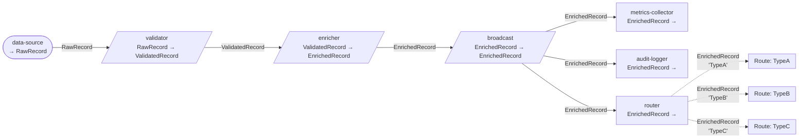

# Complex ETL Benchmark DataFlow

This diagram represents the sophisticated ETL pipeline used for benchmarking the DataFlow library.
It demonstrates real-world scenarios including:

- Data ingestion and validation
- Enrichment with external data lookups
- Category-based routing (TypeA, TypeB, TypeC)
- Multiple processing paths:
  - **TypeA**: Individual record processing
  - **TypeB**: Batch aggregation
  - **TypeC**: Category-based storage

## Pipeline Diagram

## Dataflow Configuration

- **Record Count**: Configurable (default: 10,000)
- **Max Concurrency**: 4 workers per block
- **Batch Size**: 100 records
- **Routing**: 3 categories evenly distributed

## Usage

This dataflow is used in:
- `ComplexEtlBenchmark` - BenchmarkDotNet performance benchmarks
- Performance profiling with dotnet-trace and dotnet-counters
- OpenTelemetry metrics collection

See `src/Benchmarks/Shared/ComplexEtlDataFlow.cs` for the complete implementation.
