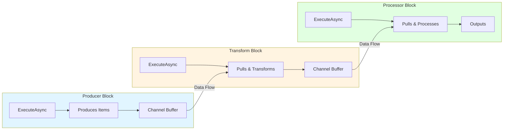
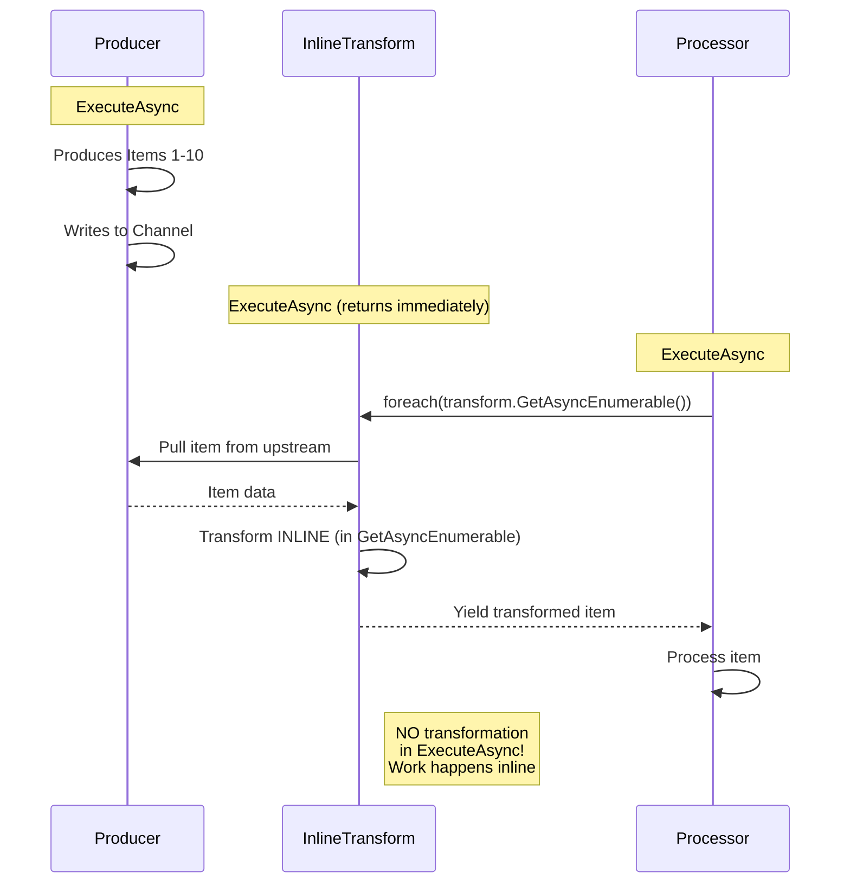
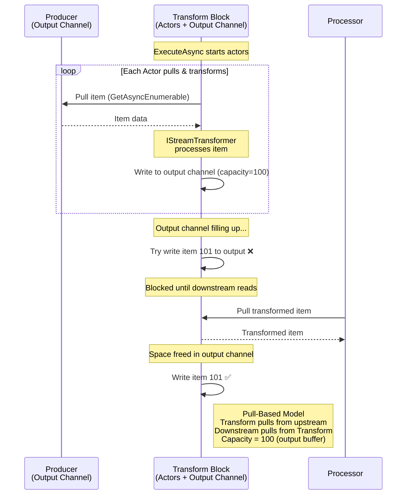
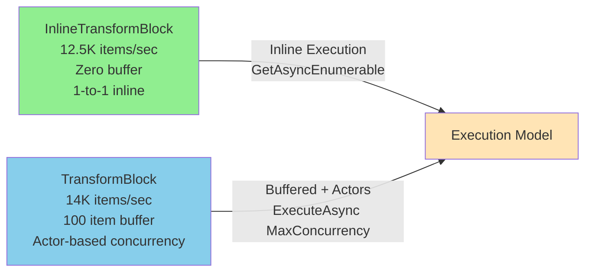
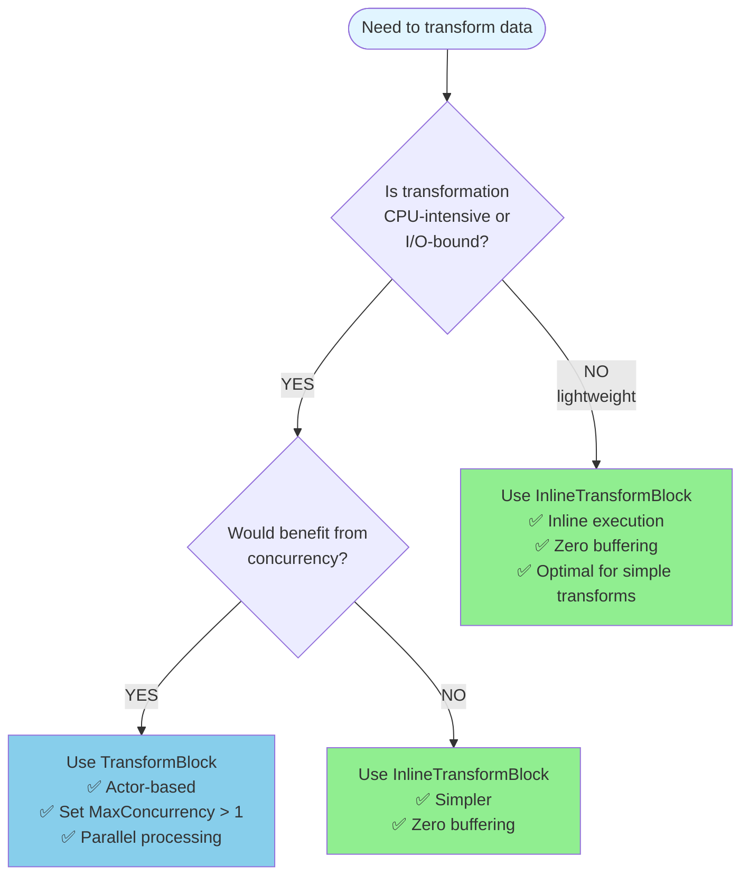

# Execution Model Visual Comparison

## Current Execution Model

All blocks execute concurrently via `Task.WhenAll`:

Each block runs independently in Task.WhenAll, requiring channels for data transfer.

## InlineTransformBlock (Inline Execution)

**Characteristics:**
- ⚡ **Inline Execution**: Transform happens during downstream block's enumeration
- 🎯 **No Separate Transform Task**: ExecuteAsync completes immediately
- 💨 **Fast**: No separate task overhead for simple transforms
- 🔧 **1-to-1 Processing**: Single-threaded inline passthrough, no concurrency
- 💚 **Zero Buffering**: No channel buffer (completely channel-free)

**Performance**: ~12,500 items/sec (8ms for 100 items)

## TransformBlock (Default Capacity ~100)

**Characteristics:**
- 🔄 **Pull-Based**: Transform block pulls items from upstream source via GetAsyncEnumerable
- 🔀 **Actor-Based Concurrency**: Can spawn multiple concurrent IStreamTransformer actors
- ⚡ **Concurrent Processing**: Increase MaxConcurrency for parallel transform execution
- 📤 **Output Buffering**: Transformed items written to output channel (capacity=100)
- ⚖️ **Balanced Backpressure**: Blocks when output buffer full, naturally slows upstream
- 🎯 **Good Default**: Works well for most scenarios
- 🔧 **Configurable**: Can adjust output capacity and MaxConcurrency

**Performance**: ~14,000 items/sec (7ms for 100 items)

**Key Difference**: TransformBlock can execute multiple `IStreamTransformer` actors concurrently (controlled by `MaxConcurrency` option), all outputting to the same buffered channel. This provides in-block parallelism for CPU-intensive transformations. InlineTransformBlock cannot do this - it's designed for lightweight 1-to-1 inline passthrough transforms with zero buffering.

## Comparison Summary

| Block Type | Execution Model | Concurrency | Throughput | Memory | Best For |
|------------|----------------|-------------|------------|---------|----------|
| **InlineTransformBlock** | ⚡ **GetAsyncEnum** | Single (1-to-1) | 🚀 12,500/sec | 💚 Zero buffer | Lightweight transforms |
| **TransformBlock** | ⚖️ **ExecuteAsync + Actor** | Multiple workers | ⚡ 14,000/sec | 💼 Moderate (100) | CPU-intensive work |

## Performance vs Concurrency Trade-off

## Recommendation Decision Tree

## Key Insights

### InlineTransformBlock
> **Transformation work doesn't have to happen in ExecuteAsync. It can happen inline during GetAsyncEnumerable enumeration by the downstream block.**

This eliminates:
- Separate task overhead for the transformation
- All channel buffering overhead
- Coordination overhead between ExecuteAsync tasks

**Use when**: Transformation is lightweight (simple mapping, formatting) and doesn't need concurrency.

### TransformBlock
> **Provides actor-based concurrency with multiple IStreamTransformer instances working in parallel, all outputting to a shared buffered channel. Uses pull-based architecture where actors pull from upstream.**

Key capabilities:
- **Pull-Based**: Actors pull items from upstream source via GetAsyncEnumerable()
- **Output Buffer**: Default 100-item channel capacity (configurable) for transformed items
- **Concurrency**: Set `MaxConcurrency` to spawn multiple concurrent actors
- **Parallelism**: Multiple `IStreamTransformer` instances can process items simultaneously
- **Natural Backpressure**: When output buffer fills, actors slow down, which propagates upstream

**Use when**: Transformation is CPU-intensive or I/O-bound and would benefit from parallel processing.

## Choosing the Right Block

- **Lightweight transforms** → InlineTransformBlock
  - Simple mapping, formatting, string operations
  - 1-to-1 inline passthrough
  - Zero buffering overhead
  
- **CPU-intensive work** → TransformBlock
  - Complex calculations, parsing, encoding
  - Set MaxConcurrency > 1 for parallel execution
  - Built-in buffering with actor-based concurrency
