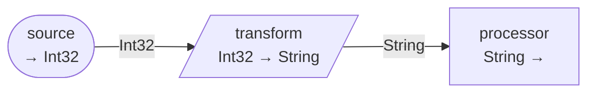

# Structured DataFlow Builder

## Overview

The **Structured DataFlow Builder** provides a two-phase approach to building dataflows:

1. **Define Phase**: Build a graph representation with metadata about blocks and connections without instantiating them
2. **Build Phase**: Create block instances and wire them based on the graph structure

**Key Benefits:**
- **Graph Inspection**: Examine flow structure before creating block instances
- **Visualization**: Export flows as Mermaid diagrams or text representations
- **Validation**: Detect topology issues (cycles, disconnected blocks) before execution
- **Extensibility**: Foundation for future features like interceptors and decorators
- **Documentation**: Auto-generate flow diagrams from code

## Quick Start

```csharp
using Uniun.DataFlow.Builder.Graph;

// Create builder and define flow (metadata only)
var builder = new StructuredDataFlowBuilder(serviceProvider, "MyFlow");

builder.AddProducer("source", sp => new MyProducer())
    .AddTransform("transform", sp => new MyTransformer())
    .AddBatch("batcher", maxBatchSize: 100, windowPeriod: TimeSpan.FromSeconds(5))
    .AddProcessor("processor", sp => new MyProcessor());

// Inspect before building
Console.WriteLine($"Blocks: {builder.Graph.BlockDefinitions.Count}");
Console.WriteLine($"Connections: {builder.Graph.Connections.Count}");

// Generate documentation
File.WriteAllText("flow.md", builder.Graph.ToMermaidDiagram());

// Build and execute
var dataflow = builder.Build();
await dataflow.ExecuteAsync(context);
```

## Graph Inspection

Query the flow topology before instantiation:

```csharp
// Get block definitions
foreach (var blockDef in builder.Graph.BlockDefinitions.Values)
{
    Console.WriteLine($"{blockDef.Name}: {blockDef.InputType?.Name} → {blockDef.OutputType?.Name}");
}

// Analyze connections
var sourceBlocks = builder.Graph.GetSourceBlocks();
var targetBlocks = builder.Graph.GetTargetBlocks();
var incoming = builder.Graph.GetIncomingConnections("transform");
var outgoing = builder.Graph.GetOutgoingConnections("source");
```

## Visualization

### Mermaid Diagrams

```csharp
// Generate diagram (supports LR, TB, RL, BT directions)
var mermaid = builder.Graph.ToMermaidDiagram("LR");
File.WriteAllText("pipeline.md", $"```mermaid\n{mermaid}\n```");
```

Example output:


### Text Diagrams

```csharp
var textDiagram = builder.Graph.ToTextDiagram();
Console.WriteLine(textDiagram);
```

### Summary Statistics

```csharp
var summary = builder.Graph.GetSummary();
Console.WriteLine($"Blocks: {summary.BlockCount}, Connections: {summary.ConnectionCount}");
```

## Validation

The graph is automatically validated when calling `Build()`:
- **Cycle Detection**: Prevents circular dependencies
- **Multiple Sources**: Validates that blocks don't have unsupported multiple incoming connections
- **Connection Validation**: Ensures all connections reference existing blocks

```csharp
try 
{
    var dataflow = builder.Build();
}
catch (InvalidOperationException ex)
{
    Console.WriteLine($"Validation failed: {ex.Message}");
}
```

## Advanced Features

### Metadata Attachments

Attach custom metadata for extensions or documentation:

```csharp
builder.AddBlockDefinition<MyBlock>(
    name: "processor",
    factory: sp => new MyBlock(),
    metadata: new Dictionary<string, object>
    {
        ["description"] = "Processes customer data",
        ["owner"] = "data-team"
    });
```

### Integration with Existing Builder

The structured builder coexists with the traditional `DataFlowBuilder`:

```csharp
// Traditional builder (immediate instantiation)
var legacyBuilder = new DataFlowBuilder(serviceProvider);

// Structured builder (graph-first)
var structuredBuilder = new StructuredDataFlowBuilder(serviceProvider, "MyFlow");
```

## Practical Examples

### Batch Processing Pipeline

```csharp
var builder = new StructuredDataFlowBuilder(serviceProvider, "BatchPipeline");

builder.AddProducer("dataSource", sp => new DatabaseReader())
    .AddTransform("enricher", sp => new DataEnricher())
    .AddBatch("batcher", maxBatchSize: 1000, windowPeriod: TimeSpan.FromSeconds(10))
    .AddProcessor("writer", sp => new BulkWriter());

// Export diagram and execute
File.WriteAllText("pipeline.md", builder.Graph.ToMermaidDiagram());
await builder.Build().ExecuteAsync(context);
```

### Flow Testing

```csharp
[Fact]
public void MyFlow_ShouldHaveCorrectTopology()
{
    var builder = new StructuredDataFlowBuilder(serviceProvider, "TestFlow");
    new MyFlowConfiguration().Configure(builder);
    
    // Assert topology without execution
    builder.Graph.BlockDefinitions.Count.ShouldBe(5);
    builder.Graph.GetSourceBlocks().Count().ShouldBe(1);
    builder.Graph.GetOutgoingConnections("source")
        .ShouldContain(c => c.TargetBlockName == "transform");
}
```

## Comparison with Traditional Builder

| Feature | Traditional Builder | Structured Builder |
|---------|-------------------|-------------------|
| Block Creation | Immediate | Deferred (at Build()) |
| Graph Inspection | Limited | Full metadata access |
| Visualization | Not built-in | Mermaid, text diagrams |
| Validation | Runtime only | Build-time + Runtime |
| Extensibility | Limited | High (metadata, interceptors) |

## When to Use

**Use Structured Builder when:**
- Generating documentation from flow definitions
- Validating flow topology in tests
- Building visual designers or code generators
- Debugging complex flows

**Use Traditional Builder when:**
- Building simple flows quickly
- Maintaining existing code
- Prototyping

## Future Enhancements

The structured approach enables:
- **Interceptors**: Wrap blocks with cross-cutting concerns
- **Decorators**: Add behavior dynamically during build
- **Type Validation**: Ensure compatibility before instantiation
- **Flow Optimization**: Analyze and optimize execution plans
- **Import/Export**: Save/load flow definitions

## See Also

- [DataFlow Builder Documentation](./builder.md)
- [Block Types](./blocks.md)
- [Metrics and Monitoring](./metrics.md)
