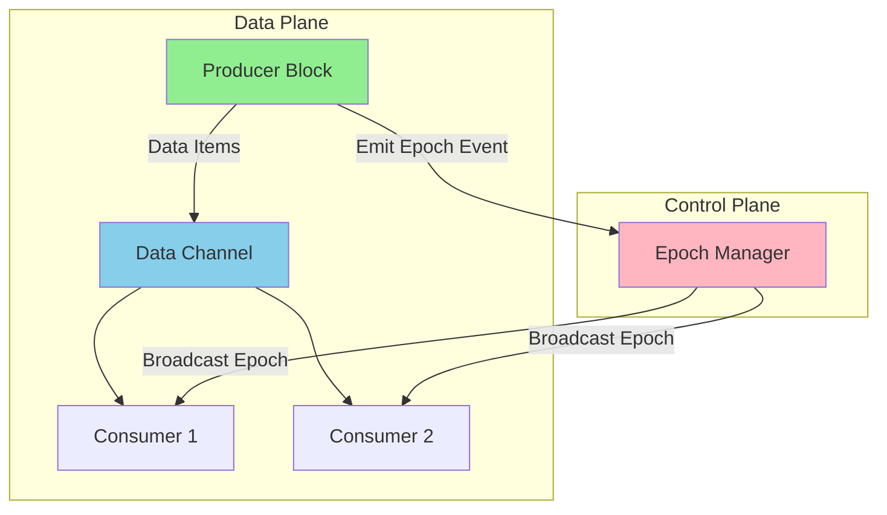
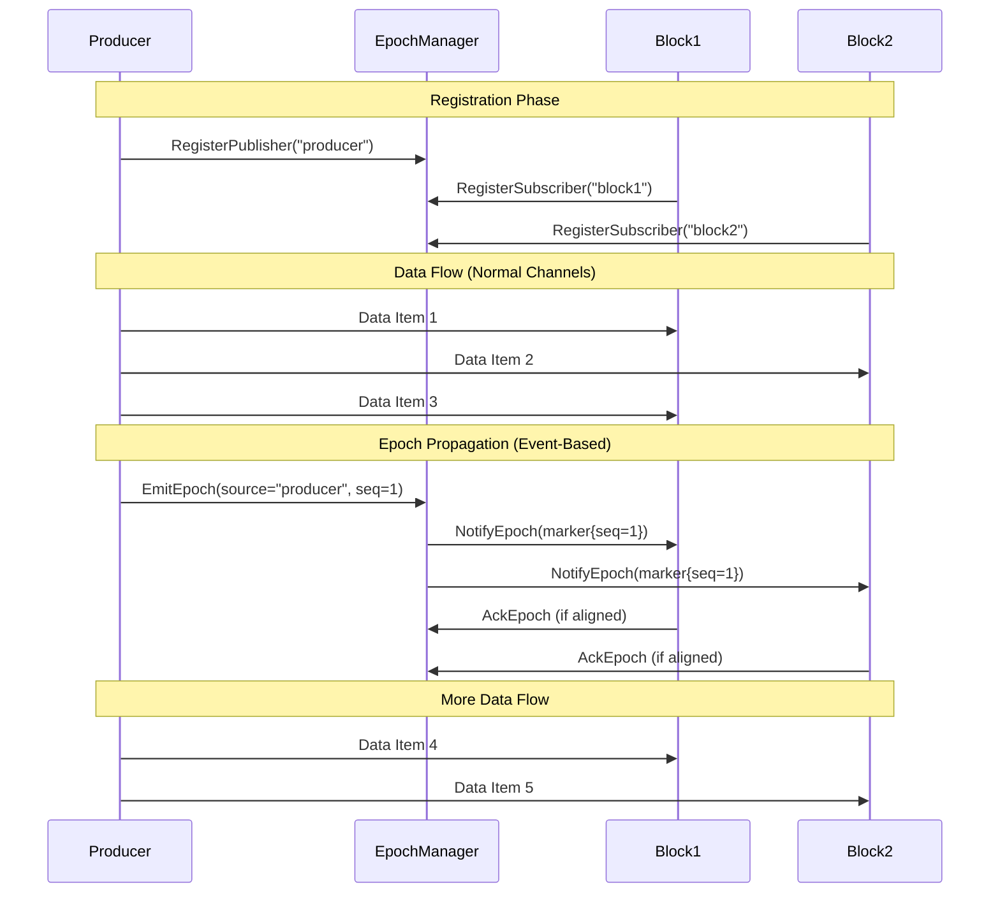
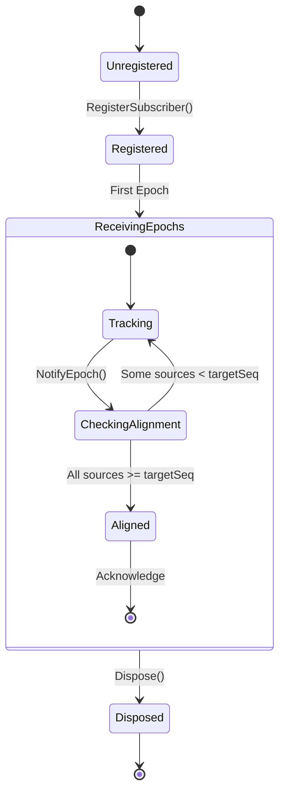

# Out-of-Band Epoch Control Plane Design

## Overview

The Out-of-Band Epoch Control Plane provides a zero hot-path overhead mechanism for control signal propagation in dataflow graphs. Unlike in-band approaches where control signals flow through data channels, this design uses a separate event-based control plane for coordination.

## Architecture



### Key Components

1. **EpochManager**: Centralized coordinator for epoch propagation
2. **EpochMarker**: Immutable record containing (sourceId, sequence, timestamp, metadata)
3. **EpochProgress**: Per-block tracking of last seen sequences from each source
4. **IEpochPublisher**: Interface for blocks that emit epochs
5. **IEpochSubscriber**: Interface for blocks that receive and track epochs

## Design Principles

### Separation of Concerns

- **Data Flow**: Pure data items flow through normal channels without any overhead
- **Control Flow**: Epochs propagate via events, completely bypassing data channels
- **Zero Hot-Path Cost**: No type checking, no special routing logic in data path

### Monotonic Sequences

Each source assigns monotonically increasing sequence numbers to epochs:

```
Source1: Epoch{seq=1} → Epoch{seq=2} → Epoch{seq=3}
Source2: Epoch{seq=1} → Epoch{seq=2} → Epoch{seq=3}
```

### Alignment Detection

Blocks track the last seen sequence from each source and can determine when they've "caught up":

```csharp
// Block has seen: Source1=seq5, Source2=seq3, Source3=seq7
progress.HasSeenAllSources(["Source1", "Source2"], targetSeq=3) // true
progress.HasSeenAllSources(["Source1", "Source2", "Source3"], targetSeq=4) // false
```

## Sequence Diagram



## Block Subscription Requirements

### Which Blocks Need to Subscribe?

**All blocks in the dataflow graph should implement `IEpochSubscriber`** to participate in epoch coordination. This includes:

1. **Source Blocks** (also implement `IEpochPublisher`):
   - Emit epochs when reaching checkpoints
   - Track their own progress

2. **Intermediate Blocks** (transformers, filters, etc.):
   - Receive epochs from upstream
   - Forward alignment acknowledgments downstream

3. **Terminal Blocks** (processors, sinks):
   - Receive and acknowledge epochs
   - Signal completion of epoch processing

### Why All Blocks?

The epoch mechanism enables coordinated checkpointing across the entire graph. For proper alignment:

- **Fan-out scenarios**: All parallel branches must see the same epoch
- **Fan-in scenarios**: A block waits until all upstream sources reach the same epoch
- **Cascade propagation**: Epochs flow through the entire pipeline

### Opt-Out Strategy

Blocks that don't need epoch coordination can provide a no-op implementation:

```csharp
public class SimpleBlock : IBlock<int, int>, IEpochSubscriber
{
    public EpochProgress GetEpochProgress() => new EpochProgress();
    
    public ValueTask<bool> NotifyEpochAsync(EpochMarker marker, CancellationToken ct)
    {
        // No-op: just acknowledge immediately
        return new ValueTask<bool>(true);
    }
}
```

## Usage Examples

### Basic Setup

```csharp
// Create epoch manager
var epochManager = new EpochManager();

// Register a publisher (source block)
var producer = new MyProducer();
epochManager.RegisterPublisher("producer", producer);

// Register subscribers (downstream blocks)
var transformer = new MyTransformer();
var sink = new MySink();
epochManager.RegisterSubscriber("transformer", transformer);
epochManager.RegisterSubscriber("sink", sink);

// Use with edge strategy
var strategy = EpochControlPlaneFactory.CreateCompeting(epochManager);
builder.AddEdge(new Edge(producer, new[] { transformer }, strategy));
```

### Emitting Epochs from a Publisher

```csharp
public class CheckpointProducer : IProducer<int>, IEpochPublisher
{
    public event EventHandler<EpochEventArgs>? EpochEmitted;
    
    public async IAsyncEnumerable<int> ProduceAsync(
        [EnumeratorCancellation] CancellationToken ct)
    {
        for (int i = 0; i < 1000; i++)
        {
            yield return i;
            
            // Emit epoch every 100 items
            if (i % 100 == 99)
            {
                var marker = new EpochMarker("producer", i / 100, DateTime.UtcNow);
                EpochEmitted?.Invoke(this, new EpochEventArgs(marker));
            }
        }
    }
}
```

### Tracking Epochs in a Subscriber

```csharp
public class CheckpointTransformer : ITransformer<int, int>, IEpochSubscriber
{
    private readonly EpochProgress _progress = new();
    private readonly List<string> _upstreamSources = new() { "producer" };
    
    public EpochProgress GetEpochProgress() => _progress;
    
    public async ValueTask<bool> NotifyEpochAsync(
        EpochMarker marker, 
        CancellationToken ct)
    {
        // Update tracking
        _progress.UpdateLastSeen(marker.SourceId, marker.Sequence);
        
        // Check if aligned with all upstream sources
        bool aligned = _progress.HasSeenAllSources(
            _upstreamSources, 
            marker.Sequence);
        
        if (aligned)
        {
            // Perform checkpoint logic here
            await SaveCheckpointAsync(marker, ct);
        }
        
        return aligned;
    }
}
```

## State Flow Diagram



## Performance Characteristics

### Hot-Path Analysis

**Data Operations** (zero overhead):
- ✅ No type checks
- ✅ No conditional routing
- ✅ No epoch-related allocations
- ✅ Direct channel writes

**Control Operations** (off hot-path):
- Event dispatch via EpochManager
- Background task for broadcast
- Per-subscriber alignment checks

### Memory Usage

- **Per Source**: Single long counter (8 bytes)
- **Per Subscriber**: Dictionary\<string, long\> for tracking (~40 bytes + entries)
- **Per Epoch**: EpochMarker allocation (~64 bytes) - short-lived
- **Total Overhead**: Minimal, scales with number of sources × subscribers

### Scalability

- **Sources**: O(1) sequence generation
- **Subscribers**: O(N) broadcast, but parallelized
- **Alignment Checks**: O(S) where S = number of sources
- **Overall**: Excellent for high data throughput, moderate control signal frequency

## Trade-offs

### Advantages

1. **Zero Hot-Path Overhead**: Data flows at maximum speed
2. **Strong Alignment**: Precise coordination across all blocks
3. **Flexible Metadata**: Epochs can carry arbitrary checkpoint information
4. **Scalable**: Handles many blocks efficiently

### Disadvantages

1. **Explicit Emission**: Producers must explicitly emit epochs
2. **Coordination Required**: All blocks must participate for proper alignment
3. **No Automatic Ordering**: Data and epochs are separate - ordering must be managed
4. **Learning Curve**: More complex than simple in-band signals

## Known Limitations

### ⚠️ Premature Epoch Alignment (Phase 2 - To Be Addressed in Phase 3)

**Issue**: The current implementation updates epoch progress immediately when `NotifyEpochAsync()` is called, without waiting for all data items associated with that epoch to be fully processed. This can lead to premature alignment acknowledgments.

**Impact**:
- Checkpoints may be acknowledged before all in-flight data is processed
- False completion signals when the pipeline still has work in progress
- Potential data loss in recovery scenarios if state is persisted too early

**Example Scenario**:
```
1. Source emits 1000 data items for Epoch 1
2. Data items are queued in channels (still unprocessed)
3. Source broadcasts "Epoch 1 complete" 
4. Downstream blocks receive broadcast and update progress immediately
5. Alignment check passes → "Epoch 1 aligned" ✓
6. BUT: 900 data items are still in channels being processed!
```

**Demonstration**: See test `KNOWN_BUG_EpochAlignment_Can_Occur_Before_Data_Processing_Complete` in `EpochControlPlaneTests.cs` which demonstrates this race condition.

**Root Cause**: Epoch broadcasts are out-of-band events that set a new watermark but don't confirm that all data associated with the previous watermark has been consumed.

**Remediation Plan (Phase 3)**:
1. **Option A - Drain Acknowledgment**: Blocks must explicitly signal when they've finished processing all data up to an epoch, separate from receiving the epoch notification
2. **Option B - In-Band Markers**: Inject special marker items into data channels to ensure proper ordering
3. **Option C - Two-Phase Commit**: Separate "epoch received" from "epoch completed" acknowledgments

**Workaround**: For now, applications should add explicit delays or completion signals after emitting epochs to ensure data has time to drain through the pipeline.

**Follow-up**: A Phase 3 investigation will design and validate correct alignment semantics with proper data-drain guarantees.

## Comparison with In-Band Side-Channel

| Aspect | Out-of-Band Epoch | In-Band Side-Channel |
|--------|-------------------|----------------------|
| **Data Path Overhead** | Zero | 5-15% (type checks) |
| **Memory Overhead** | <5% | ~30% (double buffering) |
| **Ordering Guarantees** | Via alignment logic (⚠️ see limitations) | Implicit in stream |
| **Transparency** | Explicit subscription | Transparent to blocks |
| **Coordination** | Event-based | Channel-based |
| **Use Case** | Checkpointing, watermarks | General control signals |

## Best Practices

### When to Use

✅ **Good For**:
- Coordinated checkpointing across distributed state
- Watermark-style event-time processing
- High-throughput data pipelines
- Infrequent but important control signals

❌ **Not Ideal For**:
- Frequent control signals (>1% of data items)
- Simple pipelines where in-band is sufficient
- When control/data ordering must be automatic
- Legacy code expecting transparent control flow

### Implementation Tips

1. **Register Early**: Subscribe all blocks during graph construction
2. **Track Sources**: Maintain list of upstream sources for alignment
3. **Handle Epochs**: Don't ignore epoch notifications - at minimum, track progress
4. **Test Alignment**: Verify coordination under backpressure scenarios
5. **Monitor Progress**: Use `GetStatistics()` for debugging slow blocks

## Future Extensions

### Planned Enhancements

1. **Automatic Registration**: Builder could auto-register implementing blocks
2. **Pluggable Strategies**: Enum-based selection between in-band and out-of-band
3. **Hybrid Mode**: Mix both approaches in same graph
4. **Epoch Timeouts**: Detect and handle slow blocks
5. **Persistence**: Save/restore epoch state for recovery

## References

- [Apache Flink Watermarks](https://nightlies.apache.org/flink/flink-docs-master/docs/concepts/time/) - Similar concept
- [Google Dataflow](https://cloud.google.com/dataflow/docs) - Distributed coordination
- Phase 1 Investigation: `CONTROL_SIGNAL_INVESTIGATION_SUMMARY.md`
- Performance Analysis: `PHASE2_CONTROL_SIGNAL_INVESTIGATION.md`
