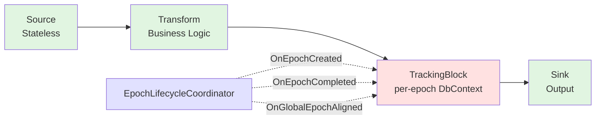
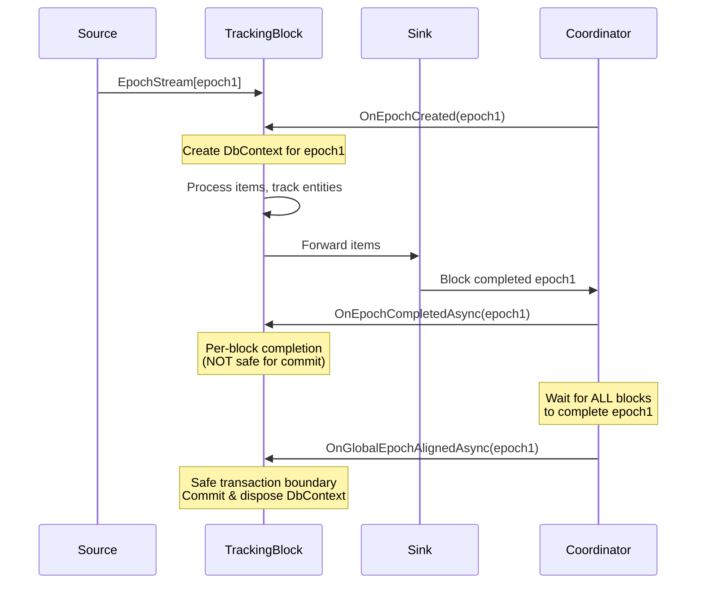

# Phase 6: Epoch Lifecycle and Composable Transaction Blocks

## Overview

Phase 6 introduces **lifecycle event interfaces** that integrate with the existing `GlobalEpochAlignment` infrastructure from Phase 5. The focus is on enabling **composable transaction management** through downstream blocks that participate in epoch lifecycle events, rather than coupling transactions to source actors.

## Key Concepts

### Existing Infrastructure (Phase 5)

Phase 5 already provides comprehensive epoch alignment tracking via `CompletionBasedEpochProgress.cs`:

- **`GlobalEpochAlignment`**: Tracks epoch completion across all blocks
- **`GetGlobalCompletionWatermark()`**: Calculates the safe checkpoint boundary (min across all blocks)
- **`IsGloballyAligned(EpochVector)`**: Checks if all blocks completed a specific epoch

### New in Phase 6

**Lifecycle Event Interfaces**:
- `IEpochLifecycleParticipant`: Interface for components that want lifecycle notifications
- `IBlockContext`: Identifies which block triggered the event
- `EpochLifecycleCoordinator`: Manages participant registration and broadcasts events

**Key Architectural Principle**: Keep sources stateless. Let **downstream blocks** manage transactional lifecycles per epoch.

## Architecture

### Core Interfaces

```csharp
/// Block identification for lifecycle events
public interface IBlockContext
{
    string BlockName { get; }
    IReadOnlyDictionary<string, object>? Metadata { get; }
}

/// Lifecycle participant interface
public interface IEpochLifecycleParticipant
{
    // Called when a block starts processing an epoch
    ValueTask OnEpochCreatedAsync(EpochVector epoch, IBlockContext block, CancellationToken ct);
    
    // Called when a block finishes processing an epoch
    ValueTask OnEpochCompletedAsync(EpochVector epoch, IBlockContext block, CancellationToken ct);
    
    // Called when ALL blocks have completed an epoch (checkpoint boundary)
    ValueTask OnGlobalEpochAlignedAsync(EpochVector watermark, CancellationToken ct);
}
```

### Composable Transaction Block Pattern

The **recommended pattern** for managing transaction boundaries:

**Separation of Concerns**:
1. **Source Actor** (`ISourceActor<T>`):
   - Pure data producer - emits epochs and items
   - Stateless regarding persistence
   - Controls epoch segmentation only

2. **Downstream Transaction Block** (implements `IEpochLifecycleParticipant`):
   - Manages DbContext per epoch
   - Adds/tracks entities as they flow through
   - Commits transaction on global alignment

3. **Benefits**:
   - **Flexible routing**: Transform, filter, branch before persisting
   - **Multi-sink support**: Different blocks can manage different transaction boundaries
   - **Composable**: Works with any number of sources and sinks
   - **Separation of concerns**: Source emits data, downstream blocks persist

### Why Not Source-Centric?

**Problem with source-centric transactions**:
- Couples transaction to input source (rigid)
- Works only for simple ETL (read + write same domain)
- Breaks in multi-sink or transformation-heavy pipelines
- Loses flexibility to route, buffer, or branch

**Solution**: Transaction block as downstream component.

## Lifecycle Flow



**Pipeline**: `Source → Transform → TrackingBlock (per-epoch DbContext) → Sink`

### Lifecycle Sequence Diagram



**Flow Steps**:

1. **Source Emits Epoch** (stateless)
   - Creates `EpochVector` with sourceId and sequence
   - Yields `IEpochStream` with data items
   - No persistence logic

2. **TrackingBlock Receives Epoch**
   - `OnEpochCreatedAsync(epoch)` triggered
   - Creates new `DbContext` for this epoch
   - Stores in `_contexts[epoch] = ctx`
   - Items flow through and get tracked

3. **TrackingBlock Completes Epoch** ⚠️ **Per-Block Event**
   - All epoch items processed by THIS block
   - `OnEpochCompletedAsync(epoch)` triggered
   - Context kept alive, awaiting global alignment
   - **NOT a safe transaction boundary** - other blocks may still be processing

4. **Global Alignment Reached** ✅ **Safe Transaction Boundary**
   - **ALL blocks** complete epoch (watermark reached)
   - `OnGlobalEpochAlignedAsync(epoch)` triggered
   - Commits all contexts: `await ctx.SaveChangesAsync()`
   - Transaction committed with full consistency ✓

> **Important**: `OnEpochCompletedAsync` indicates a single block finished processing an epoch. Only `OnGlobalEpochAlignedAsync` guarantees all blocks have completed and is safe for committing transactions.

## Implementation Examples

### Pattern 1: Stateless Source Actor

```csharp
// Pure data producer - no transaction management
public class DatabaseSourceActor : SourceActorBase<DataRecord>
{
    private readonly DbContextOptions<MyDbContext> _dbOptions;
    private readonly int _epochSize;
    private readonly string _sourceId;

    public DatabaseSourceActor(DbContextOptions<MyDbContext> dbOptions, int epochSize, string sourceId)
    {
        _dbOptions = dbOptions;
        _epochSize = epochSize;
        _sourceId = sourceId;
    }

    public override async IAsyncEnumerable<IEpochStream<DataRecord>> ProduceEpochsAsync(
        IActorExecutionContext context)
    {
        long sequence = 1;
        
        // Read-only context for querying
        await using var queryContext = new MyDbContext(_dbOptions);
        var records = queryContext.Records.AsNoTracking().AsAsyncEnumerable();

        // Stream records, creating new epoch every _epochSize items
        yield return CreateEpochStream(
            CreateEpoch(_sourceId, sequence++), 
            StreamRecordsForEpoch(records, _epochSize));
    }
    
    private static async IAsyncEnumerable<DataRecord> StreamRecordsForEpoch(
        IAsyncEnumerable<DataRecord> source, 
        int count)
    {
        int yielded = 0;
        await foreach (var record in source)
        {
            if (yielded >= count) yield break;
            yield return record;
            yielded++;
        }
    }
}
```

### Pattern 2: Downstream Transaction Block

```csharp
// Generic composable tracking block - works with any DbContext type
public class EntityTrackingBlock<T, TContext> : IEpochLifecycleParticipant 
    where T : class
    where TContext : DbContext
{
    private readonly IDbContextFactory<TContext> _contextFactory;
    private readonly ConcurrentDictionary<EpochVector, TContext> _epochContexts = new();
    private readonly ILogger<EntityTrackingBlock<T, TContext>> _logger;

    public EntityTrackingBlock(
        IDbContextFactory<TContext> contextFactory, 
        ILogger<EntityTrackingBlock<T, TContext>> logger)
    {
        _contextFactory = contextFactory;
        _logger = logger;
    }

    // Process items and track in per-epoch DbContext
    // NOTE: DbContext is NOT thread-safe. Each context is bound to a single epoch and processed 
    // sequentially within that epoch's processing path. Concurrent processing of different epochs 
    // is safe because each epoch has its own isolated context instance.
    public async IAsyncEnumerable<T> ProcessAsync(
        IAsyncEnumerable<IEpochStream<T>> input,
        [EnumeratorCancellation] CancellationToken cancellationToken = default)
    {
        await foreach (var epochStream in input.WithCancellation(cancellationToken))
        {
            await foreach (var item in epochStream.Items.WithCancellation(cancellationToken))
            {
                // IMPORTANT: Handle epoch vector merging at fan-in points
                // When upstream flows merge, epoch vectors advance via element-wise max.
                // To avoid creating duplicate contexts, check if a parent epoch context exists.
                
                TContext ctx;
                if (!_epochContexts.TryGetValue(epochStream.Epoch, out ctx))
                {
                    // Fast path: Single-source linear progression - O(1) check, no ancestry lookup needed
                    if (epochStream.Epoch.Sequences.Count == 1)
                    {
                        ctx = _contextFactory.CreateDbContext();
                        _epochContexts[epochStream.Epoch] = ctx;
                    }
                    else
                    {
                        // Merge scenario: check for reusable ancestor
                        var ancestor = epochStream.Epoch.FindMostSpecificAncestor(_epochContexts.Keys);
                        
                        if (ancestor != null && _epochContexts.TryRemove(ancestor, out var ancestorCtx))
                        {
                            // Reuse and promote the ancestor's context
                            ctx = ancestorCtx;
                            _epochContexts[epochStream.Epoch] = ctx;
                            _logger.LogDebug("Promoted context from ancestor {Ancestor} to merged epoch {Merged}", 
                                ancestor, epochStream.Epoch);
                        }
                        else
                        {
                            // Create new context
                            ctx = _contextFactory.CreateDbContext();
                            _epochContexts[epochStream.Epoch] = ctx;
                        }
                    }
                }
                
                // Track the entity
                ctx.Attach(item);
                
                yield return item;
            }
        }
    }

    // Lifecycle Events
    
    public ValueTask OnEpochCreatedAsync(EpochVector epoch, IBlockContext block, CancellationToken ct)
    {
        // Optionally pre-create DbContext for this epoch
        // (contexts are also created lazily in ProcessAsync)
        _logger.LogInformation("Epoch {Epoch} created in block {Block}", epoch, block.BlockName);
        return ValueTask.CompletedTask;
    }

    public ValueTask OnEpochCompletedAsync(EpochVector epoch, IBlockContext block, CancellationToken ct)
    {
        // Epoch done locally, but don't commit yet (wait for global alignment)
        _logger.LogInformation("Block {Block} completed epoch {Epoch}", block.BlockName, epoch);
        return ValueTask.CompletedTask;
    }

    public async ValueTask OnGlobalEpochAlignedAsync(EpochVector watermark, CancellationToken ct)
    {
        // ALL blocks completed - safe to commit all contexts up to watermark
        // Snapshot keys first to avoid concurrent modification during iteration
        var ready = _epochContexts
            .Where(kvp => kvp.Key.IsLessThanOrEqual(watermark))
            .Select(kvp => kvp.Key)
            .ToList();

        foreach (var epoch in ready)
        {
            if (_epochContexts.TryRemove(epoch, out var ctx))
            {
                try
                {
                    // Dispose DbContext properly to prevent connection leaks
                    await using (ctx)
                    {
                        await ctx.SaveChangesAsync(ct);
                        _logger.LogInformation("Committed transaction for epoch {Epoch}", epoch);
                    }
                }
                catch (Exception ex)
                {
                    _logger.LogError(ex, "Failed to commit epoch {Epoch}", epoch);
                    throw;
                }
            }
        }
    }
}
```

### Handling Epoch Vector Merging

**Problem**: At merge points in the flow, epoch vectors advance via element-wise max. A downstream tracking block may receive:
- `EpochVector[source1=1]` → creates `DbContext1`
- `EpochVector[source2=1]` → creates `DbContext2`
- `EpochVector[source1=1, source2=1]` → **merged epoch**

Without ancestry detection, a **third context** would be created, fragmenting tracked entities.

**Solution**: The `FindMostSpecificAncestor` method detects when a merged epoch subsumes a parent:

```csharp
// Pseudo-logic in ProcessAsync
if (!_epochContexts.TryGetValue(mergedEpoch, out ctx))
{
    var ancestor = mergedEpoch.FindMostSpecificAncestor(_epochContexts.Keys);
    if (ancestor != null)
    {
        // Promote ancestor's context to merged epoch
        ctx = _epochContexts[ancestor];
        _epochContexts.TryRemove(ancestor, out _);
        _epochContexts[mergedEpoch] = ctx;
    }
}
```

**Result**: Entities from both sources are tracked in a **single DbContext**, ensuring atomicity on `SaveChangesAsync()`.

**Important Consideration - Entity Accumulation**:

In continuous merge scenarios, a single DbContext could be promoted indefinitely across multiple merge stages:
- `Epoch[source1=1]` → `DbContext1` with 100 entities
- `Epoch[source1=1, source2=1]` → Promotes `DbContext1` (now 200 entities)
- `Epoch[source1=1, source2=1, source3=1]` → Promotes `DbContext1` again (now 300 entities)

**Why this is bounded in practice**:
1. **Global alignment commits and disposes contexts** - contexts are removed at watermark boundaries
2. **Contexts only live until alignment** - new epochs after commit get fresh contexts
3. **Natural backpressure** - slow downstream blocks delay alignment, but also slow new data arrival

**If global alignment is delayed** (e.g., slow downstream processing), a context could accumulate many entities before commit, potentially hitting EF Core's change tracker limits (~10,000 entities).

**Mitigation strategies**:
```csharp
// Option 1: Max entity threshold
if (ctx.ChangeTracker.Entries().Count() > 5000)
{
    await ctx.SaveChangesAsync(ct); // Forced intermediate commit
    ctx = _contextFactory.CreateDbContext(); // Fresh context
}

// Option 2: Periodic forced commits within epoch boundaries
if (_lastCommit.Elapsed > TimeSpan.FromMinutes(5))
{
    await ctx.SaveChangesAsync(ct);
    _lastCommit = Stopwatch.StartNew();
}

// Option 3: Context pooling with reuse limits
if (ctx.ReuseCount > 10)
{
    // Retire and create fresh context
}
```

For most workloads, global alignment happens frequently enough that entity accumulation is not an issue. Monitor DbContext size in production and apply mitigation if needed.

### Pattern 3: Complete Pipeline

```csharp
// Register services
services.AddDbContextFactory<MyDbContext>(options => 
    options.UseSqlServer(connectionString));

// Build composable pipeline
var pipeline = new DataFlowGraphBuilder()
    // Source: Pure data producer (stateless)
    .AddSource<DataRecord, DatabaseSourceActor>("database-source")
    
    // Transform: Business logic (stateless)
    .AddTransform<DataRecord, EnrichedRecord>("enricher", 
        record => new EnrichedRecord(record))
    
    // Tracking: Transaction management (per-epoch state)
    .AddBlock<IEpochStream<EnrichedRecord>, EnrichedRecord>("entity-tracker", 
        sp => new EntityTrackingBlock<EnrichedRecord, MyDbContext>(
            sp.GetRequiredService<IDbContextFactory<MyDbContext>>(),
            sp.GetRequiredService<ILogger<EntityTrackingBlock<EnrichedRecord, MyDbContext>>>()))
    
    // Sink: Final output (stateless)
    .AddProcessor<EnrichedRecord>("logger", 
        record => Console.WriteLine($"Processed: {record}"))
    
    .Build();

// Register tracking block as lifecycle participant
var trackingBlock = serviceProvider.GetRequiredService<EntityTrackingBlock<EnrichedRecord, MyDbContext>>();
coordinator.RegisterParticipant(trackingBlock);

// Execute
await pipeline.ExecuteAsync(cancellationToken);
```

### Usage Examples

**Example 1: Simple single DbContext scenario**

```csharp
// Setup
services.AddDbContextFactory<AppDbContext>(options => 
    options.UseSqlServer(connectionString));

var trackingBlock = new EntityTrackingBlock<Product, AppDbContext>(
    contextFactory, logger);

// Use in pipeline...
```

**Example 2: Multi-sink with different databases**

```csharp
// Track orders in one database
var orderTracker = new EntityTrackingBlock<Order, OrderDbContext>(
    orderContextFactory, logger);

// Track inventory in another database  
var inventoryTracker = new EntityTrackingBlock<InventoryItem, InventoryDbContext>(
    inventoryContextFactory, logger);

// Both participate in lifecycle coordination
coordinator.RegisterParticipant(orderTracker);
coordinator.RegisterParticipant(inventoryTracker);
```

**Example 3: Custom entity modification before tracking**

```csharp
public class CustomTrackingBlock<T, TContext> : EntityTrackingBlock<T, TContext>
    where T : class, ITimestamped
    where TContext : DbContext
{
    public override async IAsyncEnumerable<T> ProcessAsync(
        IAsyncEnumerable<IEpochStream<T>> input,
        [EnumeratorCancellation] CancellationToken ct = default)
    {
        await foreach (var item in base.ProcessAsync(input, ct))
        {
            // Add custom logic
            item.LastModified = DateTime.UtcNow;
            item.ModifiedBy = "DataFlow";
            
            yield return item;
        }
    }
}
```


## Design Rationale

### Why Downstream Transaction Blocks?

**Flexibility and Composability**:
- **Multi-sink support**: Different blocks can manage different databases/transactions
- **Transformation pipelines**: Filter, route, transform before persisting
- **Branching**: Send data to multiple destinations with different transaction boundaries
- **Testability**: Mock transaction blocks without affecting sources

**Separation of Concerns**:
- **Source**: Pure data production (read-only, stateless regarding persistence)
- **Transform**: Business logic (stateless)
- **Tracking**: Transaction management (per-epoch state)
- **Sink**: Final output (stateless)

### Problems with Source-Centric Transactions

1. **Rigidity**: Couples transaction to input source
2. **Limited scope**: Works only for simple ETL (read + write same domain)
3. **Multi-sink issues**: Can't have different transaction boundaries
4. **Pipeline breaks**: Can't transform, filter, or route between read and write

### Why Keep IEpochLifecycleParticipant?

The lifecycle interface is valuable for ANY component that needs epoch awareness:
- **Transaction blocks**: Commit on global alignment
- **Metrics collectors**: Track epoch durations, throughput
- **Checkpoint managers**: Contribute state at alignment boundaries
- **Loggers**: Debug epoch flow through pipeline
- **Cache managers**: Clear per-epoch caches

### Integration with Existing GlobalEpochAlignment

Phase 6 does NOT replace the existing alignment infrastructure. Instead:
- Leverages existing `GlobalEpochAlignment` for tracking
- Adds **notification layer** on top for event-driven coordination
- Any component can participate in lifecycle events
- No duplication of alignment logic

## Limitations and Future Work

### Current Limitations

1. **Manual Wiring**: Currently requires manual integration between blocks and `GlobalEpochAlignment`
2. **No Built-in TrackingBlock**: Example shows pattern; needs concrete implementation
3. **Manual Lifecycle Notification**: Blocks must manually call coordinator methods

### Future Enhancements (Phase 7+)

1. **Automatic Integration**: Blocks could automatically:
   - Register with `GlobalEpochAlignment`
   - Notify lifecycle coordinator
   - Trigger alignment checks

2. **Built-in Tracking Blocks**: Pre-built implementations:
   - `EFCoreTrackingBlock<T>`: EF Core change tracking per epoch
   - `TransactionBlock<T>`: Generic transaction boundary management
   - `CacheBlock<T>`: Per-epoch caching with automatic cleanup

3. **Multi-Source Coordination**: Enhanced coordination when multiple sources emit epochs:
   - Automatic epoch vector merging across sources (using existing element-wise max operation)
   - Cross-source watermark calculation for global alignment
   - Support for sources emitting epochs at different rates
   - Partial alignment notifications (subset of blocks completed)

4. **Advanced Features**:
   - Retry policies on commit failure
   - Distributed transaction support
   - Deadlock detection and resolution

5. **Benchmarks**: Extend existing benchmark suite to measure:
   - Overhead of `EntityTrackingBlock` vs pure data processing
   - Compare: baseline (no epochs) → epochs enabled → epochs + tracking block
   - Memory allocation impact of per-epoch DbContext
   - Transaction commit latency at global alignment
   - Multi-sink scenario with different tracking blocks

   *Benchmark template*: Follow pattern from `EpochAlignmentBenchmark.cs`
   ```csharp
   [Benchmark(Baseline = true)]
   public async Task Baseline_NoEpochs() { /* pure processing */ }
   
   [Benchmark]
   public async Task WithEpochs_NoTracking() { /* epoch segmentation only */ }
   
   [Benchmark]
   public async Task WithEpochs_AndTrackingBlock() { /* + EntityTrackingBlock */ }
   ```

## Summary

Phase 6 provides:

✅ **Lifecycle event interfaces** for epoch participation  
✅ **Integration** with existing `GlobalEpochAlignment`  
✅ **Composable transaction block pattern** (downstream, not source-coupled)  
✅ **Flexible architecture** supporting multi-sink, transformation pipelines  
✅ **Clear separation of concerns** (source = emit, tracking block = persist)  
✅ **Foundation** for checkpoint and recovery  

The **composable pattern** is more flexible than source-centric transactions:
- Sources remain stateless
- Transaction blocks are downstream components
- Works with any pipeline topology (multi-sink, branching, routing)
- Scales to complex scenarios

## References

- **Phase 5**: `CompletionBasedEpochProgress.cs` - Global alignment tracking
- **Phase 4**: `ISourceActor<T>` and `EpochSourceBlock` - Source actor infrastructure
- **Phase 3**: `EpochVector` and `IEpochStream<T>` - Epoch stream segmentation
