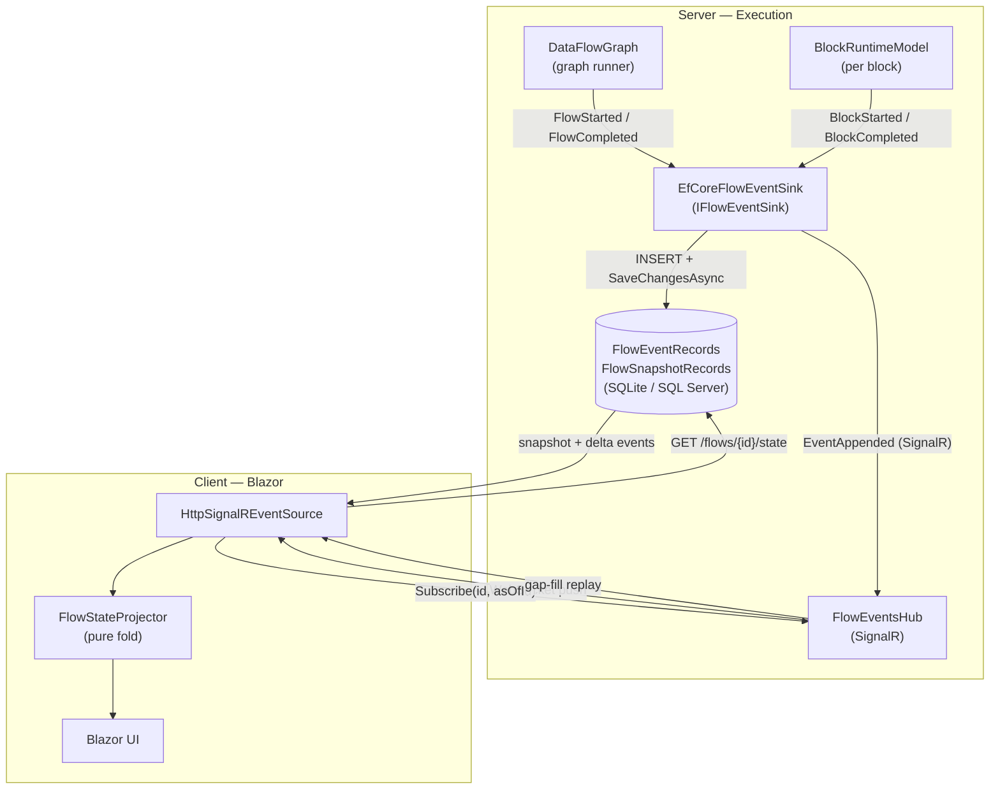
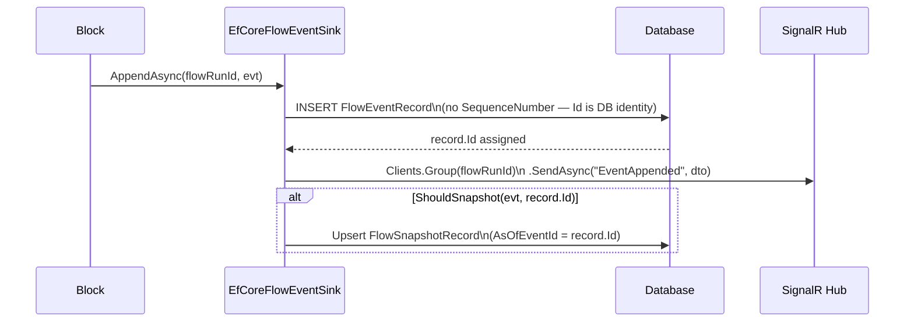
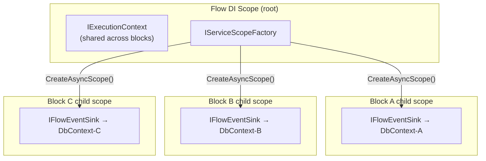
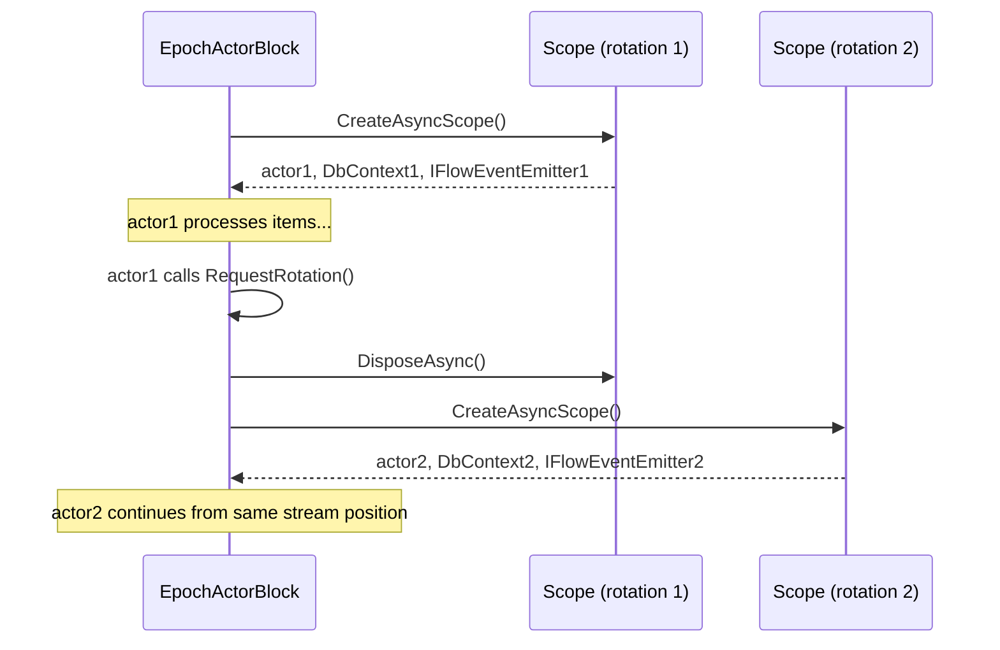
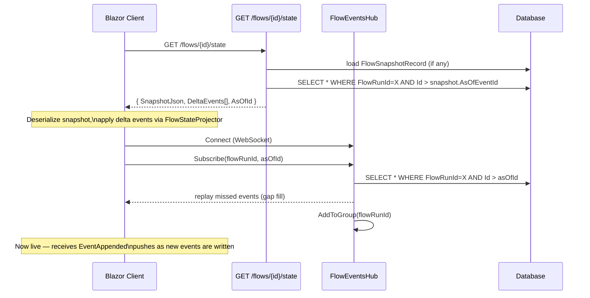
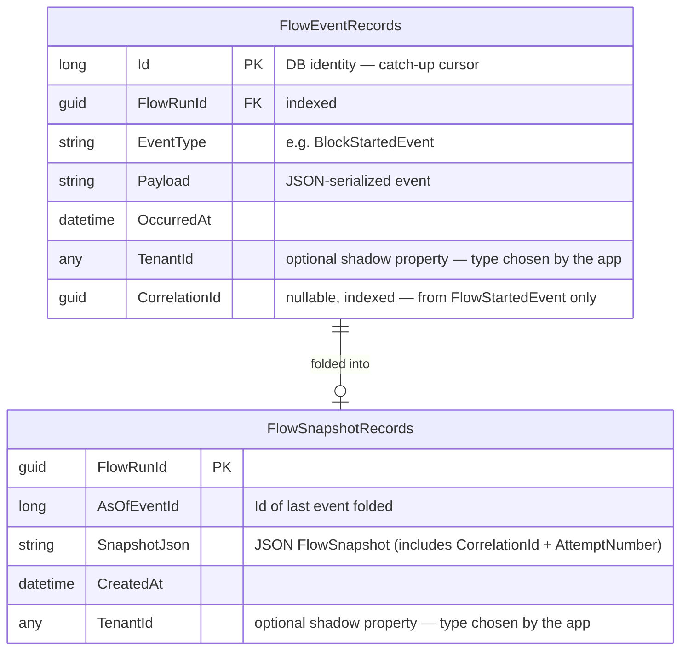
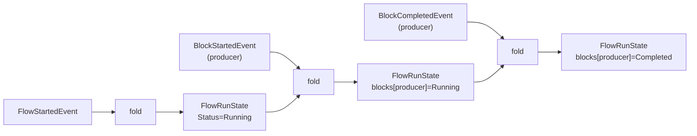

# Flow Visualization — End-to-End Architecture

Real-time observability of a running dataflow: every graph and block lifecycle event
is persisted to a database and pushed to connected Blazor clients via SignalR.
Clients that connect mid-run or reconnect after a drop receive a consistent snapshot
without re-folding the full event log.

---

## Components



---

## Event Write Path

Every call to `IFlowEventSink.AppendAsync` does three things in sequence:



Key points:
- **No application-assigned sequence number.** `FlowEventRecord.Id` is a DB identity
  column — the database guarantees strict monotonic ordering with no race conditions.
- The SignalR push happens *after* the DB commit, so clients always see a record that
  can be retrieved from the database on reconnect.
- Snapshot materialisation folds all events up to `record.Id` into a `FlowSnapshot`
  and upserts it. This is triggered by `SnapshotPolicy` (on `FlowCompletedEvent` and
  optionally every N events for long-running flows).

---

## Events Emitted

| Event | Emitted by | Trigger |
|---|---|---|
| `FlowStartedEvent` | `DataFlowGraph.ExecuteAsync` | Before blocks start |
| `FlowCompletedEvent` | `DataFlowGraph.ExecuteAsync` | After all blocks finish (success or failure) |
| `BlockStartedEvent` | `BlockRuntimeModel.ExecuteAsync` | Before block executes |
| `BlockCompletedEvent` | `BlockRuntimeModel.ExecuteAsync` | After block finishes (success or failure) |
| `BlockProgressEvent` | Block business logic via `IFlowEventEmitter` | As items are processed |
| `ChannelStatsEvent` | Block business logic via `IFlowEventEmitter` | Periodic buffer stats |

### `FlowStartedEvent` fields

| Field | Type | Description |
|---|---|---|
| `InvocationId` | `Guid` | Unique ID for this execution attempt (= `FlowRunId` throughout) |
| `FlowName` | `string` | Human-readable graph name |
| `Timestamp` | `DateTime` | UTC start time |
| `TriggerParamsJson` | `string?` | Optional JSON payload passed by the caller |
| `CorrelationId` | `Guid?` | Stable work-item identity from the originating message broker (null for standalone runs) |
| `AttemptNumber` | `int` | 1-based delivery attempt counter for this `CorrelationId` (always 1 for standalone runs) |

`InvocationId` is always a fresh `Guid.NewGuid()` per execution. `CorrelationId` is the stable
identity that groups retries — see [Retry Correlation](#retry-correlation) below.

---

## DI Scope Management

Each block runs concurrently. `DbContext` is not thread-safe, so each block gets
its own DI scope (and therefore its own `DbContext` instance):



`BlockRuntimeModel.ExecuteAsync` creates and disposes the child scope:

```csharp
var scopeFactory = context.ServiceProvider.GetService<IServiceScopeFactory>();
await using var blockScope = scopeFactory?.CreateAsyncScope();
var eventSink = blockScope?.ServiceProvider.GetService<IFlowEventSink>()
    ?? context.ServiceProvider.GetService<IFlowEventSink>();
// ... block runs, scope disposed on exit
```

Flow-level events (`FlowStarted`, `FlowCompleted`) are emitted sequentially from
`DataFlowGraph.ExecuteAsync` using the flow's root scope — no concurrency, no issue.

### Actor Scope Rotation

Epoch actor blocks (`EpochActorBlock`, `EpochSourceBlock`) already create a fresh
DI scope per actor instance. The emitter is built from that same scope so each
actor rotation also gets a fresh `DbContext`:



---

## IFlowEventEmitter

`IFlowEventEmitter` is a thin wrapper around `IFlowEventSink` pre-bound to the
current `InvocationId`. Blocks and actors use it to emit events without knowing
the flow run ID.

```csharp
public interface IFlowEventEmitter
{
    Task EmitAsync(IDataFlowEvent evt, CancellationToken cancellationToken = default);
}
```

Available on both execution context types:

| Context | Property | Source |
|---|---|---|
| `IExecutionContext` | `Events` | Built from flow-scope `IFlowEventSink` at `ExecutionContext` construction |
| `IActorExecutionContext` | `Events` | Built from the actor's own scope `IFlowEventSink` in `Reset()` |

Usage in a block:

```csharp
public override async IAsyncEnumerable<TOut> ExecuteAsync(
    IAsyncEnumerable<TIn> input, IExecutionContext context)
{
    await foreach (var item in input)
    {
        // ...process item...
        await context.Events?.EmitAsync(new BlockProgressEvent(Name, itemsProcessed, DateTime.UtcNow));
        yield return result;
    }
}
```

> **Note:** `context.Events` on `IExecutionContext` is resolved from the flow-scope
> `IFlowEventSink`. For high-frequency per-item events from concurrent blocks, prefer
> resolving `IFlowEventSink` from `context.ServiceProvider` directly to get the
> block-scoped instance (same `DbContext` lifetime as the block).

---

## Client Load Sequence

The client-side load is designed to close the race window between the HTTP snapshot
fetch and the WebSocket subscription:



The `asOfId` cursor ensures the client never misses events that arrived between the
HTTP response and the WebSocket handshake.

---

## Database Schema



> **Multi-tenant note:** `TenantId` is **not** a CLR property on the entity classes.
> It is intended to be added as an EF Core [shadow property](https://learn.microsoft.com/en-us/ef/core/modeling/shadow-properties)
> after calling `AddDataFlowVisualizationEntities()`, using whatever type your
> application's tenant identifier requires (`int`, `Guid`, `string`, etc.).
> This avoids the EF Core error _"the type of the corresponding CLR property … does not match the specified type"_
> that occurs when the library entity uses a different type than the application's tenant model.

`CorrelationId` is denormalized onto `FlowEventRecord` only for the `FlowStartedEvent` row.
This allows the query "all attempts for this message" — `WHERE CorrelationId = @id` — without
deserializing any JSON payloads.

**Why `Id` not `SequenceNumber`?**

A per-flow sequence number computed as `MAX(seq)+1` creates a race: two concurrent
blocks writing the first event for a flow both read `MAX=0` and both try to write
`seq=1`, resulting in a constraint violation or silent duplicate.

The DB identity column is atomic by definition — the database assigns it after the
row is committed, so concurrent writers never collide.

---

## Snapshot Policy

`SnapshotPolicy` decides when to materialise a snapshot from the event log:

| Trigger | Default | Purpose |
|---|---|---|
| `FlowCompletedEvent` | always | Ensures a snapshot exists for completed flows |
| Every N events | 100 (configurable, 0 = off) | Bounds catch-up cost for long-running flows |

A snapshot stores the fully projected `FlowRunState` as JSON. On client load, the
server returns the snapshot + only the events since `AsOfEventId`, so the client
never re-folds the entire log regardless of how many events were emitted.

---

## State Projection

`FlowStateProjector` is a pure fold function used identically on server and client:



**Server** folds events during snapshot materialisation.
**Client** starts from the snapshot (if any), folds delta events, then applies each
incoming SignalR push in real time — no server roundtrip needed for live updates.

---

## Retry Correlation

### The problem

In queue-based systems a flow may be invoked multiple times for the same logical work item
— the broker redelivers the message if the consumer crashes before acknowledging. Each
delivery produces an independent event stream (its own `FlowRunId`), but they all represent
the same unit of work.

Without correlation, the only clue that two runs are related is a shared `FlowName` and
approximate start times. The visualization shows them as completely separate rows.

### Design

Two concepts are kept deliberately separate:

| Concept | Identity | Lifetime |
|---|---|---|
| **Work item** (`CorrelationId`) | Stable — comes from the message broker | Shared across all retry attempts |
| **Execution attempt** (`FlowRunId` / `InvocationId`) | Fresh `Guid.NewGuid()` per run | Scoped to one execution |
| **Attempt counter** (`AttemptNumber`) | 1-based integer | Increments per delivery |

This split means each attempt has its own isolated, clean event stream. The projector needs
no changes — a second `FlowStartedEvent` for a different `FlowRunId` starts a fresh
`FlowRunState` as usual. Retries never pollute each other's event log.

### Data flow

```
broker message (MessageId="abc", DeliveryCount=2)
    │
    ▼
queue consumer
    │  sets CorrelationId = MessageId
    │  sets AttemptNumber  = DeliveryCount
    ▼
FlowStartedEvent { InvocationId=<new guid>, CorrelationId="abc", AttemptNumber=2, ... }
    │
    ▼
FlowEventRecord  { FlowRunId=<new guid>, CorrelationId="abc", ... }   ← indexed
FlowSnapshotRecord { FlowRunId=<new guid>, SnapshotJson includes CorrelationId + AttemptNumber }
    │
    ▼
GET /flows  →  FlowSummaryDto { CorrelationId="abc", AttemptNumber=2 }
    │
    ▼
FlowRunsList  →  shows "attempt 2" badge next to flow name
```

### How to set these fields

Pass `CorrelationId` and `AttemptNumber` when constructing `FlowStartedEvent`. The graph
emits this event automatically from the values it reads off `IExecutionContext` — the
context carries them from the point of invocation:

```csharp
// In your queue consumer / message handler:
var invocationId = Guid.NewGuid();   // always fresh
var correlationId = message.MessageId;     // stable from broker
var attemptNumber = message.DeliveryCount; // 1-based from broker

using var scope = _services.CreateScope();
var ctx = new ExecutionContext(
    scope.ServiceProvider,
    cancellationToken,
    invocationId,
    correlationId: correlationId,
    attemptNumber: attemptNumber);

await graph.ExecuteAsync(ctx);
```

Standalone / ad-hoc runs (no message broker) leave both fields at their defaults
(`null` / `1`) — no UI change, no data overhead.

### Querying all attempts for a work item

Because `CorrelationId` is indexed on `FlowEventRecords`, finding all attempts for a
given message is a single query:

```csharp
var attempts = await db.FlowEventRecords
    .Where(e => e.CorrelationId == correlationId && e.EventType == nameof(FlowStartedEvent))
    .OrderBy(e => e.Id)
    .Select(e => e.FlowRunId)
    .ToListAsync();
```

---

## Related

- [`EfCoreFlowEventSink`](../../DataFlow.Blazor.Server/Services/EfCoreFlowEventSink.cs)
- [`FlowEventsHub`](../../DataFlow.Blazor.Server/Hubs/FlowEventsHub.cs)
- [`FlowStateEndpoints`](../../DataFlow.Blazor.Server/Endpoints/FlowStateEndpoints.cs)
- [`HttpSignalREventSource`](../../DataFlow.Blazor/Services/HttpSignalREventSource.cs)
- [`FlowStateProjector`](../../DataFlow.Blazor.Shared/Projection/FlowStateProjector.cs)
- [`IFlowEventEmitter`](../../DataFlow.Blazor.Shared/Events/IFlowEventEmitter.cs)
