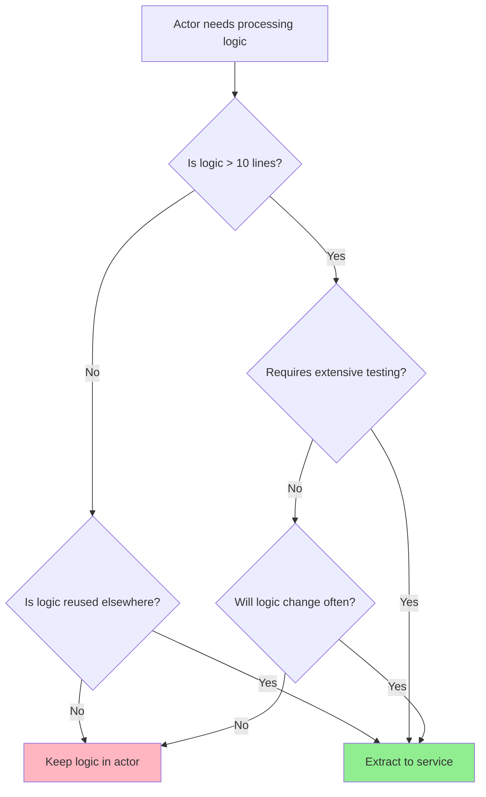

# Business Logic Decoupling Pattern

## Overview

The Business Logic Decoupling Pattern is a design approach that separates business logic from DataFlow orchestration, significantly improving testability and maintainability.

## The Problem

When business logic is embedded directly in actors, it becomes difficult to test because you must deal with async streams, cancellation tokens, and DataFlow infrastructure.

```csharp
// ❌ Hard to test - logic mixed with streaming
public class ComplexProcessingActor : IStreamActor<Order, ProcessedOrder>
{
    public async IAsyncEnumerable<ProcessedOrder> RunAsync(
        IAsyncEnumerable<Order> input,
        IActorExecutionContext context)
    {
        await foreach (var order in input.WithCancellation(context.CancellationToken))
        {
            // Complex business logic embedded here
            var discount = CalculateDiscount(order);
            var tax = CalculateTax(order, discount);
            var total = order.Subtotal - discount + tax;
            var isValid = ValidateOrder(order, total);
            
            yield return new ProcessedOrder(order.Id, total, isValid);
        }
    }
    
    private decimal CalculateDiscount(Order order) { /* complex logic */ }
    private decimal CalculateTax(Order order, decimal discount) { /* complex logic */ }
    private bool ValidateOrder(Order order, decimal total) { /* complex logic */ }
}
```

**Problems:**
1. **Hard to unit test** - Requires DataFlow infrastructure
2. **Difficult to verify logic** - Mixed with streaming concerns
3. **Can't reuse logic** - Tied to actor implementation
4. **Hard to mock** - Complex async enumerable handling

## The Solution

Extract business logic into separate services that are easy to test independently.

### Step 1: Define Service Interface

```csharp
public interface IOrderProcessor
{
    ProcessedOrder Process(Order order);
}
```

### Step 2: Implement Service (Pure Business Logic)

```csharp
public class OrderProcessor : IOrderProcessor
{
    public ProcessedOrder Process(Order order)
    {
        // Pure business logic - no async, no streaming
        var discount = CalculateDiscount(order);
        var tax = CalculateTax(order, discount);
        var total = order.Subtotal - discount + tax;
        var isValid = ValidateOrder(order, total);
        
        return new ProcessedOrder(order.Id, total, isValid);
    }
    
    private decimal CalculateDiscount(Order order)
    {
        // Discount logic - easy to test in isolation
        if (order.Subtotal > 100) return order.Subtotal * 0.1m;
        return 0;
    }
    
    private decimal CalculateTax(Order order, decimal discount)
    {
        // Tax calculation - easy to test in isolation
        return (order.Subtotal - discount) * 0.08m;
    }
    
    private bool ValidateOrder(Order order, decimal total)
    {
        // Validation logic - easy to test in isolation
        return total > 0 && order.Subtotal > 0;
    }
}
```

### Step 3: Thin Actor (Orchestration Only)

```csharp
// ✅ Easy to test - thin orchestration layer
public class OrderProcessingActor : IStreamActor<Order, ProcessedOrder>
{
    private readonly IOrderProcessor _processor;

    public OrderProcessingActor(IOrderProcessor processor)
    {
        _processor = processor;
    }

    public async IAsyncEnumerable<ProcessedOrder> RunAsync(
        IAsyncEnumerable<Order> input,
        IActorExecutionContext context)
    {
        await foreach (var order in input.WithCancellation(context.CancellationToken))
        {
            yield return _processor.Process(order);
        }
    }
}
```

## Testing Strategy

### Test 1: Pure Unit Test of Business Logic (Fast, Simple)

```csharp
[Fact]
public void OrderProcessor_Should_Apply_Discount_For_Large_Orders()
{
    // Arrange
    var processor = new OrderProcessor();
    var order = new Order { Id = 1, Subtotal = 150m };

    // Act
    var result = processor.Process(order);

    // Assert
    result.Total.ShouldBe(145.8m); // 150 - 15 (discount) + 10.8 (tax)
    result.IsValid.ShouldBeTrue();
}

[Fact]
public void OrderProcessor_Should_Not_Apply_Discount_For_Small_Orders()
{
    // Arrange
    var processor = new OrderProcessor();
    var order = new Order { Id = 2, Subtotal = 50m };

    // Act
    var result = processor.Process(order);

    // Assert
    result.Total.ShouldBe(54m); // 50 + 4 (tax)
    result.IsValid.ShouldBeTrue();
}
```

### Test 2: Actor Test with Mock (Verifies Orchestration)

```csharp
[Fact]
public async Task OrderProcessingActor_Should_Process_All_Orders()
{
    // Arrange
    var mockProcessor = Substitute.For<IOrderProcessor>();
    mockProcessor.Process(Arg.Any<Order>())
        .Returns(x => new ProcessedOrder(
            ((Order)x[0]).Id,
            ((Order)x[0]).Subtotal * 1.1m,
            true));

    var actor = new OrderProcessingActor(mockProcessor);
    var input = TestStreams.FromArray(
        new Order { Id = 1, Subtotal = 100m },
        new Order { Id = 2, Subtotal = 200m }
    );

    // Act
    var results = await TestStreams.CollectAsync(
        actor.RunAsync(input, TestContext.CreateActor()));

    // Assert
    results.Count.ShouldBe(2);
    mockProcessor.Received(2).Process(Arg.Any<Order>());
}
```

## Benefits

### 1. Testability

**Before (coupled):**
- Must test business logic through DataFlow infrastructure
- Complex test setup with async enumerables
- Difficult to test edge cases
- Slow tests (async overhead)

**After (decoupled):**
- Pure unit tests for business logic (fast, simple)
- Actor tests verify orchestration only
- Easy to test all edge cases
- Fast tests (synchronous business logic)

### 2. Maintainability

**Before:**
- Business logic buried in streaming code
- Changes require understanding DataFlow
- Hard to review business rules

**After:**
- Business logic clearly separated
- Changes only to service, not actor
- Easy to review business rules

### 3. Reusability

**Before:**
- Logic tied to specific actor
- Can't reuse in different contexts

**After:**
- Service can be reused across multiple actors
- Can use in non-DataFlow code
- Can share logic between POC and production

### 4. Performance Optimization

**Before:**
- Can't optimize logic separately from streaming
- Must optimize entire actor

**After:**
- Can profile and optimize service independently
- Can cache results at service level
- Can add memoization without touching actor

## When to Use This Pattern

### ✅ Use When:

1. **Business logic is complex** (> 10 lines)
2. **Logic requires thorough testing** (financial calculations, validation rules)
3. **Multiple actors share similar logic**
4. **Logic changes frequently** (business rules)
5. **Performance optimization needed** (can optimize service separately)
6. **Logic has many edge cases** (easier to test in isolation)

### ❌ Don't Use When:

1. **Logic is trivial** (simple mapping: `i => i.ToString()`)
2. **Actor is already simple** (< 5 lines of logic)
3. **No shared logic** (used only once)
4. **Abstraction adds unnecessary complexity**

## Decision Tree



## Pattern Variations

### Variation 1: Async Business Logic

If business logic is inherently async (e.g., calling external services):

```csharp
public interface IOrderProcessor
{
    Task<ProcessedOrder> ProcessAsync(Order order, CancellationToken ct);
}

public class OrderProcessingActor : IStreamActor<Order, ProcessedOrder>
{
    private readonly IOrderProcessor _processor;

    public OrderProcessingActor(IOrderProcessor processor)
    {
        _processor = processor;
    }

    public async IAsyncEnumerable<ProcessedOrder> RunAsync(
        IAsyncEnumerable<Order> input,
        IActorExecutionContext context)
    {
        await foreach (var order in input.WithCancellation(context.CancellationToken))
        {
            yield return await _processor.ProcessAsync(order, context.CancellationToken);
        }
    }
}
```

### Variation 2: Batch Processing Service

For batch-oriented logic:

```csharp
public interface IBatchProcessor
{
    ProcessedBatch Process(Batch batch);
}

public class BatchProcessingActor : IStreamActor<Batch, ProcessedBatch>
{
    private readonly IBatchProcessor _processor;

    public BatchProcessingActor(IBatchProcessor processor)
    {
        _processor = processor;
    }

    public async IAsyncEnumerable<ProcessedBatch> RunAsync(
        IAsyncEnumerable<Batch> input,
        IActorExecutionContext context)
    {
        await foreach (var batch in input.WithCancellation(context.CancellationToken))
        {
            yield return _processor.Process(batch);
        }
    }
}
```

### Variation 3: Filtering Service

For filtering logic:

```csharp
public interface IOrderValidator
{
    bool IsValid(Order order);
}

public class OrderFilterActor : IStreamActor<Order, Order>
{
    private readonly IOrderValidator _validator;

    public OrderFilterActor(IOrderValidator validator)
    {
        _validator = validator;
    }

    public async IAsyncEnumerable<Order> RunAsync(
        IAsyncEnumerable<Order> input,
        IActorExecutionContext context)
    {
        await foreach (var order in input.WithCancellation(context.CancellationToken))
        {
            if (_validator.IsValid(order))
            {
                yield return order;
            }
        }
    }
}
```

## Real-World Example

See `NSubstituteExamplesTests.cs` for a complete example with transactions:

- `ITransactionValidator` - Business logic interface
- `ValidationActor` - Thin actor using validator
- Comprehensive tests showing the pattern in action

## Common Pitfalls

### Pitfall 1: Over-Extraction

**Problem:** Extracting trivial logic unnecessarily.

```csharp
// ❌ Over-extraction
public interface IStringFormatter
{
    string Format(int value);
}

// ✅ Keep it simple
public class SimpleActor : IStreamActor<int, string>
{
    public async IAsyncEnumerable<string> RunAsync(...)
    {
        await foreach (var item in input)
        {
            yield return item.ToString(); // Trivial - no need to extract
        }
    }
}
```

### Pitfall 2: Not Respecting Cancellation

**Problem:** Service doesn't handle cancellation for long operations.

```csharp
// ❌ Long operation without cancellation
public ProcessedOrder Process(Order order)
{
    // Long computation without cancellation check
    for (int i = 0; i < 1000000; i++) { /* ... */ }
    return result;
}

// ✅ Add cancellation support
public ProcessedOrder Process(Order order, CancellationToken ct)
{
    for (int i = 0; i < 1000000; i++)
    {
        ct.ThrowIfCancellationRequested();
        // ...
    }
    return result;
}
```

### Pitfall 3: State in Services

**Problem:** Storing mutable state in services registered as scoped/singleton.

```csharp
// ❌ Mutable state in service
public class OrderProcessor : IOrderProcessor
{
    private int _processedCount; // Bad - state in service!

    public ProcessedOrder Process(Order order)
    {
        _processedCount++; // Not thread-safe!
        return new ProcessedOrder(order.Id, _processedCount);
    }
}

// ✅ Stateless services or use proper scoping
public class OrderProcessor : IOrderProcessor
{
    public ProcessedOrder Process(Order order, ref int processedCount)
    {
        processedCount++;
        return new ProcessedOrder(order.Id, processedCount);
    }
}
```

## Summary

The Business Logic Decoupling Pattern:
- **Separates** business logic from DataFlow orchestration
- **Improves** testability dramatically
- **Enables** pure unit tests (fast, simple)
- **Facilitates** logic reuse and maintenance
- **Should be used** for complex, frequently-changing, or thoroughly-tested logic
- **Should be avoided** for trivial transformations

**Key Principle:** Keep actors thin (orchestration), extract services for logic (testability).

## Related Resources

- **Testing Guide**: `/poc/docs/guides/testing-guide.md`
- **NSubstitute Examples**: `/poc/DataFlow.POC.Tests/NSubstituteExamplesTests.cs`
- **ADR - Business Logic Decoupling**: `/poc/docs/adr/2025-11-07-business-logic-decoupling.md`
