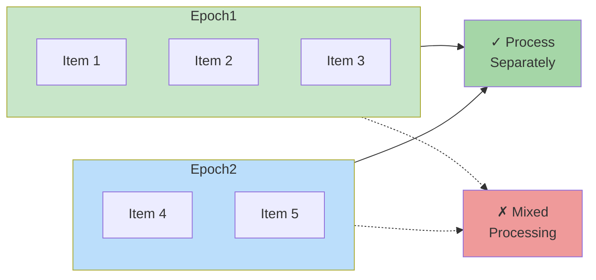
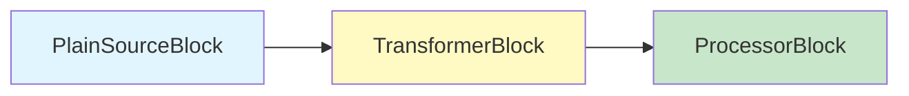
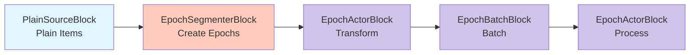
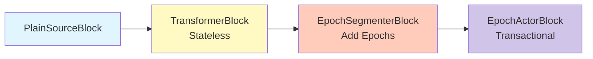
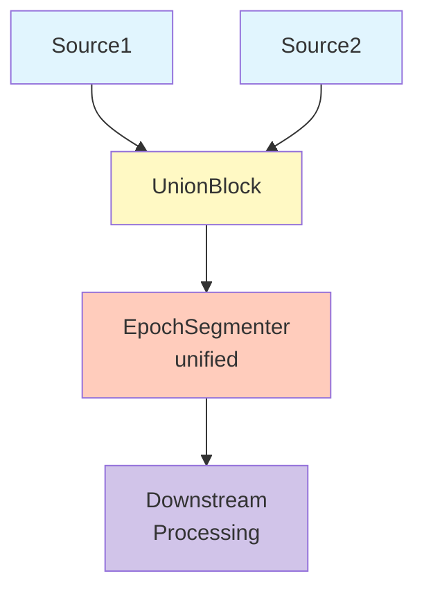
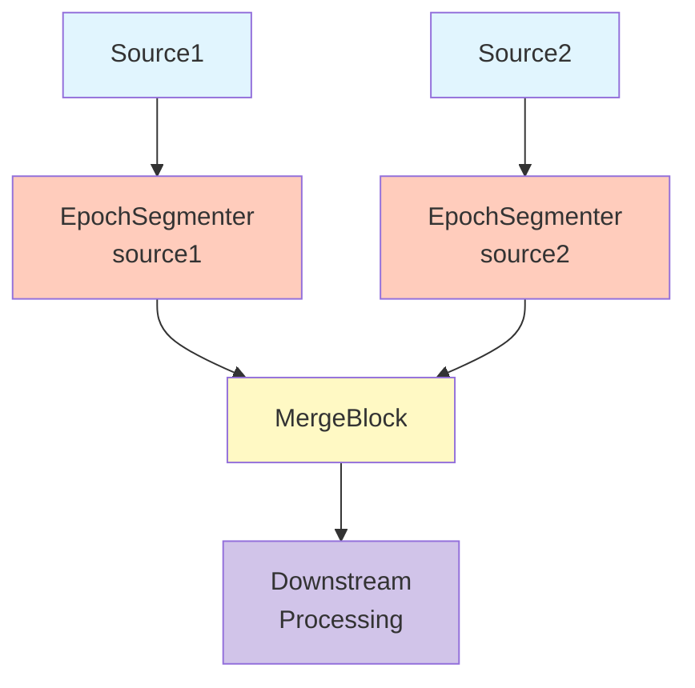
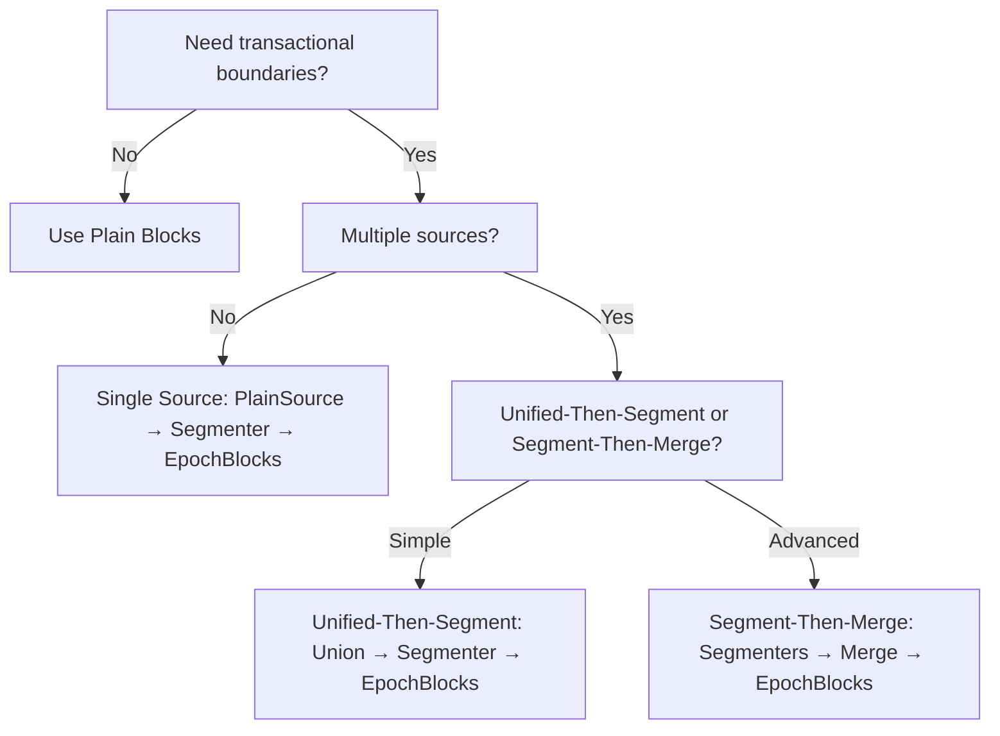

# Using Epochs in DataFlow POC

## Overview

Epochs provide transactional boundaries and checkpointing capabilities in DataFlow pipelines. This guide explains when and how to use epoch-aware blocks for building composable data processing pipelines.

## What are Epochs?

An **epoch** represents a logical boundary in the data stream that groups related items together. Epochs enable:

- **Transactional boundaries**: Process data in discrete units with commit/rollback semantics
- **Checkpointing**: Track progress and enable resumption from specific points
- **Multi-source coordination**: Coordinate processing across multiple data sources
- **Bulk operations**: Efficiently batch operations while maintaining logical boundaries

## Key Concepts

### Epoch Streams

An `IEpochStream<T>` wraps a stream of items with epoch metadata:

```csharp
public interface IEpochStream<T>
{
    EpochVector Epoch { get; }        // Epoch identification
    IAsyncEnumerable<T> Items { get; } // Items in this epoch
}
```

### Epoch Boundaries

**Critical Rule**: Operations must respect epoch boundaries. Items from different epochs should never be mixed in batches or transformations.



**Example:**
```csharp
// ✓ CORRECT: Process within epoch boundaries
// Input: Epoch1[1,2,3] Epoch2[4,5]
// Output: Epoch1[[1,2,3]] Epoch2[[4,5]]

// ✗ WRONG: Mixing epochs
// Input: Epoch1[1,2,3] Epoch2[4,5]
// Output: [[1,2,3,4,5]]  // Spans epochs!
```

## When to Use Epochs

### Use Epochs When You Need:

1. **Transactional Processing**: Writing to databases where you need commit/rollback
2. **Checkpointing**: Tracking progress for resumable processing
3. **Multi-Source Coordination**: Coordinating data from multiple sources
4. **Bulk Operations with Boundaries**: Batching for efficiency while maintaining logical boundaries

### Use Plain Blocks When:

1. **Stateless Transformations**: Simple data mapping without transaction concerns
2. **Continuous Streams**: Unbounded streams without natural boundaries
3. **Simple ETL**: Straightforward extract-transform-load pipelines

## Epoch-Aware Blocks

### EpochActorBlock<TIn, TOut, TActor>

The **recommended** primary block for epoch-aware processing. Provides DI scope safety and consolidates transformation and processing capabilities.

```csharp
// Define an actor
public class MyTransformActor : IStreamActor<int, string>
{
    public async IAsyncEnumerable<string> RunAsync(
        IAsyncEnumerable<int> input,
        IActorExecutionContext context)
    {
        await foreach (var item in input.WithCancellation(context.CancellationToken))
        {
            yield return $"Item-{item}";
        }
    }
}

// Use in pipeline
var actorBlock = new EpochActorBlock<int, string, MyTransformActor>(
    "transformer",
    serviceScopeFactory);
```

**Key Features**:
- **DI Scope Isolation**: Each actor runs in its own async DI scope
- **Scope Rotation**: Optionally rotate scopes via `context.RequestRotation()`
- **Flexible**: Supports 1-to-1, 1-to-many, filtering, and processing patterns

### EpochBatchBlock<T>

Batches items within epoch boundaries. Batches **never** span across epochs.

```csharp
var batchBlock = new EpochBatchBlock<int>(
    "batcher",
    maxBatchSize: 100,
    windowPeriod: TimeSpan.FromSeconds(5));
```

**Behavior**:
- Accumulates items up to `maxBatchSize`
- Emits batch when full or `windowPeriod` expires
- **Always** breaks at epoch boundaries (may emit underfilled batches)

## Composability Patterns

### Pattern 1: Plain Pipeline (No Epochs)

Use when epochs are not needed:



**Best For**: Stateless transformations, simple processing

### Pattern 2: Full Epoch Pipeline

Use when processing requires epochs throughout:



**Best For**: Transactional processing, checkpointing, bulk operations with boundaries

### Pattern 3: Mixed Pipeline

Combine plain and epoch-aware blocks by inserting a segmenter:



**Best For**: Some stateless processing, some requiring transactions

## Epoch Segmentation Strategies

### Single-Source Segmentation

For a single data source, segment after the source:

```csharp
var segmenter = new EpochSegmenterBlock<int>(
    "segmenter",
    EpochSegmentationPolicy.ByCount(1000, sourceId: "my-source"));
```

**Granularity Options**:
- **Per-batch** (e.g., 1000 items): Efficient bulk operations
- **Per-entity** (e.g., 1 item): Fine-grained checkpointing

### Multi-Source Segmentation

#### Unified-Then-Segment (Recommended)

Merge sources first, then segment:



**Advantages**:
- Simple single-source epochs
- No ancestry tracking needed
- Easier to implement

#### Segment-Then-Merge (Advanced)

Segment each source independently, then merge:



**Advantages**:
- Per-source checkpointing
- Independent progress tracking

**Complexity**: Requires lifecycle-aware blocks for multi-source epochs

## Epoch Granularity Trade-offs

### Coarse Epochs (Many Items per Epoch)

```csharp
EpochSegmentationPolicy.ByCount(1000, "source")
```

**Pros**:
- Efficient bulk operations (e.g., bulk database inserts)
- Lower overhead per epoch
- Better throughput

**Cons**:
- Less frequent checkpointing
- Larger rollback units on failure

**Use When**: Bulk insert scenarios, high-throughput requirements

### Fine Epochs (Few Items per Epoch)

```csharp
EpochSegmentationPolicy.ByCount(1, "source")
```

**Pros**:
- Frequent checkpointing
- Small rollback units
- Better failure recovery

**Cons**:
- Higher per-epoch overhead
- May not leverage bulk operations

**Use When**: Critical data, need fine-grained recovery

### Recommendation

Start with **coarse epochs** (hundreds to thousands of items) for efficiency. Refine based on:
- Failure recovery requirements
- Bulk operation capabilities
- Checkpointing frequency needs

## Examples

### Example 1: Transactional Database Writes

```csharp
var services = new ServiceCollection();
services.AddTransient<MyDataProducer>();
services.AddTransient<DatabaseWriteActor>();
var provider = services.BuildServiceProvider();

var sourceBlock = new PlainSourceBlock<Invoice, MyDataProducer>(
    "invoice-source",
    provider.GetRequiredService<IServiceScopeFactory>());

var segmenterBlock = new EpochSegmenterBlock<Invoice>(
    "segmenter",
    EpochSegmentationPolicy.ByCount(100, "invoices")); // Batch 100 invoices per epoch

var writerBlock = new EpochActorBlock<Invoice, object, DatabaseWriteActor>(
    "writer",
    provider.GetRequiredService<IServiceScopeFactory>());

// Execute pipeline
var context = new ExecutionContext();
var invoices = sourceBlock.ExecuteAsync(EmptyInput(), context);
var epochStreams = segmenterBlock.ExecuteAsync(invoices, context);
var results = writerBlock.ExecuteAsync(epochStreams, context);

await foreach (var result in results)
{
    // Process results
}
```

### Example 2: Composed Pipeline with Batching

```csharp
// Transform → Batch → Process within epochs
var transformBlock = new EpochActorBlock<int, int, DoubleActor>(
    "doubler",
    scopeFactory);

var batchBlock = new EpochBatchBlock<int>(
    "batcher",
    maxBatchSize: 50);

var processBlock = new EpochActorBlock<int[], object, BatchProcessorActor>(
    "processor",
    scopeFactory);

// Chain blocks
var epochStreams = segmenterBlock.ExecuteAsync(plainItems, context);
var transformed = transformBlock.ExecuteAsync(epochStreams, context);
var batched = batchBlock.ExecuteAsync(transformed, context);
var processed = processBlock.ExecuteAsync(batched, context);
```

### Example 3: Filtering Within Epochs

```csharp
public class FilterEvenActor : IStreamActor<int, int>
{
    public async IAsyncEnumerable<int> RunAsync(
        IAsyncEnumerable<int> input,
        IActorExecutionContext context)
    {
        await foreach (var item in input.WithCancellation(context.CancellationToken))
        {
            if (item % 2 == 0)
            {
                yield return item; // Only even numbers
            }
        }
    }
}

var filterBlock = new EpochActorBlock<int, int, FilterEvenActor>(
    "filter-evens",
    scopeFactory);
```

## Decision Tree

Use this flowchart to decide your approach:



## Best Practices

1. **Respect Epoch Boundaries**: Never mix items from different epochs
2. **Choose Appropriate Granularity**: Balance efficiency vs. checkpointing frequency
3. **Use EpochActorBlock**: Primary block for epoch-aware processing (DI-safe by default)
4. **Streaming Semantics**: Use `yield return` for lazy evaluation
5. **Handle Cancellation**: Always pass through cancellation tokens
6. **Cleanup Resources**: Use `finally` blocks for resource disposal

## Common Pitfalls

### ❌ Buffering Entire Epoch

```csharp
// DON'T: Buffers entire epoch in memory
var allItems = await epochStream.Items.ToListAsync();
foreach (var item in allItems)
{
    yield return Transform(item);
}
```

### ✅ Streaming Processing

```csharp
// DO: Stream items as they arrive
await foreach (var item in epochStream.Items.WithCancellation(ct))
{
    yield return Transform(item);
}
```

### ❌ Ignoring Cancellation

```csharp
// DON'T: Process without checking cancellation
await foreach (var item in epochStream.Items)
{
    yield return Transform(item);
}
```

### ✅ Respecting Cancellation

```csharp
// DO: Pass cancellation token
await foreach (var item in epochStream.Items.WithCancellation(context.CancellationToken))
{
    yield return Transform(item);
}
```

## Performance Considerations

- **EpochActorBlock**: Minimal overhead (~10% in micro-benchmarks)
- **EpochBatchBlock**: Efficient batching with epoch boundary checks
- **Memory**: O(1) per item for streaming operations
- **Throughput**: Comparable to plain blocks for most workloads

## Further Reading

- `/poc/docs/design/epoch-segmentation.md` - Epoch segmentation design
- `/research/flow-composability-unification/` - Research on composability patterns
- `/poc/docs/POC_GLOSSARY.md` - POC terminology reference
