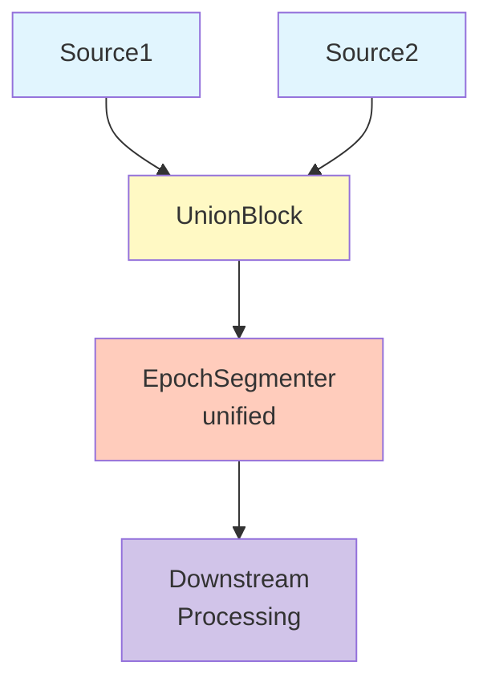
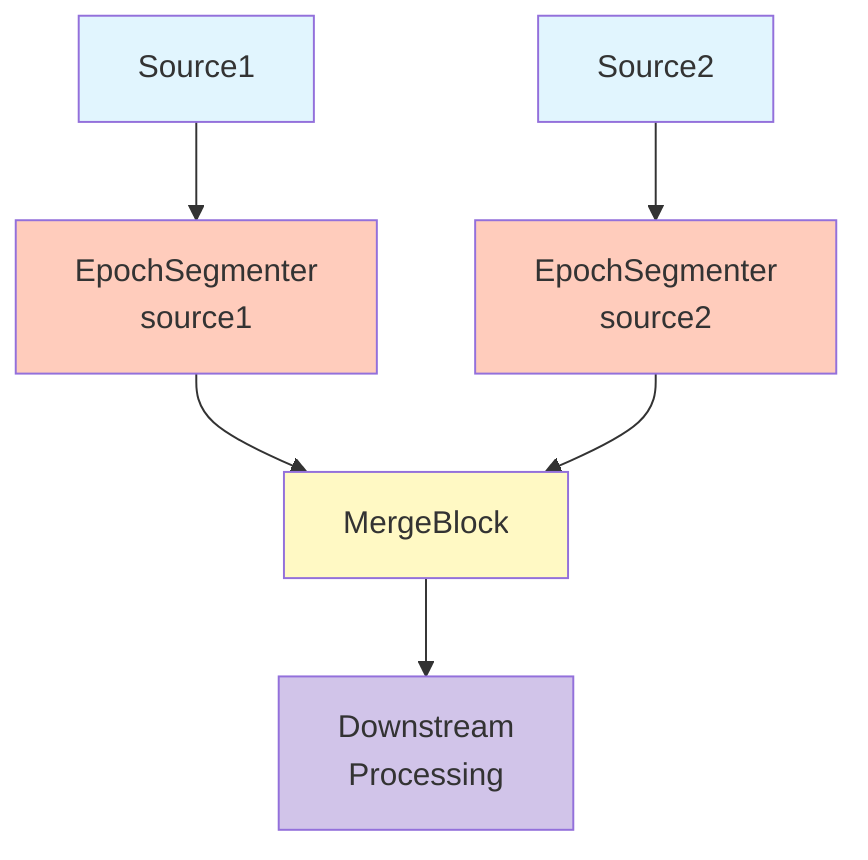
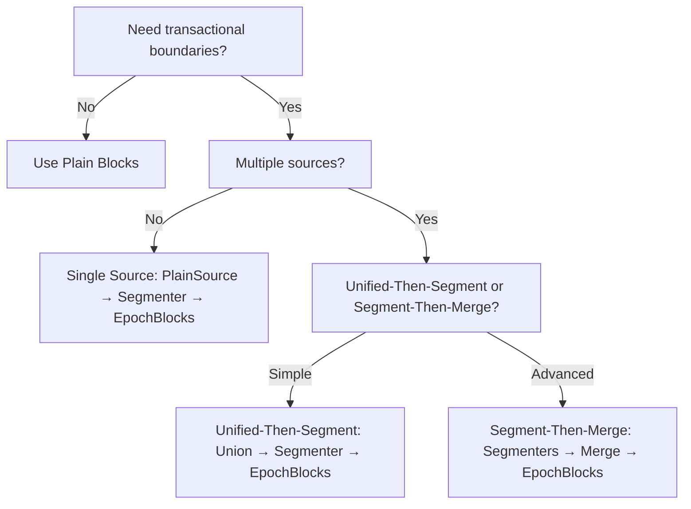

# Using Epochs in DataFlow POC

## Overview

Epochs provide transactional boundaries and coordination capabilities in DataFlow pipelines. This guide explains the **formalized epoch system** using `EpochSourceNode` and `EpochProcessorNode` for building transactional data processing pipelines.

## What are Epochs?

An **epoch** represents a logical boundary in the data stream that groups related items together. The formalized epoch system provides:

- **Transaction lifecycle management**: Begin, commit, and rollback transactions via lifecycle hooks
- **Serialized operation execution**: Queue operations that execute serially within epoch scope
- **Multi-processor concurrency**: Configure 1-N processors for serial vs parallel epoch processing
- **DI scope isolation**: Each epoch has its own dependency injection scope
- **MSDTC-safe design**: Fully serial execution prevents distributed transaction escalation

## Key Concepts

### Epoch Architecture

The formalized epoch system consists of two specialized nodes:

#### EpochSourceNode
Creates and publishes epochs to an internal stream. Acts as the coordinator for epoch creation.

```csharp
public sealed class EpochSourceNode
{
    public ChannelReader<IEpoch> EpochReader { get; }
    public Task PublishEpochAsync(IEpoch epoch);
    public void SignalCompletion();
}
```

#### EpochProcessorNode
Consumes epochs from the source node and processes them by:
1. Executing lifecycle hooks (OnBeginEpoch, OnCommitEpoch, OnEpochError)
2. Draining serialized operation queues
3. Managing epoch disposal

```csharp
public sealed class EpochProcessorNode : IAsyncDisposable
{
    public EpochProcessorNode(EpochSourceNode source, EpochHooks? hooks = null);
    public Task CompletionTask { get; }
}
```

### Epoch Scopes and DI

Each epoch has its own DI scope, enabling scoped services (like `DbContext`) to be shared across all operations within that epoch:

```csharp
public interface IEpoch : IAsyncDisposable
{
    EpochVector Vector { get; }
    IServiceProvider ServiceProvider { get; }
    
    Task QueueSerializedOperationAsync<TService>(
        Func<TService, Task> operation,
        CancellationToken cancellationToken = default)
        where TService : notnull;
}
```

### Serialized Operations

All operations within an epoch execute **fully serially** through a single channel:

```csharp
// All operations queued to this epoch will execute in FIFO order
await epoch.QueueSerializedOperationAsync<DbContext>(async db =>
{
    // Operation executes with epoch-scoped DbContext
    db.Orders.Add(new Order { ... });
    await db.SaveChangesAsync();
});
```

**Key Benefits**:
- ✅ No MSDTC escalation (only one connection active at a time)
- ✅ Thread-safe by design (no concurrent access)
- ✅ Deterministic execution order
- ✅ Automatic service resolution from epoch scope

## When to Use Epochs

### Use the Formalized Epoch System When You Need:

1. **Transactional Database Operations**: Writing to databases where you need transaction lifecycle control
2. **Scoped Service Coordination**: Multiple blocks need to share scoped services (like `DbContext`)
3. **Serialized Execution**: Operations must execute in order without concurrency
4. **Lifecycle Hooks**: Need to execute custom logic at epoch boundaries (begin/commit/error)

### Use Plain Blocks When:

1. **Stateless Transformations**: Simple data mapping without transaction concerns
2. **Continuous Streams**: Unbounded streams without natural boundaries
3. **No Shared State**: Each item processed independently

## Using the Formalized Epoch System

### Basic Setup

Configure epochs during graph construction:

```csharp
var services = new ServiceCollection();
services.AddScoped<DbContext>(); // Register scoped services
var serviceProvider = services.BuildServiceProvider();

var coordinator = new EpochCoordinator(
    serviceProvider.GetRequiredService<IServiceScopeFactory>());
var source = new EpochSourceNode(coordinator);

// Configure lifecycle hooks
var hooks = new EpochHooks
{
    OnBeginEpoch = async (epoch, ct) =>
    {
        await epoch.QueueSerializedOperationAsync<DbContext>(async db =>
        {
            await db.Database.BeginTransactionAsync(ct);
        }, ct);
    },
    
    OnCommitEpoch = async (epoch, ct) =>
    {
        await epoch.QueueSerializedOperationAsync<DbContext>(async db =>
        {
            await db.SaveChangesAsync(ct);
            await db.Database.CommitTransactionAsync(ct);
        }, ct);
    },
    
    OnEpochError = async (epoch, error, ct) =>
    {
        await epoch.QueueSerializedOperationAsync<DbContext>(async db =>
        {
            await db.Database.RollbackTransactionAsync(ct);
        }, ct);
    }
};

// Create processor(s)
var processor = new EpochProcessorNode(source, hooks);
```

### Queueing Operations from Blocks

In your processing blocks, queue operations to the epoch:

```csharp
public class OrderProcessingBlock
{
    public async Task ProcessOrderAsync(Order order, IEpoch epoch, CancellationToken ct)
    {
        // Queue operation to execute within epoch's transaction
        await epoch.QueueSerializedOperationAsync<DbContext>(async db =>
        {
            db.Orders.Add(order);
            // Don't call SaveChanges here - the OnCommitEpoch hook handles it
        }, ct);
    }
}
```

### Multi-Processor Concurrency

Configure multiple processors for higher throughput:

```csharp
// Serial processing (deterministic order)
var processor1 = new EpochProcessorNode(source, hooks);

// Parallel processing (higher throughput, non-deterministic commit order)
var processor1 = new EpochProcessorNode(source, hooks);
var processor2 = new EpochProcessorNode(source, hooks);
var processor3 = new EpochProcessorNode(source, hooks);
var processor4 = new EpochProcessorNode(source, hooks);

// Wait for all processors
await Task.WhenAll(
    processor1.CompletionTask,
    processor2.CompletionTask,
    processor3.CompletionTask,
    processor4.CompletionTask);
```

## Configuration Patterns

### Policy-Based Epoch Creation

```csharp
// Create epochs by count
var policy = EpochPolicy.ByCount(100); // Every 100 items

// Create epochs by time
var policy = EpochPolicy.ByTime(TimeSpan.FromSeconds(5)); // Every 5 seconds

// Custom policy
var policy = new CustomEpochPolicy();
```

### Publishing Epochs

```csharp
// Create an epoch
var vector = EpochVector.FromSingleSource("mySource", sequenceNumber);
var epoch = await coordinator.GetOrCreateEpochAsync("mySource", vector);

// Queue operations during processing
await epoch.QueueSerializedOperationAsync<MyService>(async svc =>
{
    await svc.DoWorkAsync();
});

// Publish for processing
await source.PublishEpochAsync(epoch);

// Signal completion when done
source.SignalCompletion();

// Wait for processing
await processor.CompletionTask;
```

## Best Practices

### 1. Use Lifecycle Hooks for Transaction Management

Always use `OnBeginEpoch` and `OnCommitEpoch` hooks for transaction lifecycle:

```csharp
var hooks = new EpochHooks
{
    OnBeginEpoch = async (epoch, ct) =>
    {
        await epoch.QueueSerializedOperationAsync<DbContext>(
            async db => await db.Database.BeginTransactionAsync(ct), ct);
    },
    OnCommitEpoch = async (epoch, ct) =>
    {
        await epoch.QueueSerializedOperationAsync<DbContext>(async db =>
        {
            await db.SaveChangesAsync(ct);
            await db.Database.CommitTransactionAsync(ct);
        }, ct);
    }
};
```

### 2. Don't Call SaveChanges in Operations

Let the `OnCommitEpoch` hook handle SaveChanges:

```csharp
// ✅ CORRECT
await epoch.QueueSerializedOperationAsync<DbContext>(async db =>
{
    db.Orders.Add(order);
    // OnCommitEpoch will call SaveChangesAsync
});

// ❌ WRONG
await epoch.QueueSerializedOperationAsync<DbContext>(async db =>
{
    db.Orders.Add(order);
    await db.SaveChangesAsync(); // Don't do this!
});
```

### 3. Queue Operations, Don't Block

The `QueueSerializedOperationAsync` returns when the operation is **queued**, not when it executes:

```csharp
// Queues operation and returns immediately
await epoch.QueueSerializedOperationAsync<DbContext>(async db =>
{
    db.Orders.Add(order);
});

// Continue processing - operation executes later
await ProcessNextItemAsync();
```

### 4. Configure Processor Count for Your Workload

- **1 processor**: Deterministic commit order, lower throughput
- **2-4 processors**: Higher throughput, non-deterministic commit order
- **More processors**: Diminishing returns due to coordination overhead

## See Also

- [EF Core with Epochs Guide](./ef-core-epochs.md) - Specific guidance for Entity Framework Core
- [Epoch Vectors](../design/epoch-vectors.md) - Multi-source coordination
- [Transaction Boundaries](../design/transaction-boundaries.md) - Transaction semantics

## Migration from Old Patterns

If you're using the old `IEpochStream<T>` pattern, see the migration guide for details on converting to the formalized epoch system.

**Key Changes**:
- ❌ No more `IEpochStream<T>` - Use `EpochSourceNode` and `EpochProcessorNode`
- ❌ No more `EpochActorBlock` - Queue operations via `IEpoch.QueueSerializedOperationAsync`
- ❌ No more out-of-band control signals - Epochs are managed explicitly
- ✅ Lifecycle hooks replace `IEpochLifecycleParticipant`
- ✅ Serialized operations replace per-block state management
flowchart LR
    A[PlainSourceAdapter] --> B[EpochActorBlock<br/>Epoch-aware]
    B --> C[EpochBatchBlock<br/>Batching]
    C --> D[EpochActorBlock<br/>Transactional]
    
    style A fill:#e1f5fe
    style B fill:#d1c4e9
    style C fill:#ffccbc
    style D fill:#c8e6c9
```

**Best For**: Some stateless processing, some requiring transactions

## Epoch Segmentation Strategies

### Single-Source Segmentation

For a single data source, segment after the source:

```csharp
var segmenter = new EpochSegmenterBlock<int>(
    "segmenter",
    EpochSegmentationPolicy.ByCount(1000, sourceId: "my-source"));
```

**Granularity Options**:
- **Per-batch** (e.g., 1000 items): Efficient bulk operations
- **Per-entity** (e.g., 1 item): Fine-grained checkpointing

### Multi-Source Segmentation

#### Unified-Then-Segment (Recommended)

Merge sources first, then segment:



**Advantages**:
- Simple single-source epochs
- No ancestry tracking needed
- Easier to implement

#### Segment-Then-Merge (Advanced)

Segment each source independently, then merge:



**Advantages**:
- Per-source checkpointing
- Independent progress tracking

**Complexity**: Requires lifecycle-aware blocks for multi-source epochs

## Epoch Granularity Trade-offs

### Coarse Epochs (Many Items per Epoch)

```csharp
EpochSegmentationPolicy.ByCount(1000, "source")
```

**Pros**:
- Efficient bulk operations (e.g., bulk database inserts)
- Lower overhead per epoch
- Better throughput

**Cons**:
- Less frequent checkpointing
- Larger rollback units on failure

**Use When**: Bulk insert scenarios, high-throughput requirements

### Fine Epochs (Few Items per Epoch)

```csharp
EpochSegmentationPolicy.ByCount(1, "source")
```

**Pros**:
- Frequent checkpointing
- Small rollback units
- Better failure recovery

**Cons**:
- Higher per-epoch overhead
- May not leverage bulk operations

**Use When**: Critical data, need fine-grained recovery

### Recommendation

Start with **coarse epochs** (hundreds to thousands of items) for efficiency. Refine based on:
- Failure recovery requirements
- Bulk operation capabilities
- Checkpointing frequency needs

## Examples

### Example 1: Transactional Database Writes

```csharp
var services = new ServiceCollection();
services.AddTransient<MyDataProducer>();
services.AddTransient<DatabaseWriteActor>();
var provider = services.BuildServiceProvider();

var sourceBlock = new PlainSourceAdapter<Invoice, MyDataProducer>(
    new BlockContext("invoice-source"),
    provider.GetRequiredService<IServiceScopeFactory>(),
    "invoice-source");

var segmenterBlock = new EpochSegmenterBlock<Invoice>(
    new BlockContext("segmenter"),
    EpochSegmentationPolicy.ByCount(100, "invoices")); // Batch 100 invoices per epoch

var writerBlock = new EpochActorBlock<Invoice, object, DatabaseWriteActor>(
    new BlockContext("writer"),
    provider.GetRequiredService<IServiceScopeFactory>());

// Execute pipeline
var context = new ExecutionContext();
var invoices = sourceBlock.ExecuteAsync(EmptyInput(), context);
var epochStreams = segmenterBlock.ExecuteAsync(invoices, context);
var results = writerBlock.ExecuteAsync(epochStreams, context);

await foreach (var result in results)
{
    // Process results
}
```

### Example 2: Composed Pipeline with Batching

```csharp
// Transform → Batch → Process within epochs
var transformBlock = new EpochActorBlock<int, int, DoubleActor>(
    "doubler",
    scopeFactory);

var batchBlock = new EpochBatchBlock<int>(
    "batcher",
    maxBatchSize: 50);

var processBlock = new EpochActorBlock<int[], object, BatchProcessorActor>(
    "processor",
    scopeFactory);

// Chain blocks
var epochStreams = segmenterBlock.ExecuteAsync(plainItems, context);
var transformed = transformBlock.ExecuteAsync(epochStreams, context);
var batched = batchBlock.ExecuteAsync(transformed, context);
var processed = processBlock.ExecuteAsync(batched, context);
```

### Example 3: Filtering Within Epochs

```csharp
public class FilterEvenActor : IStreamActor<int, int>
{
    public async IAsyncEnumerable<int> RunAsync(
        IAsyncEnumerable<int> input,
        IActorExecutionContext context)
    {
        await foreach (var item in input.WithCancellation(context.CancellationToken))
        {
            if (item % 2 == 0)
            {
                yield return item; // Only even numbers
            }
        }
    }
}

var filterBlock = new EpochActorBlock<int, int, FilterEvenActor>(
    "filter-evens",
    scopeFactory);
```

## Decision Tree

Use this flowchart to decide your approach:



## Best Practices

1. **Respect Epoch Boundaries**: Never mix items from different epochs
2. **Choose Appropriate Granularity**: Balance efficiency vs. checkpointing frequency
3. **Use EpochActorBlock**: Primary block for epoch-aware processing (DI-safe by default)
4. **Streaming Semantics**: Use `yield return` for lazy evaluation
5. **Handle Cancellation**: Always pass through cancellation tokens
6. **Cleanup Resources**: Use `finally` blocks for resource disposal

## Common Pitfalls

### ❌ Buffering Entire Epoch

```csharp
// DON'T: Buffers entire epoch in memory
var allItems = await epochStream.Items.ToListAsync();
foreach (var item in allItems)
{
    yield return Transform(item);
}
```

### ✅ Streaming Processing

```csharp
// DO: Stream items as they arrive
await foreach (var item in epochStream.Items.WithCancellation(ct))
{
    yield return Transform(item);
}
```

### ❌ Ignoring Cancellation

```csharp
// DON'T: Process without checking cancellation
await foreach (var item in epochStream.Items)
{
    yield return Transform(item);
}
```

### ✅ Respecting Cancellation

```csharp
// DO: Pass cancellation token
await foreach (var item in epochStream.Items.WithCancellation(context.CancellationToken))
{
    yield return Transform(item);
}
```

## Performance Considerations

- **EpochActorBlock**: Minimal overhead (~10% in micro-benchmarks)
- **EpochBatchBlock**: Efficient batching with epoch boundary checks
- **Memory**: O(1) per item for streaming operations
- **Throughput**: Comparable to plain blocks for most workloads

## Further Reading

- `/poc/docs/design/epoch-segmentation.md` - Epoch segmentation design
- `/research/flow-composability-unification/` - Research on composability patterns
- `/poc/docs/POC_GLOSSARY.md` - POC terminology reference
