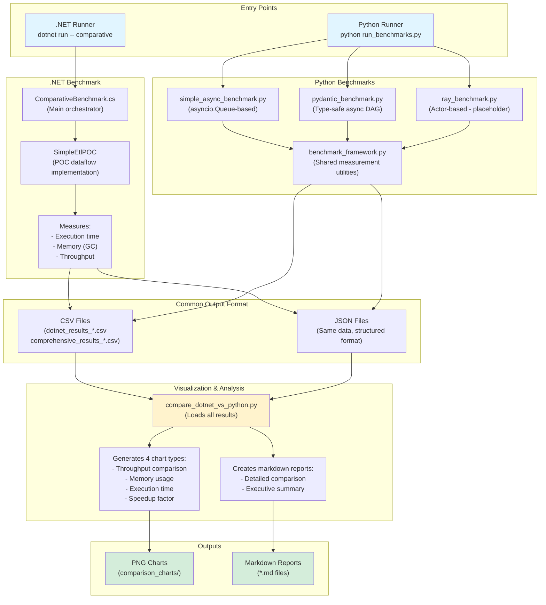

# Benchmarking Infrastructure Overview

## Architecture

The benchmarking system consists of independent benchmark runners for each platform that output results in a common format, which are then combined and visualized by a Python comparison script.



## Components & Responsibilities

### 1. .NET Benchmark Runner
**Location**: `poc/DataFlow.POC.Benchmarks/ComparativeBenchmark.cs`

**Responsibility**: 
- Runs .NET DataFlow POC benchmarks with configurable workloads
- Measures execution time, memory usage, GC collections, throughput
- Outputs results in Python-compatible CSV/JSON format

**Entry Point**:
```bash
cd poc/DataFlow.POC.Benchmarks
dotnet run -- comparative --sizes 1000,5000,10000 --concurrency 1,2,4
```

**How It Works**:
1. Parses command-line arguments for record counts and concurrency levels
2. For each configuration:
   - Forces GC collection to get clean baseline
   - Records initial GC counts and memory
   - Runs `SimpleEtlPOC.BuildDataFlow()` with the configuration
   - Measures execution time, throughput, memory delta, GC collections
3. Saves results to `poc/python-benchmarks/results/dotnet_results_*.csv/json`

### 2. Python Benchmark Runners
**Location**: `poc/python-benchmarks/`

**Components**:
- `simple_async_benchmark.py` - Lightweight asyncio implementation
- `pydantic_benchmark.py` - Type-safe Pydantic models with concurrency
- `ray_benchmark.py` - Actor-based (placeholder, needs refactoring)
- `benchmark_framework.py` - Shared utilities for timing, memory tracking, GC stats

**Entry Point**:
```bash
cd poc/python-benchmarks
python run_comprehensive_benchmarks.py --sizes 1000,5000,10000 --concurrency 1,2,4
```

**How It Works**:
1. Each benchmark implements the same topology: Producer → Validator → Enricher → Consumer
2. `BenchmarkRunner` base class provides:
   - Context manager for consistent measurement (`measure_performance`)
   - Tracks execution time via `time.perf_counter()`
   - Tracks peak memory via `tracemalloc`
   - Tracks GC collections via `gc.get_count()`
   - Tracks CPU usage via `psutil`
3. Results saved to `poc/python-benchmarks/results/comprehensive_results_*.csv/json`

### 3. Comparison & Visualization Script
**Location**: `poc/python-benchmarks/compare_dotnet_vs_python.py`

**Responsibility**:
- Loads all benchmark results (Python + .NET) from CSV/JSON files
- Normalizes column names across different formats
- Generates 4 comprehensive comparison charts
- Creates detailed markdown reports with statistical analysis

**Entry Point**:
```bash
cd poc/python-benchmarks
python compare_dotnet_vs_python.py
```

**How It Works**:
1. **Data Loading**: Scans `results/` directory for all `*_results_*.csv` files
2. **Data Normalization**: Maps column names (e.g., `RecordCount` → `record_count`)
3. **Chart Generation** (4 types):
   - **Throughput Comparison**: Shows scaling across concurrency levels
   - **Memory Usage**: Compares peak memory consumption
   - **Execution Time**: Time to complete at each configuration
   - **Speedup Factor**: Relative performance vs Pydantic baseline
4. **Report Generation**: Creates markdown files with:
   - Configuration-by-configuration comparison tables
   - Overall statistics (avg throughput, avg memory, scaling factors)
   - Key insights and recommendations

### 4. Common Data Format
**Location**: `poc/python-benchmarks/results/`

**CSV/JSON Schema**:
```
Library,RecordCount,Concurrency,ExecutionTime(s),Throughput(rec/s),
PeakMemory(MB),GC_Gen0,GC_Gen1,GC_Gen2,CPU%
```

**Why This Approach**:
- Platform-independent intermediate format
- Enables offline analysis and re-visualization
- Allows comparing benchmarks run at different times
- Simple to parse and extend

## Workflow Summary

1. **Run .NET benchmarks** → Produces `dotnet_results_*.csv`
2. **Run Python benchmarks** → Produces `comprehensive_results_*.csv`
3. **Run comparison script** → Loads both files, generates charts and reports
4. **Review outputs** → Check `results/comparison_charts/` for PNGs and `*.md` for analysis

## Key Design Decisions

1. **Separate Runners**: Each platform has its own runner that outputs to common format
   - Avoids Python calling .NET (cross-platform complexity)
   - Each can be run independently
   - Results are reproducible

2. **CSV/JSON Output**: Simple, human-readable, tool-agnostic
   - Easy to inspect manually
   - Compatible with spreadsheets, pandas, etc.
   - Version control friendly (gitignored, reproducible)

3. **Post-Processing Comparison**: Single Python script handles all visualization
   - Consistent chart styling
   - Can compare results from different benchmark runs
   - Easy to add new chart types

4. **No BenchmarkDotNet**: Custom .NET benchmark for cross-platform compatibility
   - BenchmarkDotNet excels at .NET micro-benchmarks
   - Custom approach allows unified CSV output format
   - Simpler for cross-platform comparison

## Adding New Benchmarks

To add a new library:

1. **For Python**: Create `new_library_benchmark.py` extending `BenchmarkRunner`
2. **For .NET**: Modify `ComparativeBenchmark.cs` to run new implementation
3. Re-run the comparison script - it automatically includes new data
