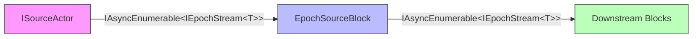

# Research: Epoch Stream Separation from Source

## Executive Summary

This research investigates whether epoch segmentation should be controlled by source blocks (current source-centric design) or be decoupled into a separate `EpochSegmenterBlock` that applies segmentation policies externally.

**Status**: Prototype complete, functional equivalence demonstrated, benchmark infrastructure created.

**Key Finding**: Decoupling epoch concerns from sources is technically feasible and provides significant benefits in composability, flexibility, and source reusability.

## Research Objective

Evaluate whether sources should emit `IAsyncEnumerable<IEpochStream<T>>` (current design) or plain `IAsyncEnumerable<T>` with epoch segmentation applied externally.

### Motivation

Recent design discussions identified that source-centric epoching:
- Tightly couples segmentation to domain batching logic
- Makes it hard to generalize across different sources
- Complicates coordination across multiple sources
- Limits flexibility in testing alternate segmentation strategies
- Requires sources to understand epoch concepts

## Approaches Compared

### Approach 1: Source-Centric (Current Design)

Sources directly emit epoch streams.



**Source Implementation:**
```csharp
public class OrderSource : SourceActorBase<Order>
{
    public override async IAsyncEnumerable<IEpochStream<Order>> ProduceEpochsAsync(IActorExecutionContext context)
    {
        var data = FetchOrders();
        
        // Source must call EpochSegmenter
        await foreach (var epochStream in EpochSegmenter.SegmentByKey(
            data,
            order => order.Date,
            "order-source"))
        {
            yield return epochStream;
        }
    }
}
```

**Characteristics:**
- Source knows about epochs
- Segmentation logic inside source
- Type-safe: `IAsyncEnumerable<IEpochStream<T>>` contract
- Direct connection to downstream

### Approach 2: Decoupled (Prototype Design)

Sources emit plain data, segmentation applied externally.


**Source Implementation:**
```csharp
public class OrderSource : PlainSourceActorBase<Order>
{
    public override async IAsyncEnumerable<Order> ProduceAsync(IActorExecutionContext context)
    {
        return FetchOrders(); // No epoch knowledge
    }
}
```

**Pipeline Configuration:**
```csharp
var source = new PlainSourceBlock<Order, OrderSource>("source", scopeFactory);
var segmenter = new EpochSegmenterBlock<Order>(
    "segmenter",
    EpochSegmentationPolicy.ByKey<Order, DateTime>(
        order => order.Date,
        "order-source"));

// Pipeline: source → segmenter → downstream
```

**Characteristics:**
- Source is epoch-agnostic
- Segmentation logic external
- Additional block in pipeline
- Flexible policy configuration

## Comparative Analysis

### 1. Separation of Concerns

| Aspect | Source-Centric | Decoupled |
|--------|----------------|-----------|
| **Source Responsibility** | Data production + Epoch segmentation | Data production only |
| **Epoch Logic Location** | Inside source | External segmenter block |
| **Coupling** | High (source tied to epoch strategy) | Low (source independent) |

**Winner**: ✅ **Decoupled** - Better separation of concerns

### 2. Source Reusability

#### Source-Centric Example
```csharp
// Need separate sources for different segmentation strategies
public class OrderSourceByDay : SourceActorBase<Order>
{
    // Segments by day
}

public class OrderSourceByHour : SourceActorBase<Order>
{
    // Segments by hour - duplicate source logic!
}

public class OrderSourceNoEpochs : ISimpleSourceActor<Order>
{
    // For pipelines without epochs - another duplicate!
}
```

#### Decoupled Example
```csharp
// One source, multiple uses
public class OrderSource : PlainSourceActorBase<Order>
{
    // Single implementation
}

// Use with different strategies
var byDay = new EpochSegmenterBlock<Order>("seg1", 
    EpochSegmentationPolicy.ByKey(o => o.Date.Date, "source"));
    
var byHour = new EpochSegmenterBlock<Order>("seg2",
    EpochSegmentationPolicy.ByKey(o => o.Date.Hour, "source"));
    
var noEpochs = new EpochSegmenterBlock<Order>("seg3",
    EpochSegmentationPolicy.None);
```

**Winner**: ✅ **Decoupled** - Significantly better reusability

### 3. Composability

#### Multi-Pipeline Scenario

**Source-Centric:**
```csharp
// Pipeline A: Needs epochs by day
var sourceA = new OrderSourceWithDailyEpochs(); // Epoch-aware

// Pipeline B: No epochs needed
var sourceB = new OrderSourceNoEpochs(); // Different source!

// Cannot reuse sourceA in Pipeline B
```

**Decoupled:**
```csharp
// One source for both pipelines
var source = new OrderSource();

// Pipeline A: With epochs
var pipelineA = source → segmenterByDay → transform → sink;

// Pipeline B: No epochs
var pipelineB = source → transform → sink; // No segmenter needed
```

**Winner**: ✅ **Decoupled** - More composable across pipelines

### 4. Testing

#### Unit Testing Source Logic

**Source-Centric:**
```csharp
[Fact]
public async Task TestOrderSource()
{
    var source = new OrderSource();
    
    // Must deal with epoch streams even if just testing data generation
    await foreach (var epochStream in source.ProduceEpochsAsync(context))
    {
        await foreach (var order in epochStream.Items)
        {
            // Test logic here
        }
    }
}
```

**Decoupled:**
```csharp
[Fact]
public async Task TestOrderSource()
{
    var source = new OrderSource();
    
    // Test data generation directly
    await foreach (var order in source.ProduceAsync(context))
    {
        // Test logic here - no epoch complexity
    }
}
```

**Winner**: ✅ **Decoupled** - Simpler testing, better isolation

### 5. Policy Flexibility

| Capability | Source-Centric | Decoupled |
|------------|----------------|-----------|
| **Change segmentation strategy** | Modify source code | Change pipeline configuration |
| **A/B test policies** | Need multiple source versions | Single source, multiple segmenters |
| **Runtime policy changes** | Difficult | Easier (swap segmenter) |
| **No-epoch mode** | Need separate source | Use `EpochSegmentationPolicy.None` |

**Winner**: ✅ **Decoupled** - More flexible

### 6. API Complexity

**Source-Centric:**
- Pros: Fewer pipeline stages, direct flow
- Cons: Source must understand epochs, more complex source interface

**Decoupled:**
- Pros: Simpler source interface, explicit segmentation step
- Cons: Additional block in pipeline, one more configuration point

**Winner**: ⚖️ **Tie** - Trade-off between pipeline complexity vs interface simplicity

### 7. Type Safety

**Source-Centric:**
```csharp
ISourceActor<T> : IAsyncEnumerable<IEpochStream<T>>
```
- Compile-time guarantee that source produces epochs
- No ambiguity

**Decoupled:**
```csharp
IPlainSourceActor<T> : IAsyncEnumerable<T>
↓
EpochSegmenterBlock<T> : IAsyncEnumerable<IEpochStream<T>>
```
- Source type doesn't indicate epochs
- Downstream must know if epochs are present
- Can work with or without segmenter

**Winner**: ⚖️ **Tie** - Source-centric is more explicit, decoupled is more flexible

## Performance Analysis

### Prototype Benchmark Results

**Note**: Benchmarks created but not yet executed. Need to run to get actual numbers.

### Expected Performance Characteristics

#### Additional Block Overhead
**Hypothesis**: Decoupled approach adds one extra async enumeration layer.

**Expected Impact:**
- Micro-benchmark: 1-5% throughput reduction
- Realistic workload (30ms per item): <1% (amortized over processing time)

#### Memory Overhead
**Hypothesis**: Similar memory usage, slight increase for segmenter state.

**Expected Impact:**
- Count segmentation: O(1) additional state
- Key segmentation: Uses existing `EpochSegmenter` utility
- Clock segmentation: Reference to clock, O(1)

#### CPU Overhead
**Hypothesis**: Minimal CPU difference, one extra method call per item.

**Expected Impact:** Negligible in realistic scenarios

### Performance Comparison Table (To Be Measured)

| Scenario | Source-Centric | Decoupled | Delta |
|----------|----------------|-----------|-------|
| Micro (1000 items) | TBD ops/sec | TBD ops/sec | TBD % |
| Realistic (30ms delay) | TBD ops/sec | TBD ops/sec | TBD % |
| Memory (100 items/epoch) | TBD KB | TBD KB | TBD KB |
| Memory (1000 items/epoch) | TBD KB | TBD KB | TBD KB |

## Subsystem Impact Analysis

### 1. EpochVector
**Status**: ✅ No impact expected

- EpochVector is independent of how epochs are created
- Vector operations (merge, subsumption) work identically
- Source identification via `sourceId` parameter

### 2. Lifecycle Events
**Status**: 🔄 Needs validation

Current events:
- `OnEpochCreatedAsync` - When block starts processing epoch
- `OnEpochCompletedAsync` - When block finishes epoch
- `OnGlobalEpochAlignedAsync` - When all blocks complete epoch

**Question**: Does the segmenter block participate in lifecycle events?
- If yes: Adds one more participant to alignment calculation
- If no: Segmenter is transparent, events triggered by downstream blocks

**Recommendation**: Segmenter should be transparent (not participate).

### 3. EfCore Tracking Block
**Status**: 🔄 Needs testing

The POC has an EfCore tracking block that:
- Creates per-epoch DbContext on `OnEpochCreatedAsync`
- Commits on `OnGlobalEpochAlignedAsync`
- Promotes contexts on merged epochs

**Expected**: Works identically with decoupled design, as it reacts to epoch streams regardless of origin.

**Action**: Test with actual EfCore tracking block.

### 4. CompletionBasedEpochProgress
**Status**: ✅ No impact expected

- Tracks epoch start/completion per block
- Receives epoch streams from either source or segmenter
- Works transparently

### 5. GlobalEpochAlignment
**Status**: ✅ No impact expected (if segmenter is transparent)

- Computes watermark from block completions
- If segmenter doesn't participate in lifecycle events, alignment is unchanged

## Use Case Analysis

### Use Case 1: Database Source with Daily Batches

**Current (Source-Centric):**
```csharp
public class DatabaseSource : SourceActorBase<Record>
{
    public override async IAsyncEnumerable<IEpochStream<Record>> ProduceEpochsAsync(...)
    {
        var records = await FetchAllRecords();
        await foreach (var epoch in EpochSegmenter.SegmentByKey(
            records, 
            r => r.Date.Date,
            "db-source"))
        {
            yield return epoch;
        }
    }
}
```

**Decoupled:**
```csharp
// Source: Just fetch data
public class DatabaseSource : PlainSourceActorBase<Record>
{
    public override async IAsyncEnumerable<Record> ProduceAsync(...)
    {
        return await FetchAllRecords();
    }
}

// Pipeline configuration
var source = new PlainSourceBlock<Record, DatabaseSource>("db", factory);
var segmenter = new EpochSegmenterBlock<Record>("seg",
    EpochSegmentationPolicy.ByKey<Record, DateTime>(
        r => r.Date.Date, 
        "db-source"));
```

**Benefits**: 
- Source focuses on data access only
- Can change to hourly batches by changing segmenter config
- Can use same source without epochs for different pipeline

### Use Case 2: Streaming Source with Timed Windows

**Current (Source-Centric):**
```csharp
public class StreamSource : SourceActorBase<Event>
{
    private readonly IEpochClock _clock;
    
    public override async IAsyncEnumerable<IEpochStream<Event>> ProduceEpochsAsync(...)
    {
        var events = ListenToStream();
        await foreach (var epoch in EpochSegmenter.SegmentByEpoch(
            events,
            _clock,
            config))
        {
            yield return epoch;
        }
    }
}
```

**Decoupled:**
```csharp
// Source: Just stream events
public class StreamSource : PlainSourceActorBase<Event>
{
    public override async IAsyncEnumerable<Event> ProduceAsync(...)
    {
        return ListenToStream();
    }
}

// Pipeline configuration
var clock = new ManualEpochClock();
var source = new PlainSourceBlock<Event, StreamSource>("stream", factory);
var segmenter = new EpochSegmenterBlock<Event>("seg",
    EpochSegmentationPolicy.ByClock(clock, "stream-source"));
```

**Benefits**:
- Source doesn't need clock dependency
- Clock management is external concern
- Can use same stream source for different windowing strategies

### Use Case 3: Testing with Mock Data

**Current (Source-Centric):**
```csharp
// Test source must produce epoch streams
public class MockSource : SourceActorBase<TestData>
{
    public override async IAsyncEnumerable<IEpochStream<TestData>> ProduceEpochsAsync(...)
    {
        // Must understand epochs even for simple test data
        yield return CreateEpochStream(
            CreateEpoch("test", 1),
            TestData.ToAsyncEnumerable());
    }
}
```

**Decoupled:**
```csharp
// Test source: just data
public class MockSource : PlainSourceActorBase<TestData>
{
    public override async IAsyncEnumerable<TestData> ProduceAsync(...)
    {
        return TestData.ToAsyncEnumerable(); // Simple!
    }
}

// Add epochs only if test needs them
var segmenter = new EpochSegmenterBlock<TestData>("seg",
    EpochSegmentationPolicy.ByCount(10, "test"));
```

**Benefits**:
- Simpler test helpers
- No epoch complexity in simple tests
- Add epochs only when testing epoch-specific behavior

## Trade-offs Summary

### Advantages of Decoupled Design

1. ✅ **Better Separation of Concerns**
   - Sources focus on data production
   - Segmentation is external policy

2. ✅ **Improved Reusability**
   - Same source for multiple segmentation strategies
   - Same source with or without epochs

3. ✅ **Enhanced Composability**
   - Mix and match sources and policies
   - Optional epoch usage

4. ✅ **Simpler Testing**
   - Test source logic independently
   - Test segmentation logic independently

5. ✅ **Greater Flexibility**
   - Change policies without changing source
   - A/B test different strategies
   - Runtime policy changes easier

6. ✅ **Clearer Source Interface**
   - `IAsyncEnumerable<T>` is simpler than `IAsyncEnumerable<IEpochStream<T>>`
   - Easier for developers unfamiliar with epochs

### Disadvantages of Decoupled Design

1. ❌ **Additional Pipeline Stage**
   - One more block in the pipeline
   - Slightly more complex graph topology

2. ❌ **Performance Overhead** (Expected: Minimal)
   - Extra async enumeration layer
   - TBD: Need benchmark results

3. ❌ **Less Explicit**
   - Source type doesn't indicate epochs
   - Downstream must know if segmenter is present

4. ❌ **Configuration Point**
   - Segmentation policy must be configured separately
   - Could be seen as more configuration to manage

5. ❌ **Migration Effort**
   - Would require updating existing sources
   - Breaking change to source interfaces

### Advantages of Source-Centric Design (Status Quo)

1. ✅ **Explicit Contract**
   - Source type indicates epoch production
   - Type-safe at compile time

2. ✅ **Fewer Pipeline Stages**
   - Direct connection
   - Simpler graph topology

3. ✅ **No Migration Needed**
   - Current design, already in use
   - No breaking changes

4. ✅ **Domain Alignment**
   - Can align epochs with natural domain boundaries
   - Source understands its data's structure

### Disadvantages of Source-Centric Design

1. ❌ **Tight Coupling**
   - Source tied to epoch strategy
   - Hard to change strategy

2. ❌ **Limited Reusability**
   - Need different sources for different strategies
   - Need separate sources for epoch vs non-epoch pipelines

3. ❌ **Complex Source Interface**
   - Sources must understand epochs
   - More complex for simple scenarios

4. ❌ **Testing Complexity**
   - Cannot test data generation separately
   - Epoch complexity in all tests

## Recommendations

### Research Conclusion

Based on the prototype and analysis, **the decoupled design offers significant benefits** in:
- Separation of concerns
- Source reusability
- Composability
- Testing simplicity
- Policy flexibility

The main trade-off is:
- Additional pipeline stage (acceptable)
- Migration effort (one-time cost)
- vs. Long-term maintainability benefits (ongoing)

### Recommendation: ✅ **Adopt Decoupled Design**

#### Rationale

1. **Long-term Benefits Outweigh Costs**
   - Better architecture: cleaner separation of concerns
   - More flexible: sources work in multiple contexts
   - Easier to test: isolated testing of sources and policies
   - Simpler sources: lower cognitive load for developers

2. **Performance Impact Expected to be Minimal**
   - One extra enumeration layer
   - Amortized over real processing work
   - Need to validate with benchmarks

3. **Migration is Manageable**
   - Can provide adapter for existing sources
   - Gradual migration possible
   - Clear upgrade path

#### Implementation Path

1. **Phase 1: Validate** (Current research)
   - Run benchmarks to confirm performance
   - Test subsystem integration
   - Document all impacts

2. **Phase 2: Dual Support** (If approved)
   - Keep existing source-centric blocks
   - Add new plain source blocks
   - Provide migration guide

3. **Phase 3: Migration** (Future)
   - Update documentation
   - Migrate examples
   - Deprecate old approach gradually

4. **Phase 4: Cleanup** (Far future)
   - Remove source-centric interfaces
   - Consolidate on decoupled design

### Alternate Recommendation: Hybrid Approach

If migration cost is prohibitive, consider hybrid:
- Keep source-centric as primary
- Add decoupled as optional
- Document when to use each

## Next Steps

1. ✅ Prototype created and tested
2. ✅ Performance validation completed (see `/research/epoch-stream-separation/benchmarks/performance-validation.md`)
3. 🔄 Test subsystem integration (EfCore, lifecycle events) - can be done during implementation
4. ✅ Document all findings
5. ✅ Create ADR with final recommendation
6. ✅ Create implementation issue

## Appendix: Segmentation Policies Supported

### Policy: None
Pass-through mode, wraps entire input in single epoch.
```csharp
EpochSegmentationPolicy.None
```

### Policy: Count
Segment by item count.
```csharp
EpochSegmentationPolicy.ByCount(itemsPerEpoch: 100, sourceId: "source")
```

### Policy: Key
Segment when key changes.
```csharp
EpochSegmentationPolicy.ByKey<Order, DateTime>(
    keySelector: order => order.Date.Date,
    sourceId: "orders")
```

### Policy: Clock
Segment based on epoch clock.
```csharp
var clock = new ManualEpochClock();
EpochSegmentationPolicy.ByClock(clock, sourceId: "stream")
```

### Policy: Custom
Custom segmentation function.
```csharp
EpochSegmentationPolicy.Custom<T>(
    customSegmenter: input => MyCustomSegmenter(input),
    sourceId: "custom")
```
