# Design: Decoupled Epoch Stream Architecture

## Overview

This document describes the architecture of the decoupled epoch stream design, where sources emit plain data streams and epoch segmentation is applied externally.

## Architecture Diagram

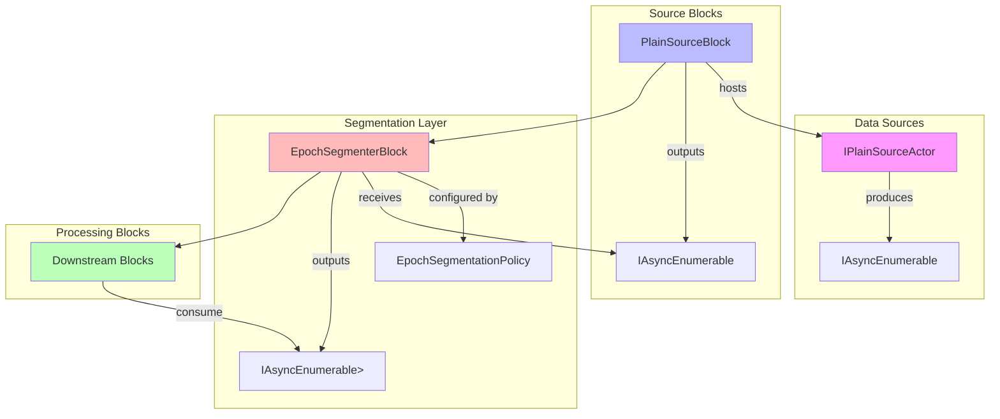

## Components

### 1. IPlainSourceActor<T>

Plain source interface without epoch knowledge.

```csharp
public interface IPlainSourceActor<T>
{
    IAsyncEnumerable<T> ProduceAsync(IActorExecutionContext context);
}

public abstract class PlainSourceActorBase<T> : IPlainSourceActor<T>
{
    public abstract IAsyncEnumerable<T> ProduceAsync(IActorExecutionContext context);
}
```

**Responsibilities**:
- Produce continuous stream of data items
- No knowledge of epochs or segmentation
- Focus on domain-specific data access

**Example**:
```csharp
public class DatabaseSource : PlainSourceActorBase<Record>
{
    private readonly IDbConnection _connection;
    
    public override async IAsyncEnumerable<Record> ProduceAsync(IActorExecutionContext context)
    {
        await using var reader = await _connection.ExecuteReaderAsync("SELECT * FROM records");
        while (await reader.ReadAsync(context.CancellationToken))
        {
            yield return MapToRecord(reader);
        }
    }
}
```

### 2. PlainSourceBlock<T, TActor>

Block that hosts a plain source actor.

```csharp
public sealed class PlainSourceBlock<T, TActor> : BlockBase<object, T>
    where TActor : IPlainSourceActor<T>
{
    public PlainSourceBlock(string name, IServiceScopeFactory scopeFactory);
    
    public override IAsyncEnumerable<T> ExecuteAsync(
        IAsyncEnumerable<object> input, 
        IExecutionContext context);
}
```

**Responsibilities**:
- Create DI scope for actor
- Host actor lifetime
- Stream items from actor
- Handle cancellation

**Pipeline Role**: Source node (produces data, ignores input)

### 3. EpochSegmentationPolicy

Configuration for segmentation strategy.

```csharp
public sealed class EpochSegmentationPolicy
{
    // Pre-defined policies
    public static readonly EpochSegmentationPolicy None;
    
    // Factory methods
    public static EpochSegmentationPolicy ByCount(int itemsPerEpoch, string sourceId);
    public static EpochSegmentationPolicy ByKey<T, TKey>(Func<T, TKey> keySelector, string sourceId);
    public static EpochSegmentationPolicy ByClock(IEpochClock clock, string sourceId);
    public static EpochSegmentationPolicy Custom<T>(Func<...> customSegmenter, string sourceId);
    
    // Configuration
    public SegmentationMode Mode { get; }
    public string SourceId { get; }
    public EpochExecutionPolicy ExecutionPolicy { get; }
    public int MaxConcurrentEpochs { get; }
    // ... mode-specific properties
}

public enum SegmentationMode
{
    None,      // Pass-through
    Count,     // By item count
    Time,      // By time window (future)
    Key,       // By key change
    Clock,     // By epoch clock
    Custom     // Custom function
}
```

**Design Principles**:
- Immutable configuration
- Type-safe factory methods
- Clear intent via mode enum
- Extensible for future policies

### 4. EpochSegmenterBlock<T>

Block that applies segmentation to plain stream.

```csharp
public sealed class EpochSegmenterBlock<T> : BlockBase<T, IEpochStream<T>>
{
    public EpochSegmenterBlock(string name, EpochSegmentationPolicy policy);
    
    public override IAsyncEnumerable<IEpochStream<T>> ExecuteAsync(
        IAsyncEnumerable<T> input,
        IExecutionContext context);
}
```

**Responsibilities**:
- Receive plain item stream
- Apply segmentation policy
- Produce epoch streams
- Maintain epoch sequence numbering
- Handle stream state transitions

**Pipeline Role**: Transform node (T → IEpochStream<T>)

**Key Implementation Detail**: Uses deferred execution - items are streamed through, not buffered.

## Segmentation Strategies

### None (Pass-Through)

Wraps entire input in single epoch.

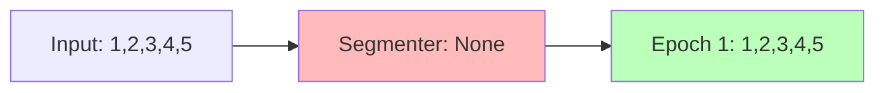

**Use Case**: Migration aid, optional epoch usage

**Implementation**:
```csharp
yield return new EpochStream<T>(
    EpochVector.FromSingleSource(sourceId, 1),
    input);
```

### Count-Based

Segments by fixed item count.

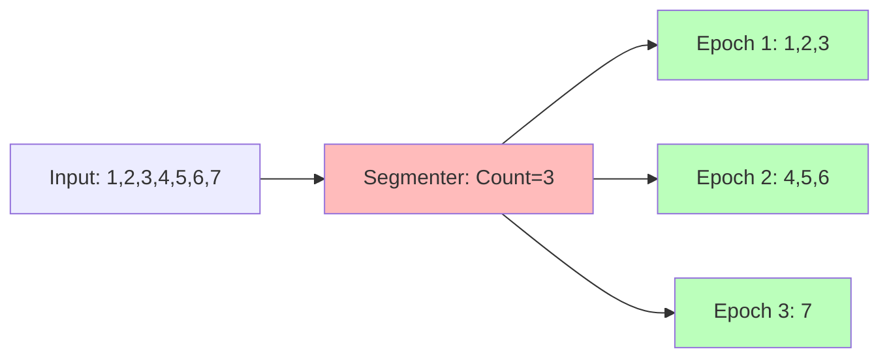

**Use Case**: Fixed-size batches, load balancing

**Configuration**:
```csharp
EpochSegmentationPolicy.ByCount(itemsPerEpoch: 1000, sourceId: "source")
```

### Key-Based

Segments when key changes.

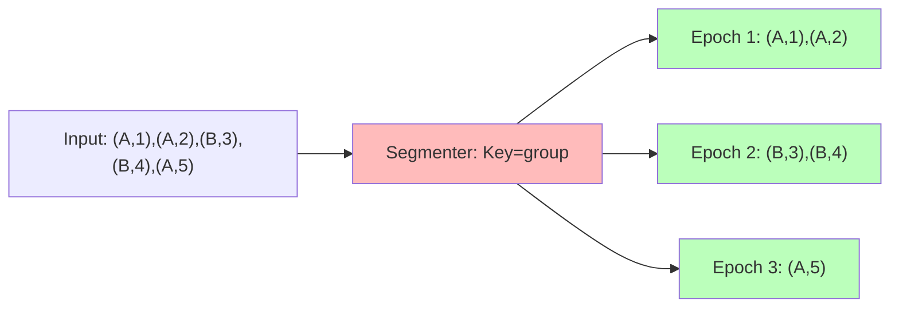

**Use Case**: Natural domain boundaries (date, customer, transaction)

**Configuration**:
```csharp
EpochSegmentationPolicy.ByKey<Order, DateTime>(
    keySelector: order => order.Date.Date,
    sourceId: "orders")
```

### Clock-Based

Segments when epoch clock advances.

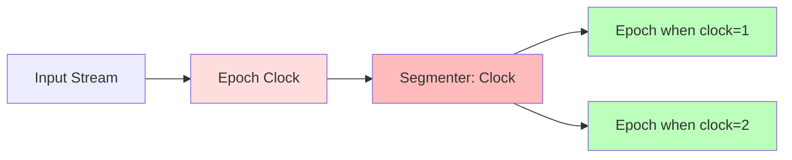

**Use Case**: Time windows, external coordination

**Configuration**:
```csharp
var clock = new ManualEpochClock();
EpochSegmentationPolicy.ByClock(clock, sourceId: "stream")
```

**Note**: Clock can be advanced externally, allowing coordinated epoch boundaries across multiple sources.

### Custom

User-defined segmentation function.

**Use Case**: Complex business rules, transaction boundaries, custom logic

**Configuration**:
```csharp
EpochSegmentationPolicy.Custom<Order>(
    customSegmenter: input => MySegmenter(input),
    sourceId: "orders")
```

## Data Flow Patterns

### Pattern 1: With Epochs

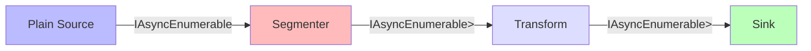

**Code**:
```csharp
var source = new PlainSourceBlock<T, MySource>("source", factory);
var segmenter = new EpochSegmenterBlock<T>("seg", policy);
var transform = new TransformBlock<T, R>("transform", transformer);
var sink = new ProcessorBlock<R>("sink", processor);

// Connect: source → segmenter → transform → sink
```

### Pattern 2: Without Epochs

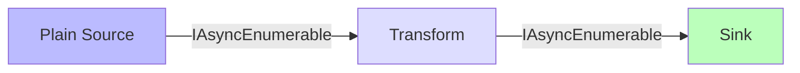

**Code**:
```csharp
var source = new PlainSourceBlock<T, MySource>("source", factory);
var transform = new TransformBlock<T, R>("transform", transformer);
var sink = new ProcessorBlock<R>("sink", processor);

// Connect: source → transform → sink (no segmenter)
```

### Pattern 3: Multiple Strategies

Same source, different pipelines.

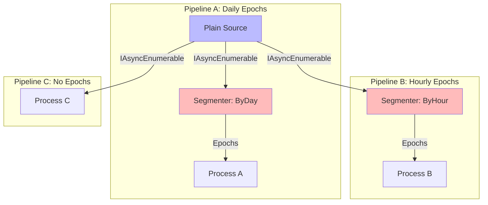

**Code**:
```csharp
var source = new PlainSourceBlock<T, MySource>("source", factory);

// Pipeline A: Daily epochs
var segByDay = new EpochSegmenterBlock<T>("segDay",
    EpochSegmentationPolicy.ByKey(item => item.Date.Date, "source"));

// Pipeline B: Hourly epochs
var segByHour = new EpochSegmenterBlock<T>("segHour",
    EpochSegmentationPolicy.ByKey(item => item.Date.Hour, "source"));

// Pipeline C: No epochs
// (source connected directly to processing)
```

## Integration with Existing Subsystems

### Lifecycle Events

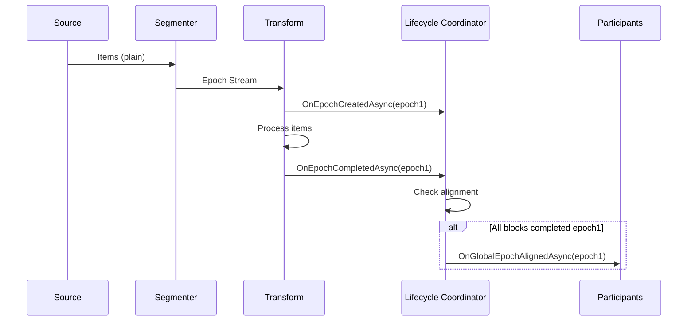

**Key Point**: Segmenter doesn't participate in lifecycle events - it's infrastructure. Downstream processing blocks trigger events.

### EfCore Tracking

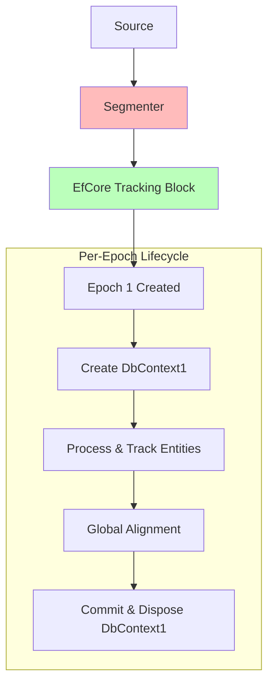

**Compatibility**: EfCore tracking block works identically - it reacts to epoch streams regardless of whether they came from source or segmenter.

### Progress Tracking

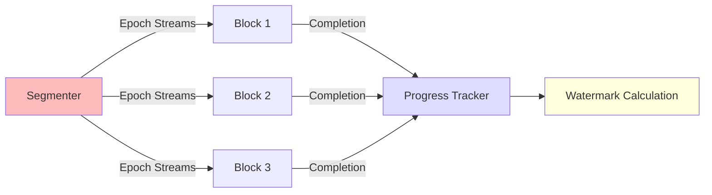

**Compatibility**: Progress tracking works identically - tracks completions per block, computes watermark.

## Performance Considerations

### Hot Path

```
Source → [async enumeration] → Segmenter → [async enumeration] → Downstream
```

**Added Overhead**: One additional async enumeration layer

**Expected Impact**:
- Micro-benchmark: 1-5% throughput reduction
- Realistic workload: <1% (amortized over processing time)

### Memory Profile

**Count Segmentation**: O(1) state (current count, sequence number)

**Key Segmentation**: O(1) state (current key, sequence number)

**Clock Segmentation**: O(1) state (clock reference)

**Streaming**: Items are yielded through, not buffered

### Optimization Opportunities

1. **Specialized Segmenters**: Optimize common cases (count, key)
2. **Inline Segmentation**: For performance-critical paths
3. **Batch Processing**: Process segments in batches if beneficial

## Extension Points

### Custom Segmentation Functions

```csharp
public static class MySegmenters
{
    public static IAsyncEnumerable<IEpochStream<T>> SegmentByTransaction<T>(
        IAsyncEnumerable<T> input,
        Func<T, bool> isTransactionBoundary,
        string sourceId)
    {
        // Custom logic
    }
}

// Use:
var policy = EpochSegmentationPolicy.Custom<T>(
    input => MySegmenters.SegmentByTransaction(input, item => item.IsCommit, "source"),
    sourceId: "txn-source");
```

### Policy Composition

```csharp
// Combine policies (future enhancement)
var policy = EpochSegmentationPolicy.Combine(
    EpochSegmentationPolicy.ByCount(1000, "source"),
    EpochSegmentationPolicy.ByKey(item => item.Region, "source"));
// Segments by count OR key change, whichever comes first
```

## Testing Strategy

### Unit Tests

1. **Source Tests**: Test data production without epoch complexity
2. **Segmenter Tests**: Test segmentation logic in isolation
3. **Integration Tests**: Test full pipeline with segmentation

### Test Helpers

```csharp
// Simple test source
public class TestSource : PlainSourceActorBase<int>
{
    private readonly int[] _data;
    
    public override async IAsyncEnumerable<int> ProduceAsync(...)
    {
        foreach (var item in _data)
            yield return item;
    }
}

// Test with different policies
var source = new PlainSourceBlock<int, TestSource>("test", factory);

// Test count segmentation
var seg1 = new EpochSegmenterBlock<int>("seg", 
    EpochSegmentationPolicy.ByCount(10, "test"));

// Test key segmentation
var seg2 = new EpochSegmenterBlock<int>("seg",
    EpochSegmentationPolicy.ByKey<int, int>(i => i / 10, "test"));

// Test no segmentation
var seg3 = new EpochSegmenterBlock<int>("seg",
    EpochSegmentationPolicy.None);
```

## Migration Guide

See [ADR: Decoupled Epoch Segmentation](../adr/2025-11-05-decoupled-epoch-segmentation.md) for detailed migration strategy.

### Quick Migration

**Before** (Source-Centric):
```csharp
public class MySource : SourceActorBase<T>
{
    public override async IAsyncEnumerable<IEpochStream<T>> ProduceEpochsAsync(...)
    {
        var data = GetData();
        await foreach (var epoch in EpochSegmenter.SegmentByKey(data, ...))
            yield return epoch;
    }
}
```

**After** (Decoupled):
```csharp
public class MySource : PlainSourceActorBase<T>
{
    public override async IAsyncEnumerable<T> ProduceAsync(...)
    {
        return GetData(); // No epoch logic
    }
}

// In pipeline configuration:
var source = new PlainSourceBlock<T, MySource>("source", factory);
var segmenter = new EpochSegmenterBlock<T>("seg",
    EpochSegmentationPolicy.ByKey(...)); // Policy external
```

## Summary

The decoupled design provides:
- ✅ Clean separation of concerns
- ✅ Source reusability across strategies
- ✅ Optional epoch usage
- ✅ Flexible policy configuration
- ✅ Simpler testing
- ✅ Better composability

With minimal trade-offs:
- ➖ One additional pipeline stage
- ➖ Minimal performance overhead (needs validation)
- ➖ Migration effort (one-time cost)
