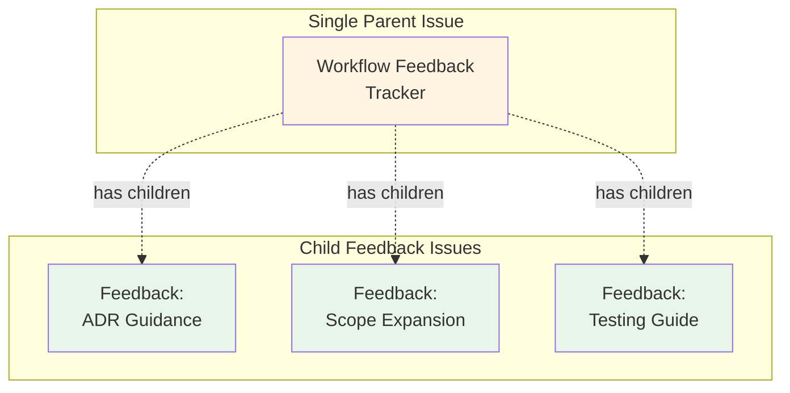

# Executive Summary: Workflow Feedback Migration

**Date**: 2025-11-10  
**Type**: Process Modeling - Exploration Mode  
**Status**: Design Validated, Ready for Implementation

---

## Problem

Current workflow feedback system uses `.github/workflow-improvements.md` (1,114 lines):
- Hard to navigate and find specific feedback
- No clear status tracking (✅ markers are informal)
- Disconnected from GitHub issue tracker
- Difficult to prioritize or manage as queue
- Takes ~11 minutes to add feedback

---

## Investigation

**GitHub MCP Tools Available**:
- ✅ Issue management (create, update, query, sub-issues)
- ❌ GitHub Wiki (not available)
- ❌ GitHub Gist (not available)

**Conclusion**: Must use GitHub Issues for feedback tracking

---

## Proposed Solution

**Parent-Child Issue Architecture**:

**Structure**:
- Single parent issue: `[Workflow Feedback] Tracker`
- Labels: `workflow:process-modeling` (both parent and children)
- Children: Individual feedback entries
- State: Open children = unaddressed, Closed children = implemented

---

## Validation

**Tabletop Simulation**: All 5 scenarios **PASS**

| Scenario | Result | Key Finding |
|----------|--------|-------------|
| Baseline | ✅ PASS | Current pain points confirmed |
| Improved | ✅ PASS | 82% time reduction validated |
| Edge Case | ✅ PASS | Missing parent handled gracefully |
| Integration | ✅ PASS | Process Modeling integrates seamlessly |
| Migration | ✅ PASS | Feasible with careful parsing |

---

## Benefits

| Metric | Current | Improved | Change |
|--------|---------|----------|--------|
| Time to add feedback | 11 min | 2 min | **-82%** |
| Visibility | Hidden in file | Issue tracker | ✅ |
| Status tracking | ✅ markers | Open/Closed | ✅ |
| Searchable | grep | GitHub search | ✅ |
| Concurrent work | Merge conflicts | No conflicts | ✅ |
| Integration | Disconnected | Linked issues | ✅ |

---

## Implementation Effort

**Estimated**: 6-7 hours total

| Phase | Duration | Status |
|-------|----------|--------|
| Create parent issue | 5 min | ⏳ Pending |
| Migrate using MCP tools | 2-3 hours | ⏳ Pending |
| Update workflows | 2-3 hours | ⏳ Pending |
| Archive original | 15 min | ⏳ Pending |

---

## Risks & Mitigations

| Risk | Mitigation |
|------|------------|
| Issue clutter | Search by title `[Workflow Feedback] Tracker` |
| Migration complexity | Use MCP tools directly, check duplicates manually |
| Duplicate entries | Search before creating each issue |
| Breaking workflows | Update all workflows simultaneously |

---

## Recommendation

**✅ PROCEED WITH IMPLEMENTATION**

All validation complete. Benefits significantly outweigh costs.

---

## Next Steps

**For Implementation Team**:

1. Review implementation guide: `/research/workflow-modeling/IMPLEMENTATION_GUIDE.md`
2. Create parent feedback tracker issue (use template provided)
3. Migrate historical entries using MCP `issue_write` and `sub_issue_write` tools
4. Check for duplicates before creating each issue
5. Update workflow documentation
6. Archive original file

**Estimated Timeline**: 1 working day for experienced developer

---

## Deliverables

Located in `/research/workflow-modeling/`:

1. **feedback-issues-design.md** - Complete technical design
2. **scenarios/feedback-issues/** - 5 test scenarios
3. **scenarios/feedback-issues/SIMULATION_RESULTS.md** - Validation results
4. **IMPLEMENTATION_GUIDE.md** - Step-by-step implementation instructions
5. **QUICK_START.md** - Quick reference for new system

---

## Decision Authority

This is a **systemic change** affecting all workflows. Recommend:
- Product owner approval before proceeding
- Communication to all stakeholders
- Clear cutover plan (when to stop using file, start using issues)

---

## Fallback Plan

If implementation reveals unforeseen issues:
1. Original file preserved in `.github/archive/`
2. Parent issues can remain (don't interfere with file-based system)
3. Can revert workflow documentation changes
4. Can delete migrated child issues if necessary

**Migration is reversible**.

---

## Contact

For questions: See `/research/workflow-modeling/plan.md` or issue #[this issue number]
