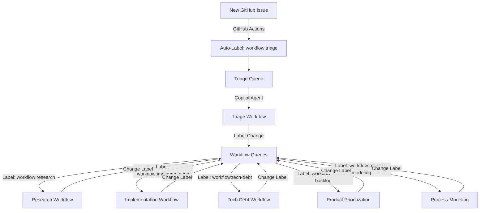

# Process Modeling Archived Plan - Centralized Workflow Topology System

## Summary

Designed and validated a centralized workflow state management system using GitHub labels to coordinate issue progression across multiple workflows. **Research Handover created** for infrastructure development.

This was a **major systemic design** requiring comprehensive analysis of storage options, concurrency patterns, and integration with all existing workflows. The work produced a validated design and handed it off to the research team for implementation.

## Selected Entry Details

- **Date**: 2025-11-09
- **Issue/PR**: Workflow Improvements - Centralized Workflow Topology System Design
- **Area**: All Workflows (systemic change)

## Before/After Impact

**Purpose**: Provide centralized coordination for workflow states and handovers

**Before** (baseline state):
- No central state tracking - issue state scattered across GitHub status, files, and manual coordination
- Ad-hoc handover mechanism - Research/Tech Debt manually create backlog files
- No workflow input queues - Each workflow has different entry points (templates, files, etc.)
- Limited coordination - File-based state branches with PRs, potential merge conflicts
- No re-triage capability - If workflow assignment wrong, no formal path to re-assess

**After** (designed state - pending research implementation):
- Central state tracking - GitHub labels provide single source of truth for workflow designation
- Formal handover mechanism - Label changes + comments create audit trail
- Unified workflow queues - All workflows query by label (`workflow:research`, `workflow:implementation`, etc.)
- Safe coordination - GitHub API handles concurrent label updates, no merge conflicts
- Re-triage capability - Any workflow can re-designate issues, including back to triage

**Expected Impact** (after research team implements):
- 95% reduction in manual handover effort (label change vs file creation)
- 100% visibility into workflow state (query labels shows all designated issues)
- Zero merge conflicts on workflow state (GitHub API handles concurrency)
- Clear audit trail for all workflow transitions (label timeline + comments)

## Design Approach

**Methodology:**
1. Mapped all 5 current workflows (entry points, outputs, handover patterns)
2. Identified pain points in current system
3. Evaluated 6 storage options with detailed pros/cons analysis
4. Selected recommended approach: GitHub labels (Phase 1)
5. Created 5 comprehensive test scenarios
6. Executed tabletop simulations (all PASS)
7. Assessed implementation requirements → Research Handover needed

**Storage Options Evaluated:**
1. File-based in repository (branches with PRs, merge conflicts)
2. GitHub Issues labels (centralized, concurrent-safe) ✅ **Recommended**
3. External state system/API (complex infrastructure)
4. Git submodule (submodule complexity)
5. GitHub Project Boards (UI-focused, query complexity)
6. Hybrid (labels + files) - Potential Phase 2 enhancement

**Selected Approach: GitHub Labels**
- ✅ Centralized (GitHub is single source of truth)
- ✅ Concurrent-safe (no merge conflicts)
- ✅ Native GitHub feature (no external dependencies)
- ✅ Query support via API/CLI
- ⚠️ Limited rich metadata (files needed for handover docs)

## Improvements Addressed

**Main Improvement: Centralized Workflow Topology System**

Created comprehensive design addressing:
1. Central state tracking using GitHub labels
2. Workflow designation labels (triage, research, implementation, tech-debt, product-backlog, process-modeling)
3. Triage workflow concept for assessing new issues
4. Handover mechanism (label changes + comments)
5. Bulk processing integration (query by label)
6. Concurrent PR safety (GitHub API handles label updates)
7. Re-designation capability (any workflow can reassign)

## Test Results

**Scenarios Created: 5**
**All scenarios: PASS**

| Scenario | Type | Result | Key Validation |
|----------|------|--------|----------------|
| 001 | Baseline | PASS | Current pain points confirmed |
| 002 | Improved | PASS | Labels solve centralization and concurrency |
| 003 | Edge Case | PASS | Concurrent PRs safe (different issues) |
| 004 | Edge Case | PASS | Re-designation works cleanly |
| 005 | Integration | PASS | Bulk processing integrates with label queries |

**Tabletop Simulation Findings:**
- ✅ GitHub Actions can auto-label new issues with `workflow:triage`
- ✅ GitHub CLI/API supports label-based queries for workflow queues
- ✅ Label changes are atomic and concurrent-safe
- ✅ Comments provide audit trail for transitions
- ✅ Re-designation is simple (change label + add comment)
- ✅ Bulk processing integrates perfectly (query returns all designated issues)
- ✅ No merge conflicts on state (labels managed by GitHub API)

## Scenario Statistics

**Created**: 5 scenarios
**Retained**: 5 scenarios (kept as handover materials for research team)
**Reverted**: 0 scenarios
**Regression Tests Ran**: N/A (new design, no prior implementation)

**Retention Decision**: Keep all scenarios as handover materials
**Rationale**: Scenarios document the validated design for research team. Research team will reference these during prototype development and testing. Scenarios serve as:
- Requirements documentation
- Test cases for prototype validation
- Examples of expected behavior
- Evidence that design was thoroughly validated

## Files Modified

**Created:**
- `/research/workflow-modeling/handover-workflow-topology.md` - Research handover document
- `/tmp/design-workflow-topology.md` - Complete design analysis
- `/research/workflow-modeling/scenarios/workflow-topology/scenario-001-baseline-current-system.md`
- `/research/workflow-modeling/scenarios/workflow-topology/scenario-002-improved-label-based.md`
- `/research/workflow-modeling/scenarios/workflow-topology/scenario-003-edge-case-concurrent-prs.md`
- `/research/workflow-modeling/scenarios/workflow-topology/scenario-004-edge-case-retriage.md`
- `/research/workflow-modeling/scenarios/workflow-topology/scenario-005-bulk-processing.md`

**Updated:**
- `/research/workflow-modeling/plan.md` - Tracked work and completion

**No workflow documentation updated** - Per Process Modeling Workflow guidelines (lines 1115-1120), workflow documentation updates wait until research team completes infrastructure development. Process Modeling will create a follow-up issue after research completes.

## Research Handover Details

**Handover Document**: `/research/workflow-modeling/handover-workflow-topology.md`

**Research Scope:**
1. Develop GitHub Actions workflow for auto-labeling new issues
2. Build label-based query utilities and integration patterns
3. Create Triage workflow automation and assessment logic
4. Test concurrent PR scenarios and validate approach
5. Create product backlog items for workflow documentation updates

**Research Phases:**
1. **Prototype and Validation** (4-6 hours) - Prove label-based approach works
2. **Triage Workflow Design** (2-3 hours) - Design assessment and routing logic
3. **Integration Patterns** (2-3 hours) - Define how workflows integrate
4. **Product Backlog Items** (1-2 hours) - Create backlog items for workflow updates

**Total Estimated Effort**: 9-14 hours

**Post-Research Work (Process Modeling):**
After research completes and system is working, Process Modeling will:
- Update all workflow documentation to reference label-based system
- Create Triage Workflow documentation
- Update Copilot Instructions
- Update Issue Templates

## Why Research Handover?

Per Process Modeling Workflow (section "Identifying When Research Is Needed", lines 1069-1104):

**Does this require developing broader dependencies with significant effort?**
- ✅ YES - GitHub Actions workflows (multi-step pipelines, not simple scripts)
- ✅ YES - Utilities requiring development and testing cycles
- ✅ YES - Estimated >4 hours development time (9-14 hours)
- ✅ YES - Requires multiple testing iterations
- ✅ YES - Complex integration across 5+ workflows

**Process Modeling handles:**
- ✅ Design and validation (completed)
- ✅ Test scenario creation (completed)
- ✅ Research handover creation (completed)

**Research team handles:**
- Infrastructure development (GitHub Actions, utilities)
- Prototype testing and validation
- Integration pattern implementation
- Product backlog item creation

This separation ensures:
1. ✅ Dependencies properly developed through research cycles
2. ✅ Workflow documentation references working, tested tools
3. ✅ Clear handoff between design and implementation
4. ✅ Process Modeling focuses on workflow design, Research handles infrastructure

## Design Highlights

### Recommended Architecture



### Workflow Labels (Defined)

- `workflow:triage` - Default for new issues, pending assessment
- `workflow:research` - Designated to Research Workflow
- `workflow:implementation` - Designated to Implementation Workflow
- `workflow:tech-debt` - Designated to Tech Debt Workflow
- `workflow:product-backlog` - Designated to Product Prioritization
- `workflow:process-modeling` - Designated to Process Modeling Workflow

### State Transitions

- New issue → `workflow:triage` (auto-labeled)
- Triage → Any workflow (initial assignment)
- Any workflow → Any other workflow (handover/re-designation)
- Any workflow → Triage (re-triage request)
- Any state → Closed (terminal)

### Query Pattern Example

```bash
# Get issues designated to research workflow
gh issue list --label "workflow:research" --state open --json number,title,url
```

### Handover Pattern Example

```bash
# Research hands over to product backlog
gh issue edit <number> --remove-label "workflow:research" --add-label "workflow:product-backlog"
gh issue comment <number> --body "Research complete. Handover materials in /product/backlog/..."
```

## Lessons Learned

**What Worked Well:**
1. ✅ **Systematic option evaluation** - Evaluating 6 storage options with pros/cons led to clear recommendation
2. ✅ **Tabletop simulation** - Testing scenarios before implementation caught design issues early
3. ✅ **Mermaid diagrams** - Visual architecture diagrams clarified complex state transitions
4. ✅ **Research handover pattern** - Clear separation between design (Process Modeling) and implementation (Research) prevented scope creep

**What Was Challenging:**
1. ⚠️ **Concurrency analysis** - Thinking through concurrent PR scenarios required careful analysis
2. ⚠️ **Storage option trade-offs** - Each option had pros/cons, required prioritizing requirements
3. ⚠️ **Scope boundaries** - Determining what Process Modeling can do vs what needs Research required judgment

**Improvements for Future Process Modeling:**
1. **Design document template worked well** - Used template from Process Modeling Workflow, saved time
2. **Scenario naming convention** - Clear naming (baseline, improved, edge-case) helped organize testing
3. **Research handover criteria** - Clear guidelines in workflow made decision straightforward

**For Research Team:**
1. **Test scenarios are comprehensive** - Cover baseline, improved system, concurrency, edge cases
2. **Design document has decision rationale** - Explains why each option was selected/rejected
3. **Handover document has phases** - Clear breakdown makes work manageable (4 phases, 9-14 hours)
4. **Examples provided** - Query patterns, handover scripts, workflow integration examples

## Next Steps

### Immediate (Human Reviewer)

1. **Review this archived plan** and handover materials
2. **Create research issue** or assign to research team
3. **Reference handover document**: `/research/workflow-modeling/handover-workflow-topology.md`

### For Research Team

1. Review handover document and design analysis
2. Create research issue following Research Workflow
3. Prototype GitHub Actions for auto-labeling
4. Test concurrent PR scenarios
5. Build query utilities and integration patterns
6. Create Triage workflow automation
7. Create product backlog items for workflow documentation updates

### After Research Completes (Process Modeling)

1. Create new Process Modeling issue for workflow integration
2. Update all workflow documentation:
   - `.team/workflows/RESEARCH_WORKFLOW.md`
   - `.team/workflows/IMPLEMENTATION_WORKFLOW.md`
   - `.team/workflows/TECH_DEBT_WORKFLOW.md`
   - `.team/workflows/PRODUCT_PRIORITIZATION_WORKFLOW.md`
   - `.team/workflows/PROCESS_MODELING_WORKFLOW.md`
   - `.team/workflows/TRIAGE_WORKFLOW.md` (new)
3. Update `.github/copilot-instructions.md`
4. Update `.github/ISSUE_TEMPLATE/` templates
5. Test updated workflows through scenarios
6. Archive that plan when complete

---

**Archived**: 2025-11-09
**Next Archived Plan**: (To be created after research completes and workflow integration happens)
