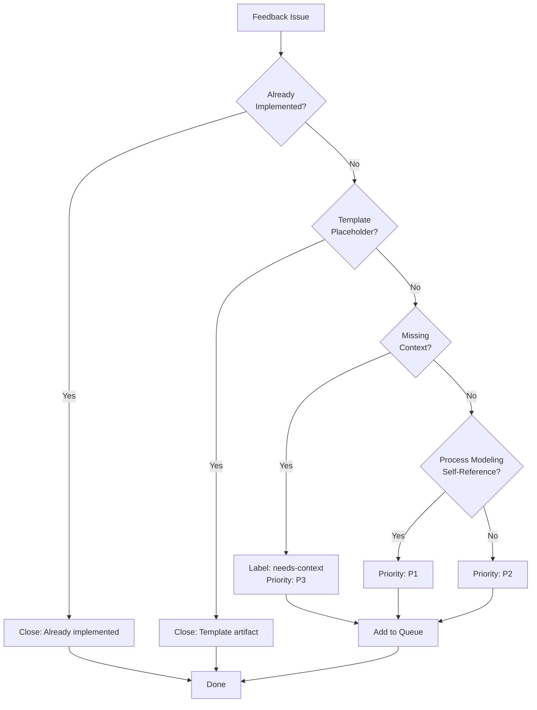

# Feedback Backlog Triage Design

## Problem

After migration to GitHub issues, we have 31 feedback items (excluding parent #254). Many are historical from `.github/workflow-improvements.md` and may be:
- Already implemented
- Outdated/irrelevant
- Missing context needed for assessment
- Superseded by newer feedback

## Design Goals

1. **Start Simple**: Quick checks that can be ascertained with high certainty
2. **Early Dismissal**: Close items that are clearly not valuable
3. **Prioritization**: Order remaining items by value
4. **Processing Order**: Priority first, then date descending (most recent feedback first)

## Proposed Triage Rules

### Rule 1: Already Implemented Check (CLOSE with comment)

**Trigger**: Issue body contains "✅ ADDRESSED" or "✅ IMPLEMENTED" markers

**Action**: Close issue with comment explaining it's already been implemented

**Rationale**: No point processing feedback that's already been actioned

### Rule 2: Template/Placeholder Check (CLOSE with comment)

**Trigger**: 
- Title contains "[Feedback] Template placeholder" OR
- Body contains only template placeholders like "[description]", "YYYY-MM-DD" with no real content

**Action**: Close issue as "not planned" with comment explaining it's a template artifact

**Rationale**: Migration created placeholder issues that have no value

### Rule 3: Missing Date or Context (LOW PRIORITY)

**Trigger**:
- Date field is "YYYY-MM-DD" (not filled in) OR  
- Issue/PR field is "#[number]" or "[description]" (not filled in) OR
- "Suggested Improvement" section is empty or only contains "[specific actionable improvement]"

**Action**: Label with "needs-context" and assign Priority: P3 (Low)

**Rationale**: Hard to assess value without context; deprioritize but don't close in case it becomes relevant

### Rule 4: Process Modeling Self-Reference (HIGH PRIORITY - P1)

**Trigger**: Issue mentions improvements to "Process Modeling Workflow" itself

**Action**: Assign Priority: P1 (High)

**Rationale**: Improvements to the process modeling workflow directly improve our ability to process other feedback

### Rule 5: Recent Feedback (Higher priority within tier)

**Within each priority tier, sort by date descending** (most recent first)

**Rationale**: Recent feedback reflects current pain points; older feedback may have been naturally resolved

### Rule 6: Supersedence Check (CLOSE with reference)

**Before processing each item, check**:
- Is there a newer feedback item that covers the same workflow/area?
- Does a more recent issue supersede this one's suggestions?

**Action**: If superseded, close with comment linking to superseding issue

**Rationale**: Avoid duplicate work on the same area

## Priority Scheme

- **P1 (High)**: Process modeling self-improvements, critical/urgent/severe mentions
- **P2 (Medium)**: Clear context, specific improvements, affects commonly-used workflows  
- **P3 (Low)**: Missing context, vague improvements, affects rarely-used workflows

## Triage Process

## Testing Plan

Test these rules against a sample of existing issues:
1. Pick 5-7 diverse feedback issues
2. Apply rules manually
3. Document expected outcome vs actual assessment
4. Refine rules if needed
5. Document in Process Modeling Workflow if successful

## Implementation

If testing validates rules:
1. Add "Feedback Backlog Triage" section to Process Modeling Workflow
2. Update Bulk Processing mode to include triage step
3. Update feedback creation documentation to emphasize required fields
4. Add link from feedback creation docs to triage section
