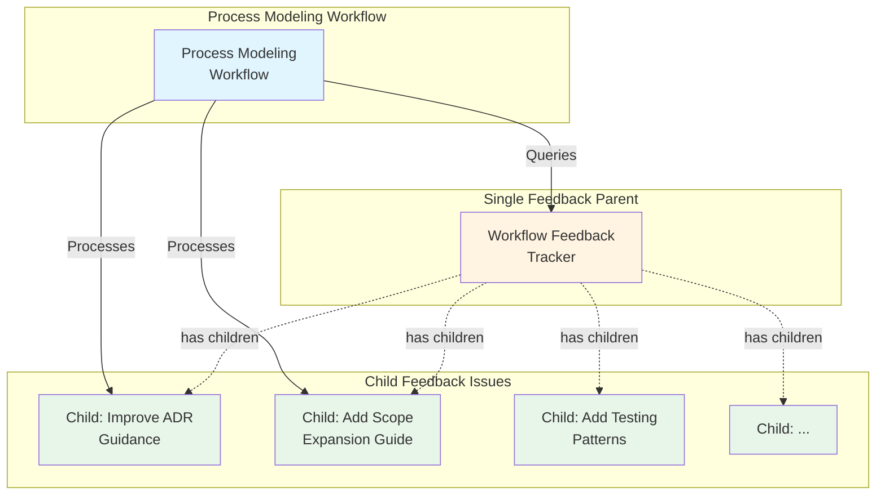

# Workflow Feedback Tracking System Design

**Date**: 2025-11-10  
**Context**: Process Modeling - Migrate workflow-improvements.md to GitHub Issues

---

## Problem Statement

Currently, workflow feedback is tracked in `.github/workflow-improvements.md`, a single markdown file with:
- **1,114 lines** of feedback entries across multiple workflows
- Hard to navigate and find specific feedback
- No easy way to track status (open/in-progress/resolved)
- Disconnected from related issues and PRs
- Difficult to prioritize or manage as a queue

## Available GitHub MCP Tools

Investigation revealed the following GitHub MCP tools:
- ✅ `issue_write` - Create and update issues
- ✅ `add_issue_comment` - Add comments to issues  
- ✅ `sub_issue_write` - Add/remove/reprioritize sub-issues under parent issues
- ✅ `list_issues` - Query issues with labels and filters
- ❌ GitHub Wiki API - NOT available
- ❌ GitHub Gist API - NOT available

**Conclusion**: Must use GitHub Issues for feedback tracking.

## Proposed Solution: Parent-Child Issue System

### Architecture



### Structure

**Parent Issue** (single parent for all feedback):
- Title: `[Workflow Feedback] Tracker`
- Labels: `workflow:process-modeling`
- State: Always **OPEN** (never closed)
- Purpose: Container for all workflow feedback child issues

**Child Issues** (one per feedback entry):
- Title: Brief description of improvement (from "Suggested improvement" field)
- Labels: None (no workflow-specific labels - feedback often spans multiple workflows)
- Body: Formatted feedback entry with context (includes workflow information in body)
- State: **OPEN** when not addressed, **CLOSED** when implemented
- Relationship: Linked as sub-issue to parent via `sub_issue_write`

### Workflow Integration

**For Workflow Agents** (Research, Implementation, etc.):

Instead of editing `.github/workflow-improvements.md`, agents:

1. **Find or create parent feedback issue**:
   ```python
   # Search for existing parent
   results = search_issues(
       owner="uniun-technology",
       repo="lib-dataflow",
       query="[Workflow Feedback] Tracker in:title state:open"
   )
   
   # If not found, create parent
   if not results:
       parent = issue_write(
           method="create",
           title="[Workflow Feedback] Tracker",
           labels=["workflow:process-modeling"],
           body="Parent issue for tracking all workflow feedback..."
       )
   ```

2. **Create child feedback issue**:
   ```python
   child = issue_write(
       method="create",
       title="Improve ADR Guidance for Research",
       body="""
       ## Workflow Feedback Entry
       
       **Date**: 2025-11-09
       **Issue/PR**: #123
       **Workflow**: Research Workflow
       
       ### What Worked Well
       ...
       
       ### What Didn't Work Well
       ...
       
       ### Suggested Improvement
       ...
       """
   )
   ```

3. **Link child to parent**:
   ```python
   sub_issue_write(
       method="add",
       owner="uniun-technology",
       repo="lib-dataflow",
       issue_number=parent_number,
       sub_issue_id=child.id
   )
   ```

**For Process Modeling Workflow**:

1. **Query open child feedback issues**:
   ```python
   # Get all open children from the parent
   parent_issue = issue_read(
       method="get_sub_issues",
       issue_number=parent_number
   )
   
   open_children = [c for c in parent_issue.children if c.state == "open"]
   ```

2. **Process each open child issue** following standard process modeling workflow

3. **Close child issue when addressed**:
   ```python
   issue_write(
       method="update",
       issue_number=child_number,
       state="closed"
   )
   
   add_issue_comment(
       issue_number=child_number,
       body="Implemented in PR #XYZ. See [workflow documentation](link)."
   )
   ```

### Labels Required

**Parent Issue**:
- `workflow:process-modeling` - Designates this as Process Modeling workflow queue item

**Child Issues**:
- `workflow:process-modeling` - Same as parent
  - Prevents triage workflow from processing feedback issues (triage workflow targets unlabeled issues)
  - Clearly identifies them as part of Process Modeling workflow
  - Simplifies querying (all feedback issues share same label)

**Complete Label Set**:
- `workflow:process-modeling` (should already exist for Process Modeling workflow)
- No new labels need to be created

**Finding the Parent**:
Search by title: `[Workflow Feedback] Tracker in:title state:open`

### Migration Strategy

**Phase 1: Create Parent Issue**
- Create single parent feedback tracker issue
- Title: `[Workflow Feedback] Tracker`
- Labels: `workflow:process-modeling`
- Keep parent issue open permanently

**Phase 2: Migrate Existing Feedback**
- Parse `.github/workflow-improvements.md`
- For each entry:
  - Create child issue with formatted content
  - Link to parent via `sub_issue_write`
  - Preserve date, issue/PR reference, workflow information, and all context in body
  - No labels on child issues (feedback content speaks for itself)

**Phase 3: Update Workflows**
- Update Research Workflow self-improvement step
- Update Implementation Workflow self-improvement step
- Update Tech Debt Workflow self-improvement step
- Update Product Prioritization Workflow self-improvement step
- Update Process Modeling Workflow self-improvement step
- Update copilot-instructions.md self-improvement section

**Phase 4: Update Process Modeling Workflow**
- Modify backlog-driven mode to work with child issues instead of file entries
- Keep ability to process multiple feedback items
- Update queue querying to use `get_sub_issues`

**Phase 5: Archive Old File**
- Once all entries migrated and workflows updated
- Archive `.github/workflow-improvements.md` to `.github/archive/`
- Add note about migration to new issue-based system

## Benefits

1. **Better Tracking**: Each feedback item has its own issue number, state, and discussion
2. **Easier Navigation**: Can filter, search, and sort feedback issues
3. **Integration**: Links directly to related issues and PRs
4. **Prioritization**: Can use labels, milestones, and projects for prioritization
5. **Workflow State**: Clear open/closed status instead of ✅ markers in markdown
6. **Discussion**: Can have threaded discussion on each feedback item
7. **Notifications**: Stakeholders can watch/subscribe to specific feedback

## Risks and Mitigations

**Risk 1**: Creating many issues could clutter the issue tracker
- **Mitigation**: Use `workflow:process-modeling` label on both parent and child issues for easy filtering and to prevent triage workflow from processing feedback issues
- **Mitigation**: Parent-child grouping keeps related feedback organized

**Risk 2**: Harder to see all feedback at once
- **Mitigation**: Parent issues aggregate all children
- **Mitigation**: Can still create markdown summary if needed

**Risk 3**: Migration effort is substantial (100+ feedback entries)
- **Mitigation**: Can migrate incrementally (section by section)
- **Mitigation**: Script the migration to reduce manual effort

**Risk 4**: Breaking change to existing workflows
- **Mitigation**: Update all workflow documentation in single PR
- **Mitigation**: Test with scenarios before deploying

## Implementation Phases

### Minimal Viable Change
1. Create parent feedback issues
2. Update one workflow (Process Modeling) to use new system
3. Test with new feedback entries
4. Gradually migrate existing entries
5. Update remaining workflows

### Full Implementation
1. Create all parent issues
2. Migrate all existing feedback entries
3. Update all workflows simultaneously
4. Archive old file
5. Update copilot-instructions.md

**Recommendation**: Use Full Implementation approach to avoid confusion from having two feedback systems running concurrently.

## Test Scenarios Needed

1. **Baseline**: Current system with file-based feedback
2. **Create Feedback**: Workflow agent creates new feedback issue
3. **Query Feedback**: Process Modeling queries open feedback items
4. **Process Feedback**: Process Modeling addresses a feedback item
5. **Edge Case - No Parent**: Agent creates feedback when parent doesn't exist yet
6. **Edge Case - Many Items**: Process Modeling handles multiple feedback items
7. **Regression**: Verify existing workflows still work after changes

## Open Questions

1. Should feedback issues be automatically labeled with priority/complexity?
2. Should we create templates for feedback issue creation?
3. How to handle feedback that applies to multiple workflows?
4. Should parent issues have a specific format/template?

## Decision Log

- ✅ Use GitHub Issues (not gist or wiki) - only available option
- ✅ Use parent-child structure - best organization for grouped feedback
- ✅ Keep parent issues open permanently - they're containers, not tasks
- ✅ One parent per workflow category - matches current file structure
- ✅ Full implementation approach - cleaner than incremental migration
