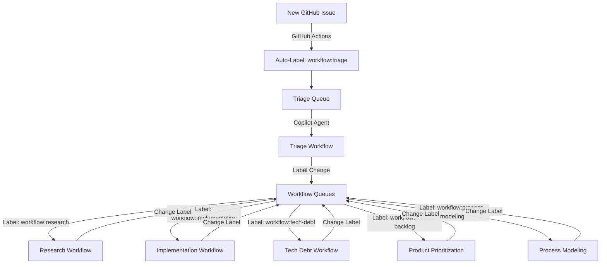

# Centralized Workflow Topology System - Research Handover

## Executive Summary

**Recommendation**: ✅ **PROCEED with research**

Design and implement a centralized workflow state management system using GitHub labels to coordinate issue progression across multiple workflows (Research, Implementation, Tech Debt, Product Prioritization, Process Modeling, and new Triage workflow).

**⚠️ CRITICAL - Research Scope**:
- **DO**: Develop GitHub Actions workflows for auto-labeling and state management
- **DO**: Build label-based query utilities and integration patterns
- **DO**: Create Triage workflow automation and assessment logic
- **DO**: Test concurrent PR scenarios and validate approach
- **DO**: Create product backlog item(s) for workflow documentation updates
- **DO NOT**: Update workflow documentation files (Process Modeling will do this after dependencies are ready)

**Why research is needed**: This requires building GitHub Actions pipelines, testing infrastructure for concurrent PRs, triage workflow automation, and significant validation cycles - all beyond Process Modeling's scope.

## Problem Statement

### Current Workflow System Pain Points

1. **No Central State Tracking**
   - Issues tracked only in GitHub issue status (open/closed)
   - No visibility into which workflow currently "owns" an issue
   - No history of workflow transitions

2. **Ad-hoc Handover Mechanism**
   - Research creates backlog items (manual file creation)
   - Tech Debt creates backlog items (manual file creation)  
   - No formal handover between workflows
   - No way to "return to triage" if misassigned

3. **No Workflow Input Queues**
   - Each workflow has different entry points:
     - GitHub issue templates (Research, Implementation, Tech Debt, Process Modeling)
     - Backlog file selection (Implementation from `/product/backlog/`)
     - Workflow improvements file (Process Modeling from `.github/workflow-improvements.md`)
   - No unified "pull from designated queue" mechanism

4. **Limited Coordination**
   - Multiple PRs can't coordinate state changes
   - File-based state branches with each PR
   - Potential merge conflicts with file-based coordination

### Who Is Affected

- **Copilot agents**: Unclear handover mechanisms, manual state tracking
- **Human reviewers**: Limited visibility into workflow state and transitions
- **All workflows**: Each has different integration patterns

## Suggested Dependencies

### 1. GitHub Actions Workflows

**Purpose**: Automate workflow state management using labels

**Components Needed:**

#### Auto-Label New Issues
```yaml
name: Auto-Label New Issues
on:
  issues:
    types: [opened]

jobs:
  auto-label:
    runs-on: ubuntu-latest
    steps:
      - name: Add triage label
        uses: actions/github-script@v7
        with:
          script: |
            github.rest.issues.addLabels({
              owner: context.repo.owner,
              repo: context.repo.repo,
              issue_number: context.issue.number,
              labels: ['workflow:triage']
            })
```

#### State Transition Logging (Optional)
```yaml
name: Log Workflow Transitions
on:
  issues:
    types: [labeled, unlabeled]

jobs:
  log-transition:
    runs-on: ubuntu-latest
    steps:
      - name: Record transition
        # Log workflow label changes for audit trail
        # Optional: Update /workflow-state/ files if using hybrid approach
```

### 2. Label-Based Query Utilities

**Purpose**: Provide consistent patterns for workflows to query their queues

**Integration Pattern:**

```bash
#!/bin/bash
# Get issues designated to specific workflow

WORKFLOW=$1  # e.g., "research", "implementation"

gh issue list \
  --label "workflow:$WORKFLOW" \
  --state open \
  --json number,title,url,labels \
  --jq '.[] | {number, title, url}'
```

**Required for Each Workflow:**
- Query script or documentation
- Handover script (change labels + add comment)
- Integration with existing workflow patterns

### 3. Triage Workflow Automation

**Purpose**: New workflow to assess incoming issues and designate to appropriate workflow

**Components:**

**Triage Assessment Logic:**
- Issue content analysis (keywords, templates, context)
- Workflow designation decision tree
- Comment generation explaining designation

**Automation Options:**
- **Manual**: Copilot agent reads triage queue, assesses, designates
- **Semi-automated**: GitHub Actions suggests designation, human confirms
- **Automated**: Rules-based or LLM-based assessment (future enhancement)

**Initial Recommendation**: Manual triage by Copilot agent

### 4. Workflow Label Schema

**Purpose**: Define standard labels for workflow states

**Required Labels:**
- `workflow:triage` - Default for new issues, pending assessment
- `workflow:research` - Designated to Research Workflow
- `workflow:implementation` - Designated to Implementation Workflow
- `workflow:tech-debt` - Designated to Tech Debt Workflow
- `workflow:product-backlog` - Designated to Product Prioritization Workflow
- `workflow:process-modeling` - Designated to Process Modeling Workflow

**Label Lifecycle:**
- New issue → auto-labeled `workflow:triage`
- Triage assesses → changes to appropriate workflow label
- Workflow completes → hands over (changes label) or closes issue

## Technical Design (Suggested)

### Architecture Overview



### State Storage: GitHub Labels (Phase 1)

**Rationale:**
- ✅ Centralized (GitHub is single source of truth)
- ✅ Concurrent-safe (GitHub API handles concurrent updates)
- ✅ No merge conflicts
- ✅ Native GitHub feature (no external dependencies)
- ✅ Query support via GitHub API/CLI

**Trade-offs:**
- Limited rich metadata (need files for handover docs)
- Label management overhead
- GitHub API rate limits (not expected to be issue)

### Future Enhancement: Hybrid Approach (Phase 2)

If needed, add file-based metadata:
- `/workflow-state/issues/[issue-number]/`
  - `handover.md` - Rich handover documents
  - `history.md` - Detailed transition history
  - `attachments/` - Supporting files

Labels remain source of truth for current state; files provide supporting docs.

## Research Phases

### Phase 1: Prototype and Validation (4-6 hours)

**Objectives:**
- Prove label-based approach works
- Test concurrent PR scenarios
- Validate query patterns

**Tasks:**
1. Create GitHub Actions workflow for auto-labeling
2. Create workflow label schema in repository
3. Build query utility/script for label-based queues
4. Test concurrent PR scenario (simulate 2 PRs, different issues)
5. Validate handover pattern (label change + comment)
6. Document findings

**Deliverables:**
- Working GitHub Actions workflow (auto-label new issues)
- Label schema defined and documented
- Query utility tested
- Test results from concurrent PR scenario
- Research findings document

### Phase 2: Triage Workflow Design (2-3 hours)

**Objectives:**
- Design Triage workflow process
- Create assessment decision tree
- Build triage automation (if applicable)

**Tasks:**
1. Define Triage workflow assessment criteria
2. Create decision tree for workflow designation
3. Build triage query and designation scripts
4. Test triage workflow manually (simulate assessment)
5. Document Triage workflow process

**Deliverables:**
- Triage workflow process document
- Assessment decision tree
- Triage automation scripts (if applicable)
- Test scenarios for triage decisions

### Phase 3: Integration Patterns (2-3 hours)

**Objectives:**
- Define how existing workflows integrate
- Create migration path
- Document query and handover patterns

**Tasks:**
1. Define query pattern for each workflow
2. Define handover pattern (label change process)
3. Test bulk processing integration (Process Modeling smart mode)
4. Document integration patterns for each workflow
5. Create migration guide

**Deliverables:**
- Integration pattern documentation
- Query examples for each workflow
- Handover pattern documentation
- Migration guide for updating workflows

### Phase 4: Product Backlog Items (1-2 hours)

**Objectives:**
- Create backlog items for workflow updates
- Prioritize implementation work

**Tasks:**
1. Create backlog item for each workflow update:
   - Research Workflow integration
   - Implementation Workflow integration
   - Tech Debt Workflow integration
   - Product Prioritization Workflow integration
   - Process Modeling Workflow integration
   - Triage Workflow creation (new)
2. Create backlog item for Copilot Instructions update
3. Create backlog item for Issue Template updates
4. Document in `/product/backlog/`

**Deliverables:**
- 8 product backlog items created
- Handover materials for each item
- Prioritization recommendation

**Total Estimated Effort**: 9-14 hours

## Post-Research: Workflow Integration

**After research completes and dependencies are working**, create a new **Process Modeling issue** to integrate the label-based workflow system into existing workflows:

**Scope**: Update workflow documentation to reference the working label-based system

**Deliverables**:
- `.team/workflows/RESEARCH_WORKFLOW.md` - Add label query and handover sections
- `.team/workflows/IMPLEMENTATION_WORKFLOW.md` - Add label query sections
- `.team/workflows/TECH_DEBT_WORKFLOW.md` - Add label query and handover sections
- `.team/workflows/PRODUCT_PRIORITIZATION_WORKFLOW.md` - Add label query sections
- `.team/workflows/PROCESS_MODELING_WORKFLOW.md` - Add label query and bulk processing integration
- `.team/workflows/TRIAGE_WORKFLOW.md` - New workflow documentation
- `.github/copilot-instructions.md` - Update Quick Navigation and workflow table
- `.github/ISSUE_TEMPLATE/config.yml` - Update with new template structure
- Create new issue template for general issues (replaces individual workflow templates)

**Why separate?**: The GitHub Actions workflows and integration patterns must be developed and tested first. Workflow documentation should only reference proven, working tools.

## Test Scenarios for Validation

Research team should validate these scenarios (already created in `/research/workflow-modeling/scenarios/workflow-topology/`):

1. **scenario-001-baseline-current-system.md**
   - Validates current state and pain points
   - Result: PASS (pain points confirmed)

2. **scenario-002-improved-label-based.md**
   - Validates label-based approach solves core problems
   - Result: PASS (labels solve centralization and concurrency)

3. **scenario-003-edge-case-concurrent-prs.md**
   - Validates concurrent PR safety
   - Result: PASS (different issues = no conflicts)

4. **scenario-004-edge-case-retriage.md**
   - Validates re-designation and re-triage mechanisms
   - Result: PASS (label changes support handover)

5. **scenario-005-bulk-processing.md**
   - Validates integration with smart mode bulk processing
   - Result: PASS (label queries integrate with existing patterns)

**All scenarios passed tabletop simulation** - label-based approach is validated.

## Design Documents

The complete design analysis is available in:
- `/tmp/design-workflow-topology.md` - Full architecture design and option evaluation

**Key Decisions:**
- **Storage**: GitHub labels (Phase 1), with optional file-based metadata (Phase 2)
- **Triage**: Manual Copilot agent assessment (Phase 1), automation possible later
- **Integration**: Query by label, handover by label change
- **Concurrency**: Safe (GitHub API handles concurrent label updates)

## Success Criteria

Research is successful when:

1. ✅ GitHub Actions workflow auto-labels new issues with `workflow:triage`
2. ✅ Label schema defined and documented
3. ✅ Query utilities work for label-based queues
4. ✅ Concurrent PR scenario tested and validated (no conflicts)
5. ✅ Handover pattern tested (label change + comment)
6. ✅ Triage workflow process documented
7. ✅ Integration patterns documented for all workflows
8. ✅ Product backlog items created for workflow updates
9. ✅ Research findings document complete

## Next Steps for Research Team

1. **Review this handover document** and design materials
2. **Create research issue** following Research Workflow
3. **Prototype GitHub Actions** workflow for auto-labeling
4. **Test concurrent PR scenarios** with actual label changes
5. **Document integration patterns** for each workflow
6. **Create product backlog items** for workflow documentation updates
7. **After research complete**: Reviewer creates Process Modeling issue for workflow integration

## References

- **Design Document**: `/tmp/design-workflow-topology.md`
- **Test Scenarios**: `/research/workflow-modeling/scenarios/workflow-topology/`
- **Process Modeling Workflow**: `.team/workflows/PROCESS_MODELING_WORKFLOW.md`
- **Current Workflows**: `.team/workflows/*.md`
- **Issue Templates**: `.github/ISSUE_TEMPLATE/*.md`
