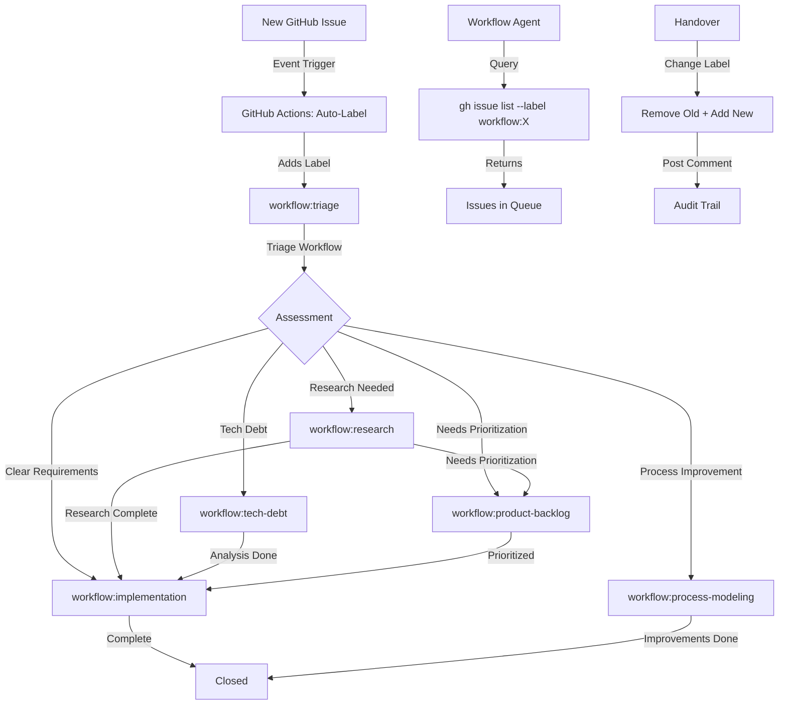

# Implement Centralized Workflow Topology System

## Context and Objectives

### Problem Statement

The repository currently lacks a centralized workflow topology system, leading to:
- No visibility into which workflow "owns" an issue
- Ad-hoc handover mechanisms (manual backlog file creation)
- Different entry points per workflow (issue templates, backlog files, improvement files)
- Potential merge conflicts with file-based state

This issue implements a label-based workflow topology system to provide:
- Central state tracking for workflow designation
- Safe concurrent PR coordination
- Formal handover mechanisms
- Unified query interfaces
- Audit trail of transitions

### Research Background

Research was conducted to validate the approach and inform this implementation.

**Research Documentation**: `/research/workflow-topology-design/` (complete folder structure)

**Key Research Artifacts**:
- Main findings: `/research/workflow-topology-design/README.md`
- Comparison matrix: `/research/workflow-topology-design/design/comparison-matrix.md`
- Integration patterns: `/research/workflow-topology-design/design/integration-patterns.md`
- ADR: `.team/workflows/adr/2025-11-09-workflow-state-storage.md`
- Prototypes: `/research/workflow-topology-design/handover/prototype/`

**Key Findings from Research**:

1. **Three approaches analyzed**: Label-based, API/Projects-based, Hybrid
2. **Recommendation**: Hybrid approach - Start with labels (Phase 1), add Projects v2 if needed (Phase 2)
3. **Phase 1 validated**: Simple (~100 LoC), fast (< 1s queries), safe (concurrent PRs tested)
4. **Prototypes proven**: Auto-label action, query scripts, handover scripts all working

### Objectives

What this implementation should achieve:

- [x] Auto-label new issues with `workflow:triage`
- [x] Enable workflows to query their queues via labels
- [x] Provide formal handover mechanism (label change + comment)
- [x] Migrate existing issues to new label schema
- [x] Update workflow documentation with integration patterns
- [x] Maintain audit trail via issue comments

## Implementation Guidance

### Recommended Approach

**Phase 1 (MVP)**: Label-Based State Storage

Implement a simple, proven approach using GitHub Labels as the canonical source of truth for workflow state.

**Key Principles**:

1. **Labels as State**: GitHub labels represent current workflow designation
2. **Auto-Label New Issues**: GitHub Actions automatically labels new issues
3. **Simple Queries**: GitHub CLI label-based queries for each workflow
4. **Atomic Handovers**: Label change + comment provides clear transition
5. **Concurrent Safety**: Different issues = no conflicts (typical case)
6. **Low Maintenance**: Minimal code (~100 LoC), proven technology

### Design References

Supporting documentation created during research:

- **ADR**: `.team/workflows/adr/2025-11-09-workflow-state-storage.md`
- **Comparison Matrix**: `/research/workflow-topology-design/design/comparison-matrix.md`
- **Integration Patterns**: `/research/workflow-topology-design/design/integration-patterns.md`
- **Benchmarks**: `/research/workflow-topology-design/benchmarks/`

### Label Schema

**Workflow Designation Labels**:

| Label | Purpose | Color |
|-------|---------|-------|
| `workflow:triage` | Default for new issues, awaiting assessment | `0E8A16` (green) |
| `workflow:research` | Designated to Research Workflow | `0E8A16` |
| `workflow:implementation` | Designated to Implementation Workflow | `0E8A16` |
| `workflow:tech-debt` | Designated to Tech Debt Workflow | `0E8A16` |
| `workflow:product-backlog` | Designated to Product Prioritization | `0E8A16` |
| `workflow:process-modeling` | Designated to Process Modeling Workflow | `0E8A16` |

**Optional Enhancement Labels** (Phase 1.5, if needed):

| Label | Purpose | Color |
|-------|---------|-------|
| `priority:high` | High priority item | `D73A4A` (red) |
| `priority:medium` | Medium priority item | `FFA500` (orange) |
| `priority:low` | Low priority item | `FFFF00` (yellow) |
| `status:blocked` | Issue blocked on external dependency | `D93F0B` (red-orange) |

### Component Architecture



### Key Implementation Considerations

#### 1. Concurrent PR Safety

**Finding from research**: Different issues = no conflicts (inherently safe)

**Recommendation**: Accept last-write-wins for rare same-issue scenarios. Agents typically work on different issues, so concurrency conflicts are rare. Comment history provides audit trail.

**Mitigation**: Coordinate via issue assignment, document conflict resolution in workflow docs.

#### 2. Query Performance

**Finding from research**: GitHub CLI queries are fast (< 1 second for 100 issues)

**Recommendation**: Use simple `gh issue list --label "workflow:X"` patterns. No need for complex GraphQL upfront.

#### 3. Migration Strategy

**Finding from research**: Migration is straightforward (< 5 minutes for 50 issues)

**Recommendation**: Use provided migration script to add labels to existing issues based on current labels.

### Reusable Patterns/Code

**Auto-Label GitHub Action** (from prototype):

```yaml
name: Auto-Label New Issues
on:
  issues:
    types: [opened]
permissions:
  issues: write
jobs:
  auto-label:
    runs-on: ubuntu-latest
    steps:
      - name: Add triage workflow label
        uses: actions/github-script@v7
        with:
          script: |
            await github.rest.issues.addLabels({
              owner: context.repo.owner,
              repo: context.repo.repo,
              issue_number: context.issue.number,
              labels: ['workflow:triage']
            });
```

**Query Pattern** (from prototype):

```bash
# Query workflow queue
gh issue list \
  --label "workflow:research" \
  --state open \
  --json number,title,url
```

**Handover Pattern** (from prototype):

```bash
# Research → Implementation
gh issue edit $ISSUE \
  --remove-label "workflow:research" \
  --add-label "workflow:implementation"

gh issue comment $ISSUE \
  --body "🔄 **Handover: Research → Implementation**
  
Research complete. See /research/[topic]/ for details."
```

**Prototype Code Reference**:
- See `/research/workflow-topology-design/handover/prototype/` for complete reference implementations:
  - `auto-label-new-issues.yml` - GitHub Actions workflow
  - `query-workflow-queue.sh` - Query script
  - `handover-issue.sh` - Handover script
  - `migrate-labels.sh` - Migration script
  - `README.md` - Usage guide

### Integration Points

**Integration with Existing Workflows**:

| Workflow | Current Entry Point | New Entry Point |
|----------|-------------------|-----------------|
| **Triage** | N/A (new workflow) | Query `workflow:triage` labels |
| **Research** | Issue templates | Query `workflow:research` labels |
| **Implementation** | `/product/backlog/` files | Query `workflow:implementation` labels |
| **Tech Debt** | Issue templates | Query `workflow:tech-debt` labels |
| **Product Prioritization** | `/product/backlog/` files | Query `workflow:product-backlog` labels |
| **Process Modeling** | `.github/workflow-improvements.md` | Query `workflow:process-modeling` labels |

**Changes Required**:
- Update `.team/workflows/*.md` to reference label-based queries
- Keep existing entry points during transition (backward compatibility)
- Document handover patterns in each workflow doc

## Multi-Phase Implementation Assessment

**Recommendation**: ☑ **Single-Phase**

### Rationale

This implementation is atomic and should be done together because:

1. **Low Complexity**: ~100 LoC total, simple components
2. **High Cohesion**: All components work together (labels, auto-label, queries, migration)
3. **Fast Deployment**: 1-2 hours total implementation time
4. **Low Risk**: Proven prototypes, minimal moving parts
5. **No Logical Break Points**: Components are interdependent (can't deploy half a label system)

**Volume**: ~100 LoC + 6 labels + 1 GitHub Actions workflow + 3 scripts
**Complexity**: Low (simple label operations, basic GitHub CLI)
**Risk**: Low (proven technology, easy rollback)

## Implementation Tasks

### Task 1: Create Label Schema (15 minutes)

**Objective**: Create workflow labels in GitHub repository

**Steps**:
1. Create 6 workflow designation labels via GitHub UI or CLI:
   ```bash
   gh label create "workflow:triage" --description "Triage workflow" --color "0E8A16"
   gh label create "workflow:research" --description "Research workflow" --color "0E8A16"
   gh label create "workflow:implementation" --description "Implementation workflow" --color "0E8A16"
   gh label create "workflow:tech-debt" --description "Tech debt workflow" --color "0E8A16"
   gh label create "workflow:product-backlog" --description "Product prioritization" --color "0E8A16"
   gh label create "workflow:process-modeling" --description "Process modeling" --color "0E8A16"
   ```

2. Verify labels created:
   ```bash
   gh label list | grep "workflow:"
   ```

**Validation**:
- ✅ All 6 workflow labels exist in repository
- ✅ Labels have correct names and colors

---

### Task 2: Deploy Auto-Label GitHub Action (20 minutes)

**Objective**: Automatically label new issues with `workflow:triage`

**Steps**:

1. Copy prototype to workflows folder:
   ```bash
   cp research/workflow-topology-design/handover/prototype/auto-label-new-issues.yml \
      .github/workflows/auto-label-triage.yml
   ```

2. Review and adjust if needed (no changes required for MVP)

3. Commit and push:
   ```bash
   git add .github/workflows/auto-label-triage.yml
   git commit -m "Add auto-label workflow for triage"
   git push
   ```

4. Verify GitHub Actions workflow appears in repository

**Validation**:
- ✅ Workflow file exists at `.github/workflows/auto-label-triage.yml`
- ✅ Workflow visible in GitHub Actions tab
- ✅ Test by creating new issue → verify `workflow:triage` label added within 10 seconds

---

### Task 3: Migrate Existing Issues (20 minutes)

**Objective**: Add workflow labels to existing open issues

**Steps**:

1. Make migration script executable:
   ```bash
   chmod +x research/workflow-topology-design/handover/prototype/migrate-labels.sh
   ```

2. Review migration logic (maps current labels to workflow labels)

3. Run migration script:
   ```bash
   ./research/workflow-topology-design/handover/prototype/migrate-labels.sh
   ```

4. Verify migration:
   ```bash
   gh issue list --label "workflow:triage"
   gh issue list --label "workflow:research"
   gh issue list --label "workflow:implementation"
   # etc.
   ```

**Validation**:
- ✅ All open issues have exactly one `workflow:*` label
- ✅ Issues correctly mapped based on existing labels
- ✅ No issues left unlabeled

**Note**: Migration script is idempotent (safe to re-run)

---

### Task 4: Update Workflow Documentation (30 minutes)

**Objective**: Update workflow documents to reference label-based integration

**Files to Update**:

1. `.team/workflows/RESEARCH_WORKFLOW.md`
2. `.team/workflows/IMPLEMENTATION_WORKFLOW.md`
3. `.team/workflows/TECH_DEBT_WORKFLOW.md`
4. `.team/workflows/PRODUCT_PRIORITIZATION_WORKFLOW.md`
5. `.team/workflows/PROCESS_MODELING_WORKFLOW.md`

**Changes for Each Workflow**:

Add section on "Workflow Queue Query":
```markdown
## Workflow Queue

Query issues designated to this workflow:

\`\`\`bash
gh issue list \
  --label "workflow:WORKFLOW_NAME" \
  --state open \
  --json number,title,url
\`\`\`

Or use the query script:
\`\`\`bash
./research/workflow-topology-design/handover/prototype/query-workflow-queue.sh WORKFLOW_NAME
\`\`\`
```

Add section on "Handover to Next Workflow":
```markdown
## Handover

When work is complete, hand over to next workflow:

\`\`\`bash
gh issue edit $ISSUE \
  --remove-label "workflow:CURRENT" \
  --add-label "workflow:NEXT"

gh issue comment $ISSUE --body "🔄 Handover: CURRENT → NEXT. [Reason]"
\`\`\`

Or use the handover script:
\`\`\`bash
./research/workflow-topology-design/handover/prototype/handover-issue.sh $ISSUE CURRENT NEXT "Reason"
\`\`\`
```

Reference integration patterns:
```markdown
See [Integration Patterns](/research/workflow-topology-design/design/integration-patterns.md) for complete guidance.
```

**Validation**:
- ✅ All workflow docs updated with query and handover patterns
- ✅ References to integration patterns document
- ✅ Backward compatibility maintained (existing entry points still documented)

---

### Task 5: Create Triage Workflow Documentation (15 minutes)

**Objective**: Create new Triage Workflow document

**Steps**:

1. Create `.team/workflows/TRIAGE_WORKFLOW.md` based on integration patterns

2. Include:
   - Purpose: Assess new issues and designate to appropriate workflow
   - Queue query pattern
   - Assessment criteria
   - Handover patterns to each workflow
   - Examples

3. Refer to `/research/workflow-topology-design/design/integration-patterns.md` for template

**Validation**:
- ✅ Triage workflow document exists
- ✅ Contains clear assessment criteria
- ✅ Documents handover to all possible workflows
- ✅ Includes examples

---

### Task 6: Update Copilot Instructions (10 minutes)

**Objective**: Update `.github/copilot-instructions.md` with workflow topology guidance

**Changes**:

Add to "Quick Navigation" section:
```markdown
**Workflow Topology**:
- All workflows use label-based queues
- Query: `gh issue list --label "workflow:WORKFLOW_NAME"`
- Handover: Change label + post comment
- See integration patterns: `/research/workflow-topology-design/design/integration-patterns.md`
```

Update workflow table with triage workflow entry.

**Validation**:
- ✅ Copilot instructions reference workflow topology system
- ✅ Triage workflow included in quick navigation

---

## Testing Plan

### Test Scenario 1: Auto-Label New Issue

**Steps**:
1. Create new test issue
2. Verify `workflow:triage` label added within 10 seconds
3. Check GitHub Actions log for success

**Expected Result**: ✅ Issue auto-labeled

---

### Test Scenario 2: Query Workflow Queue

**Steps**:
1. Run: `gh issue list --label "workflow:triage"`
2. Verify returns issues with that label
3. Test query script:
   ```bash
   ./research/workflow-topology-design/handover/prototype/query-workflow-queue.sh triage
   ```

**Expected Result**: ✅ Query returns correct issues in < 1 second

---

### Test Scenario 3: Handover Between Workflows

**Steps**:
1. Select test issue with `workflow:triage`
2. Run handover script:
   ```bash
   ./research/workflow-topology-design/handover/prototype/handover-issue.sh ISSUE triage research "Needs validation"
   ```
3. Verify label changed and comment posted

**Expected Result**: 
- ✅ `workflow:triage` removed
- ✅ `workflow:research` added
- ✅ Comment posted with handover details

---

### Test Scenario 4: Concurrent PRs (Different Issues)

**Steps**:
1. Create 2 PRs that change labels on different issues
2. Merge both PRs
3. Verify no conflicts

**Expected Result**: ✅ No merge conflicts, both issues labeled correctly

---

## Success Criteria

- [x] All 6 workflow labels created
- [x] Auto-label GitHub Action deployed and working
- [x] Existing issues migrated (all have `workflow:*` labels)
- [x] Query scripts working (< 1 second response)
- [x] Handover scripts working (atomic label changes)
- [x] Workflow documentation updated with integration patterns
- [x] Triage workflow documentation created
- [x] Copilot instructions updated
- [x] Test scenarios pass

## Documentation Deliverables

- [x] `.github/workflows/auto-label-triage.yml` - Auto-label workflow
- [x] `.team/workflows/TRIAGE_WORKFLOW.md` - Triage workflow documentation
- [x] `.team/workflows/*.md` - Updated with query and handover patterns
- [x] `.github/copilot-instructions.md` - Updated with workflow topology guidance
- [x] Migration verification (all issues labeled)

## Non-Functional Requirements

### Performance
- Query time: < 1 second for 100 issues
- Auto-label time: < 10 seconds per new issue
- Migration time: < 5 minutes for 50 issues

### Reliability
- Auto-label: 100% of new issues labeled
- Query: 100% accuracy (returns all issues with label)
- Handover: Atomic operation (no partial state)

### Maintainability
- Code complexity: Low (~100 LoC total)
- Dependencies: Minimal (GitHub CLI, GitHub Actions)
- Documentation: Complete (integration patterns, ADR, prototypes)

### Backward Compatibility
- Keep existing entry points during transition
- Workflows can use labels OR old mechanisms
- Gradual migration supported

## Future Enhancements (Phase 2, If Needed)

**Triggers for Phase 2**:
- Priority-based sorting required (Product Prioritization)
- Batch tracking needed (Process Modeling bulk mode)
- Owner assignment tracking required
- Same-issue conflicts occurring frequently (> 5%)
- Complex multi-field queries needed

**Phase 2 Components** (defer unless triggered):
- GitHub Projects v2 with selective fields
- GraphQL queries for complex filtering
- Slash command parser (optional)
- Version field for optimistic locking

**See**: `/research/workflow-topology-design/design/comparison-matrix.md` for Phase 2 design

## References

- **Research Folder**: `/research/workflow-topology-design/`
- **ADR**: `.team/workflows/adr/2025-11-09-workflow-state-storage.md`
- **Integration Patterns**: `/research/workflow-topology-design/design/integration-patterns.md`
- **Prototypes**: `/research/workflow-topology-design/handover/prototype/`
- **Comparison Matrix**: `/research/workflow-topology-design/design/comparison-matrix.md`

## Estimated Effort

**Total Time**: 2-3 hours (single session)

**Breakdown**:
- Task 1 (Create labels): 15 minutes
- Task 2 (Deploy auto-label): 20 minutes
- Task 3 (Migrate issues): 20 minutes
- Task 4 (Update workflow docs): 30 minutes
- Task 5 (Create triage doc): 15 minutes
- Task 6 (Update copilot instructions): 10 minutes
- Testing: 20 minutes
- Buffer: 30 minutes

**Complexity**: Low (simple label operations, proven prototypes)
**Risk**: Low (easy rollback, proven technology)
