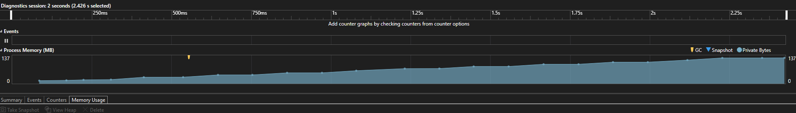
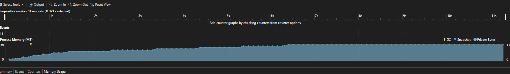

Data Flow 
- Producer yields a 10MB item with an artificial 200ms delay to allow for visibility on graphs (otherwise it ramps up too quick to see step changes)
  - This is the "quick consume all memory" scenario we want to see.
- No rate limiting

Same Data Flow but

- Producer buffer capacity is lowered to 1 (so it can't fill up behind the rate limiter)
- Rate limiting block is used to allow 1 item per 1 second

