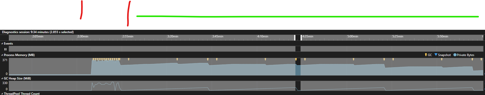

## Rate Limiting

Without rate limiting:-
- You might overwhelm downstream systems, like databases, or web services, causing failures.
  - e.g if you are making too many web requests.
- You can end up with large memory usage spikes:
  - Any buffers may fill up quickly with items (if there is back-pressure experienced in the flow)

### Throughput vs Resource Usage

For ultimate throughput - you may want to avoid rate limiting, but this means you will cause maximum resource usage, and spikes.
For more controlled resource usage, you may want to rate limit the flow at the cost of throughput.

The following shows an example memory usage, for a flow that runs many times without rate limiting, and then many times with rate limiting enabled.
You can see the latter has more controlled memory usage (less spikes) and a lower peak - but takes a lot longer to process the same amount of data.

